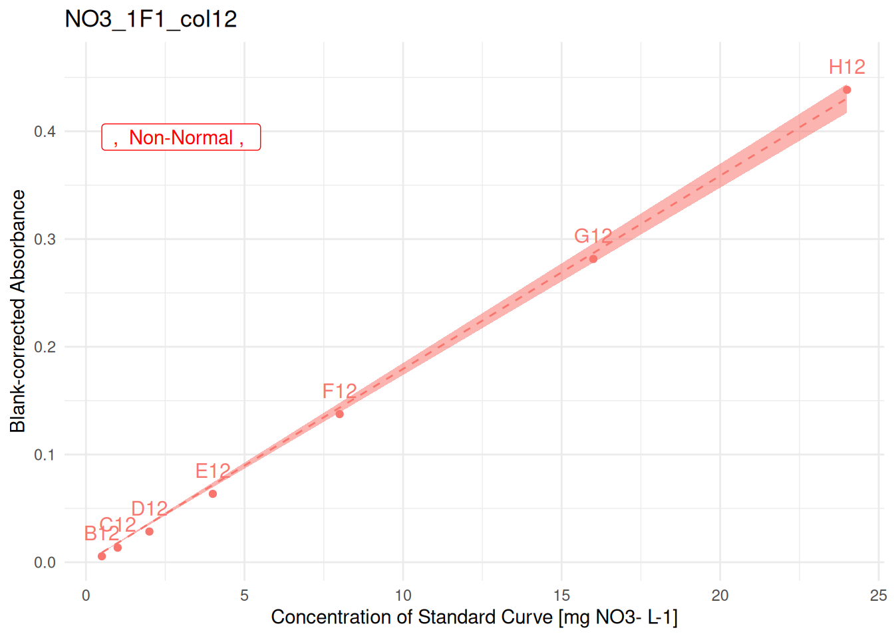
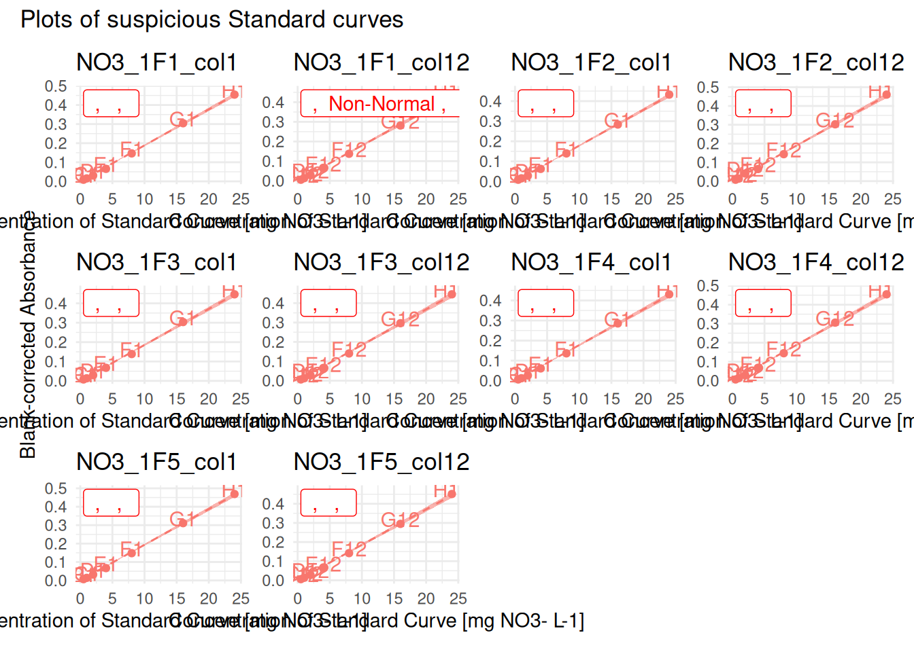
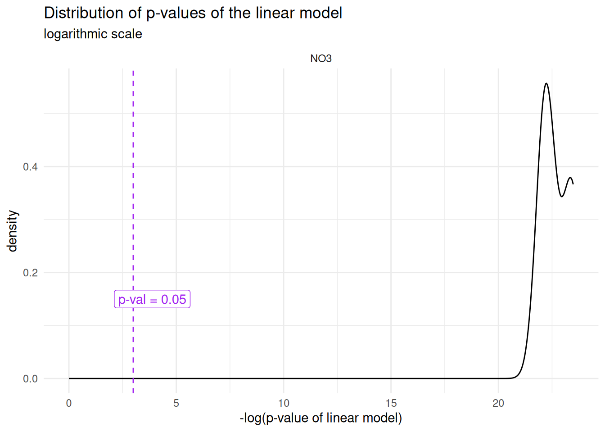
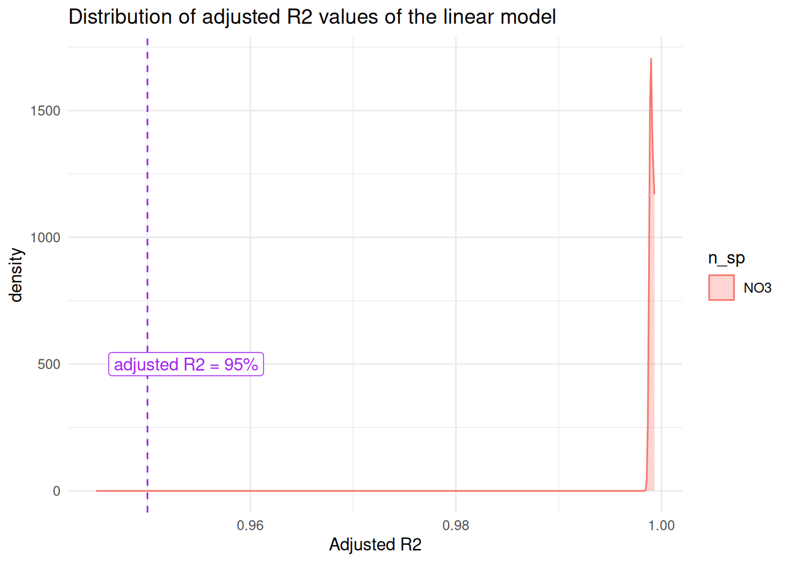
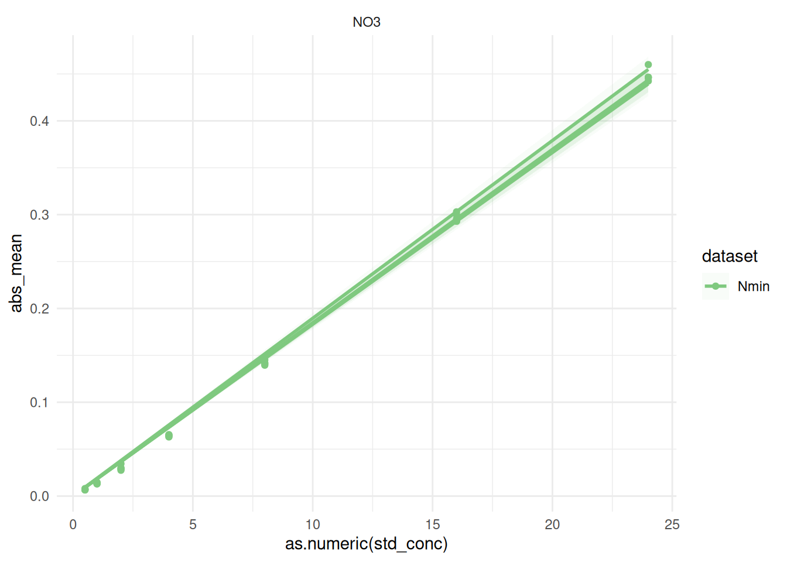

# abs-to-conc

``` r

library(plate2N)
```

## TODO

- write out last sections: 2.6, 3 and 4

- Consider creating a function for the multiple-curve QC (+ explain idea
  why it is relevant to look at it)

- For conversion: explain well difference btw mg N-sp/L and mg N/L, and
  how it relates to molar masses

> **Work in progress**
>
> This vignette is still under development, bugs are to be expected

## Introduction

In this vignette, we cover the steps from blank-corrected absorbance to
concentration in nitrogen \[mg N / L\], although this can easily be used
for dosing other molecules, as long as the Beer-Lambert equation is
respected (the relationship between absorbance and concentration is
linear)[^1].

> **Prerequisites**
>
> - data has been imported and tidied, see
>   [`vignette("import-tidy", package = "plate2N")`](https://mdetoeuf.github.io/plate2N/articles/import-tidy.md)
>
> - data has been blank-corrected, see
>   [`vignette("blank-correction", package = "plate2N")`](https://mdetoeuf.github.io/plate2N/articles/blank-correction.md)
>
> - Outliers have been removed throughout that process, see previous
>   vignettes and also
>   [`vignette("handling-outliers", package = "plate2N")`](https://mdetoeuf.github.io/plate2N/articles/handling-outliers.md)

## 1 - Get blank-corrected data

Little reminder how how the blank-corrected data looks like (see
prerequisites)

``` r

sample_corrected
#> # A tibble: 264 × 25
#>    row   column well_id unique_well_id dataset plate_id map      abs_corrected
#>    <chr> <chr>  <chr>   <chr>          <chr>   <chr>    <chr>            <dbl>
#>  1 A     2      A2      A2_NO3_1F1     Nmin    NO3_1F1  81_t1_z2        0.0312
#>  2 A     2      A2      A2_NO3_1F2     Nmin    NO3_1F2  97_t1_z1        0.0249
#>  3 A     2      A2      A2_NO3_1F3     Nmin    NO3_1F3  89_t1_z3        0.0104
#>  4 A     2      A2      A2_NO3_1F4     Nmin    NO3_1F4  81_t1_z1        0.0342
#>  5 A     2      A2      A2_NO3_1F5     Nmin    NO3_1F5  Std_3_t1        0.0832
#>  6 A     3      A3      A3_NO3_1F1     Nmin    NO3_1F1  82_t1_z2        0.0452
#>  7 A     3      A3      A3_NO3_1F2     Nmin    NO3_1F2  98_t1_z1        0.0219
#>  8 A     3      A3      A3_NO3_1F3     Nmin    NO3_1F3  90_t1_z3        0.0124
#>  9 A     3      A3      A3_NO3_1F4     Nmin    NO3_1F4  82_t1_z3        0.0543
#> 10 A     3      A3      A3_NO3_1F5     Nmin    NO3_1F5  98_t1_z3        0.0232
#> # ℹ 254 more rows
#> # ℹ 17 more variables: blank_sdev <dbl>, blank_coeff_var_percent <dbl>,
#> #   date <lgl>, time <lgl>, sampling_time <chr>, std_column <chr>,
#> #   std_sp <chr>, std_unit <chr>, std_prep <chr>, std_conc <chr>,
#> #   sample_dilution <chr>, extractant_column <lgl>, extractant_sp <chr>,
#> #   extractant_unit <chr>, extractant_conc <dbl>, empty_column <lgl>,
#> #   wait_min <chr>

std_corrected
#> # A tibble: 70 × 26
#>    row   column well_id unique_well_id dataset plate_id unique_curve_id map  
#>    <chr> <chr>  <chr>   <chr>          <chr>   <chr>    <chr>           <chr>
#>  1 B     1      B1      B1_NO3_1F1     Nmin    NO3_1F1  NO3_1F1_col1    Std  
#>  2 B     1      B1      B1_NO3_1F2     Nmin    NO3_1F2  NO3_1F2_col1    Std  
#>  3 B     1      B1      B1_NO3_1F3     Nmin    NO3_1F3  NO3_1F3_col1    Std  
#>  4 B     1      B1      B1_NO3_1F4     Nmin    NO3_1F4  NO3_1F4_col1    Std  
#>  5 B     1      B1      B1_NO3_1F5     Nmin    NO3_1F5  NO3_1F5_col1    Std  
#>  6 B     12     B12     B12_NO3_1F1    Nmin    NO3_1F1  NO3_1F1_col12   Std  
#>  7 B     12     B12     B12_NO3_1F2    Nmin    NO3_1F2  NO3_1F2_col12   Std  
#>  8 B     12     B12     B12_NO3_1F3    Nmin    NO3_1F3  NO3_1F3_col12   Std  
#>  9 B     12     B12     B12_NO3_1F4    Nmin    NO3_1F4  NO3_1F4_col12   Std  
#> 10 B     12     B12     B12_NO3_1F5    Nmin    NO3_1F5  NO3_1F5_col12   Std  
#> # ℹ 60 more rows
#> # ℹ 18 more variables: abs_corrected <dbl>, date <lgl>, time <lgl>,
#> #   sampling_time <chr>, std_column <chr>, std_sp <chr>, std_unit <chr>,
#> #   std_prep <chr>, sample_dilution <chr>, extractant_column <lgl>,
#> #   extractant_sp <chr>, extractant_unit <chr>, extractant_conc <dbl>,
#> #   empty_column <lgl>, wait_min <chr>, std_conc <chr>, blank_sdev <dbl>,
#> #   blank_coeff_var_percent <dbl>
```

## 2 - Compute linear model on Standard Curves

[`lm_std_curve()`](https://mdetoeuf.github.io/plate2N/reference/lm_std_curve.md)
computes a per-curve linear regression between 2 columns of the input
data with `lm(abs_corrected ~ 0 + std_conc, data = curve)` which is the
linear model that constraints the curve to go through the origin.
[`lm_std_curve()`](https://mdetoeuf.github.io/plate2N/reference/lm_std_curve.md)
returns a table containing one row per standard curve, and a series of
information characterizing the performance of the linear model for that
curve (see below and also `?lm_std_curve()`.

### 2.1 - Compute linear model, round 1

[`lm_std_curve()`](https://mdetoeuf.github.io/plate2N/reference/lm_std_curve.md)
defines the curve based on the groups
([`dplyr::group_by()`](https://dplyr.tidyverse.org/reference/group_by.html))
of the input data (`std_corrected` in the example below). Additionally
to the columns `abs_corrected` and `std_conc` (numeric), the function
also requires the column `unique_curve_id`.

``` r

(lm_table_raw <- lm_std_curve(std_corrected |> dplyr::group_by(plate_id, column)))
#> # A tibble: 10 × 11
#>    plate_id unique_curve_id  slope r_squared adj_r_squared     lm_p
#>    <chr>    <chr>            <dbl>     <dbl>         <dbl>    <dbl>
#>  1 NO3_1F1  NO3_1F1_col1    0.0189         1         0.999 6.49e-11
#>  2 NO3_1F1  NO3_1F1_col12   0.0179         1         0.999 2.79e-10
#>  3 NO3_1F2  NO3_1F2_col1    0.0178         1         0.999 6.03e-11
#>  4 NO3_1F2  NO3_1F2_col12   0.0190         1         0.999 1.64e-10
#>  5 NO3_1F3  NO3_1F3_col1    0.0186         1         0.999 2.07e-10
#>  6 NO3_1F3  NO3_1F3_col12   0.0184         1         0.999 4.07e-10
#>  7 NO3_1F4  NO3_1F4_col1    0.0178         1         0.999 2.16e-10
#>  8 NO3_1F4  NO3_1F4_col12   0.0188         1         0.999 2.43e-10
#>  9 NO3_1F5  NO3_1F5_col1    0.0194         1         0.999 1.31e-10
#> 10 NO3_1F5  NO3_1F5_col12   0.0185         1         0.999 3.49e-10
#> # ℹ 5 more variables: normality_lm_residuals <chr>, shapiro_p <dbl>,
#> #   homoscedasticity_lm_residuals <chr>, breusch_pagan_p <dbl>,
#> #   outlier_rstudent <dbl>
```

### 2.2 - QC Standard curves - check conditions of linear model

The function
[`suspicious_lm()`](https://mdetoeuf.github.io/plate2N/reference/suspicious_lm.md)
extracts from an `lm_table`\` as produced above all plates where the
linear model is not optimal, i.e., either the p-value of the model is
above 0.05, or its residuals are not normally distributed, or there is
heteroscedasticity of residuals. lm_table_suspicious can serve for
identification of outliers

``` r

# extract all plates where "something" is not perfect 
(lm_table_suspicious <- lm_table_raw |> suspicious_lm())
#> # A tibble: 1 × 11
#>   plate_id unique_curve_id  slope r_squared adj_r_squared     lm_p
#>   <chr>    <chr>            <dbl>     <dbl>         <dbl>    <dbl>
#> 1 NO3_1F1  NO3_1F1_col12   0.0179         1         0.999 2.79e-10
#> # ℹ 5 more variables: normality_lm_residuals <chr>, shapiro_p <dbl>,
#> #   homoscedasticity_lm_residuals <chr>, breusch_pagan_p <dbl>,
#> #   outlier_rstudent <dbl>
```

For visual aid (useful for larger data sets,
[`plot_list_lm()`](https://mdetoeuf.github.io/plate2N/reference/plot_list_lm.md)
creates a list of plots of each curve given as argument (here:
suspicious lm’s). Calling individual plots can help spotting possible
outlier wells, which can be removed with similar steps as shown above.

``` r

suspicious_lm_plotlist <- plot_list_lm(
  lm_data = lm_table_suspicious,
  std_data = std_corrected)

# check one plot out
suspicious_lm_plotlist[[1]]
```



When there are numerous suspicious curves, we can take advantage of the
package `patchwork`\` to display multiple plots (example hereunder with
the whole lm_table)

``` r

full_plotlist <- plot_list_lm(
  lm_data = lm_table_raw,
  std_data = std_corrected)


patchwork::wrap_plots(full_plotlist, axis_titles = "collect_y") +
     patchwork::plot_annotation(title = "Plots of suspicious Standard curves")
```



### 2.3 - outlier removal

At this point, you may want to remove obvious outlier wells. Follow
steps as shown in vignettes from prerequisites to
[`remove_wells()`](https://mdetoeuf.github.io/plate2N/reference/remove_wells.md).

Let’s say that we want to remove well E12 from plate NO3_1F1 in dataset
Nmin:

``` r

to_remove <- tibble::tibble(
  dataset = "Nmin",
  plate_id = "NO3_1F1",
  well_id = "E12"
)

std_corrected_wash1 <- std_corrected |> remove_wells(to_remove)
```

From now on, we no longer use `std_corrected`, but only
`std_corrected_wash1`. We recommend always running one more round of
quality check on the cleaned datasets before approving regression
equations.

### 2.4 - Per-dilution averages (if 2+ curves per plate)

Once the very few monstrously wrong wells have been removed from single
curves, in the case where several curves were pipetted per 96-well
plate, we still need to perform a per-dilution average of absorbance.
Indeed, there have been 2 events of pipetting of the same dilution,
rather than 2 successive dilutions.

> **WARNING**
>
> The next step computes per plate per row means for the standard
> curves.
>
> If some wells have been swapped in some plates, this may cause
> problems. Make sure there was no pipetting issue, or correct raw data
> or solve it through code

[`std_dilution_average()`](https://mdetoeuf.github.io/plate2N/reference/std_dilution_average.md)
does that and creates an artificial “column 13”.

``` r

std_dilution_avg <- std_corrected_wash1 |> std_dilution_average()
```

### 2.5 - Compute linear model + QC - round 2

We can now rerun the linear model on the cleaned and (if required)
per-dilution averaged, by repeating the same steps as above: computation
of linear model, identification of suspicious curves and plotting

``` r

(lm_std_mean <- lm_std_curve(std_dilution_avg |> dplyr::rename(abs_corrected = abs_mean)))
#> # A tibble: 5 × 11
#>   plate_id unique_curve_id  slope r_squared adj_r_squared     lm_p
#>   <chr>    <chr>            <dbl>     <dbl>         <dbl>    <dbl>
#> 1 NO3_1F1  NO3_1F1_col13   0.0184         1         0.999 7.36e-11
#> 2 NO3_1F2  NO3_1F2_col13   0.0184         1         0.999 6.32e-11
#> 3 NO3_1F3  NO3_1F3_col13   0.0185         1         0.999 2.47e-10
#> 4 NO3_1F4  NO3_1F4_col13   0.0183         1         0.999 2.23e-10
#> 5 NO3_1F5  NO3_1F5_col13   0.0190         1         0.999 2.09e-10
#> # ℹ 5 more variables: normality_lm_residuals <chr>, shapiro_p <dbl>,
#> #   homoscedasticity_lm_residuals <chr>, breusch_pagan_p <dbl>,
#> #   outlier_rstudent <dbl>
(lm_suspicious_mean <- lm_std_mean |> suspicious_lm())
#> # A tibble: 0 × 11
#> # ℹ 11 variables: plate_id <chr>, unique_curve_id <chr>, slope <dbl>,
#> #   r_squared <dbl>, adj_r_squared <dbl>, lm_p <dbl>,
#> #   normality_lm_residuals <chr>, shapiro_p <dbl>,
#> #   homoscedasticity_lm_residuals <chr>, breusch_pagan_p <dbl>,
#> #   outlier_rstudent <dbl>
```

Good news, there are no more suspicious linear models anymore. Should
there be any, one more round of QC as described above can still be
helpful
([`plot_list_lm()`](https://mdetoeuf.github.io/plate2N/reference/plot_list_lm.md)).

Let’s store the last correction into a clean variable name to reduce
possible confusion, and let’s compute all the plots in a big list, for
storage purposes. We could then export this as one output data in a
single list with
[`readr::write_rds()`](https://readr.tidyverse.org/reference/read_rds.html)\`.

``` r

std_data_clean <- std_dilution_avg
lm_table_clean <- lm_std_mean
lm_plots_clean <- plot_list_lm(
  lm_table_clean, std_data_clean |> dplyr::rename(abs_corrected = abs_mean))

lm_output <- list(
  "std_data_clean" = std_data_clean,
  "lm_table_clean" = lm_table_clean,
  "lm_plots_clean" = lm_plots_clean,
  "sample_corrected" = sample_corrected
)

# just an example of how to save this in a file for downstream steps
#lm_output |> write_rds("output/data/lm_output.rds")
```

### 2.6 - Multiple curve QC

TODO –\> make a function? Remove this?

First, let’s look at the distribution of p-values of the std curve
regressions

``` r

p_threshold <- 0.05

lm_output$lm_table_clean |> 
  tidyr::separate_wider_delim(
    cols = unique_curve_id, delim = "_", 
    names = c("n_sp", "rest"), too_many = "merge") |>
  ggplot2::ggplot(ggplot2::aes(x = -log(lm_p))) + 
  ggplot2::theme_minimal() +
  # geom_histogram() +
  ggplot2::geom_density() +
  ggplot2::geom_vline(ggplot2::aes(xintercept = -log(p_threshold)), linetype = 2, colour = "purple") +
  ggplot2::annotate(
    geom = "label", label = paste0("p-val = ", p_threshold),
    x = -log(p_threshold), y = 0.15, hjust = 0.25, colour = "purple" ) +
  ggplot2::facet_wrap(~n_sp, nrow = 3) +
  ggplot2::xlim(0,max(-log(lm_output$lm_table_clean$lm_p))) +
  ggplot2::xlab("-log(p-value of linear model)") +
  ggplot2::labs(
    title = "Distribution of p-values of the linear model",
    subtitle = "logarithmic scale"
  )
```



Then, same with R_squared (or adjusted?)

``` r

threshold <- 95

lm_output$lm_table_clean |> 
  tidyr::separate_wider_delim(
    cols = unique_curve_id, delim = "_", 
    names = c("n_sp", "rest"), too_many = "merge") |>
  ggplot2::ggplot(ggplot2::aes(x = adj_r_squared, colour = n_sp, fill = n_sp)) + 
  ggplot2::theme_minimal() +
  #geom_histogram() +
  ggplot2::geom_density(alpha = 0.3) +
  ggplot2::geom_vline(ggplot2::aes(xintercept = 0.95), linetype = 2, colour = "purple") +
  ggplot2::annotate(
    geom = "label", label = paste0("adjusted R2 = ", threshold, "%"),
    x = threshold/100, y = 500, hjust = 0.25, colour = "purple" ) +
  #facet_wrap(~n_sp, nrow = 3, scales = "free_y") +
  ggplot2::xlim(
    0.945,
    max(lm_output$lm_table_clean$adj_r_squared)) +
  ggplot2::xlab("Adjusted R2") +
  ggplot2::labs(
    title = "Distribution of adjusted R2 values of the linear model"
  )
```



Now we plot all curves on same plot

``` r

colors <- c("#7FC97F", "#BEAED4", "#FDC086")

lm_output$std_data_clean |> 
  dplyr::filter_out(dataset == "TDN") |> 
  ggplot2::ggplot(ggplot2::aes(x = as.numeric(std_conc), y = abs_mean, groups = plate_id, colour = dataset, fill = dataset)) +
  ggplot2::theme_minimal()+
  ggplot2::geom_smooth(
    formula = y~x-1, method = "lm", se = TRUE, 
    alpha = 0.05) +
  ggplot2::geom_point() +
  ggplot2::facet_wrap(~std_sp, scales = "free") +
  ggplot2::scale_color_discrete(palette = colors[1:2]) +
  ggplot2::scale_fill_discrete(palette = colors[1:2]) 
```



Now, finally, I decide that I am happy with my standard curves, so I can
move on to apply the equations on my data

## 3 - Infer sample concentration from regression equation

Check that we are now left with only one curve per plate (i.e., we
indeed took a per-dilution average)

``` r

if (
  (lm_output$std_data_clean |> dplyr::group_by(plate_id) |>  dplyr::n_groups()) == 
  (lm_output$std_data_clean |> dplyr::group_by(unique_curve_id) |>  dplyr::n_groups())
) {message("All good: there is exactly one curve per plate")} else {
  warning("Warning: there is at least one plate with several curves")
}
#> All good: there is exactly one curve per plate
```

Regression equation is Abs = slope \* Concentration

There is a default vector containing relevant molar masses. Make sure to
append it with values that are relevant for your study. This is needed
to convert concentrations from mg *molecule* per L to mg *element* per L
(e.g., mg NO3/L to mg N/L)

``` r

molar_masses
#>       N     NO3     NO2     NH4 
#> 14.0069 62.0051 46.0057 36.0775
```

Here, we

- connect regression data to sample absorbance data with
  [`reg_join_abs()`](https://mdetoeuf.github.io/plate2N/reference/reg_join_abs.md).

- apply the regression equation to go from absorbance to concentration
  in mg N-sp per L

- convert unit to mg N per L using `molar_masses` and
  [`convert_molec()`](https://mdetoeuf.github.io/plate2N/reference/convert_molec.md).

``` r

data_mg_N_L <- 
  # add slope + info regression (p-val and R2) to absorbance data
  reg_join_abs(lm_output$lm_table_clean, lm_output$sample_corrected, target_sp = "N") |> 
  # compute concentration from absorbance
  dplyr::mutate(conc_mgNsp_L = abs_corrected / slope) |> 
  convert_molec(masses = molar_masses)
```

## 4 - Epilogue

We now have clean and tidy concentration data

[^1]: To adapt to other compounds, you may need to add molar masses into
    the data \`molar_masses\`, see later.
