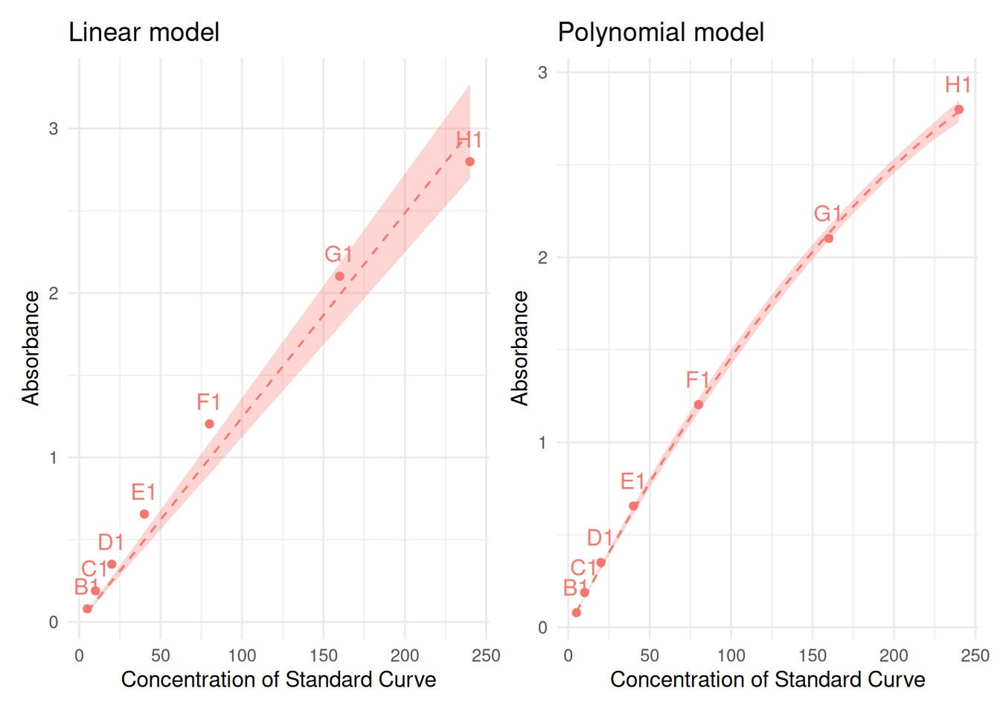
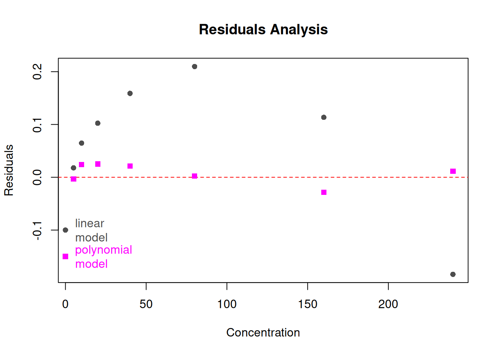
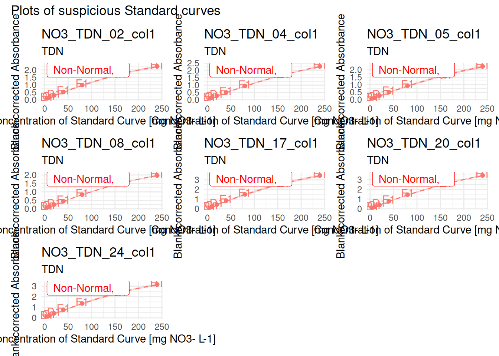
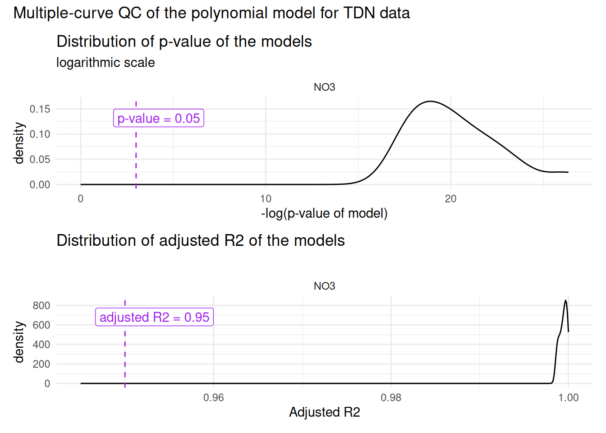
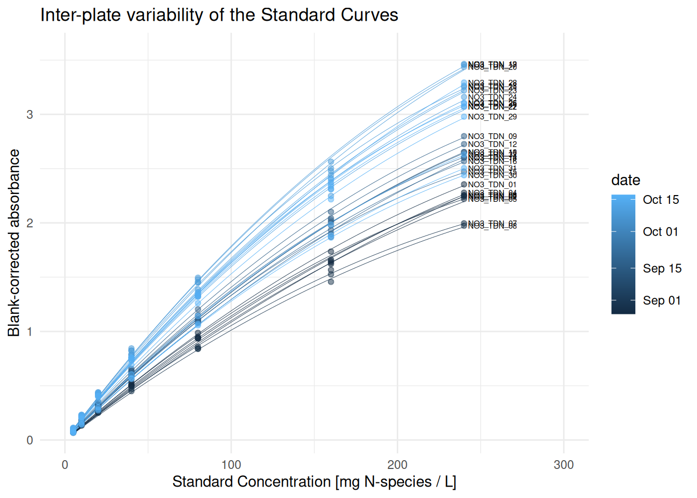

# abs-to-conc

``` r

library(plate2N)
library(patchwork)
```

## TODO

- Integrate polynomial modelling, take it from personal pipeline

- write out last sections: 2.6, 3 and 4

- Consider creating a function for the multiple-curve QC (+ explain idea
  why it is relevant to look at it)

- For conversion: explain well difference btw mg N-sp/L and mg N/L, and
  how it relates to molar masses

> **Work in progress**
>
> This vignette is still under development, bugs are to be expected

## Introduction

In this vignette, we cover the steps from blank-corrected absorbance to
concentration in nitrogen \[mg N / L\], although this can easily be used
for dosing other molecules, as long as the Beer-Lambert equation is
respected (the relationship between absorbance and concentration is
linear)[^1].

> **Prerequisites**
>
> - data has been imported and tidied, see
>   [`vignette("import-tidy", package = "plate2N")`](https://mdetoeuf.github.io/plate2N/articles/import-tidy.md)
>
> - data has been blank-corrected, see
>   [`vignette("blank-correction", package = "plate2N")`](https://mdetoeuf.github.io/plate2N/articles/blank-correction.md)
>
> - Outliers have been removed throughout that process, see previous
>   vignettes and also
>   [`vignette("handling-outliers", package = "plate2N")`](https://mdetoeuf.github.io/plate2N/articles/handling-outliers.md)

## 1 - Get blank-corrected data

Little reminder how how the blank-corrected data looks like (see
prerequisites)

``` r

sample_corrected
#> # A tibble: 264 × 25
#>    row   column well_id unique_well_id dataset plate_id map      abs_corrected
#>    <chr> <chr>  <chr>   <chr>          <chr>   <chr>    <chr>            <dbl>
#>  1 A     2      A2      A2_NO3_1F1     Nmin    NO3_1F1  81_t1_z2       0.0312 
#>  2 A     2      A2      A2_NO3_1F2     Nmin    NO3_1F2  97_t1_z1      -0.00975
#>  3 A     2      A2      A2_NO3_1F3     Nmin    NO3_1F3  89_t1_z3       0.0104 
#>  4 A     2      A2      A2_NO3_1F4     Nmin    NO3_1F4  81_t1_z1       0.0437 
#>  5 A     2      A2      A2_NO3_1F5     Nmin    NO3_1F5  Std_3_t1       0.0832 
#>  6 A     3      A3      A3_NO3_1F1     Nmin    NO3_1F1  82_t1_z2       0.0452 
#>  7 A     3      A3      A3_NO3_1F2     Nmin    NO3_1F2  98_t1_z1      -0.0128 
#>  8 A     3      A3      A3_NO3_1F3     Nmin    NO3_1F3  90_t1_z3       0.0124 
#>  9 A     3      A3      A3_NO3_1F4     Nmin    NO3_1F4  82_t1_z3       0.0638 
#> 10 A     3      A3      A3_NO3_1F5     Nmin    NO3_1F5  98_t1_z3       0.0232 
#> # ℹ 254 more rows
#> # ℹ 17 more variables: blank_sdev <dbl>, blank_coeff_var_percent <dbl>,
#> #   date <lgl>, time <lgl>, sampling_time <chr>, std_column <chr>,
#> #   std_sp <chr>, std_unit <chr>, std_prep <chr>, std_conc <chr>,
#> #   sample_dilution <chr>, extractant_column <lgl>, extractant_sp <chr>,
#> #   extractant_unit <chr>, extractant_conc <dbl>, empty_column <lgl>,
#> #   wait_min <chr>

std_corrected
#> # A tibble: 70 × 26
#>    row   column well_id unique_well_id dataset plate_id unique_curve_id map  
#>    <chr> <chr>  <chr>   <chr>          <chr>   <chr>    <chr>           <chr>
#>  1 B     1      B1      B1_NO3_1F1     Nmin    NO3_1F1  NO3_1F1_col1    Std  
#>  2 B     1      B1      B1_NO3_1F2     Nmin    NO3_1F2  NO3_1F2_col1    Std  
#>  3 B     1      B1      B1_NO3_1F3     Nmin    NO3_1F3  NO3_1F3_col1    Std  
#>  4 B     1      B1      B1_NO3_1F4     Nmin    NO3_1F4  NO3_1F4_col1    Std  
#>  5 B     1      B1      B1_NO3_1F5     Nmin    NO3_1F5  NO3_1F5_col1    Std  
#>  6 B     12     B12     B12_NO3_1F1    Nmin    NO3_1F1  NO3_1F1_col12   Std  
#>  7 B     12     B12     B12_NO3_1F2    Nmin    NO3_1F2  NO3_1F2_col12   Std  
#>  8 B     12     B12     B12_NO3_1F3    Nmin    NO3_1F3  NO3_1F3_col12   Std  
#>  9 B     12     B12     B12_NO3_1F4    Nmin    NO3_1F4  NO3_1F4_col12   Std  
#> 10 B     12     B12     B12_NO3_1F5    Nmin    NO3_1F5  NO3_1F5_col12   Std  
#> # ℹ 60 more rows
#> # ℹ 18 more variables: abs_corrected <dbl>, date <lgl>, time <lgl>,
#> #   sampling_time <chr>, std_column <chr>, std_sp <chr>, std_unit <chr>,
#> #   std_prep <chr>, sample_dilution <chr>, extractant_column <lgl>,
#> #   extractant_sp <chr>, extractant_unit <chr>, extractant_conc <dbl>,
#> #   empty_column <lgl>, wait_min <chr>, std_conc <dbl>, blank_sdev <dbl>,
#> #   blank_coeff_var_percent <dbl>
```

## 2 - Compute linear model on Standard Curves

> **Choose your model wisely**
>
> We cover later a script to implement a polynomial model rather than a
> linear model. For dosage of mineral N pools, such a model can be
> necessary, for example, when concentrations (and absorbance values)
> are high. The best red flag for the inappropriateness of the linear
> model if when the fit of the curve does not seem to suit the plotting
> of the experimental points.
>
> For new pipelines, always check out the standard curves graphically to
> ensure a good fit. See later, in section [Section 6](#sec-polynomial)

[`lm_std_curve()`](https://mdetoeuf.github.io/plate2N/reference/lm_std_curve.md)
computes a per-curve linear regression between 2 columns of the input
data with `lm(abs_corrected ~ 0 + std_conc, data = curve)` which is the
linear model that constraints the curve to go through the origin.
[`lm_std_curve()`](https://mdetoeuf.github.io/plate2N/reference/lm_std_curve.md)
returns a table containing one row per standard curve, and a series of
information characterizing the performance of the linear model for that
curve (see below and also `?lm_std_curve()`.

### 2.1 - Compute linear model, round 1

[`lm_std_curve()`](https://mdetoeuf.github.io/plate2N/reference/lm_std_curve.md)
defines the curve based on the groups
([`dplyr::group_by()`](https://dplyr.tidyverse.org/reference/group_by.html))
of the input data (`std_corrected` in the example below). Additionally
to the columns `abs_corrected` and `std_conc` (numeric), the function
also requires the column `unique_curve_id`.

``` r

(lm_table_raw <- lm_std_curve(std_corrected |> dplyr::group_by(plate_id, column)))
#> # A tibble: 10 × 12
#>    dataset plate_id unique_curve_id std_sp  slope r_squared adj_r_squared
#>    <chr>   <chr>    <chr>           <chr>   <dbl>     <dbl>         <dbl>
#>  1 Nmin    NO3_1F1  NO3_1F1_col1    NO3    0.0189     0.999         0.999
#>  2 Nmin    NO3_1F1  NO3_1F1_col12   NO3    0.0179     0.999         0.999
#>  3 Nmin    NO3_1F2  NO3_1F2_col1    NO3    0.0178     0.999         0.999
#>  4 Nmin    NO3_1F2  NO3_1F2_col12   NO3    0.0190     0.999         0.999
#>  5 Nmin    NO3_1F3  NO3_1F3_col1    NO3    0.0187     0.999         0.999
#>  6 Nmin    NO3_1F3  NO3_1F3_col12   NO3    0.0185     0.999         0.999
#>  7 Nmin    NO3_1F4  NO3_1F4_col1    NO3    0.0178     0.999         0.999
#>  8 Nmin    NO3_1F4  NO3_1F4_col12   NO3    0.0188     0.999         0.999
#>  9 Nmin    NO3_1F5  NO3_1F5_col1    NO3    0.0193     0.999         0.999
#> 10 Nmin    NO3_1F5  NO3_1F5_col12   NO3    0.0185     0.999         0.998
#> # ℹ 5 more variables: lm_p <dbl>, normality_lm_residuals <chr>,
#> #   shapiro_p <dbl>, homoscedasticity_lm_residuals <chr>, breusch_pagan_p <dbl>
```

### 2.2 - QC Standard curves - check conditions of linear model

The function
[`suspicious_lm()`](https://mdetoeuf.github.io/plate2N/reference/suspicious_lm.md)
extracts from an `lm_table`\` as produced above all plates where the
linear model is not optimal, i.e., either the p-value of the model is
above 0.05, or its residuals are not normally distributed, or there is
heteroscedasticity of residuals. lm_table_suspicious can serve for
identification of outliers

``` r

# extract all plates where "something" is not perfect 
(lm_table_suspicious <- lm_table_raw |> suspicious_lm())
#> # A tibble: 1 × 12
#>   dataset plate_id unique_curve_id std_sp  slope r_squared adj_r_squared
#>   <chr>   <chr>    <chr>           <chr>   <dbl>     <dbl>         <dbl>
#> 1 Nmin    NO3_1F1  NO3_1F1_col12   NO3    0.0179     0.999         0.999
#> # ℹ 5 more variables: lm_p <dbl>, normality_lm_residuals <chr>,
#> #   shapiro_p <dbl>, homoscedasticity_lm_residuals <chr>, breusch_pagan_p <dbl>
```

For visual aid (useful for larger data sets,
[`plot_list_lm()`](https://mdetoeuf.github.io/plate2N/reference/plot_list_lm.md)
creates a list of plots of each curve given as argument (here:
suspicious lm’s). Calling individual plots can help spotting possible
outlier wells, which can be removed with similar steps as shown above.

``` r

suspicious_lm_plotlist <- plot_list_lm(
  lm_data = lm_table_suspicious,
  std_data = std_corrected)

# check one plot out
suspicious_lm_plotlist[[1]]
```


When there are numerous suspicious curves, we can take advantage of the
package `patchwork`\` to display multiple plots (example hereunder with
the whole lm_table)

``` r

full_plotlist <- plot_list_lm(
  lm_data = lm_table_raw,
  std_data = std_corrected)


patchwork::wrap_plots(full_plotlist, axis_titles = "collect_y") +
     patchwork::plot_annotation(title = "Plots of suspicious Standard curves")
```


### 2.3 - outlier removal

At this point, you may want to remove obvious outlier wells. Follow
steps as shown in vignettes from prerequisites to
[`remove_wells()`](https://mdetoeuf.github.io/plate2N/reference/remove_wells.md).

Let’s say that we want to remove well E12 from plate NO3_1F1 in dataset
Nmin:

``` r

to_remove <- tibble::tibble(
  dataset = "Nmin",
  plate_id = "NO3_1F1",
  well_id = "E12"
)

std_corrected_wash1 <- std_corrected |> remove_wells(to_remove)
```

From now on, we no longer use `std_corrected`, but only
`std_corrected_wash1`. We recommend always running one more round of
quality check on the cleaned datasets before approving regression
equations.

### 2.4 - Per-dilution averages (if 2+ curves per plate)

Once the very few monstrously wrong wells have been removed from single
curves, in the case where several curves were pipetted per 96-well
plate, we still need to perform a per-dilution average of absorbance.
Indeed, there have been 2 events of pipetting of the same dilution,
rather than 2 successive dilutions.

> **WARNING**
>
> The next step computes per plate per row means for the standard
> curves.
>
> If some wells have been swapped in some plates, this may cause
> problems. Make sure there was no pipetting issue, or correct raw data
> or solve it through code

[`std_dilution_average()`](https://mdetoeuf.github.io/plate2N/reference/std_dilution_average.md)
does that and creates an artificial “column 13”.

``` r

std_dilution_avg <- std_corrected_wash1 |> std_dilution_average()
```

### 2.5 - Compute linear model + QC - round 2

We can now rerun the linear model on the cleaned and (if required)
per-dilution averaged, by repeating the same steps as above: computation
of linear model, identification of suspicious curves and plotting

``` r

(lm_std_mean <- lm_std_curve(std_dilution_avg |> dplyr::rename(abs_corrected = abs_mean)))
#> # A tibble: 5 × 12
#>   dataset plate_id unique_curve_id std_sp  slope r_squared adj_r_squared
#>   <chr>   <chr>    <chr>           <chr>   <dbl>     <dbl>         <dbl>
#> 1 Nmin    NO3_1F1  NO3_1F1_col13   NO3    0.0184     0.999         0.999
#> 2 Nmin    NO3_1F2  NO3_1F2_col13   NO3    0.0184     0.999         0.999
#> 3 Nmin    NO3_1F3  NO3_1F3_col13   NO3    0.0186     0.999         0.999
#> 4 Nmin    NO3_1F4  NO3_1F4_col13   NO3    0.0183     0.999         0.999
#> 5 Nmin    NO3_1F5  NO3_1F5_col13   NO3    0.0189     0.999         0.999
#> # ℹ 5 more variables: lm_p <dbl>, normality_lm_residuals <chr>,
#> #   shapiro_p <dbl>, homoscedasticity_lm_residuals <chr>, breusch_pagan_p <dbl>
(lm_suspicious_mean <- lm_std_mean |> suspicious_lm())
#> # A tibble: 0 × 12
#> # ℹ 12 variables: dataset <chr>, plate_id <chr>, unique_curve_id <chr>,
#> #   std_sp <chr>, slope <dbl>, r_squared <dbl>, adj_r_squared <dbl>,
#> #   lm_p <dbl>, normality_lm_residuals <chr>, shapiro_p <dbl>,
#> #   homoscedasticity_lm_residuals <chr>, breusch_pagan_p <dbl>
```

Good news, there are no more suspicious linear models anymore. Should
there be any, one more round of QC as described above can still be
helpful
([`plot_list_lm()`](https://mdetoeuf.github.io/plate2N/reference/plot_list_lm.md)).

Let’s store the last correction into a clean variable name to reduce
possible confusion, and let’s compute all the plots in a big list, for
storage purposes. We could then export this as one output data in a
single list with
[`readr::write_rds()`](https://readr.tidyverse.org/reference/read_rds.html)\`.

``` r

std_data_clean <- std_dilution_avg
lm_table_clean <- lm_std_mean
lm_plots_clean <- plot_list_lm(
  lm_table_clean, std_data_clean |> dplyr::rename(abs_corrected = abs_mean))

lm_output <- list(
  "std_data_clean" = std_data_clean,
  "lm_table_clean" = lm_table_clean,
  "lm_plots_clean" = lm_plots_clean,
  "sample_corrected" = sample_corrected
)

# just an example of how to save this in a file for downstream steps
#lm_output |> write_rds("output/data/lm_output.rds")
```

### 2.6 - Multiple curve QC

TODO –\> make a function? Remove this?

First, let’s look at the distribution of p-values of the std curve
regressions

``` r

p_threshold <- 0.05

lm_output$lm_table_clean |> 
  tidyr::separate_wider_delim(
    cols = unique_curve_id, delim = "_", 
    names = c("n_sp", "rest"), too_many = "merge") |>
  ggplot2::ggplot(ggplot2::aes(x = -log(lm_p))) + 
  ggplot2::theme_minimal() +
  # geom_histogram() +
  ggplot2::geom_density() +
  ggplot2::geom_vline(ggplot2::aes(xintercept = -log(p_threshold)), linetype = 2, colour = "purple") +
  ggplot2::annotate(
    geom = "label", label = paste0("p-val = ", p_threshold),
    x = -log(p_threshold), y = 0.15, hjust = 0.25, colour = "purple" ) +
  ggplot2::facet_wrap(~n_sp, nrow = 3) +
  ggplot2::xlim(0,max(-log(lm_output$lm_table_clean$lm_p))) +
  ggplot2::xlab("-log(p-value of linear model)") +
  ggplot2::labs(
    title = "Distribution of p-values of the linear model",
    subtitle = "logarithmic scale"
  )
```


Then, same with R_squared (or adjusted?)

``` r

threshold <- 95

lm_output$lm_table_clean |> 
  tidyr::separate_wider_delim(
    cols = unique_curve_id, delim = "_", 
    names = c("n_sp", "rest"), too_many = "merge") |>
  ggplot2::ggplot(ggplot2::aes(x = adj_r_squared, colour = n_sp, fill = n_sp)) + 
  ggplot2::theme_minimal() +
  #geom_histogram() +
  ggplot2::geom_density(alpha = 0.3) +
  ggplot2::geom_vline(ggplot2::aes(xintercept = 0.95), linetype = 2, colour = "purple") +
  ggplot2::annotate(
    geom = "label", label = paste0("adjusted R2 = ", threshold, "%"),
    x = threshold/100, y = 500, hjust = 0.25, colour = "purple" ) +
  #facet_wrap(~n_sp, nrow = 3, scales = "free_y") +
  ggplot2::xlim(
    0.945,
    max(lm_output$lm_table_clean$adj_r_squared)) +
  ggplot2::xlab("Adjusted R2") +
  ggplot2::labs(
    title = "Distribution of adjusted R2 values of the linear model"
  )
```


Now we plot all curves on same plot

``` r

colors <- c("#7FC97F", "#BEAED4", "#FDC086")

lm_output$std_data_clean |> 
  dplyr::filter_out(dataset == "TDN") |> 
  ggplot2::ggplot(ggplot2::aes(x = as.numeric(std_conc), y = abs_mean, groups = plate_id, colour = dataset, fill = dataset)) +
  ggplot2::theme_minimal()+
  ggplot2::geom_smooth(
    formula = y~x-1, method = "lm", se = TRUE, 
    alpha = 0.05) +
  ggplot2::geom_point() +
  ggplot2::facet_wrap(~std_sp, scales = "free") +
  ggplot2::scale_color_discrete(palette = colors[1:2]) +
  ggplot2::scale_fill_discrete(palette = colors[1:2]) 
```


Now, finally, I decide that I am happy with my standard curves, so I can
move on to apply the equations on my data

## 3 - Infer sample concentration from regression equation

Check that we are now left with only one curve per plate (i.e., we
indeed took a per-dilution average)

``` r

if (
  (lm_output$std_data_clean |> dplyr::group_by(plate_id) |>  dplyr::n_groups()) == 
  (lm_output$std_data_clean |> dplyr::group_by(unique_curve_id) |>  dplyr::n_groups())
) {message("All good: there is exactly one curve per plate")} else {
  warning("Warning: there is at least one plate with several curves")
}
#> All good: there is exactly one curve per plate
```

Regression equation is Abs = slope \* Concentration

There is a default vector containing relevant molar masses. Make sure to
append it with values that are relevant for your study. This is needed
to convert concentrations from mg *molecule* per L to mg *element* per L
(e.g., mg NO3/L to mg N/L)

``` r

molar_masses
#>       N     NO3     NO2     NH4 
#> 14.0069 62.0051 46.0057 36.0775
```

Here, we

- connect regression data to sample absorbance data with
  [`reg_join_abs()`](https://mdetoeuf.github.io/plate2N/reference/reg_join_abs.md).

- apply the regression equation to go from absorbance to concentration
  in mg N-sp per L

- convert unit to mg N per L using `molar_masses` and
  [`convert_molec()`](https://mdetoeuf.github.io/plate2N/reference/convert_molec.md).

``` r

data_mg_N_L <- 
  # add slope + info regression (p-val and R2) to absorbance data
  reg_join_abs(lm_output$lm_table_clean, lm_output$sample_corrected, target_sp = "N") |> 
  # compute concentration from absorbance
  dplyr::mutate(conc_mgNsp_L = abs_corrected / slope) |> 
  convert_molec(masses = molar_masses)

data_mg_N_L
#> # A tibble: 264 × 13
#>    dataset plate_id map   well_id abs_corrected std_sp target_sp std_unit  slope
#>    <chr>   <chr>    <chr> <chr>           <dbl> <chr>  <chr>     <chr>     <dbl>
#>  1 Nmin    NO3_1F1  81_t… A2            0.0312  NO3    N         mg NO3-… 0.0184
#>  2 Nmin    NO3_1F2  97_t… A2           -0.00975 NO3    N         mg NO3-… 0.0184
#>  3 Nmin    NO3_1F3  89_t… A2            0.0104  NO3    N         mg NO3-… 0.0186
#>  4 Nmin    NO3_1F4  81_t… A2            0.0437  NO3    N         mg NO3-… 0.0183
#>  5 Nmin    NO3_1F5  Std_… A2            0.0832  NO3    N         mg NO3-… 0.0189
#>  6 Nmin    NO3_1F1  82_t… A3            0.0452  NO3    N         mg NO3-… 0.0184
#>  7 Nmin    NO3_1F2  98_t… A3           -0.0128  NO3    N         mg NO3-… 0.0184
#>  8 Nmin    NO3_1F3  90_t… A3            0.0124  NO3    N         mg NO3-… 0.0186
#>  9 Nmin    NO3_1F4  82_t… A3            0.0638  NO3    N         mg NO3-… 0.0183
#> 10 Nmin    NO3_1F5  98_t… A3            0.0232  NO3    N         mg NO3-… 0.0189
#> # ℹ 254 more rows
#> # ℹ 4 more variables: adj_r_squared <dbl>, lm_p <dbl>, conc_mgNsp_L <dbl>,
#> #   conc_mgN_L <dbl>
```

## 4 - Polynomial model

In this section, we cover the sames steps as in the previous 2 sections,
but implementing a polynomial, rather than linear, model. This was
necessary, for example, when dosing total dissolved nitrogen, i.e.,
dosing nitrate after a total oxidation of all N-compounds to nitrate.
For this experiment, standard curve concentrations have been increased
ten-fold. This resulted in highly concentrated solutions generating
absorbance values above 3. It appears that a polynomial model is more
appropriated in this case, as can be seen in the next chunks (example of
a single curve)

> **Only polynomial model - specific steps are reviewed in detail**
>
> In theory, applying a polynomial model would go through the same logic
> as the linear model:
>
> - 1st computation of the model + plotting suspicious curves
>
> - optional removal of outliers
>
> - if outliers were removed: 2nd computation of the model + plotting
>   suspicious curves again, etc untill we are satisfied with the curves
>
> - In case of several curves per plate: computation of the per-dilution
>   (per-plate-row) average of the standard curve
>
> - If average was computed: 3rd computation of the model on
>   per-dilution averages
>
> - Infering sample concentration
>
> In this section, we mainly focus on steps that differ from the linear
> model

***TO DO: Keep only a few plates (maybe those without outliers?)***

### 4.1 - Choice of the best fitting model

The dataset for Total Dissolved Nitrogen data (TDN), and its standard
curve data look like this (very similar to what we have seen with other
data sets before)

``` r

tidy_TDN
#> # A tibble: 3,072 × 8
#>    row   column well_id unique_well_id dataset plate_id   abs   map  
#>    <chr> <chr>  <chr>   <chr>          <chr>   <chr>      <chr> <chr>
#>  1 A     1      A1      A1_NO3_TDN_01  TDN     NO3_TDN_01 0.095 Std  
#>  2 A     1      A1      A1_NO3_TDN_02  TDN     NO3_TDN_02 0.097 Std  
#>  3 A     1      A1      A1_NO3_TDN_03  TDN     NO3_TDN_03 0.113 Std  
#>  4 A     1      A1      A1_NO3_TDN_04  TDN     NO3_TDN_04 0.114 Std  
#>  5 A     1      A1      A1_NO3_TDN_05  TDN     NO3_TDN_05 0.132 Std  
#>  6 A     1      A1      A1_NO3_TDN_06  TDN     NO3_TDN_06 0.12  Std  
#>  7 A     1      A1      A1_NO3_TDN_07  TDN     NO3_TDN_07 0.095 Std  
#>  8 A     1      A1      A1_NO3_TDN_08  TDN     NO3_TDN_08 0.09  Std  
#>  9 A     1      A1      A1_NO3_TDN_09  TDN     NO3_TDN_09 0.14  Std  
#> 10 A     1      A1      A1_NO3_TDN_10  TDN     NO3_TDN_10 0.143 Std  
#> # ℹ 3,062 more rows

std_corrected_TDN
#> # A tibble: 224 × 13
#>    row   column well_id unique_well_id dataset plate_id   unique_curve_id map  
#>    <chr> <chr>  <chr>   <chr>          <chr>   <chr>      <chr>           <chr>
#>  1 B     1      B1      B1_NO3_TDN_01  TDN     NO3_TDN_01 NO3_TDN_01_col1 Std  
#>  2 B     1      B1      B1_NO3_TDN_02  TDN     NO3_TDN_02 NO3_TDN_02_col1 Std  
#>  3 B     1      B1      B1_NO3_TDN_03  TDN     NO3_TDN_03 NO3_TDN_03_col1 Std  
#>  4 B     1      B1      B1_NO3_TDN_04  TDN     NO3_TDN_04 NO3_TDN_04_col1 Std  
#>  5 B     1      B1      B1_NO3_TDN_05  TDN     NO3_TDN_05 NO3_TDN_05_col1 Std  
#>  6 B     1      B1      B1_NO3_TDN_06  TDN     NO3_TDN_06 NO3_TDN_06_col1 Std  
#>  7 B     1      B1      B1_NO3_TDN_07  TDN     NO3_TDN_07 NO3_TDN_07_col1 Std  
#>  8 B     1      B1      B1_NO3_TDN_08  TDN     NO3_TDN_08 NO3_TDN_08_col1 Std  
#>  9 B     1      B1      B1_NO3_TDN_09  TDN     NO3_TDN_09 NO3_TDN_09_col1 Std  
#> 10 B     1      B1      B1_NO3_TDN_10  TDN     NO3_TDN_10 NO3_TDN_10_col1 Std  
#> # ℹ 214 more rows
#> # ℹ 5 more variables: abs_corrected <dbl>, std_sp <chr>, std_unit <chr>,
#> #   date <date>, std_conc <dbl>

samples_corrected_TDN
#> # A tibble: 2,560 × 15
#>    row   column well_id unique_well_id dataset plate_id   map      abs_corrected
#>    <chr> <chr>  <chr>   <chr>          <chr>   <chr>      <chr>            <dbl>
#>  1 A     2      A2      A2_NO3_TDN_01  TDN     NO3_TDN_01 102_t2_…         0.459
#>  2 A     2      A2      A2_NO3_TDN_02  TDN     NO3_TDN_02 92_t2_z…         0.471
#>  3 A     2      A2      A2_NO3_TDN_03  TDN     NO3_TDN_03 90_t2_z…         0.434
#>  4 A     2      A2      A2_NO3_TDN_04  TDN     NO3_TDN_04 90_t2_z…         0.433
#>  5 A     2      A2      A2_NO3_TDN_05  TDN     NO3_TDN_05 99_t2_z…         0.460
#>  6 A     2      A2      A2_NO3_TDN_06  TDN     NO3_TDN_06 81_t2_z…         0.438
#>  7 A     2      A2      A2_NO3_TDN_07  TDN     NO3_TDN_07 83_t2_z…         0.380
#>  8 A     2      A2      A2_NO3_TDN_08  TDN     NO3_TDN_08 81_t2_z…         0.375
#>  9 A     2      A2      A2_NO3_TDN_09  TDN     NO3_TDN_09 102_t2_…         0.759
#> 10 A     2      A2      A2_NO3_TDN_10  TDN     NO3_TDN_10 92_t2_z…         0.694
#> # ℹ 2,550 more rows
#> # ℹ 7 more variables: std_sp <chr>, std_unit <chr>, std_conc <chr>,
#> #   date <date>, extr_id <chr>, blank_sdev <dbl>, blank_coeff_var_percent <dbl>
```

To illustrate the polynomial vs the linear model, we extract standard
data for a single curve

``` r

# take data for a single curve and format it for the plotting
curve <- (std_corrected_TDN |> 
            dplyr::group_by(plate_id, column) |> 
            dplyr::filter(std_sp == "NO3") |> 
            dplyr::rename(abs = abs_corrected) |> 
            dplyr::group_split()
          )[[9]]

# check it out
curve
#> # A tibble: 7 × 13
#>   row   column well_id unique_well_id dataset plate_id   unique_curve_id map  
#>   <chr> <chr>  <chr>   <chr>          <chr>   <chr>      <chr>           <chr>
#> 1 B     1      B1      B1_NO3_TDN_09  TDN     NO3_TDN_09 NO3_TDN_09_col1 Std  
#> 2 C     1      C1      C1_NO3_TDN_09  TDN     NO3_TDN_09 NO3_TDN_09_col1 Std  
#> 3 D     1      D1      D1_NO3_TDN_09  TDN     NO3_TDN_09 NO3_TDN_09_col1 Std  
#> 4 E     1      E1      E1_NO3_TDN_09  TDN     NO3_TDN_09 NO3_TDN_09_col1 Std  
#> 5 F     1      F1      F1_NO3_TDN_09  TDN     NO3_TDN_09 NO3_TDN_09_col1 Std  
#> 6 G     1      G1      G1_NO3_TDN_09  TDN     NO3_TDN_09 NO3_TDN_09_col1 Std  
#> 7 H     1      H1      H1_NO3_TDN_09  TDN     NO3_TDN_09 NO3_TDN_09_col1 Std  
#> # ℹ 5 more variables: abs <dbl>, std_sp <chr>, std_unit <chr>, date <date>,
#> #   std_conc <dbl>
```

Now we compute both models: linear and polynomial, so that we may
compare them

``` r

# compute both models
lm_linear <- stats::lm(abs ~ 0 + std_conc, data = curve)
lm_poly <- stats::lm(abs ~ 0 + std_conc + I(std_conc^2), data = curve)
```

While both models return p-values corresponding to highly significant
models (see next chunk), and very high adjusted R-squared, we will see
with the plots that, indeed, the polynomial model is a much better fit

``` r

(sum_linear <- summary(lm_linear))
#> 
#> Call:
#> stats::lm(formula = abs ~ 0 + std_conc, data = curve)
#> 
#> Residuals:
#>      Min       1Q   Median       3Q      Max 
#> -0.18370  0.04129  0.10244  0.13621  0.20977 
#> 
#> Coefficients:
#>           Estimate Std. Error t value Pr(>|t|)    
#> std_conc 0.0124279  0.0004877   25.48 2.41e-07 ***
#> ---
#> Signif. codes:  0 '***' 0.001 '**' 0.01 '*' 0.05 '.' 0.1 ' ' 1
#> 
#> Residual standard error: 0.1477 on 6 degrees of freedom
#> Multiple R-squared:  0.9908, Adjusted R-squared:  0.9893 
#> F-statistic: 649.5 on 1 and 6 DF,  p-value: 2.405e-07
(sum_poly <- summary(lm_poly))
#> 
#> Call:
#> stats::lm(formula = abs ~ 0 + std_conc + I(std_conc^2), data = curve)
#> 
#> Residuals:
#>         1         2         3         4         5         6         7 
#> -0.003064  0.023935  0.025124  0.021264  0.002595 -0.028541  0.011591 
#> 
#> Coefficients:
#>                 Estimate Std. Error t value Pr(>|t|)    
#> std_conc       1.672e-02  2.846e-04   58.75 2.70e-08 ***
#> I(std_conc^2) -2.127e-05  1.360e-06  -15.64 1.94e-05 ***
#> ---
#> Signif. codes:  0 '***' 0.001 '**' 0.01 '*' 0.05 '.' 0.1 ' ' 1
#> 
#> Residual standard error: 0.0229 on 5 degrees of freedom
#> Multiple R-squared:  0.9998, Adjusted R-squared:  0.9997 
#> F-statistic: 1.363e+04 on 2 and 5 DF,  p-value: 4.551e-10
```

Seeing the summary of both models: both are significant, but the p-value
of the coefficient for the second degree term (b in bx^2) in the
polynomial model is \<0.05, which indicates that that term significantly
contributes to the model. This becomes also very obvious when we look at
the plots (the polynomial model fits a lot better)

``` r

p_linear <- plot_std(curve, through_origin = TRUE, model = "linear") + 
  ggplot2::theme(legend.position = "none") + 
  ggplot2::labs(title = "Linear model")
p_poly <- plot_std(curve, through_origin = TRUE, model = "poly") + 
  ggplot2::theme(legend.position = "none") + 
  ggplot2::labs(title = "Polynomial model")

p_linear + p_poly
```



Let’s look at the Residual plot to confirm this intuition

``` r

# Extract residual data from the 2 models
res_linear <- stats::residuals(sum_linear)
res_poly <- stats::residuals(sum_poly)

# plot both on the same graph

# plot residuals for linear model
plot(curve$std_conc, res_linear, main = "Residuals Analysis", xlab = "Concentration", ylab = "Residuals", col = "grey30", pch = 16)
# add red line at y = 0
graphics::abline(h = 0, col = "red", lty = 2)
# add residuals for polynomial model
graphics::points(curve$std_conc, res_poly,  col = "magenta", pch = 15)
# add legend
graphics::points(0, y = -0.1, col = "grey30", pch = 16)
graphics::text(x = 6, y = -0.1, labels = "linear\nmodel", col = "grey30", adj = 0)
graphics::points(0, y = -0.15, col = "magenta", pch = 15)
graphics::text(x = 6, y = -0.15, labels = "polynomial\nmodel", col = "magenta", adj = 0)
```



Whereas this quick approach suffices to convince us that a polynomial
model is a better fit for this particular curve, one should evaluate
several curves before taking a decision that concerns a larger data set

### 4.2 - Compute polynomial model on Standard curves

These steps follow the same steps as in section [Section 4](#sec-linear)
, with some adaptations.

First, we perform a polynomial model on each NO3 curve individually. In
the background, the function
[`lm_std_curve()`](https://mdetoeuf.github.io/plate2N/reference/lm_std_curve.md)
performs the model
`stats::lm(abs_corrected ~ 0 + std_conc + I(std_conc^2), data = curve)`
on each individual curve from the data

``` r

# Compute the polynomial model
lm_TDN_raw <- lm_std_curve(
  grouped_data = std_corrected_TDN |> dplyr::group_by(unique_curve_id), 
  model = "poly") 
```

This produces a table that has a similar structure to the one from the
linear model, though columns are slightly different to reflect the
differences in the model. This table has one row per standard curve.
Columns poly_a and poly_b correspond to the coefficients `a` and `b`,
respectively, in the equation `y = a*x^2 + b*x + c`, where

- c = 0 because we used blank-corrected absorbance and the model was
  forced to go through the origin

- y = blank-corrected absorbance

- x = concentration in the compound of interest (here: nitrate)

### 4.3 - QC Standard curve

Other columns in `lm_TDN_raw` contain the p-values associated to `a` and
`b` (poly_a_p and poly_b_p, respectively), the R2 and adjusted R2
values, the p-value associated with the model, and results of a
normality test of residuals (columns `normality_lm_residuals` and
`shapiro_p`), and results of a test of homoscedasticity (columns
`homoscedasticity_lm_residuals` and `breusch_pagan_p`)

``` r

# Check it out
lm_TDN_raw
#> # A tibble: 32 × 15
#>    dataset plate_id   unique_curve_id std_sp     poly_a poly_a_p poly_b poly_b_p
#>    <chr>   <chr>      <chr>           <chr>       <dbl>    <dbl>  <dbl>    <dbl>
#>  1 TDN     NO3_TDN_01 NO3_TDN_01_col1 NO3    -0.0000152  7.40e-4 0.0134  6.71e-7
#>  2 TDN     NO3_TDN_02 NO3_TDN_02_col1 NO3    -0.0000174  4.93e-4 0.0134  8.32e-7
#>  3 TDN     NO3_TDN_03 NO3_TDN_03_col1 NO3    -0.0000149  1.10e-4 0.0129  9.70e-8
#>  4 TDN     NO3_TDN_04 NO3_TDN_04_col1 NO3    -0.0000131  6.72e-4 0.0126  3.96e-7
#>  5 TDN     NO3_TDN_05 NO3_TDN_05_col1 NO3    -0.0000132  2.83e-3 0.0123  2.19e-6
#>  6 TDN     NO3_TDN_06 NO3_TDN_06_col1 NO3    -0.0000107  6.68e-3 0.0119  2.44e-6
#>  7 TDN     NO3_TDN_07 NO3_TDN_07_col1 NO3    -0.0000160  8.02e-6 0.0121  1.32e-8
#>  8 TDN     NO3_TDN_08 NO3_TDN_08_col1 NO3    -0.0000139  1.40e-4 0.0115  1.56e-7
#>  9 TDN     NO3_TDN_09 NO3_TDN_09_col1 NO3    -0.0000213  1.94e-5 0.0167  2.70e-8
#> 10 TDN     NO3_TDN_10 NO3_TDN_10_col1 NO3    -0.0000186  1.07e-4 0.0155  1.16e-7
#> # ℹ 22 more rows
#> # ℹ 7 more variables: r_squared <dbl>, adj_r_squared <dbl>, lm_p <dbl>,
#> #   normality_lm_residuals <chr>, shapiro_p <dbl>,
#> #   homoscedasticity_lm_residuals <chr>, breusch_pagan_p <dbl>
```

Then we take a subset to examine individually. The function
[`suspicious_lm()`](https://mdetoeuf.github.io/plate2N/reference/suspicious_lm.md)
allows the subsetting of those curves where the linear model doesn’t
seem to perform ideally. i.e., either non-significant model (p-value \>
0.05), residuals not normally distributed, heteroscedasticity, or
p-value of one of the coefficients \> 0.05.

In this case, this concerns 7 curves (from 32)

``` r

# extract all plates where "something" is not perfect 
(lm_suspicious <- lm_TDN_raw |> suspicious_lm(model = "poly"))
#> # A tibble: 7 × 15
#>   dataset plate_id   unique_curve_id std_sp     poly_a poly_a_p poly_b  poly_b_p
#>   <chr>   <chr>      <chr>           <chr>       <dbl>    <dbl>  <dbl>     <dbl>
#> 1 TDN     NO3_TDN_02 NO3_TDN_02_col1 NO3    -0.0000174 0.000493 0.0134   8.32e-7
#> 2 TDN     NO3_TDN_04 NO3_TDN_04_col1 NO3    -0.0000131 0.000672 0.0126   3.96e-7
#> 3 TDN     NO3_TDN_05 NO3_TDN_05_col1 NO3    -0.0000132 0.00283  0.0123   2.19e-6
#> 4 TDN     NO3_TDN_08 NO3_TDN_08_col1 NO3    -0.0000139 0.000140 0.0115   1.56e-7
#> 5 TDN     NO3_TDN_17 NO3_TDN_17_col1 NO3    -0.0000252 0.00113  0.0203   1.66e-6
#> 6 TDN     NO3_TDN_20 NO3_TDN_20_col1 NO3    -0.0000218 0.000483 0.0194   4.00e-7
#> 7 TDN     NO3_TDN_24 NO3_TDN_24_col1 NO3    -0.0000236 0.000662 0.0187   9.99e-7
#> # ℹ 7 more variables: r_squared <dbl>, adj_r_squared <dbl>, lm_p <dbl>,
#> #   normality_lm_residuals <chr>, shapiro_p <dbl>,
#> #   homoscedasticity_lm_residuals <chr>, breusch_pagan_p <dbl>
```

We can visually evaluate those plates. For visual support, we create
with
[`plot_list_lm()`](https://mdetoeuf.github.io/plate2N/reference/plot_list_lm.md)
a list of plots where we store each individual plot of “suspicious”
standard curves.

``` r

suspicious_plots <- plot_list_lm(
  lm_suspicious, 
  std_data = std_corrected_TDN, 
  model = "poly")
```

Then we plot them together. Notice that the “default” of each curve is
displayed on the plots. In this case, non-normality of the residuals is
always the issue. Should p-values (model or coefficients) be above 0.05
or the residuals be heteroscedastic, this would be displayed as well.

``` r

patchwork::wrap_plots(suspicious_plots, axis_titles = "keep") +
     patchwork::plot_annotation(title = "Plots of suspicious Standard curves")
```



Whereas the shapiro test that is ran in the background by
[`lm_std_curve()`](https://mdetoeuf.github.io/plate2N/reference/lm_std_curve.md)
to test for normality of residuals is considered a trustworthy test,
normality is not easily achieved with only 8 data points. This
non-normality result should therefore be seen as an aid to spot possibly
faulty curves, rather than a strict criterion to exclude curves. Visual
assessment is therefore crucial.

In this case, all 7 “suspicious” curves look quite good despite not
hitting the normality threshold. Should a well be very obviously outside
of the curve, then use
[`remove_wells()`](https://mdetoeuf.github.io/plate2N/reference/remove_wells.md)
to remove outliers as described many times above, the re-run the model,
etc. until you are satisfied with the curves. Per-dilution averages in
case of 2 or more curves per plate can be computed as shown above for
the linear model.

> **Caution 1: Downward facing parable?**
>
> These functions for the polynomial model have been tested in the case
> where the data form a downward-facing parable, i.e., when the curve is
> fitted to go through the origin, the smallest value for x
> (concentration) is the correct one when solving the equation
> `a*x^2 + b*x - y = 0` for any value of y (absorbance). For an
> upward-facing parable, however, the highest solution for x would be
> the right one (provided the relationship between absorbance and
> concentration is an ascending curve).
>
> Should you have data where the polynomial fit is correct, but the
> curves do not look like those displayed here, do check that the
> solutions for x in the next sections are correct. Please contact us
> should it not be the case

### 4.4 - Multiple curve QC

First, let’s look at the distribution of p-values and adjusted R^2 of
the std curve regressions

``` r

TDN_p <- density_lm_param(
  lm_TDN_raw, 
  p_or_r = "p", threshold = 0.05, 
  facetting_std_sp = TRUE, color_std_sp = FALSE)

TDN_adjR2 <- density_lm_param(
  lm_TDN_raw, "adjR2", 0.95, color_std_sp = FALSE 
)

TDN_p / TDN_adjR2 + patchwork::plot_annotation(title = "Multiple-curve QC of the polynomial model for TDN data")
```



Now we plot all curves on same plot. Here, we check for batch-effects by
assigning the date to the color aesthetics, this should be adapted as
needed.

``` r

annotation <- std_corrected_TDN |> 
  dplyr::select(plate_id, abs_corrected, std_conc, date) |> 
  dplyr::slice_max(std_conc, with_ties = TRUE) 

std_corrected_TDN |> 
  ggplot2::ggplot(ggplot2::aes(
    x = as.numeric(std_conc), 
    y = abs_corrected, groups = plate_id,
    color = date, fill = date)) +
  ggplot2::theme_minimal() + 
  ggplot2::theme(legend.position = "right") +
  ggplot2::geom_smooth(
    formula = y ~ 0 + x + I(x^2), method = "lm", se = TRUE, 
    alpha = 0, linetype = 1, linewidth = 0.15) +
  ggplot2::geom_point(alpha = 0.5) +
  ggplot2::xlab("Standard Concentration [mg N-species / L]") +
  ggplot2::ylab("Blank-corrected absorbance") +
  ggplot2::labs(title = "Inter-plate variability of the Standard Curves") +
  ggplot2::xlim(c(0, 300)) +
  ggplot2::annotate(
    geom = "text",
    x = annotation$std_conc*1.01, 
    y = annotation$abs_corrected, 
    label = annotation$plate_id, size = 2,
    hjust = 0
  ) 
```



### 4.5 - Infer sample concentration from regression equation

Here we use the last version of the linear model data (starts with
“lm”). In this case, no outlier removal or per-dilution average
computation was necessary, therefore we are still working with
`lm_TDN_raw`.

First, we join the liner-model data (on a per-plate basis) to the sample
data, i.e., each row (= sample-containing well) of the sample data
receives additional columns containing polynomial model data. That is
what the function
[`reg_join_abs()`](https://mdetoeuf.github.io/plate2N/reference/reg_join_abs.md)
does (it works on linear or polynomial model)

``` r

data <- lm_TDN_raw |> 
  reg_join_abs(
    samples_corrected_TDN, 
    target_sp = "N")

# Check it out
data
#> # A tibble: 2,560 × 15
#>    dataset plate_id   map        well_id abs_corrected std_sp target_sp std_unit
#>    <chr>   <chr>      <chr>      <chr>           <dbl> <chr>  <chr>     <chr>   
#>  1 TDN     NO3_TDN_01 102_t2_z1… A2              0.459 NO3    N         mg NO3-…
#>  2 TDN     NO3_TDN_02 92_t2_z2_… A2              0.471 NO3    N         mg NO3-…
#>  3 TDN     NO3_TDN_03 90_t2_z3_… A2              0.434 NO3    N         mg NO3-…
#>  4 TDN     NO3_TDN_04 90_t2_z1_… A2              0.433 NO3    N         mg NO3-…
#>  5 TDN     NO3_TDN_05 99_t2_z2_… A2              0.460 NO3    N         mg NO3-…
#>  6 TDN     NO3_TDN_06 81_t2_z2_… A2              0.438 NO3    N         mg NO3-…
#>  7 TDN     NO3_TDN_07 83_t2_z3_… A2              0.380 NO3    N         mg NO3-…
#>  8 TDN     NO3_TDN_08 81_t2_z1_… A2              0.375 NO3    N         mg NO3-…
#>  9 TDN     NO3_TDN_09 102_t2_z1… A2              0.759 NO3    N         mg NO3-…
#> 10 TDN     NO3_TDN_10 92_t2_z2_… A2              0.694 NO3    N         mg NO3-…
#> # ℹ 2,550 more rows
#> # ℹ 7 more variables: poly_a <dbl>, poly_a_p <dbl>, poly_b <dbl>,
#> #   poly_b_p <dbl>, r_squared <dbl>, adj_r_squared <dbl>, lm_p <dbl>
```

Then, we can compute the concentration in N-species in mg N / L (i.e.,
mg NO3-N / L, mg NH4-N / L, etc.). Because the concentration of the
standard curve dilution was expressed in mg N-sp / L (i.e., mg NO3 / L
or mg NH4 /L, etc.), a conversion using molar masses of both the target
species (N as an element) and the origin species (e.g., NO3-) needs to
take place as a last step. For that purposes, `plate2N` stores molar
masses of N, NO3-, NO2-, NH4+ in a vector called `molar_masses`.

In the script below, we take the smallest value of the solutions to the
2nd degree equation `a*x^2 + b*x - y = 0`. See [Caution 1](#cau-parable)
for more details on when to adapt this choice (change
[`min()`](https://rdrr.io/r/base/Extremes.html) to
[`max()`](https://rdrr.io/r/base/Extremes.html)).

``` r

# Check out molar_masses
molar_masses
#>       N     NO3     NO2     NH4 
#> 14.0069 62.0051 46.0057 36.0775

data_mg_N_L <- data |> 
  dplyr::rowwise() |> 
  dplyr::mutate(
    conc_mgNsp_L = min(c(
      # we take the smallest of the solutions to the 2nd degree equation
        (-poly_b + sqrt(poly_b^2 - 4*poly_a*(-abs_corrected))) / (2*poly_a),
        (-poly_b - sqrt(poly_b^2 - 4*poly_a*(-abs_corrected))) / (2*poly_a)
      )),
    .before = std_sp
  ) |> 
  # remove std_unit to avoid confusion in the new unit
  dplyr::select(!std_unit) |> 
  convert_molec(masses = molar_masses)

# Check it out
data_mg_N_L
#> # A tibble: 2,560 × 16
#> # Rowwise: 
#>    dataset plate_id   map    well_id abs_corrected conc_mgNsp_L std_sp target_sp
#>    <chr>   <chr>      <chr>  <chr>           <dbl>        <dbl> <chr>  <chr>    
#>  1 TDN     NO3_TDN_01 102_t… A2              0.459         35.6 NO3    N        
#>  2 TDN     NO3_TDN_02 92_t2… A2              0.471         36.9 NO3    N        
#>  3 TDN     NO3_TDN_03 90_t2… A2              0.434         35.1 NO3    N        
#>  4 TDN     NO3_TDN_04 90_t2… A2              0.433         35.8 NO3    N        
#>  5 TDN     NO3_TDN_05 99_t2… A2              0.460         38.9 NO3    N        
#>  6 TDN     NO3_TDN_06 81_t2… A2              0.438         38.1 NO3    N        
#>  7 TDN     NO3_TDN_07 83_t2… A2              0.380         32.7 NO3    N        
#>  8 TDN     NO3_TDN_08 81_t2… A2              0.375         34.0 NO3    N        
#>  9 TDN     NO3_TDN_09 102_t… A2              0.759         48.4 NO3    N        
#> 10 TDN     NO3_TDN_10 92_t2… A2              0.694         47.6 NO3    N        
#> # ℹ 2,550 more rows
#> # ℹ 8 more variables: poly_a <dbl>, poly_a_p <dbl>, poly_b <dbl>,
#> #   poly_b_p <dbl>, r_squared <dbl>, adj_r_squared <dbl>, lm_p <dbl>,
#> #   conc_mgN_L <dbl>
```

## 5 - Epilogue

We now have clean and tidy concentration data, which can be exported for
further downstream analysis, for example using
`data_mg_N_L |> write_rds("path/to/my/output/TDN_data_mg_N_L")`.

Notice that so far we still have 4 data points per sample (in our
example data sets, they were pipetted in 4 replicates in the 96-well
plates). A pipeline for spotting and removing sample-outliers and
computing per-sample average is under development and may arrive later.

[^1]: To adapt to other compounds, you may need to add molar masses into
    the data \`molar_masses\`, see later.
