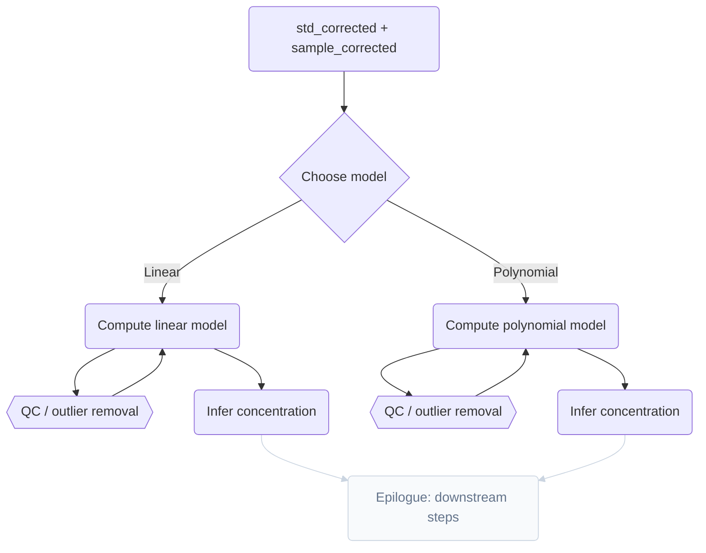
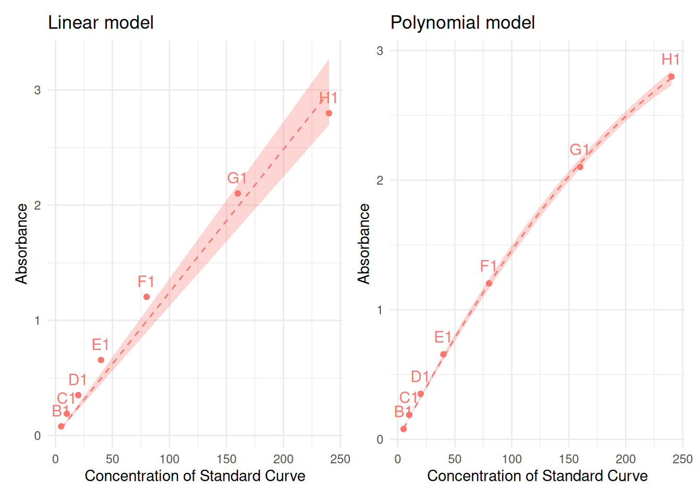
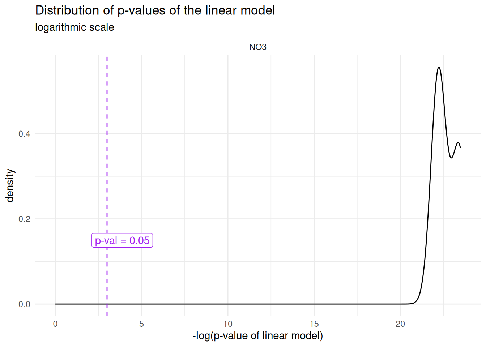
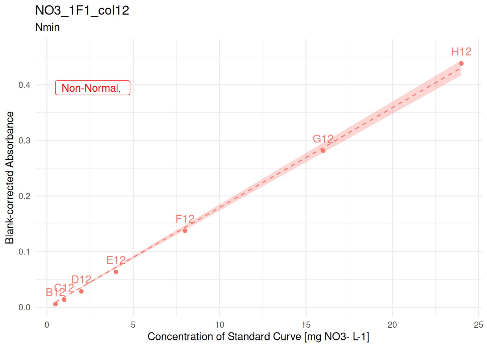
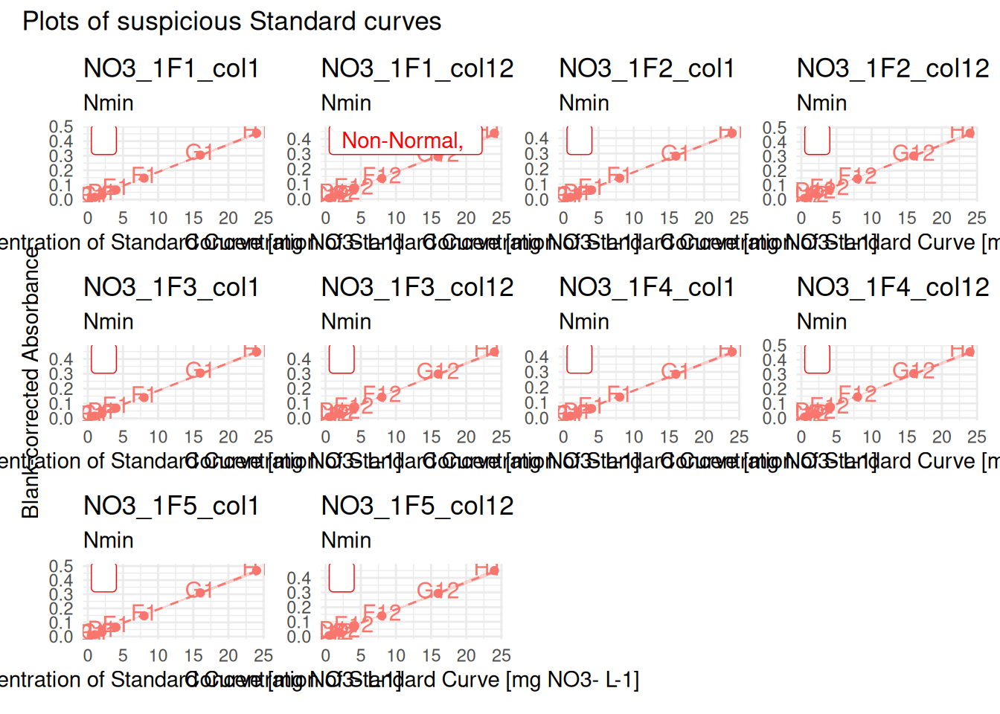
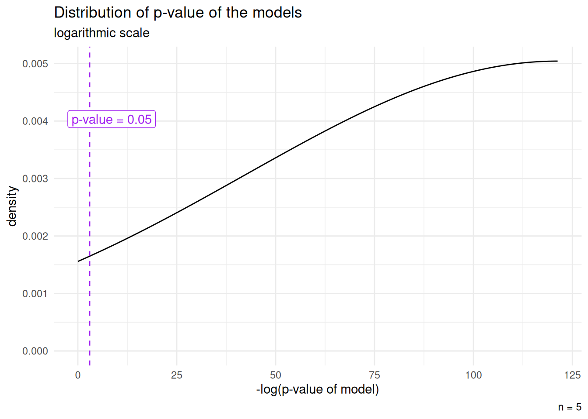
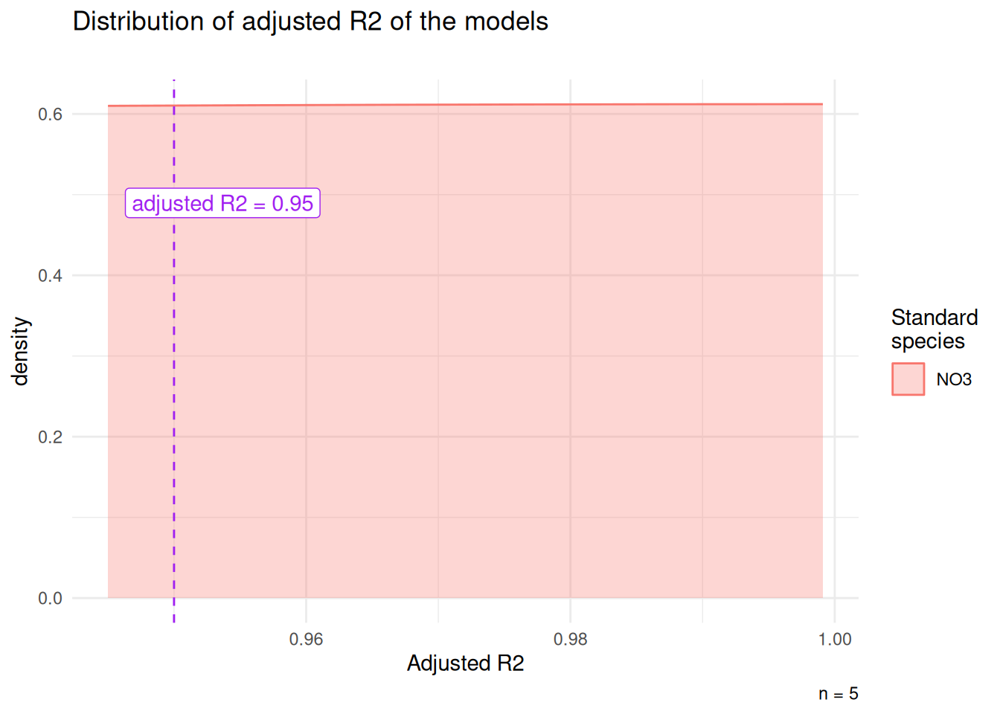
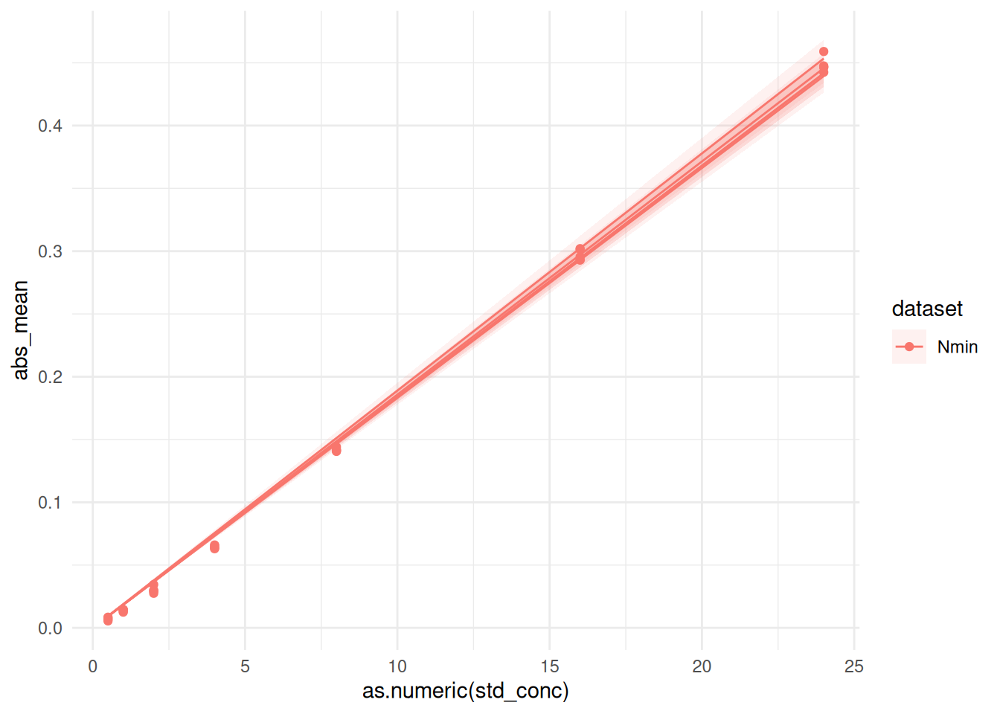
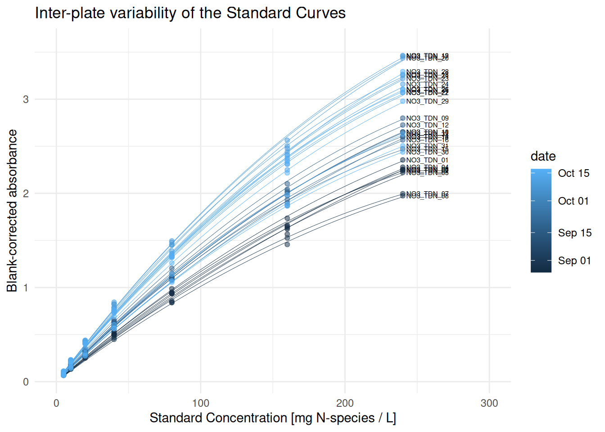
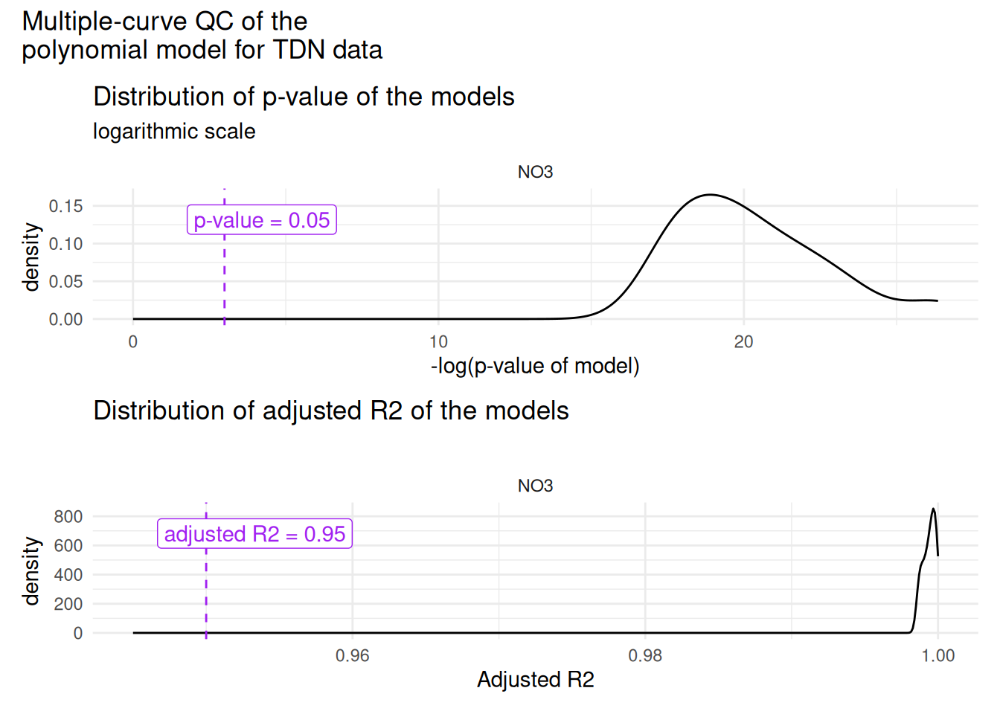

# abs-to-conc

``` r

library(plate2N)
library(patchwork)
```

> **Work in progress**
>
> This vignette is still under development, bugs are to be expected

## Introduction

In this vignette, we cover the steps from blank-corrected absorbance to
concentration in nitrogen \[mg N / L\], although this can easily be used
for dosing other molecules[^1], as long as the the relationship between
absorbance and concentration is linear or polynomial.

### The Whole Game

This pipeline picks up where `blank-correction` left off
(`std_corrected` and `sample_corrected`), decides between a linear or
polynomial model based on how your standard curves fit, computes the
regression, and infers sample concentrations:


``` mermaid
flowchart TD
  A(std_corrected + sample_corrected) --> B{Choose model}
  B -->|Linear| C1(Compute linear model)
  C1 --> O1{{QC / outlier removal}}
  O1 --> C1
  C1 --> D1(Infer concentration)
  B -->|Polynomial| C2(Compute polynomial model)
  C2 --> O2{{QC / outlier removal}}
  O2 --> C2
  C2 --> D2(Infer concentration)
  D1 --> E(Epilogue: downstream steps):::sideThing
  D2 --> E

  classDef sideThing fill:#f8fafc,stroke:#cbd5e1,color:#64748b,stroke-width:1px;
   linkStyle 9 stroke:#cbd5e1,stroke-width:1px;
   linkStyle 10 stroke:#cbd5e1,stroke-width:1px;
```

As with `blank-correction`, there’s no honest one-shot snippet that
skips outlier removal, since checking your standard curves is a manual,
visual step. Here’s the fast path for the linear model, assuming clean
curves (no outlier) with one dilution per plate (no averaging needed):

``` r

# compute linear model
lm_table_raw <- lm_std_curve(std_corrected |> dplyr::group_by(plate_id, column))

#** HERE COMES USER-DECISION ON OUTLIER REMOVAL / PER-DILUTION AVERAGING - ITERATIVE PROCESS *

# infer concentration
data_mg_N_L <- reg_join_abs(lm_table_raw, sample_corrected, target_sp = "N") |> 
  dplyr::mutate(conc_mgNsp_L = abs_corrected / slope) |> 
  convert_molec(masses = molar_masses)
```

For the polynomial model, the steps follow the same overall pattern,
just with a different model formula — see [Polynomial
model](#sec-polynomial) for the specifics.

### The Cheat Sheet

| Step | Function(s) | Purpose |
|----|----|----|
| Compute model | [`lm_std_curve()`](https://mdetoeuf.github.io/plate2N/reference/lm_std_curve.md) (add `model = "poly"` for the polynomial model) | Fit a per-curve regression (linear or polynomial) through the origin |
| QC & visualize | [`suspicious_lm()`](https://mdetoeuf.github.io/plate2N/reference/suspicious_lm.md), [`plot_list_lm()`](https://mdetoeuf.github.io/plate2N/reference/plot_list_lm.md), [`density_lm_param()`](https://mdetoeuf.github.io/plate2N/reference/density_lm_param.md) | Identify and visualize curves that don’t fit well *(see the upcoming plotting vignette)* |
| Remove outlier wells | [`remove_wells()`](https://mdetoeuf.github.io/plate2N/reference/remove_wells.md) | Drop wells identified as outliers — explained in detail in `handling-outliers` |
| Per-dilution average | [`std_dilution_average()`](https://mdetoeuf.github.io/plate2N/reference/std_dilution_average.md) | Average multiple curves per plate into one |
| Join model to sample data | [`reg_join_abs()`](https://mdetoeuf.github.io/plate2N/reference/reg_join_abs.md) | Attach the fitted regression (linear or polynomial) to sample absorbance data |
| Infer concentration | manual formula (linear) or quadratic solve (polynomial) | Convert absorbance to concentration using the fitted model |
| Convert units | [`convert_molec()`](https://mdetoeuf.github.io/plate2N/reference/convert_molec.md) | Convert between mg *molecule* / L and mg *element* / L using `molar_masses` |

### Overview of abs-to-conc

- Decide which model to use (linear or polynomial) based on how well
  your standard curves fit a straight line

- Compute the model

  - if suspicious curves are flagged: identify and remove outliers,
    recompute

  - if there’s more than one standard blank per plate (e.g. several
    curves per plate, or several blank wells within a single curve):
    compute the per-dilution average, recompute the model

- Join the fitted model to sample data and infer concentration

- Convert to the units relevant to your study (e.g. mg N/L, later ppm —
  see Epilogue)

> **Prerequisites**
>
> - data has been imported and tidied, see
>   [`vignette("import-tidy", package = "plate2N")`](https://mdetoeuf.github.io/plate2N/articles/import-tidy.md)
>
> - data has been blank-corrected, see
>   [`vignette("blank-correction", package = "plate2N")`](https://mdetoeuf.github.io/plate2N/articles/blank-correction.md)
>
> - Outliers have been removed throughout that process, see previous
>   vignettes and also
>   [`vignette("handling-outliers", package = "plate2N")`](https://mdetoeuf.github.io/plate2N/articles/handling-outliers.md)

## 1 - Get blank-corrected data

Here is what the blank-corrected data looks like (see prerequisites)

``` r

sample_corrected
#> # A tibble: 264 × 25
#>    row   column well_id unique_well_id dataset plate_id map      abs_corrected
#>    <chr> <chr>  <chr>   <chr>          <chr>   <chr>    <chr>            <dbl>
#>  1 A     2      A2      A2_NO3_1F1     Nmin    NO3_1F1  81_t1_z2       0.0312 
#>  2 A     2      A2      A2_NO3_1F2     Nmin    NO3_1F2  97_t1_z1      -0.00975
#>  3 A     2      A2      A2_NO3_1F3     Nmin    NO3_1F3  89_t1_z3       0.0104 
#>  4 A     2      A2      A2_NO3_1F4     Nmin    NO3_1F4  81_t1_z1       0.0437 
#>  5 A     2      A2      A2_NO3_1F5     Nmin    NO3_1F5  Std_3_t1       0.0832 
#>  6 A     3      A3      A3_NO3_1F1     Nmin    NO3_1F1  82_t1_z2       0.0452 
#>  7 A     3      A3      A3_NO3_1F2     Nmin    NO3_1F2  98_t1_z1      -0.0128 
#>  8 A     3      A3      A3_NO3_1F3     Nmin    NO3_1F3  90_t1_z3       0.0124 
#>  9 A     3      A3      A3_NO3_1F4     Nmin    NO3_1F4  82_t1_z3       0.0638 
#> 10 A     3      A3      A3_NO3_1F5     Nmin    NO3_1F5  98_t1_z3       0.0232 
#> # ℹ 254 more rows
#> # ℹ 17 more variables: blank_sdev <dbl>, blank_coeff_var_percent <dbl>,
#> #   date <lgl>, time <lgl>, sampling_time <chr>, std_column <chr>,
#> #   std_sp <chr>, std_unit <chr>, std_prep <chr>, std_conc <chr>,
#> #   sample_dilution <chr>, extractant_column <lgl>, extractant_sp <chr>,
#> #   extractant_unit <chr>, extractant_conc <dbl>, empty_column <lgl>,
#> #   wait_min <chr>

std_corrected
#> # A tibble: 70 × 26
#>    row   column well_id unique_well_id dataset plate_id unique_curve_id map  
#>    <chr> <chr>  <chr>   <chr>          <chr>   <chr>    <chr>           <chr>
#>  1 B     1      B1      B1_NO3_1F1     Nmin    NO3_1F1  NO3_1F1_col1    Std  
#>  2 B     1      B1      B1_NO3_1F2     Nmin    NO3_1F2  NO3_1F2_col1    Std  
#>  3 B     1      B1      B1_NO3_1F3     Nmin    NO3_1F3  NO3_1F3_col1    Std  
#>  4 B     1      B1      B1_NO3_1F4     Nmin    NO3_1F4  NO3_1F4_col1    Std  
#>  5 B     1      B1      B1_NO3_1F5     Nmin    NO3_1F5  NO3_1F5_col1    Std  
#>  6 B     12     B12     B12_NO3_1F1    Nmin    NO3_1F1  NO3_1F1_col12   Std  
#>  7 B     12     B12     B12_NO3_1F2    Nmin    NO3_1F2  NO3_1F2_col12   Std  
#>  8 B     12     B12     B12_NO3_1F3    Nmin    NO3_1F3  NO3_1F3_col12   Std  
#>  9 B     12     B12     B12_NO3_1F4    Nmin    NO3_1F4  NO3_1F4_col12   Std  
#> 10 B     12     B12     B12_NO3_1F5    Nmin    NO3_1F5  NO3_1F5_col12   Std  
#> # ℹ 60 more rows
#> # ℹ 18 more variables: abs_corrected <dbl>, date <lgl>, time <lgl>,
#> #   sampling_time <chr>, std_column <chr>, std_sp <chr>, std_unit <chr>,
#> #   std_prep <chr>, sample_dilution <chr>, extractant_column <lgl>,
#> #   extractant_sp <chr>, extractant_unit <chr>, extractant_conc <dbl>,
#> #   empty_column <lgl>, wait_min <chr>, std_conc <dbl>, blank_sdev <dbl>,
#> #   blank_coeff_var_percent <dbl>
```

## 2 - Tips for choosing the model

> **Choose your model wisely**
>
> In this pipeline, we show how to implement a linear model and a
> polynomial model. The section on linear model is detailed in great
> depth, then the polynomial model is presented more briefly, with
> insistence only on points that differ from the linear model.
>
> For dosage of mineral N pools, a polynomial model can be necessary,
> for example, when concentrations (and absorbance values) are high. The
> best red flag for the inappropriateness of the linear model is when
> the fit of the curve does not seem to suit the plotting of the
> experimental points.
>
> For new pipelines, always check out the standard curves graphically to
> ensure a good fit.
>
> Curvature at high absorbance can come from more than one source — for
> example, the color-forming reagent becoming limiting at high
> concentrations, or stray light, an optical artifact of the plate
> reader itself that affects any sufficiently high absorbance reading
> regardless of chemistry. Switching to a polynomial model is a
> reasonable empirical fix either way, but it’s worth understanding
> roughly why your curve bends before doing so, since the two causes
> have different implications — for example, whether readings above your
> calibrated range can be trusted, or whether diluting samples is a
> better fix than adding model complexity.

We will illustrate the choice of model on another data set called
`tidy_TDN` (equivalent in structure to the `tidy_plates` we had at the
beginning of the vignette `blank-correction`):

``` r

tidy_TDN
#> # A tibble: 3,072 × 8
#>    row   column well_id unique_well_id dataset plate_id   abs   map  
#>    <chr> <chr>  <chr>   <chr>          <chr>   <chr>      <chr> <chr>
#>  1 A     1      A1      A1_NO3_TDN_01  TDN     NO3_TDN_01 0.095 Std  
#>  2 A     1      A1      A1_NO3_TDN_02  TDN     NO3_TDN_02 0.097 Std  
#>  3 A     1      A1      A1_NO3_TDN_03  TDN     NO3_TDN_03 0.113 Std  
#>  4 A     1      A1      A1_NO3_TDN_04  TDN     NO3_TDN_04 0.114 Std  
#>  5 A     1      A1      A1_NO3_TDN_05  TDN     NO3_TDN_05 0.132 Std  
#>  6 A     1      A1      A1_NO3_TDN_06  TDN     NO3_TDN_06 0.12  Std  
#>  7 A     1      A1      A1_NO3_TDN_07  TDN     NO3_TDN_07 0.095 Std  
#>  8 A     1      A1      A1_NO3_TDN_08  TDN     NO3_TDN_08 0.09  Std  
#>  9 A     1      A1      A1_NO3_TDN_09  TDN     NO3_TDN_09 0.14  Std  
#> 10 A     1      A1      A1_NO3_TDN_10  TDN     NO3_TDN_10 0.143 Std  
#> # ℹ 3,062 more rows
```

To illustrate the polynomial vs the linear model, we extract standard
data for a single curve from that dataset. We chose here the 9th curve
because it illustrates the purpose nicely. But to base a model decision
at the dataset scale, you would have to repeat this on several curves,
e.g., by sampling a random number of curves, then plotting them in a
loop.

``` r

# take data for a single curve and format it for the plotting
curve <- (std_corrected_TDN |> 
            # whatever steps are required to isolate a single curve
            # Here: grouping by plate and column (2 curves per plate)
            dplyr::group_by(plate_id, column) |> 
            # dataset with several N-species for each plate_id --> choose only one
            dplyr::filter(std_sp == "NO3") |> 
           # dplyr::rename(abs = abs_corrected) |> 
            # split the data by group:
            # it creates a list where each group is one element
            dplyr::group_split()
          # take the 9th element of the list
          )[[9]]

# check it out
curve
#> # A tibble: 7 × 13
#>   row   column well_id unique_well_id dataset plate_id   unique_curve_id map  
#>   <chr> <chr>  <chr>   <chr>          <chr>   <chr>      <chr>           <chr>
#> 1 B     1      B1      B1_NO3_TDN_09  TDN     NO3_TDN_09 NO3_TDN_09_col1 Std  
#> 2 C     1      C1      C1_NO3_TDN_09  TDN     NO3_TDN_09 NO3_TDN_09_col1 Std  
#> 3 D     1      D1      D1_NO3_TDN_09  TDN     NO3_TDN_09 NO3_TDN_09_col1 Std  
#> 4 E     1      E1      E1_NO3_TDN_09  TDN     NO3_TDN_09 NO3_TDN_09_col1 Std  
#> 5 F     1      F1      F1_NO3_TDN_09  TDN     NO3_TDN_09 NO3_TDN_09_col1 Std  
#> 6 G     1      G1      G1_NO3_TDN_09  TDN     NO3_TDN_09 NO3_TDN_09_col1 Std  
#> 7 H     1      H1      H1_NO3_TDN_09  TDN     NO3_TDN_09 NO3_TDN_09_col1 Std  
#> # ℹ 5 more variables: abs_corrected <dbl>, std_sp <chr>, std_unit <chr>,
#> #   date <date>, std_conc <dbl>
```

Now we compute both models: linear and polynomial, so that we may
compare them.

The linear model takes `abs_corrected ~ 0 + std_conc` as a formula,
which is the equivalent to say: `y = mx + p` with y = absorbance and x =
concentration. m is the slope, and because we blank-corrected the data
already, we are constraining the model to fit through the origin, i.e.,
p = 0, which justifies the `0 + std_conc` in the model call.

The polynomial model takes
`abs_corrected ~ 0 + std_conc + I(std_conc^2)` as a formula, which is
the equivalent to say: `y = ax^2 + bx + c`. With the same logic as
above, y = absorbance, x = concentration and c = 0 (blank-corrected
data).

``` r

# compute both models
lm_linear <- stats::lm(abs_corrected ~ 0 + std_conc, data = curve)
lm_poly <- stats::lm(abs_corrected ~ 0 + std_conc + I(std_conc^2), data = curve)
```

While both models return p-values corresponding to highly significant
models (see next chunk), and very high adjusted R-squared, we will see
with the plots that, indeed, the polynomial model is a much better fit
in this case

``` r

(sum_linear <- summary(lm_linear))
#> 
#> Call:
#> stats::lm(formula = abs_corrected ~ 0 + std_conc, data = curve)
#> 
#> Residuals:
#>      Min       1Q   Median       3Q      Max 
#> -0.18370  0.04129  0.10244  0.13621  0.20977 
#> 
#> Coefficients:
#>           Estimate Std. Error t value Pr(>|t|)    
#> std_conc 0.0124279  0.0004877   25.48 2.41e-07 ***
#> ---
#> Signif. codes:  0 '***' 0.001 '**' 0.01 '*' 0.05 '.' 0.1 ' ' 1
#> 
#> Residual standard error: 0.1477 on 6 degrees of freedom
#> Multiple R-squared:  0.9908, Adjusted R-squared:  0.9893 
#> F-statistic: 649.5 on 1 and 6 DF,  p-value: 2.405e-07
(sum_poly <- summary(lm_poly))
#> 
#> Call:
#> stats::lm(formula = abs_corrected ~ 0 + std_conc + I(std_conc^2), 
#>     data = curve)
#> 
#> Residuals:
#>         1         2         3         4         5         6         7 
#> -0.003064  0.023935  0.025124  0.021264  0.002595 -0.028541  0.011591 
#> 
#> Coefficients:
#>                 Estimate Std. Error t value Pr(>|t|)    
#> std_conc       1.672e-02  2.846e-04   58.75 2.70e-08 ***
#> I(std_conc^2) -2.127e-05  1.360e-06  -15.64 1.94e-05 ***
#> ---
#> Signif. codes:  0 '***' 0.001 '**' 0.01 '*' 0.05 '.' 0.1 ' ' 1
#> 
#> Residual standard error: 0.0229 on 5 degrees of freedom
#> Multiple R-squared:  0.9998, Adjusted R-squared:  0.9997 
#> F-statistic: 1.363e+04 on 2 and 5 DF,  p-value: 4.551e-10
```

Seeing the summary of both models: both are significant, but the p-value
of the coefficient for the second degree term (a in ax^2) in the
polynomial model is \<\<0.05, which indicates that that term
significantly contributes to the model.

Now, we build the 2 plots. In the call to the plot below, we rename
abs_corrected with abs, as that is the argument that the function
[`plot_std()`](https://mdetoeuf.github.io/plate2N/reference/plot_std.md)
takes.

``` r

# build the linear model plot
p_linear <- 
  plot_std(
    curve |> dplyr::rename(abs = abs_corrected), 
    through_origin = TRUE, 
    model = "linear") + 
  ggplot2::theme(legend.position = "none") + 
  ggplot2::labs(title = "Linear model")

# build the polynomial model plot
p_poly <- 
  plot_std(
    curve |> dplyr::rename(abs = abs_corrected), 
    through_origin = TRUE, 
    model = "poly") + 
  ggplot2::theme(legend.position = "none") + 
  ggplot2::labs(title = "Polynomial model")

# looking at both plots next to each other (package "patchwork" needed)
p_linear + p_poly
```



Indeed, the polynomial model fits a lot better

Let’s look at the Residual plot to confirm this intuition

``` r

# Extract residual data from the 2 models
res_linear <- stats::residuals(sum_linear)
res_poly <- stats::residuals(sum_poly)

# plot both on the same graph

# plot residuals for linear model
plot(curve$std_conc, res_linear, main = "Residuals Analysis", xlab = "Concentration", ylab = "Residuals", col = "grey30", pch = 16)
# add red line at y = 0
graphics::abline(h = 0, col = "red", lty = 2)
# add residuals for polynomial model
graphics::points(curve$std_conc, res_poly,  col = "magenta", pch = 15)
# add legend
graphics::points(0, y = -0.1, col = "grey30", pch = 16)
graphics::text(x = 6, y = -0.1, labels = "linear\nmodel", col = "grey30", adj = 0)
graphics::points(0, y = -0.15, col = "magenta", pch = 15)
graphics::text(x = 6, y = -0.15, labels = "polynomial\nmodel", col = "magenta", adj = 0)
```



Whereas this quick approach suffices to convince us that a polynomial
model is a better fit for this particular curve, one should evaluate
several curves before taking a decision that concerns a larger data set.

## 3 - Linear model from Standard Curves

[`lm_std_curve()`](https://mdetoeuf.github.io/plate2N/reference/lm_std_curve.md)
computes a per-curve linear regression between 2 columns of the input
data with `lm(abs_corrected ~ 0 + std_conc, data = curve)` which is the
linear model that constraints the curve to go through the origin.
[`lm_std_curve()`](https://mdetoeuf.github.io/plate2N/reference/lm_std_curve.md)
returns a table containing one row per standard curve, and a series of
information characterizing the performance of the linear model for that
curve (see below and also `?lm_std_curve()`.

### 3.1 - Compute linear model, round 1

[`lm_std_curve()`](https://mdetoeuf.github.io/plate2N/reference/lm_std_curve.md)
defines a curve based on the groups (defined by
[`dplyr::group_by()`](https://dplyr.tidyverse.org/reference/group_by.html))
of the data given as input (`std_corrected` in the example below).
Additionally to the columns `abs_corrected` and `std_conc` (numeric),
the function also requires the column `unique_curve_id`.

``` r

# compute the model and store model details
(lm_table_raw <- lm_std_curve(
  std_corrected |> dplyr::group_by(plate_id, column)))
#> # A tibble: 10 × 12
#>    dataset plate_id unique_curve_id std_sp  slope r_squared adj_r_squared
#>    <chr>   <chr>    <chr>           <chr>   <dbl>     <dbl>         <dbl>
#>  1 Nmin    NO3_1F1  NO3_1F1_col1    NO3    0.0189     0.999         0.999
#>  2 Nmin    NO3_1F1  NO3_1F1_col12   NO3    0.0179     0.999         0.999
#>  3 Nmin    NO3_1F2  NO3_1F2_col1    NO3    0.0178     0.999         0.999
#>  4 Nmin    NO3_1F2  NO3_1F2_col12   NO3    0.0190     0.999         0.999
#>  5 Nmin    NO3_1F3  NO3_1F3_col1    NO3    0.0187     0.999         0.999
#>  6 Nmin    NO3_1F3  NO3_1F3_col12   NO3    0.0185     0.999         0.999
#>  7 Nmin    NO3_1F4  NO3_1F4_col1    NO3    0.0178     0.999         0.999
#>  8 Nmin    NO3_1F4  NO3_1F4_col12   NO3    0.0188     0.999         0.999
#>  9 Nmin    NO3_1F5  NO3_1F5_col1    NO3    0.0193     0.999         0.999
#> 10 Nmin    NO3_1F5  NO3_1F5_col12   NO3    0.0185     0.999         0.998
#> # ℹ 5 more variables: lm_p <dbl>, normality_lm_residuals <chr>,
#> #   shapiro_p <dbl>, homoscedasticity_lm_residuals <chr>, breusch_pagan_p <dbl>

# check out column names, type, and data
str(lm_table_raw)
#> tibble [10 × 12] (S3: tbl_df/tbl/data.frame)
#>  $ dataset                      : chr [1:10] "Nmin" "Nmin" "Nmin" "Nmin" ...
#>  $ plate_id                     : chr [1:10] "NO3_1F1" "NO3_1F1" "NO3_1F2" "NO3_1F2" ...
#>  $ unique_curve_id              : chr [1:10] "NO3_1F1_col1" "NO3_1F1_col12" "NO3_1F2_col1" "NO3_1F2_col12" ...
#>  $ std_sp                       : chr [1:10] "NO3" "NO3" "NO3" "NO3" ...
#>  $ slope                        : num [1:10] 0.0189 0.0179 0.0178 0.019 0.0187 ...
#>  $ r_squared                    : num [1:10] 0.999 0.999 0.999 0.999 0.999 ...
#>  $ adj_r_squared                : num [1:10] 0.999 0.999 0.999 0.999 0.999 ...
#>  $ lm_p                         : num [1:10] 6.49e-11 2.79e-10 6.03e-11 1.64e-10 9.25e-11 ...
#>  $ normality_lm_residuals       : chr [1:10] "Normal" "Not Normal" "Normal" "Normal" ...
#>  $ shapiro_p                    : num [1:10] 0.836 0.01 0.824 0.962 0.805 0.81 0.632 0.646 0.602 0.535
#>  $ homoscedasticity_lm_residuals: chr [1:10] "Homoscedasticity" "Homoscedasticity" "Homoscedasticity" "Homoscedasticity" ...
#>  $ breusch_pagan_p              : num [1:10] 0.445 0.721 0.686 0.789 0.916 0.483 0.46 0.445 0.537 0.621
```

### 3.2 - QC Standard curves - check conditions of linear model

The function
[`suspicious_lm()`](https://mdetoeuf.github.io/plate2N/reference/suspicious_lm.md)
extracts from an `lm_table` as produced above all plates where the
linear model is not optimal, i.e., either the p-value of the model is
above 0.05, or its residuals are not normally distributed, or there is
heteroscedasticity of residuals. `lm_table_suspicious` can serve for the
identification of outlier wells.

In this simplified data set, there is only one suspicious curve:

``` r

# extract all plates where "something" is not perfect 
(lm_table_suspicious <- lm_table_raw |> suspicious_lm())
#> # A tibble: 1 × 12
#>   dataset plate_id unique_curve_id std_sp  slope r_squared adj_r_squared
#>   <chr>   <chr>    <chr>           <chr>   <dbl>     <dbl>         <dbl>
#> 1 Nmin    NO3_1F1  NO3_1F1_col12   NO3    0.0179     0.999         0.999
#> # ℹ 5 more variables: lm_p <dbl>, normality_lm_residuals <chr>,
#> #   shapiro_p <dbl>, homoscedasticity_lm_residuals <chr>, breusch_pagan_p <dbl>
```

For visual aid (useful for larger data sets),
[`plot_list_lm()`](https://mdetoeuf.github.io/plate2N/reference/plot_list_lm.md)
creates a *list* of plots of each curve given as argument. This means
that it can be used to store plots any subset of curves, or for the
whole dataset. Calling individual plots from this list can help spotting
possible outlier wells, which can be removed with similar steps as shown
above.

Each element of the list is one plot, so that calling
`suspicious_lm_plotlist[[i]]` will return the i-th plot. The plots are
named in the list, so that you can also access any plot by calling the
`unique_curve_id`, e.g., with `suspicious_lm_plotlist$NO3_1F1_col12`

``` r

# here, we create a list of plots from only the suspicious curve
suspicious_lm_plotlist <- plot_list_lm(
  lm_data = lm_table_suspicious,
  std_data = std_corrected)

# check out the names of elements of the list (here only 1)
names(suspicious_lm_plotlist)
#> [1] "NO3_1F1_col12"

# check one plot out
suspicious_lm_plotlist[[1]]
```


``` r


# or by name
suspicious_lm_plotlist$NO3_1F1_col12
```



When there are numerous (suspicious) curves, we can take advantage of
the package `patchwork` to display multiple plots (example hereunder
with the whole lm_table)

``` r

full_plotlist <- plot_list_lm(
  lm_data = lm_table_raw,
  std_data = std_corrected)


patchwork::wrap_plots(full_plotlist, axis_titles = "collect_y") +
     patchwork::plot_annotation(title = "Plots of suspicious Standard curves")
```



### 3.3 - outlier removal

At this point, you may want to remove obvious outlier wells. Follow
steps as shown in vignettes from prerequisites to
[`remove_wells()`](https://mdetoeuf.github.io/plate2N/reference/remove_wells.md).

Let’s say that we want to remove well E12 from plate NO3_1F1 in dataset
Nmin:

``` r

to_remove <- tibble::tibble(
  dataset = "Nmin",
  plate_id = "NO3_1F1",
  well_id = "E12"
)

std_corrected_wash1 <- std_corrected |> remove_wells(to_remove)
```

From now on, we no longer use `std_corrected`, but only
`std_corrected_wash1`. We recommend always running one more round of
quality check on the cleaned datasets before approving regression
equations.

### 3.4 - Per-dilution averages (if 2+ curves per plate)

Once the outlier wells have been removed from single curves, in the case
where several curves were pipetted per 96-well plate, we still need to
perform a per-dilution average of absorbance. Indeed, there likely have
been 2 events of pipetting of the same dilution, rather than 2
independent dilutions.

> **WARNING**
>
> The next step computes per plate per row means for the standard
> curves.
>
> If some wells have been swapped in some plates, this may cause
> problems. Make sure there was no pipetting issue, or correct raw data
> or solve it through code

[`std_dilution_average()`](https://mdetoeuf.github.io/plate2N/reference/std_dilution_average.md)
does that and creates an artificial “column 13”.

Notice that the average reduced the number of rows ~ 2-fold, and notice
unique curve ids ending with `_col13`.

``` r

std_dilution_avg <- std_corrected_wash1 |> std_dilution_average()

# Check it out (notice )
std_dilution_avg
#> # A tibble: 35 × 25
#>    plate_id row   column well_id unique_curve_id abs_mean dataset map   date 
#>    <chr>    <chr>  <dbl> <chr>   <chr>              <dbl> <chr>   <chr> <lgl>
#>  1 NO3_1F1  B         13 B13     NO3_1F1_col13    0.00700 Nmin    Std   NA   
#>  2 NO3_1F1  C         13 C13     NO3_1F1_col13    0.0145  Nmin    Std   NA   
#>  3 NO3_1F1  D         13 D13     NO3_1F1_col13    0.0295  Nmin    Std   NA   
#>  4 NO3_1F1  E         13 E13     NO3_1F1_col13    0.0655  Nmin    Std   NA   
#>  5 NO3_1F1  F         13 F13     NO3_1F1_col13    0.142   Nmin    Std   NA   
#>  6 NO3_1F1  G         13 G13     NO3_1F1_col13    0.293   Nmin    Std   NA   
#>  7 NO3_1F1  H         13 H13     NO3_1F1_col13    0.446   Nmin    Std   NA   
#>  8 NO3_1F2  B         13 B13     NO3_1F2_col13    0.00800 Nmin    Std   NA   
#>  9 NO3_1F2  C         13 C13     NO3_1F2_col13    0.0145  Nmin    Std   NA   
#> 10 NO3_1F2  D         13 D13     NO3_1F2_col13    0.0345  Nmin    Std   NA   
#> # ℹ 25 more rows
#> # ℹ 16 more variables: time <lgl>, sampling_time <chr>, std_column <chr>,
#> #   std_sp <chr>, std_unit <chr>, std_prep <chr>, sample_dilution <chr>,
#> #   extractant_column <lgl>, extractant_sp <chr>, extractant_unit <chr>,
#> #   extractant_conc <dbl>, empty_column <lgl>, wait_min <chr>, std_conc <dbl>,
#> #   blank_sdev <dbl>, blank_coeff_var_percent <dbl>
```

### 3.5 - Compute linear model + QC - round 2

We can now rerun the linear model on the cleaned and (if required)
per-dilution averaged curve, by repeating the same steps as above:
computation of linear model, identification of suspicious curves and
plotting

``` r

# Generate linear model data
(lm_std_mean <- lm_std_curve(
  std_dilution_avg |> dplyr::rename(abs_corrected = abs_mean)))
#> # A tibble: 5 × 12
#>   dataset plate_id unique_curve_id std_sp  slope r_squared adj_r_squared
#>   <chr>   <chr>    <chr>           <chr>   <dbl>     <dbl>         <dbl>
#> 1 Nmin    NO3_1F1  NO3_1F1_col13   NO3    0.0184     0.999         0.999
#> 2 Nmin    NO3_1F2  NO3_1F2_col13   NO3    0.0184     0.999         0.999
#> 3 Nmin    NO3_1F3  NO3_1F3_col13   NO3    0.0186     0.999         0.999
#> 4 Nmin    NO3_1F4  NO3_1F4_col13   NO3    0.0183     0.999         0.999
#> 5 Nmin    NO3_1F5  NO3_1F5_col13   NO3    0.0189     0.999         0.999
#> # ℹ 5 more variables: lm_p <dbl>, normality_lm_residuals <chr>,
#> #   shapiro_p <dbl>, homoscedasticity_lm_residuals <chr>, breusch_pagan_p <dbl>

# look for suspicious curves
(lm_suspicious_mean <- lm_std_mean |> suspicious_lm())
#> # A tibble: 0 × 12
#> # ℹ 12 variables: dataset <chr>, plate_id <chr>, unique_curve_id <chr>,
#> #   std_sp <chr>, slope <dbl>, r_squared <dbl>, adj_r_squared <dbl>,
#> #   lm_p <dbl>, normality_lm_residuals <chr>, shapiro_p <dbl>,
#> #   homoscedasticity_lm_residuals <chr>, breusch_pagan_p <dbl>
```

Good news, there are no more suspicious linear models anymore. Should
there be any, one more round of QC as described above can still be
helpful in some cases
([`plot_list_lm()`](https://mdetoeuf.github.io/plate2N/reference/plot_list_lm.md)).
However, one should not expect to always reach normality of residuals
with only 7 points. If the curve fits and the p-value of the model if
very low, non-normality and heteroscedasticity can be accepted. They are
used as tools to “flag” suspicious curves, but should not be used as too
strict criteria.

Let’s store the last correction into a clean variable name to reduce
possible confusion, and let’s compute all the plots in a big list, for
storage purposes. We could then export this as one output data in a
single list with
[`readr::write_rds()`](https://readr.tidyverse.org/reference/read_rds.html),
or save the plots with `ggsave()`.

``` r

# save the last wash in a clean variable name
std_data_clean <- std_dilution_avg
lm_table_clean <- lm_std_mean

# run model on the last, clean version
lm_plots_clean <- plot_list_lm(
  lm_table_clean, std_data_clean |> dplyr::rename(abs_corrected = abs_mean))

# store output and clean data in a list for export (optional)
lm_output <- list(
  "std_data_clean" = std_data_clean,
  "lm_table_clean" = lm_table_clean,
  "lm_plots_clean" = lm_plots_clean,
  "sample_corrected" = sample_corrected
)

# just an example of how to save this in a file for downstream steps
#lm_output |> write_rds("output/data/lm_output.rds")
```

### 3.6 - Multiple curve QC

The function
[`density_lm_param()`](https://mdetoeuf.github.io/plate2N/reference/density_lm_param.md)
plots the density curve of either p-values or adjusted R^2 of the model
(parameter `p_or_r`). See also `?density_lm_param()` for details and
examples.

First, let’s look at the distribution of p-values of the std curve
regressions

``` r

density_lm_param(
  lm_table_clean, 
  p_or_r = "p", threshold = 0.05, 
  facetting_std_sp = FALSE, color_std_sp = FALSE) +
  # add caption with number of curves
  ggplot2::labs(caption = paste0("n = ", nrow(lm_table_clean)))
```



Then, same with R_squared (or adjusted?)

``` r

density_lm_param(
  lm_table_clean, 
  p_or_r = "adjR2", threshold = 0.95, 
  facetting_std_sp = FALSE, color_std_sp = TRUE) +
  # add caption with number of curves
  ggplot2::labs(caption = paste0("n = ", nrow(lm_table_clean))) 
```



> **A note on R² thresholds for regression through the origin**
>
> Both the linear and polynomial models throughout this pipeline are
> constrained to pass through zero (`abs_corrected ~ 0 + std_conc`,
> since blank-corrected absorbance should read zero at zero
> concentration). R² for this kind of model is calculated differently
> than for a standard intercept model — relative to zero rather than the
> mean of the response — which tends to produce higher values than an
> equivalent intercept-model R² would. The 0.95 threshold used here (and
> again in Section 4.4 for the polynomial model) should be read as a
> practical guideline calibrated for this specific class of model, not
> as directly comparable to R² thresholds you might see quoted elsewhere
> for ordinary regression.

Now we plot all curves on same plot. Here we only have 5 curves. But it
can be useful to visualize the multi-curve plot to spot plates where
something possibly went wrong.

``` r

#colors <- c("#7FC97F", "#BEAED4", "#FDC086")

lm_output$std_data_clean |> 
  ggplot2::ggplot(ggplot2::aes(
    x = as.numeric(std_conc), y = abs_mean, 
    groups = plate_id, colour = dataset, fill = dataset)) +
  ggplot2::theme_minimal() +
  ggplot2::geom_smooth(
    formula = y ~ 0 + x, method = "lm", se = TRUE, 
    alpha = 0.1, linewidth = 0.5) +
  ggplot2::geom_point() 
```



Now, finally, we decide that we are happy with our standard curves, so
we can move on to apply the equations on the data

### 3.7 - Infer sample concentration from regression equation

Check that we are now left with only one curve per plate (i.e., we
indeed took a per-dilution average)

``` r

if (
  (lm_output$std_data_clean |> dplyr::group_by(plate_id) |>  dplyr::n_groups()) == 
  (lm_output$std_data_clean |> dplyr::group_by(unique_curve_id) |>  dplyr::n_groups())
) {message("All good: there is exactly one curve per plate")} else {
  warning("Warning: there is at least one plate with several curves")
}
#> All good: there is exactly one curve per plate
```

The regression equation is Abs = slope \* Concentration

There is a default vector containing relevant molar masses. Make sure to
append it with values that are relevant for your study. This is needed
to convert concentrations from mg *molecule* per L to mg *element* per L
(e.g., mg NO3/L to mg N/L)

``` r

molar_masses
#>       N     NO3     NO2     NH4 
#> 14.0069 62.0051 46.0057 36.0775
```

Here, we

- connect regression data to sample absorbance data with
  [`reg_join_abs()`](https://mdetoeuf.github.io/plate2N/reference/reg_join_abs.md).

- apply the regression equation to go from absorbance to concentration
  in mg N-sp per L

- convert unit to mg N per L using `molar_masses` and
  [`convert_molec()`](https://mdetoeuf.github.io/plate2N/reference/convert_molec.md).

``` r

data_mg_N_L <- 
  # add slope + info regression (p-val and R2) to absorbance data
  reg_join_abs(lm_output$lm_table_clean, lm_output$sample_corrected, target_sp = "N") |> 
  # compute concentration from absorbance
  dplyr::mutate(conc_mgNsp_L = abs_corrected / slope) |> 
  convert_molec(masses = molar_masses)

# Check it out
data_mg_N_L
#> # A tibble: 264 × 13
#>    dataset plate_id map   well_id abs_corrected std_sp target_sp std_unit  slope
#>    <chr>   <chr>    <chr> <chr>           <dbl> <chr>  <chr>     <chr>     <dbl>
#>  1 Nmin    NO3_1F1  81_t… A2            0.0312  NO3    N         mg NO3-… 0.0184
#>  2 Nmin    NO3_1F2  97_t… A2           -0.00975 NO3    N         mg NO3-… 0.0184
#>  3 Nmin    NO3_1F3  89_t… A2            0.0104  NO3    N         mg NO3-… 0.0186
#>  4 Nmin    NO3_1F4  81_t… A2            0.0437  NO3    N         mg NO3-… 0.0183
#>  5 Nmin    NO3_1F5  Std_… A2            0.0832  NO3    N         mg NO3-… 0.0189
#>  6 Nmin    NO3_1F1  82_t… A3            0.0452  NO3    N         mg NO3-… 0.0184
#>  7 Nmin    NO3_1F2  98_t… A3           -0.0128  NO3    N         mg NO3-… 0.0184
#>  8 Nmin    NO3_1F3  90_t… A3            0.0124  NO3    N         mg NO3-… 0.0186
#>  9 Nmin    NO3_1F4  82_t… A3            0.0638  NO3    N         mg NO3-… 0.0183
#> 10 Nmin    NO3_1F5  98_t… A3            0.0232  NO3    N         mg NO3-… 0.0189
#> # ℹ 254 more rows
#> # ℹ 4 more variables: adj_r_squared <dbl>, lm_p <dbl>, conc_mgNsp_L <dbl>,
#> #   conc_mgN_L <dbl>
```

We finally have our computed concentration for each well, expressed in
mg N per L. This is not the end of the data pipeline, but it is the end
of what really belongs in this vignette. Downstream steps are different
for each study. However, we propose below, in [Epilogue](#sec-epilogue),
a few examples of further data transformation.

## 4 - Polynomial model

In this section, we cover the sames steps as in the previous 2 sections,
but implementing a polynomial, rather than linear, model. This was
necessary, for example, when dosing total dissolved nitrogen, i.e.,
dosing nitrate after a total oxidation of all N-compounds to nitrate.
For this experiment, standard curve concentrations have been increased
ten-fold. This resulted in highly concentrated solutions generating
absorbance values above 3. It appears that a polynomial model is more
appropriate in this case, as can be seen in the next chunks (example of
a single curve).

> **Don’t need a polynomial model?**
>
> If your standard curves fit a straight line well (see [Tips for
> choosing the model](#sec-choice)), you can skip this section entirely
> — jump to [Epilogue](#sec-epilogue) once you’ve finished the linear
> model in Section 3.

> **Does a polynomial model change blank correction?**
>
> No. Blank correction (see the `blank-correction` vignette) was already
> carried out using simple subtraction, and that remains valid here even
> though the model in this section is polynomial. The blank is measured
> at (or near) zero concentration, before either of the mechanisms
> mentioned in [Tips for choosing the model](#sec-choice) becomes
> relevant — so blank subtraction and curve shape are answering two
> separate questions. Nothing about using a polynomial model here
> requires revisiting the earlier blank-correction step.

> **Only polynomial model-specific steps are reviewed in detail**
>
> In theory, applying a polynomial model would go through the same logic
> as the linear model:
>
> - 1st computation of the model + plotting suspicious curves
>
> - optional removal of outliers
>
> - if outliers were removed: 2nd computation of the model + plotting
>   suspicious curves again, etc until we are satisfied with the curves
>
> - In case of several curves per plate: computation of the per-dilution
>   (per-plate-row) average of the standard curve
>
> - If average was computed: 3rd computation of the model on
>   per-dilution averages
>
> - Infering sample concentration
>
> In this section, we mainly focus on steps that differ from the linear
> model. If it appears too cryptic here, go and check the linear
> model-equivalent section.
>
> For tips on choice of model, see [Tips for choosing the
> model](#sec-choice)

The dataset for Total Dissolved Nitrogen data (TDN), and its standard
curve data look like this (very similar to what we have seen with other
data sets before)

``` r

std_corrected_TDN
#> # A tibble: 224 × 13
#>    row   column well_id unique_well_id dataset plate_id   unique_curve_id map  
#>    <chr> <chr>  <chr>   <chr>          <chr>   <chr>      <chr>           <chr>
#>  1 B     1      B1      B1_NO3_TDN_01  TDN     NO3_TDN_01 NO3_TDN_01_col1 Std  
#>  2 B     1      B1      B1_NO3_TDN_02  TDN     NO3_TDN_02 NO3_TDN_02_col1 Std  
#>  3 B     1      B1      B1_NO3_TDN_03  TDN     NO3_TDN_03 NO3_TDN_03_col1 Std  
#>  4 B     1      B1      B1_NO3_TDN_04  TDN     NO3_TDN_04 NO3_TDN_04_col1 Std  
#>  5 B     1      B1      B1_NO3_TDN_05  TDN     NO3_TDN_05 NO3_TDN_05_col1 Std  
#>  6 B     1      B1      B1_NO3_TDN_06  TDN     NO3_TDN_06 NO3_TDN_06_col1 Std  
#>  7 B     1      B1      B1_NO3_TDN_07  TDN     NO3_TDN_07 NO3_TDN_07_col1 Std  
#>  8 B     1      B1      B1_NO3_TDN_08  TDN     NO3_TDN_08 NO3_TDN_08_col1 Std  
#>  9 B     1      B1      B1_NO3_TDN_09  TDN     NO3_TDN_09 NO3_TDN_09_col1 Std  
#> 10 B     1      B1      B1_NO3_TDN_10  TDN     NO3_TDN_10 NO3_TDN_10_col1 Std  
#> # ℹ 214 more rows
#> # ℹ 5 more variables: abs_corrected <dbl>, std_sp <chr>, std_unit <chr>,
#> #   date <date>, std_conc <dbl>

samples_corrected_TDN
#> # A tibble: 2,560 × 15
#>    row   column well_id unique_well_id dataset plate_id   map      abs_corrected
#>    <chr> <chr>  <chr>   <chr>          <chr>   <chr>      <chr>            <dbl>
#>  1 A     2      A2      A2_NO3_TDN_01  TDN     NO3_TDN_01 102_t2_…         0.459
#>  2 A     2      A2      A2_NO3_TDN_02  TDN     NO3_TDN_02 92_t2_z…         0.471
#>  3 A     2      A2      A2_NO3_TDN_03  TDN     NO3_TDN_03 90_t2_z…         0.434
#>  4 A     2      A2      A2_NO3_TDN_04  TDN     NO3_TDN_04 90_t2_z…         0.433
#>  5 A     2      A2      A2_NO3_TDN_05  TDN     NO3_TDN_05 99_t2_z…         0.460
#>  6 A     2      A2      A2_NO3_TDN_06  TDN     NO3_TDN_06 81_t2_z…         0.438
#>  7 A     2      A2      A2_NO3_TDN_07  TDN     NO3_TDN_07 83_t2_z…         0.380
#>  8 A     2      A2      A2_NO3_TDN_08  TDN     NO3_TDN_08 81_t2_z…         0.375
#>  9 A     2      A2      A2_NO3_TDN_09  TDN     NO3_TDN_09 102_t2_…         0.759
#> 10 A     2      A2      A2_NO3_TDN_10  TDN     NO3_TDN_10 92_t2_z…         0.694
#> # ℹ 2,550 more rows
#> # ℹ 7 more variables: std_sp <chr>, std_unit <chr>, std_conc <chr>,
#> #   date <date>, extr_id <chr>, blank_sdev <dbl>, blank_coeff_var_percent <dbl>
```

### 4.1 - Compute polynomial model on Standard curves

These steps follow the same steps as in section [Linear model from
Standard Curves](#sec-linear), with some adaptations.

First, we perform a polynomial model on each NO3 curve individually. In
the background, the function
[`lm_std_curve()`](https://mdetoeuf.github.io/plate2N/reference/lm_std_curve.md)
performs the model
`stats::lm(abs_corrected ~ 0 + std_conc + I(std_conc^2), data = curve)`
on each individual curve from the data

``` r

# Compute the polynomial model
lm_TDN_raw <- lm_std_curve(
  grouped_data = std_corrected_TDN |> dplyr::group_by(unique_curve_id), 
  model = "poly") 

# Check it out
lm_TDN_raw
#> # A tibble: 32 × 15
#>    dataset plate_id   unique_curve_id std_sp     poly_a poly_a_p poly_b poly_b_p
#>    <chr>   <chr>      <chr>           <chr>       <dbl>    <dbl>  <dbl>    <dbl>
#>  1 TDN     NO3_TDN_01 NO3_TDN_01_col1 NO3    -0.0000152  7.40e-4 0.0134  6.71e-7
#>  2 TDN     NO3_TDN_02 NO3_TDN_02_col1 NO3    -0.0000174  4.93e-4 0.0134  8.32e-7
#>  3 TDN     NO3_TDN_03 NO3_TDN_03_col1 NO3    -0.0000149  1.10e-4 0.0129  9.70e-8
#>  4 TDN     NO3_TDN_04 NO3_TDN_04_col1 NO3    -0.0000131  6.72e-4 0.0126  3.96e-7
#>  5 TDN     NO3_TDN_05 NO3_TDN_05_col1 NO3    -0.0000132  2.83e-3 0.0123  2.19e-6
#>  6 TDN     NO3_TDN_06 NO3_TDN_06_col1 NO3    -0.0000107  6.68e-3 0.0119  2.44e-6
#>  7 TDN     NO3_TDN_07 NO3_TDN_07_col1 NO3    -0.0000160  8.02e-6 0.0121  1.32e-8
#>  8 TDN     NO3_TDN_08 NO3_TDN_08_col1 NO3    -0.0000139  1.40e-4 0.0115  1.56e-7
#>  9 TDN     NO3_TDN_09 NO3_TDN_09_col1 NO3    -0.0000213  1.94e-5 0.0167  2.70e-8
#> 10 TDN     NO3_TDN_10 NO3_TDN_10_col1 NO3    -0.0000186  1.07e-4 0.0155  1.16e-7
#> # ℹ 22 more rows
#> # ℹ 7 more variables: r_squared <dbl>, adj_r_squared <dbl>, lm_p <dbl>,
#> #   normality_lm_residuals <chr>, shapiro_p <dbl>,
#> #   homoscedasticity_lm_residuals <chr>, breusch_pagan_p <dbl>
```

This produces a table that has a similar structure to the one from the
linear model, though columns are slightly different to reflect the
differences in the model. This table has one row per standard curve.
Columns poly_a and poly_b correspond to the coefficients `a` and `b`,
respectively, in the equation `y = a*x^2 + b*x + c`, where

- c = 0 because we used blank-corrected absorbance and the model was
  forced to go through the origin

- y = blank-corrected absorbance

- x = concentration in the compound of interest (here: nitrate)

Other columns in `lm_TDN_raw` contain the p-values associated to `a` and
`b` (`poly_a_p` and `poly_b_p`, respectively), the R2 and adjusted R2
values, the p-value associated with the model (`lm_p`), and results of a
normality test of residuals (columns `normality_lm_residuals` and
`shapiro_p`), and results of a test of homoscedasticity (columns
`homoscedasticity_lm_residuals` and `breusch_pagan_p`)

### 4.3 - QC Standard curve

Then we take a subset to examine individually. The function
[`suspicious_lm()`](https://mdetoeuf.github.io/plate2N/reference/suspicious_lm.md)
allows the subsetting of those curves where the linear model doesn’t
seem to perform ideally. i.e., either non-significant model (p-value \>
0.05), residuals not normally distributed, heteroscedasticity, or
p-value of one of the coefficients \> 0.05.

In our case, this concerns 7 curves (from 32)

``` r

# extract all plates where "something" is not perfect 
(lm_suspicious <- lm_TDN_raw |> suspicious_lm(model = "poly"))
#> # A tibble: 7 × 15
#>   dataset plate_id   unique_curve_id std_sp     poly_a poly_a_p poly_b  poly_b_p
#>   <chr>   <chr>      <chr>           <chr>       <dbl>    <dbl>  <dbl>     <dbl>
#> 1 TDN     NO3_TDN_02 NO3_TDN_02_col1 NO3    -0.0000174 0.000493 0.0134   8.32e-7
#> 2 TDN     NO3_TDN_04 NO3_TDN_04_col1 NO3    -0.0000131 0.000672 0.0126   3.96e-7
#> 3 TDN     NO3_TDN_05 NO3_TDN_05_col1 NO3    -0.0000132 0.00283  0.0123   2.19e-6
#> 4 TDN     NO3_TDN_08 NO3_TDN_08_col1 NO3    -0.0000139 0.000140 0.0115   1.56e-7
#> 5 TDN     NO3_TDN_17 NO3_TDN_17_col1 NO3    -0.0000252 0.00113  0.0203   1.66e-6
#> 6 TDN     NO3_TDN_20 NO3_TDN_20_col1 NO3    -0.0000218 0.000483 0.0194   4.00e-7
#> 7 TDN     NO3_TDN_24 NO3_TDN_24_col1 NO3    -0.0000236 0.000662 0.0187   9.99e-7
#> # ℹ 7 more variables: r_squared <dbl>, adj_r_squared <dbl>, lm_p <dbl>,
#> #   normality_lm_residuals <chr>, shapiro_p <dbl>,
#> #   homoscedasticity_lm_residuals <chr>, breusch_pagan_p <dbl>
```

We can visually evaluate those plates. For visual support, we create
with
[`plot_list_lm()`](https://mdetoeuf.github.io/plate2N/reference/plot_list_lm.md)
a list of plots where we store each individual plot of “suspicious”
standard curves.

``` r

suspicious_plots <- plot_list_lm(
  lm_suspicious, 
  std_data = std_corrected_TDN, 
  model = "poly")

# Look at the first plot
suspicious_plots[[1]]
```


Then we plot them together. Notice that the “problem” of each curve is
displayed on the plots. In this case, non-normality of the residuals is
always the issue. Should p-values (model or coefficients) be above 0.05
or the residuals be heteroscedastic, this would be displayed as well.

``` r

patchwork::wrap_plots(suspicious_plots, axis_titles = "keep") +
     patchwork::plot_annotation(title = "Plots of suspicious Standard curves")
```



Whereas the shapiro test that is run in the background by
[`lm_std_curve()`](https://mdetoeuf.github.io/plate2N/reference/lm_std_curve.md)
to test for normality of residuals is considered a trustworthy test in
general, normality is not easily achieved with only 8 data points. This
non-normality result should therefore be seen as an aid to spot possibly
faulty curves, rather than a strict criterion to exclude them. Visual
assessment is therefore crucial.

In this case, all 7 “suspicious” curves look quite good despite not
hitting the normality threshold. Should a well be very obviously outside
of the curve, then use
[`remove_wells()`](https://mdetoeuf.github.io/plate2N/reference/remove_wells.md)
to remove outliers as described many times above and in previous
vignettes. Then, re-run the model, etc. until you are satisfied with the
curves. Per-dilution averages in case of 2 or more curves per plate can
be computed as shown above for the linear model.

> **Caution 1: Downward facing parable or descending curve?**
>
> These functions for the polynomial model have been tested in the case
> where the data form a downward-facing parable. Knowing this AND the
> fact that we are in an ascending part of the curve, the smallest
> solution for x (concentration) is the correct one when solving the
> equation `a*x^2 + b*x - y = 0` for any value of y (absorbance).
>
> For the combination of upward-facing parable AND ascending curve,
> however, the highest solution for x would be the right one.
>
> Should you have data where the polynomial fit is correct, but the
> curves do not look like those displayed here, do check that the
> solutions for x in the next sections are correct. Please contact us
> should it not be the case

### 4.4 - Multiple curve QC

First, let’s look at the distribution of p-values and adjusted R^2 of
the std curve regressions

``` r

TDN_p <- density_lm_param(
  lm_TDN_raw, 
  p_or_r = "p", threshold = 0.05, 
  facetting_std_sp = TRUE, color_std_sp = FALSE)

TDN_adjR2 <- density_lm_param(
  lm_TDN_raw, "adjR2", 0.95, color_std_sp = FALSE 
)

TDN_p / TDN_adjR2 + patchwork::plot_annotation(title = "Multiple-curve QC of the\npolynomial model for TDN data")
```



Now we plot all curves on a single plot. Here, we check for
batch-effects by assigning the date to the color aesthetics, this should
be adapted as needed.

``` r

(annotation <- std_corrected_TDN |> 
  dplyr::select(plate_id, abs_corrected, std_conc, date) |> 
  dplyr::slice_max(std_conc, with_ties = TRUE))
#> # A tibble: 32 × 4
#>    plate_id   abs_corrected std_conc date      
#>    <chr>              <dbl>    <dbl> <date>    
#>  1 NO3_TDN_01          2.36      240 2025-08-26
#>  2 NO3_TDN_02          2.24      240 2025-08-26
#>  3 NO3_TDN_03          2.25      240 2025-08-26
#>  4 NO3_TDN_04          2.28      240 2025-08-26
#>  5 NO3_TDN_05          2.22      240 2025-08-26
#>  6 NO3_TDN_06          2.26      240 2025-08-26
#>  7 NO3_TDN_07          2.00      240 2025-08-28
#>  8 NO3_TDN_08          1.97      240 2025-08-28
#>  9 NO3_TDN_09          2.80      240 2025-09-15
#> 10 NO3_TDN_10          2.65      240 2025-09-15
#> # ℹ 22 more rows

std_corrected_TDN |> 
  ggplot2::ggplot(ggplot2::aes(
    x = as.numeric(std_conc), 
    y = abs_corrected, groups = plate_id,
    color = date, fill = date)) +
  ggplot2::theme_minimal() + 
  ggplot2::theme(legend.position = "right") +
  ggplot2::geom_smooth(
    formula = y ~ 0 + x + I(x^2), method = "lm", se = TRUE, 
    alpha = 0, linetype = 1, linewidth = 0.15) +
  ggplot2::geom_point(alpha = 0.5) +
  ggplot2::xlab("Standard Concentration [mg N-species / L]") +
  ggplot2::ylab("Blank-corrected absorbance") +
  ggplot2::labs(title = "Inter-plate variability of the Standard Curves") +
  ggplot2::xlim(c(0, 300)) +
  ggplot2::annotate(
    geom = "text",
    x = annotation$std_conc*1.01, 
    y = annotation$abs_corrected, 
    label = annotation$plate_id, size = 2,
    hjust = 0
  ) 
```


### 4.5 - Infer sample concentration from regression equation

Here we use the last version of the polynomial model data (starts with
“lm”). In this case, no outlier removal or per-dilution average
computation was necessary, therefore we are still working with
`lm_TDN_raw`.

First, we join the polynomial-model data (on a per-plate basis) to the
sample absorbance data, i.e., each row (= sample-containing well) of the
sample data receives additional columns containing polynomial model
data. That is what the function
[`reg_join_abs()`](https://mdetoeuf.github.io/plate2N/reference/reg_join_abs.md)
does (it recognizes which model is given as input, so it works either
way)

``` r

data <- lm_TDN_raw |> 
  reg_join_abs(
    samples_corrected_TDN, 
    target_sp = "N")

# Check it out
data
#> # A tibble: 2,560 × 15
#>    dataset plate_id   map        well_id abs_corrected std_sp target_sp std_unit
#>    <chr>   <chr>      <chr>      <chr>           <dbl> <chr>  <chr>     <chr>   
#>  1 TDN     NO3_TDN_01 102_t2_z1… A2              0.459 NO3    N         mg NO3-…
#>  2 TDN     NO3_TDN_02 92_t2_z2_… A2              0.471 NO3    N         mg NO3-…
#>  3 TDN     NO3_TDN_03 90_t2_z3_… A2              0.434 NO3    N         mg NO3-…
#>  4 TDN     NO3_TDN_04 90_t2_z1_… A2              0.433 NO3    N         mg NO3-…
#>  5 TDN     NO3_TDN_05 99_t2_z2_… A2              0.460 NO3    N         mg NO3-…
#>  6 TDN     NO3_TDN_06 81_t2_z2_… A2              0.438 NO3    N         mg NO3-…
#>  7 TDN     NO3_TDN_07 83_t2_z3_… A2              0.380 NO3    N         mg NO3-…
#>  8 TDN     NO3_TDN_08 81_t2_z1_… A2              0.375 NO3    N         mg NO3-…
#>  9 TDN     NO3_TDN_09 102_t2_z1… A2              0.759 NO3    N         mg NO3-…
#> 10 TDN     NO3_TDN_10 92_t2_z2_… A2              0.694 NO3    N         mg NO3-…
#> # ℹ 2,550 more rows
#> # ℹ 7 more variables: poly_a <dbl>, poly_a_p <dbl>, poly_b <dbl>,
#> #   poly_b_p <dbl>, r_squared <dbl>, adj_r_squared <dbl>, lm_p <dbl>
```

Then, we can compute the concentration in N-species in mg N / L (i.e.,
mg NO3-N / L, mg NH4-N / L, etc.). Because the concentration of the
standard curve dilution was expressed in mg N-sp / L (i.e., mg NO3 / L
or mg NH4 /L, etc.), a conversion using molar masses of both the target
species (N as an element) and the origin species (e.g., NO3-) needs to
take place as a last step. For that purpose, `plate2N` stores molar
masses of N, NO3-, NO2-, NH4+ in a vector called `molar_masses`.

In the script below, we take the smallest value of the solutions to the
2nd degree equation `a*x^2 + b*x - y = 0`. See [Caution 1](#cau-parable)
for more details on when to adapt this choice, which you can do by
changing [`min()`](https://rdrr.io/r/base/Extremes.html) to
[`max()`](https://rdrr.io/r/base/Extremes.html).

**TO DO: make a function out of the concentration inference step**

``` r

# Check out molar_masses
molar_masses
#>       N     NO3     NO2     NH4 
#> 14.0069 62.0051 46.0057 36.0775

data_mg_N_L <- data |> 
  dplyr::rowwise() |> 
  dplyr::mutate(
    conc_mgNsp_L = min(c(
      # we take the smallest of the solutions to the 2nd degree equation
        (-poly_b + sqrt(poly_b^2 - 4*poly_a*(-abs_corrected))) / (2*poly_a),
        (-poly_b - sqrt(poly_b^2 - 4*poly_a*(-abs_corrected))) / (2*poly_a)
      )),
    .before = std_sp
  ) |> 
  # remove std_unit to avoid confusion in the new unit
  dplyr::select(!std_unit) |> 
  convert_molec(masses = molar_masses)

# Check it out
data_mg_N_L
#> # A tibble: 2,560 × 16
#> # Rowwise: 
#>    dataset plate_id   map    well_id abs_corrected conc_mgNsp_L std_sp target_sp
#>    <chr>   <chr>      <chr>  <chr>           <dbl>        <dbl> <chr>  <chr>    
#>  1 TDN     NO3_TDN_01 102_t… A2              0.459         35.6 NO3    N        
#>  2 TDN     NO3_TDN_02 92_t2… A2              0.471         36.9 NO3    N        
#>  3 TDN     NO3_TDN_03 90_t2… A2              0.434         35.1 NO3    N        
#>  4 TDN     NO3_TDN_04 90_t2… A2              0.433         35.8 NO3    N        
#>  5 TDN     NO3_TDN_05 99_t2… A2              0.460         38.9 NO3    N        
#>  6 TDN     NO3_TDN_06 81_t2… A2              0.438         38.1 NO3    N        
#>  7 TDN     NO3_TDN_07 83_t2… A2              0.380         32.7 NO3    N        
#>  8 TDN     NO3_TDN_08 81_t2… A2              0.375         34.0 NO3    N        
#>  9 TDN     NO3_TDN_09 102_t… A2              0.759         48.4 NO3    N        
#> 10 TDN     NO3_TDN_10 92_t2… A2              0.694         47.6 NO3    N        
#> # ℹ 2,550 more rows
#> # ℹ 8 more variables: poly_a <dbl>, poly_a_p <dbl>, poly_b <dbl>,
#> #   poly_b_p <dbl>, r_squared <dbl>, adj_r_squared <dbl>, lm_p <dbl>,
#> #   conc_mgN_L <dbl>
```

## 5 - Epilogue

We now have clean and tidy concentration data, which can be exported for
further downstream analysis, for example using
`data_mg_N_L |> write_rds("path/to/my/output/TDN_data_mg_N_L")`.

It’s worth being explicit about what this concentration represents:
`conc_mgN_L` is the concentration **in the well as measured** — one
value per well, not yet a final, per-sample or publication-ready number.
Depending on your experimental design, one or more further steps are
typically still needed, and which ones apply is study-specific. For
example, in our own soil dataset:

- **Correcting for dilution.** Any sample that was diluted before
  reading needs its concentration multiplied back by the dilution factor
  to reflect the original sample,
  e.g. `data_mg_N_L |> dplyr::mutate(conc_corrected = conc_mgN_L * dilution_factor)`.
- **Per-sample averaging.** So far we still have 4 data points per
  sample (in our example data sets, they were pipetted in 4 replicates
  in the 96-well plates) — these typically need to be averaged, with
  outliers checked for, to get one value per sample.
- **Unit conversion.** In our case, this means converting to ppm,
  i.e. mg N / kg dry soil. This requires bringing in external data
  collected in the lab, not part of the plate-reader pipeline itself:
  the fresh soil weight used in the extraction, the water content of
  that fresh soil, and the soil-to-extractant ratio used.

A pipeline for spotting and removing sample-outliers and computing
per-sample averages is under development and may arrive later. In the
meantime, these downstream steps depend on your specific experimental
design and aren’t something this vignette can fully generalize.

[^1]: To adapt to other compounds, you may need to add molar masses into
    the data ‘molar_masses’, see later.
