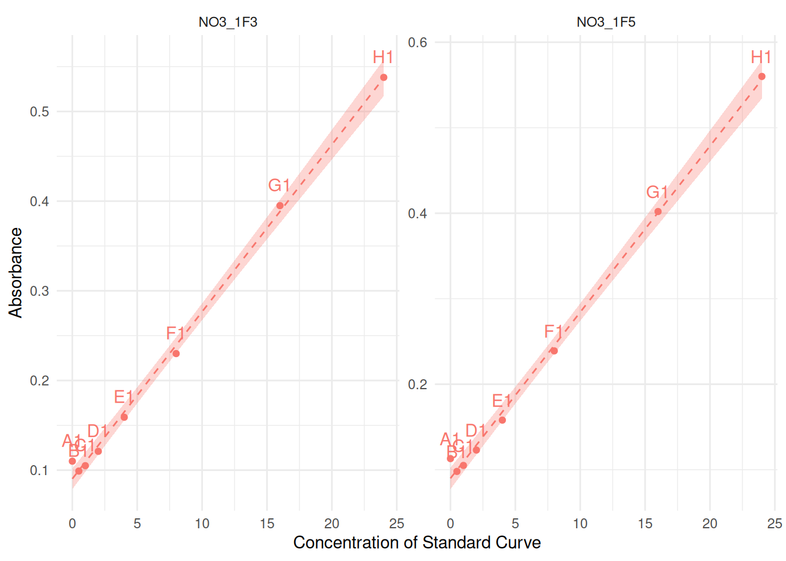
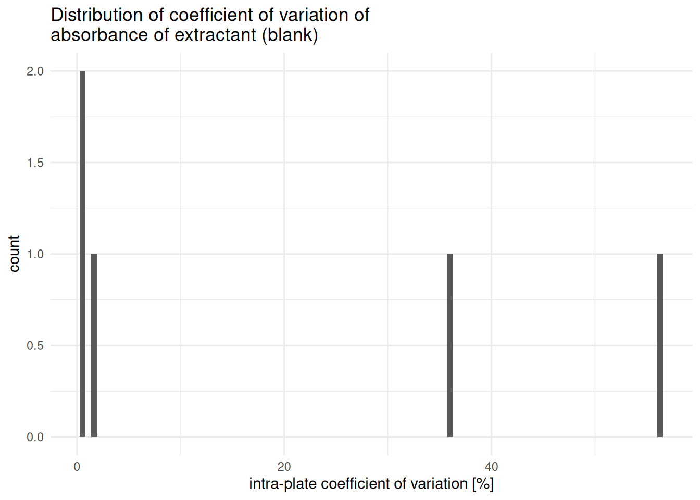
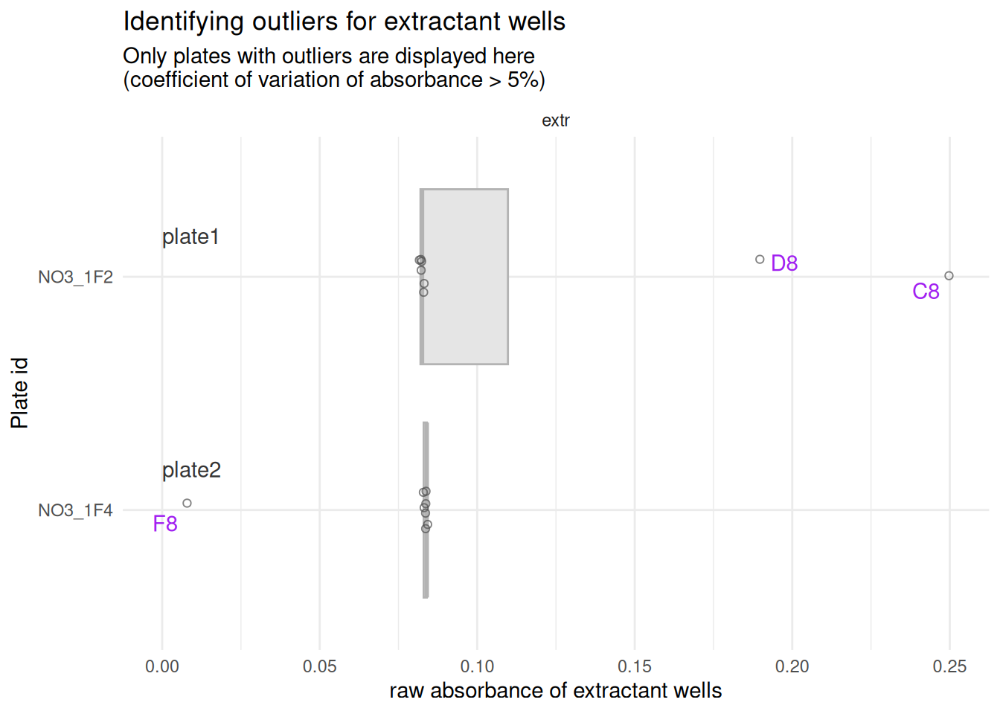
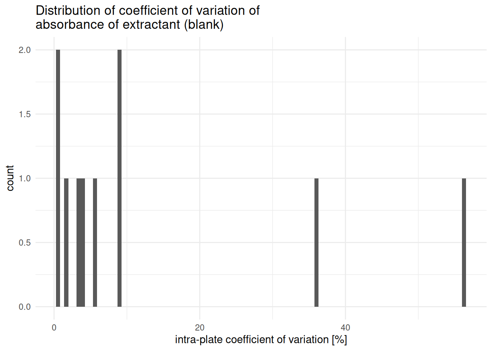
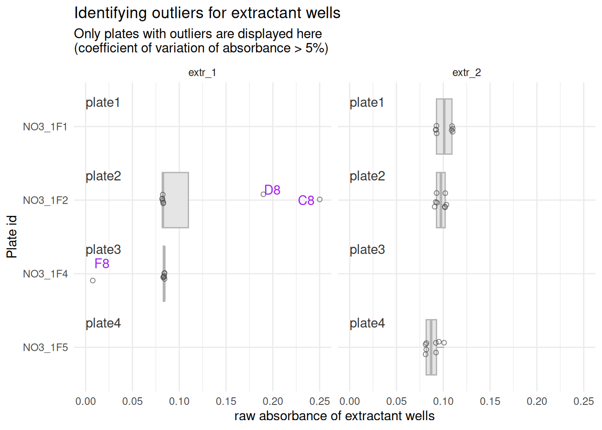

# blank-correction

``` r

library(plate2N)
```

> **Work in progress**
>
> This vignette is still under development, bugs are to be expected

## TO DO

- Consider making a function of creating the “to_remove” table for
  extractant outliers
- Split actions within extract_std_blank so that average computes in a
  separate function, so it can be more easily re-run after outlier
  removal, then adapt code of the re-run

## Introduction

This vignette shows the basic functions that allow the correction of raw
absorbance data (`abs`) to blank-corrected absorbance data, referred to
as `abs_corrected` throughout this package.

This pipeline is adapted to the case where the standard curve solutions
were prepared with a different blank than the samples. Because of that,
there are 2 parallel pipelines to perform the blank-correction (first on
standard curves data, then on samples data), then data from standard
curves and from samples are merged again.

In theory, the “samples” pipeline should be adaptable to the case where
all wells used the same blank (including those containing standard curve
solutions), though this has yet to be tested, and bugs may occur. Feel
free to contact the authors to suggest improvements.

To avoid confusion between “blank of the standard curve” and “blank of
the samples”, the sample-blank is referred to as “extractant” or `extr`
throughout this vignette, to refer to the solution that was used to
extract N-compounds from soil samples and now serves as blank. The
standard blank is referred to as `std_blank`.

## 1 - Getting raw absorbance data

The vignette `import-tidy` shows how to import and tidy absorbance data.
The vignette `handling-outliers` shows how to run some preliminary
quality checks and possibly remove some first outliers. To access those
vignettes, run the following commands

[`vignette("import-tidy", package = "plate2N")`](https://mdetoeuf.github.io/plate2N/articles/import-tidy.md)

[`vignette("handling-outliers", package = "plate2N")`](https://mdetoeuf.github.io/plate2N/articles/handling-outliers.md)

Tidy data as imported according to `import-tidy` should look something
like this:

``` r

tidy_plates
#> # A tibble: 480 × 8
#>    row   column well_id unique_well_id dataset plate_id map      abs  
#>    <chr> <chr>  <chr>   <chr>          <chr>   <chr>    <chr>    <chr>
#>  1 A     1      A1      A1_NO3_1F1     Nmin    NO3_1F1  Std      0.092
#>  2 A     1      A1      A1_NO3_1F2     Nmin    NO3_1F2  Std      0.091
#>  3 A     1      A1      A1_NO3_1F3     Nmin    NO3_1F3  Std      0.110
#>  4 A     1      A1      A1_NO3_1F4     Nmin    NO3_1F4  Std      0.092
#>  5 A     1      A1      A1_NO3_1F5     Nmin    NO3_1F5  Std      0.113
#>  6 A     2      A2      A2_NO3_1F1     Nmin    NO3_1F1  81_t1_z2 0.114
#>  7 A     2      A2      A2_NO3_1F2     Nmin    NO3_1F2  97_t1_z1 0.107
#>  8 A     2      A2      A2_NO3_1F3     Nmin    NO3_1F3  89_t1_z3 0.095
#>  9 A     2      A2      A2_NO3_1F4     Nmin    NO3_1F4  81_t1_z1 0.118
#> 10 A     2      A2      A2_NO3_1F5     Nmin    NO3_1F5  Std_3_t1 0.167
#> # ℹ 470 more rows
```

For quality checking of the standard curve, we will require some
metadata for each 96-well plate containing at least the concentrations
of the dilutions of the standard curve.

``` r

(meta <- metadata |> dplyr::select(dataset, plate_id, std_sp, std_unit, std_conc))
#> # A tibble: 5 × 5
#>   dataset plate_id std_sp std_unit    std_conc           
#>   <chr>   <chr>    <chr>  <chr>       <chr>              
#> 1 Nmin    NO3_1F1  NO3    mg NO3- L-1 0-0.5-1-2-4-8-16-24
#> 2 Nmin    NO3_1F2  NO3    mg NO3- L-1 0-0.5-1-2-4-8-16-24
#> 3 Nmin    NO3_1F3  NO3    mg NO3- L-1 0-0.5-1-2-4-8-16-24
#> 4 Nmin    NO3_1F4  NO3    mg NO3- L-1 0-0.5-1-2-4-8-16-24
#> 5 Nmin    NO3_1F5  NO3    mg NO3- L-1 0-0.5-1-2-4-8-16-24
```

We now join (raw) plate data and metadata (meta). Note that there has to
be a correspondence in the columns `dataset` and `plate_id` between the
raw absorbance data and the metadata.

``` r

(raw_meta <- tidy_plates |> 
  dplyr::left_join(meta, by = dplyr::join_by(dataset, plate_id)))
#> # A tibble: 480 × 11
#>    row   column well_id unique_well_id dataset plate_id map      abs   std_sp
#>    <chr> <chr>  <chr>   <chr>          <chr>   <chr>    <chr>    <chr> <chr> 
#>  1 A     1      A1      A1_NO3_1F1     Nmin    NO3_1F1  Std      0.092 NO3   
#>  2 A     1      A1      A1_NO3_1F2     Nmin    NO3_1F2  Std      0.091 NO3   
#>  3 A     1      A1      A1_NO3_1F3     Nmin    NO3_1F3  Std      0.110 NO3   
#>  4 A     1      A1      A1_NO3_1F4     Nmin    NO3_1F4  Std      0.092 NO3   
#>  5 A     1      A1      A1_NO3_1F5     Nmin    NO3_1F5  Std      0.113 NO3   
#>  6 A     2      A2      A2_NO3_1F1     Nmin    NO3_1F1  81_t1_z2 0.114 NO3   
#>  7 A     2      A2      A2_NO3_1F2     Nmin    NO3_1F2  97_t1_z1 0.107 NO3   
#>  8 A     2      A2      A2_NO3_1F3     Nmin    NO3_1F3  89_t1_z3 0.095 NO3   
#>  9 A     2      A2      A2_NO3_1F4     Nmin    NO3_1F4  81_t1_z1 0.118 NO3   
#> 10 A     2      A2      A2_NO3_1F5     Nmin    NO3_1F5  Std_3_t1 0.167 NO3   
#> # ℹ 470 more rows
#> # ℹ 2 more variables: std_unit <chr>, std_conc <chr>
```

## 2 - Blank-correction of standard curves

### 2.1 - Extract curve concentrations

To fit in one row per plate, the concentrations for standard curve are,
so far, stored in a compact manner, like this:

``` r

raw_meta |> dplyr::select(plate_id, std_conc) |> head(n = 3)
#> # A tibble: 3 × 2
#>   plate_id std_conc           
#>   <chr>    <chr>              
#> 1 NO3_1F1  0-0.5-1-2-4-8-16-24
#> 2 NO3_1F2  0-0.5-1-2-4-8-16-24
#> 3 NO3_1F3  0-0.5-1-2-4-8-16-24
```

But in truth, only one of those concentration values corresponds to each
value of well of the standard curve.

Note that concentration values are separated by a `-` and digits are
marked by a `.`, which is important in the function call to
[`extract_curve()`](https://mdetoeuf.github.io/plate2N/reference/extract_curve.md).
Also, concentration values MUST be in ascending order in the metadata
file. See also
[`?metadata`](https://mdetoeuf.github.io/plate2N/reference/metadata.md)
and `?extract_curve()`

``` r

(curve_concentration <- extract_curve(meta, pipetting_direction = "top_down"))
#> # A tibble: 40 × 4
#>    dataset plate_id row   std_conc
#>    <chr>   <chr>    <chr>    <dbl>
#>  1 Nmin    NO3_1F1  A          0  
#>  2 Nmin    NO3_1F1  B          0.5
#>  3 Nmin    NO3_1F1  C          1  
#>  4 Nmin    NO3_1F1  D          2  
#>  5 Nmin    NO3_1F1  E          4  
#>  6 Nmin    NO3_1F1  F          8  
#>  7 Nmin    NO3_1F1  G         16  
#>  8 Nmin    NO3_1F1  H         24  
#>  9 Nmin    NO3_1F2  A          0  
#> 10 Nmin    NO3_1F2  B          0.5
#> # ℹ 30 more rows
```

Notice now that each row only contains a single value under the column
`std_conc`

> **Too many rows?**
>
> A common mistake is to run
> [`extract_curve()`](https://mdetoeuf.github.io/plate2N/reference/extract_curve.md)
> on `raw_meta` instead of `meta`. But `meta` has one row per plate,
> whereas `raw_meta` has one row per well, so that calling
> `extract_curve(raw_meta)` would result on a table that is much too
> long (~96 times too long). If you run into issues later, this might be
> the source.

We now have curve concentrations corresponding to the `dataset`,
`plate_id` and `row` of a plate, which we can use for all downstream
steps. This goes under the assumption that standard curves are pipetted
vertically in a complete column of the 96-well plate. Check
`?extract_curve()` for more details.

### 2.2 - Extract Standard data

Here, we get a subset of the table `raw_meta`, keeping only absorbance
reads of the wells of the standard curve (defined by the value `Std` in
the column `map`), from which we remove the “old” column `std_conc`
(with all dilutions of the curve), and replace it by the “new” column
`std_conc` (only 1 dilution per row).

``` r

std_data <- raw_meta |> 
  extract_std_data(std_def = "Std") |> 
  dplyr::select(!std_conc) |> 
  dplyr::left_join(curve_concentration, by = dplyr::join_by(row, dataset, plate_id))

# Check it out (rearranging rows and columns for better readibility)
std_data |> 
  dplyr::arrange(plate_id, column) |> 
  dplyr::relocate(well_id, dataset, plate_id, map, abs, std_conc, std_unit)
#> # A tibble: 80 × 12
#> # Groups:   dataset, plate_id [5]
#>    well_id dataset plate_id map   abs   std_conc std_unit    row   column
#>    <chr>   <chr>   <chr>    <chr> <chr>    <dbl> <chr>       <chr> <chr> 
#>  1 A1      Nmin    NO3_1F1  Std   0.092      0   mg NO3- L-1 A     1     
#>  2 B1      Nmin    NO3_1F1  Std   0.100      0.5 mg NO3- L-1 B     1     
#>  3 C1      Nmin    NO3_1F1  Std   0.107      1   mg NO3- L-1 C     1     
#>  4 D1      Nmin    NO3_1F1  Std   0.122      2   mg NO3- L-1 D     1     
#>  5 E1      Nmin    NO3_1F1  Std   0.157      4   mg NO3- L-1 E     1     
#>  6 F1      Nmin    NO3_1F1  Std   0.238      8   mg NO3- L-1 F     1     
#>  7 G1      Nmin    NO3_1F1  Std   0.396     16   mg NO3- L-1 G     1     
#>  8 H1      Nmin    NO3_1F1  Std   0.546     24   mg NO3- L-1 H     1     
#>  9 A12     Nmin    NO3_1F1  Std   0.091      0   mg NO3- L-1 A     12    
#> 10 B12     Nmin    NO3_1F1  Std   0.097      0.5 mg NO3- L-1 B     12    
#> # ℹ 70 more rows
#> # ℹ 3 more variables: unique_well_id <chr>, unique_curve_id <chr>, std_sp <chr>
```

### 2.3 - Compute per-plate average of std_blank

`extract_std_blanc()` returns a list with several elements concerning
standard blanks

``` r

std_blank <- std_data |> 
  extract_std_blank(
    std_def = "Std",
    pipetting_direction = "top_down")
```

- `std_blank$all` fetches all wells that are expected to contain the
  standard blank, i.e., all standard data from plate-row A
  (`pipetting_direction = "top_down"`) or H
  (`pipetting_direction = "bottom_up"`)

``` r

  std_blank$all
#> # A tibble: 10 × 8
#> # Groups:   dataset, plate_id, column [10]
#>    well_id dataset plate_id row   column unique_well_id unique_curve_id   abs
#>    <chr>   <chr>   <chr>    <chr> <chr>  <chr>          <chr>           <dbl>
#>  1 A1      Nmin    NO3_1F1  A     1      A1_NO3_1F1     NO3_1F1_col1    0.092
#>  2 A1      Nmin    NO3_1F2  A     1      A1_NO3_1F2     NO3_1F2_col1    0.091
#>  3 A1      Nmin    NO3_1F3  A     1      A1_NO3_1F3     NO3_1F3_col1    0.11 
#>  4 A1      Nmin    NO3_1F4  A     1      A1_NO3_1F4     NO3_1F4_col1    0.092
#>  5 A1      Nmin    NO3_1F5  A     1      A1_NO3_1F5     NO3_1F5_col1    0.113
#>  6 A12     Nmin    NO3_1F1  A     12     A12_NO3_1F1    NO3_1F1_col12   0.091
#>  7 A12     Nmin    NO3_1F2  A     12     A12_NO3_1F2    NO3_1F2_col12   0.09 
#>  8 A12     Nmin    NO3_1F3  A     12     A12_NO3_1F3    NO3_1F3_col12   0.09 
#>  9 A12     Nmin    NO3_1F4  A     12     A12_NO3_1F4    NO3_1F4_col12   0.091
#> 10 A12     Nmin    NO3_1F5  A     12     A12_NO3_1F5    NO3_1F5_col12   0.092
```

- `std_blank$untrusted` identifies expected blank wells that do not
  correspond to the lowest absorbance value of their standard curve[^1].
  This item and may be empty

``` r

  std_blank$untrusted
#> # A tibble: 2 × 8
#> # Groups:   dataset, plate_id, column [2]
#>   well_id dataset plate_id column unique_curve_id row   unique_well_id   abs
#>   <chr>   <chr>   <chr>    <chr>  <chr>           <chr> <chr>          <dbl>
#> 1 A1      Nmin    NO3_1F3  1      NO3_1F3_col1    A     A1_NO3_1F3     0.11 
#> 2 A1      Nmin    NO3_1F5  1      NO3_1F5_col1    A     A1_NO3_1F5     0.113
```

- `std_blank$trusted` is the complement to `std_blank$untrusted`.

``` r

  std_blank$trusted
#> # A tibble: 8 × 8
#>   well_id dataset plate_id row   column unique_well_id unique_curve_id   abs
#>   <chr>   <chr>   <chr>    <chr> <chr>  <chr>          <chr>           <dbl>
#> 1 A1      Nmin    NO3_1F1  A     1      A1_NO3_1F1     NO3_1F1_col1    0.092
#> 2 A1      Nmin    NO3_1F2  A     1      A1_NO3_1F2     NO3_1F2_col1    0.091
#> 3 A1      Nmin    NO3_1F4  A     1      A1_NO3_1F4     NO3_1F4_col1    0.092
#> 4 A12     Nmin    NO3_1F1  A     12     A12_NO3_1F1    NO3_1F1_col12   0.091
#> 5 A12     Nmin    NO3_1F2  A     12     A12_NO3_1F2    NO3_1F2_col12   0.09 
#> 6 A12     Nmin    NO3_1F3  A     12     A12_NO3_1F3    NO3_1F3_col12   0.09 
#> 7 A12     Nmin    NO3_1F4  A     12     A12_NO3_1F4    NO3_1F4_col12   0.091
#> 8 A12     Nmin    NO3_1F5  A     12     A12_NO3_1F5    NO3_1F5_col12   0.092
```

### 2.4 - Quality check of std_blank & outlier removal

> **Check out untrusted standard blanks**
>
> The computation of per-plate standard curve blank average should made
> on trusted blank wells only. It is therefore important to check curves
> containing “untrusted” blank wells and decide whether to keep them or
> not

The function
[`plot_std()`](https://mdetoeuf.github.io/plate2N/reference/plot_std.md)
allows the visualization of (a subset of) curves.

``` r

# Select subset of std_data to be plotted because curves are in "untrusted"
to_plot <- std_data |> 
  dplyr::filter(
    unique_curve_id %in% std_blank$untrusted$unique_curve_id) 

# look at "suspicious" curves
to_plot |> 
  plot_std(through_origin = FALSE) +
  ggplot2::facet_wrap(~plate_id, scales = "free") +
  ggplot2::theme(legend.position = "none")
```



If the absorbance in well A is very obviously wrong (like here), then
remove those wells for the computation of standard blank average. There
are 2 options to do so:

- either by keeping `std_blank$trusted` as is (all “untrusted” wells
  should indeed be removed)

- or by using
  [`remove_wells()`](https://mdetoeuf.github.io/plate2N/reference/remove_wells.md)
  on `std_blank$all` and to generate a better-adapted list of “trusted”
  standard blank wells.

Either way, blank averages will then be computed on trusted wells only
(see hereunder). Of course, this only works if there were several
standard curves on problematic plates, otherwise you will be removing
the only `std_blank` of the plate[^2]. Here are 2 examples of how to
compute average blanks.

``` r

# Option 1 - We keep std_blank$trusted
std_blank_avg_1 <- std_blank_average(std_blank$trusted)
```

For the second option, we decide to reject only one of the wells from
`std_blank$untrusted`: let’s say the first one, for plate NO3_1F3 (which
is obviously wrong in this case).

``` r

# Option 2 - We create a table of wells to remove
(to_remove <- std_blank$untrusted |> dplyr::filter(plate_id == "NO3_1F3"))
#> # A tibble: 1 × 8
#> # Groups:   dataset, plate_id, column [1]
#>   well_id dataset plate_id column unique_curve_id row   unique_well_id   abs
#>   <chr>   <chr>   <chr>    <chr>  <chr>           <chr> <chr>          <dbl>
#> 1 A1      Nmin    NO3_1F3  1      NO3_1F3_col1    A     A1_NO3_1F3      0.11

# remove those untrusted wells from std_blank$all ~ new version of std_blank$trusted
std_blank_clean <- std_blank$all |> remove_wells(to_remove)

# compute per-plate blank average from that new trusted table
std_blank_avg_2 <- std_blank_average(std_blank_clean)
```

Let’s compare both options and see that, indeed, plate NO3_1F5 now
received 2 wells to compute the average from (no NA values)

``` r

std_blank_avg_1 ; std_blank_avg_2
#> # A tibble: 5 × 5
#>   dataset plate_id blank_avg blank_sdev blank_coeff_var_percent
#>   <chr>   <chr>        <dbl>      <dbl>                   <dbl>
#> 1 Nmin    NO3_1F1     0.0915   0.000707                   0.773
#> 2 Nmin    NO3_1F2     0.0905   0.000707                   0.781
#> 3 Nmin    NO3_1F4     0.0915   0.000707                   0.773
#> 4 Nmin    NO3_1F3     0.09    NA                         NA    
#> 5 Nmin    NO3_1F5     0.092   NA                         NA
#> # A tibble: 5 × 5
#>   dataset plate_id blank_avg blank_sdev blank_coeff_var_percent
#>   <chr>   <chr>        <dbl>      <dbl>                   <dbl>
#> 1 Nmin    NO3_1F1     0.0915   0.000707                   0.773
#> 2 Nmin    NO3_1F2     0.0905   0.000707                   0.781
#> 3 Nmin    NO3_1F4     0.0915   0.000707                   0.773
#> 4 Nmin    NO3_1F5     0.103    0.0148                    14.5  
#> 5 Nmin    NO3_1F3     0.09    NA                         NA
```

We proposed the 2nd option for the sake of the example, but we will move
on with the first option from here on, as the decision to keep the
untrusted well for plate NO3_1F3 was obviously misled.

``` r

std_blank_avg <- std_blank_avg_1
```

> **Outlier check of the whole curve comes later**
>
> In this pipeline, we search for and remove outliers prior to critical
> aggregation steps that will not be trustworthy otherwise (see also
> vignette `handling-outliers`. With this logic in mind, the outlier
> removal of other wells[^3] in the standard curve will be done later
> on, before computing the regression between absorbance and
> concentration. This is shown in the next vignette, `abs-to-conc`.

### 2.5 - Blank-correction of Standard Curve

Once we are confident in our `std_blank`s, we can use the
`std_blank_avg` to blank-correct the raw absorbance values for the whole
standard curves. This is done with the function
[`blank_correct_abs()`](https://mdetoeuf.github.io/plate2N/reference/blank_correct_abs.md),
which will also be used to correct sample absorbance data in the next
section.

[`blank_correct_abs()`](https://mdetoeuf.github.io/plate2N/reference/blank_correct_abs.md)
takes 3 main arguments:

- `raw_wells_data` takes the standard curves data. It should be
  ungrouped and contain only non-blank data (i.e., in the case of
  “top_down” pipetting, rows B to H)

- `per_plate_avg_blank` takes blank averages (e.g., `std_blank_avg`)

- `map_to_exclude` tells which rows to exclude from `raw_wells_data`
  based on their value for the column “map”. Its default setting fits
  the blank-correction of sample data (next section), not that of
  standard data, so we simply replace it by `""`, as we do not wish to
  exclude any rows here

You can ignore the message `Joining with by = join_by(...)`, which just
depends on the additional columns you may have in your data tables

``` r

# prepare the first argument
raw_wells_data <- std_data |>
      dplyr::ungroup() |>
      dplyr::filter_out(row == "A")

# check it out
head(raw_wells_data)
#> # A tibble: 6 × 12
#>   row   column well_id unique_well_id dataset plate_id unique_curve_id map  
#>   <chr> <chr>  <chr>   <chr>          <chr>   <chr>    <chr>           <chr>
#> 1 B     1      B1      B1_NO3_1F1     Nmin    NO3_1F1  NO3_1F1_col1    Std  
#> 2 B     1      B1      B1_NO3_1F2     Nmin    NO3_1F2  NO3_1F2_col1    Std  
#> 3 B     1      B1      B1_NO3_1F3     Nmin    NO3_1F3  NO3_1F3_col1    Std  
#> 4 B     1      B1      B1_NO3_1F4     Nmin    NO3_1F4  NO3_1F4_col1    Std  
#> 5 B     1      B1      B1_NO3_1F5     Nmin    NO3_1F5  NO3_1F5_col1    Std  
#> 6 B     12     B12     B12_NO3_1F1    Nmin    NO3_1F1  NO3_1F1_col12   Std  
#> # ℹ 4 more variables: abs <chr>, std_sp <chr>, std_unit <chr>, std_conc <dbl>

# blank-correct standard curve data
std_corrected <-
  blank_correct_abs(
    # ungroup std data, remove rows with the blanks (here: row A)
    raw_wells_data = raw_wells_data,
    per_plate_avg_blank = std_blank_avg,
    map_to_exclude = ""
  ) |> 
  # only keep relevant columns (remove metadata clutter, optional)
  dplyr::select(row:abs_corrected)
#> Joining with `by = join_by(dataset, plate_id)`
#> Joining with `by = join_by(row, column, well_id, unique_well_id, dataset,
#> plate_id, unique_curve_id, map, std_sp, std_unit, std_conc, extr_id)`

# Check it out
std_corrected
#> # A tibble: 70 × 9
#>    row   column well_id unique_well_id dataset plate_id unique_curve_id map  
#>    <chr> <chr>  <chr>   <chr>          <chr>   <chr>    <chr>           <chr>
#>  1 B     1      B1      B1_NO3_1F1     Nmin    NO3_1F1  NO3_1F1_col1    Std  
#>  2 B     1      B1      B1_NO3_1F2     Nmin    NO3_1F2  NO3_1F2_col1    Std  
#>  3 B     1      B1      B1_NO3_1F3     Nmin    NO3_1F3  NO3_1F3_col1    Std  
#>  4 B     1      B1      B1_NO3_1F4     Nmin    NO3_1F4  NO3_1F4_col1    Std  
#>  5 B     1      B1      B1_NO3_1F5     Nmin    NO3_1F5  NO3_1F5_col1    Std  
#>  6 B     12     B12     B12_NO3_1F1    Nmin    NO3_1F1  NO3_1F1_col12   Std  
#>  7 B     12     B12     B12_NO3_1F2    Nmin    NO3_1F2  NO3_1F2_col12   Std  
#>  8 B     12     B12     B12_NO3_1F3    Nmin    NO3_1F3  NO3_1F3_col12   Std  
#>  9 B     12     B12     B12_NO3_1F4    Nmin    NO3_1F4  NO3_1F4_col12   Std  
#> 10 B     12     B12     B12_NO3_1F5    Nmin    NO3_1F5  NO3_1F5_col12   Std  
#> # ℹ 60 more rows
#> # ℹ 1 more variable: abs_corrected <dbl>
```

Notice that the `abs` column has been removed to avoid mistaking it for
corrected absorbance. Instead, it has been replaced by `abs_corrected`.

## 3 - Blank-correction of samples

### 3.1 - Extract extractant data (sample blank)

In a real world, `raw_meta` will have probably undergone some cleaning
steps (e.g., outlier removal, see `handling-outliers`). In this example
dataset, there are always 8 wells attributed to the sample blank (or
extractant), which is found because its mapping (column “map” in
`raw_meta`) contains the string “extr”, as can be seen here:

``` r

# look at extractant data
raw_meta |> dplyr::filter(map == "extr")
#> # A tibble: 40 × 11
#>    row   column well_id unique_well_id dataset plate_id map   abs   std_sp
#>    <chr> <chr>  <chr>   <chr>          <chr>   <chr>    <chr> <chr> <chr> 
#>  1 A     8      A8      A8_NO3_1F1     Nmin    NO3_1F1  extr  0.083 NO3   
#>  2 A     8      A8      A8_NO3_1F2     Nmin    NO3_1F2  extr  0.083 NO3   
#>  3 A     8      A8      A8_NO3_1F3     Nmin    NO3_1F3  extr  0.084 NO3   
#>  4 A     8      A8      A8_NO3_1F4     Nmin    NO3_1F4  extr  0.084 NO3   
#>  5 A     8      A8      A8_NO3_1F5     Nmin    NO3_1F5  extr  0.084 NO3   
#>  6 B     8      B8      B8_NO3_1F1     Nmin    NO3_1F1  extr  0.083 NO3   
#>  7 B     8      B8      B8_NO3_1F2     Nmin    NO3_1F2  extr  0.082 NO3   
#>  8 B     8      B8      B8_NO3_1F3     Nmin    NO3_1F3  extr  0.085 NO3   
#>  9 B     8      B8      B8_NO3_1F4     Nmin    NO3_1F4  extr  0.084 NO3   
#> 10 B     8      B8      B8_NO3_1F5     Nmin    NO3_1F5  extr  0.084 NO3   
#> # ℹ 30 more rows
#> # ℹ 2 more variables: std_unit <chr>, std_conc <chr>
```

This filtering is also what
[`extract_extractant()`](https://mdetoeuf.github.io/plate2N/reference/extract_extractant.md)
does in the background, which is the first step of
[`extractant_average()`](https://mdetoeuf.github.io/plate2N/reference/extractant_average.md)
(see below).

``` r

extr_data <- extract_extractant(raw_meta)

# Check it out
extr_data
#> # A tibble: 40 × 11
#>    row   column well_id unique_well_id dataset plate_id map   abs   std_sp
#>    <chr> <chr>  <chr>   <chr>          <chr>   <chr>    <chr> <chr> <chr> 
#>  1 A     8      A8      A8_NO3_1F1     Nmin    NO3_1F1  extr  0.083 NO3   
#>  2 A     8      A8      A8_NO3_1F2     Nmin    NO3_1F2  extr  0.083 NO3   
#>  3 A     8      A8      A8_NO3_1F3     Nmin    NO3_1F3  extr  0.084 NO3   
#>  4 A     8      A8      A8_NO3_1F4     Nmin    NO3_1F4  extr  0.084 NO3   
#>  5 A     8      A8      A8_NO3_1F5     Nmin    NO3_1F5  extr  0.084 NO3   
#>  6 B     8      B8      B8_NO3_1F1     Nmin    NO3_1F1  extr  0.083 NO3   
#>  7 B     8      B8      B8_NO3_1F2     Nmin    NO3_1F2  extr  0.082 NO3   
#>  8 B     8      B8      B8_NO3_1F3     Nmin    NO3_1F3  extr  0.085 NO3   
#>  9 B     8      B8      B8_NO3_1F4     Nmin    NO3_1F4  extr  0.084 NO3   
#> 10 B     8      B8      B8_NO3_1F5     Nmin    NO3_1F5  extr  0.084 NO3   
#> # ℹ 30 more rows
#> # ℹ 2 more variables: std_unit <chr>, std_conc <chr>
```

### 3.2 - Compute per-plate average of extractant

This string “extr” is the default of the argument `extr_def` of
[`extractant_average()`](https://mdetoeuf.github.io/plate2N/reference/extractant_average.md)
and can be adapted to reflect your mapping. Like
`extract_std_blank(..)$average`,
[`extractant_average()`](https://mdetoeuf.github.io/plate2N/reference/extractant_average.md)
computes the average, standard deviation and coefficient of variation
(%) of the blanks.

``` r

(extr_avg <- extractant_average(raw_meta, extr_def = "extr")) 
#> # A tibble: 5 × 6
#>   dataset plate_id map   blank_avg blank_sdev blank_coeff_var_percent
#>   <chr>   <chr>    <chr>     <dbl>      <dbl>                   <dbl>
#> 1 Nmin    NO3_1F1  extr     0.0828   0.000463                   0.559
#> 2 Nmin    NO3_1F2  extr     0.117    0.0657                    56.3  
#> 3 Nmin    NO3_1F3  extr     0.0846   0.00151                    1.78 
#> 4 Nmin    NO3_1F4  extr     0.0743   0.0268                    36.1  
#> 5 Nmin    NO3_1F5  extr     0.0838   0.000463                   0.553
```

> **More than 1 extractant per plate?**
>
> [`extractant_average()`](https://mdetoeuf.github.io/plate2N/reference/extractant_average.md)
> should also work when there are several extractants per plate, but the
> argument `extr_def` must be given a vector with extractant (e.g.,
> `extr_def = c("extr_1", "extr_2")`. See also `?extractant_average()`
> for examples.

### 3.3 - Quality check of extractant and outlier removal

#### 3.3.1 - One extractant per plate

[`plot_blank_var_distrib()`](https://mdetoeuf.github.io/plate2N/reference/plot_blank_var_distrib.md)
plots a distribution of this coefficient of variation throughout the
data set (which becomes relevant in big data sets).

``` r

plot_blank_var_distrib(extr_avg)
```



In big data sets, there is bound to be some plate where one or two wells
went wrong in the lab, and seeing that there are some plates with much
higher variation can be a sign that you need to investigate to remove
outliers (like here, with a maximum coefficient of variation of almost
60%). You can take advantage of `dplyr::arrange(desc())` that sorts rows
by decreasing values of its argument, to quickly identify suspicious
plates (consider removing the call to `desc()` if you have negative
values for the coefficients of variation).

``` r

extr_avg |> 
  dplyr::arrange(desc(blank_coeff_var_percent))
#> # A tibble: 5 × 6
#>   dataset plate_id map   blank_avg blank_sdev blank_coeff_var_percent
#>   <chr>   <chr>    <chr>     <dbl>      <dbl>                   <dbl>
#> 1 Nmin    NO3_1F2  extr     0.117    0.0657                    56.3  
#> 2 Nmin    NO3_1F4  extr     0.0743   0.0268                    36.1  
#> 3 Nmin    NO3_1F3  extr     0.0846   0.00151                    1.78 
#> 4 Nmin    NO3_1F1  extr     0.0828   0.000463                   0.559
#> 5 Nmin    NO3_1F5  extr     0.0838   0.000463                   0.553
```

Here, we see that the suspicious plates are `NO3_1F2` and `NO3_1F4`.
This is easy with a small dataset. For larger data sets,
[`qc_raw_extr()`](https://mdetoeuf.github.io/plate2N/reference/qc_raw_extr.md)
performs a quality check of raw absorbance data for extractant wells. It
returns a vector containing the “suspicious” `plate_id`s of plates
exceeding a user-defined threshold. Note that we work from `raw_meta`
because in this pipeline, there has not been any prior outlier removal,
but of course, we should work with the “cleanest” data that we have.

A `max_coeff` threshold of 5% is reasonable to segregate “acceptable”
coefficients if, like here, you have 8 wells per plate for the
extractant.

``` r

threshold <- 5

suspicious_extr_per_plate <- raw_meta |> 
  qc_raw_extr(suppress_warning = FALSE, max_coeff = threshold)
#> Warning in qc_raw_extr(raw_meta, suppress_warning = FALSE, max_coeff = threshold): 
#>         There is a big variation in absorbance values for the blank (more than 5%).
#>         Remove the most unlikely values / remove outliers manually.
#>         Suspicious plate ID's are returned
```

We get a warning message (to suppress it, opt for
`suppress_warning = TRUE`). The identifiers of the suspicious plates
have been recorded in `suspicious_plate_ids`.

``` r

suspicious_extr_per_plate
#> # A tibble: 2 × 2
#>   plate_id map  
#>   <chr>    <chr>
#> 1 NO3_1F2  extr 
#> 2 NO3_1F4  extr
```

Should all plates have a coefficient of variation for the absorbance of
the extractant below the threshold,
[`qc_raw_extr()`](https://mdetoeuf.github.io/plate2N/reference/qc_raw_extr.md)
returns a happy message, instead of a warning, which can also be
suppressed, using `suppress_message = TRUE`.

``` r

# run it with a very unreasonably high threshold
raw_meta |> 
  qc_raw_extr(suppress_warning = FALSE, max_coeff = 60)
#> 
#>         Good news: all plates show a satisfactorily small variation for raw blank (extractant) absorbance values. This means that the coefficient of variation is below the threshold of 60%.
```

To obtain the full extractant data corresponding to our
`suspicious plate_ids`, we can use
[`suspicious_extr()`](https://mdetoeuf.github.io/plate2N/reference/suspicious_extr.md).

``` r

(suspicious_extr <- suspicious_extr(
  raw_meta, 
  suspicious_extr_per_plate = suspicious_extr_per_plate, 
  max_coeff = threshold))
#> Joining with `by = join_by(plate_id, map)`
#> # A tibble: 16 × 11
#>    row   column well_id unique_well_id dataset plate_id map     abs std_sp
#>    <chr> <chr>  <chr>   <chr>          <chr>   <chr>    <chr> <dbl> <chr> 
#>  1 A     8      A8      A8_NO3_1F2     Nmin    NO3_1F2  extr  0.083 NO3   
#>  2 B     8      B8      B8_NO3_1F2     Nmin    NO3_1F2  extr  0.082 NO3   
#>  3 C     8      C8      C8_NO3_1F2     Nmin    NO3_1F2  extr  0.25  NO3   
#>  4 D     8      D8      D8_NO3_1F2     Nmin    NO3_1F2  extr  0.19  NO3   
#>  5 E     8      E8      E8_NO3_1F2     Nmin    NO3_1F2  extr  0.083 NO3   
#>  6 F     8      F8      F8_NO3_1F2     Nmin    NO3_1F2  extr  0.082 NO3   
#>  7 G     8      G8      G8_NO3_1F2     Nmin    NO3_1F2  extr  0.082 NO3   
#>  8 H     8      H8      H8_NO3_1F2     Nmin    NO3_1F2  extr  0.082 NO3   
#>  9 A     8      A8      A8_NO3_1F4     Nmin    NO3_1F4  extr  0.084 NO3   
#> 10 B     8      B8      B8_NO3_1F4     Nmin    NO3_1F4  extr  0.084 NO3   
#> 11 C     8      C8      C8_NO3_1F4     Nmin    NO3_1F4  extr  0.084 NO3   
#> 12 D     8      D8      D8_NO3_1F4     Nmin    NO3_1F4  extr  0.083 NO3   
#> 13 E     8      E8      E8_NO3_1F4     Nmin    NO3_1F4  extr  0.084 NO3   
#> 14 F     8      F8      F8_NO3_1F4     Nmin    NO3_1F4  extr  0.008 NO3   
#> 15 G     8      G8      G8_NO3_1F4     Nmin    NO3_1F4  extr  0.084 NO3   
#> 16 H     8      H8      H8_NO3_1F4     Nmin    NO3_1F4  extr  0.083 NO3   
#> # ℹ 2 more variables: std_unit <chr>, std_conc <chr>
```

Finally, we can use
[`boxplot_outlier_extr()`](https://mdetoeuf.github.io/plate2N/reference/boxplot_outlier_extr.md)
to plot extractant plates containing suspicious wells, so that we can
decide whether or not to remove some outlier wells. To do so, we can,
once more, take advantage of
[`remove_wells()`](https://mdetoeuf.github.io/plate2N/reference/remove_wells.md),
see also above, `?remove_wells()` and the vignette `handling-outliers`.
Should there be too many plates for a proper visualization, split
`suspicious_extr` in subsets.

``` r

# plot outliers
suspicious_extr |> boxplot_outlier_extr(max_coeff = threshold) + ggplot2::facet_wrap(~map)
#> Joining with `by = join_by(plate_id)`
```



#### 3.3.2 - Outlier removal steps

He have here 2 very obvious outliers: wells D8 and C8 in plate 1
(NO3_1F2) and well F8 in plate 2 (NO3_1F4), which we want to remove. The
plot given by
[`boxplot_outlier_extr()`](https://mdetoeuf.github.io/plate2N/reference/boxplot_outlier_extr.md)
gives all necessary information to do so. First, we create a small
tibble that will serve to construct the tibble of wells to remove: first
get dataset and plate_ids from `suspicious_extr`, then add a column
“plate_order” that will help checking which plate is which (compared to
the plot, useful when several plates are plotted).

``` r

# Construct tibble to remove
(plate_ids <- suspicious_extr |> 
    dplyr::ungroup() |> 
    dplyr::select(dataset, plate_id) |> 
    unique()) 
#> # A tibble: 2 × 2
#>   dataset plate_id
#>   <chr>   <chr>   
#> 1 Nmin    NO3_1F2 
#> 2 Nmin    NO3_1F4

# save numbers for plate order in the plot
(plate_ids <- plate_ids |> 
  dplyr::mutate(plate_order = seq(1, nrow(plate_ids))))
#> # A tibble: 2 × 3
#>   dataset plate_id plate_order
#>   <chr>   <chr>          <int>
#> 1 Nmin    NO3_1F2            1
#> 2 Nmin    NO3_1F4            2
```

Then, we create a vector with wells to remove (reading through boxplots
from top to bottom).

> **Manually remove outliers**
>
> > **Tip 1**
> >
> > In the following chunk, we need to manually decide which wells to
> > remove, based on the boxplots produced above.
> >
> > - Make sure to deal appropriately with plates that require 2
> >   outliers or no outlier to be removed (see example below)
> > - Use a number \> nb of plates if there is no plate with 2 or zero
> >   outlier

To remove well C8 and D8 from plate 1, and wells F8 from plate 2:

``` r

#** !!! MANUAL INPUT !!! *

# Which plate needs 2 outliers removed?
plate_with_2_outliers <- c(1) 
# Which plate needs no outlier removed?
plate_without_outliers <- c(9) 

# Which wells are outliers? 
well_ids <- c("C8", "D8", "F8") # only fill in well_ids that need to be removed, in the order of the plates
```

Then we finish constructing the tibble of wells to be removed.

**TODO: consider making a function out of this**

``` r

to_remove <- plate_ids |> 
  # double rows for plates with 2 outliers
  dplyr::bind_rows(
    plate_ids |> dplyr::filter(plate_order %in% plate_with_2_outliers)) |> 
  #remove plate without outliers
  dplyr::filter_out(plate_order %in% plate_without_outliers) |> 
  #reorder plates (if some were doubled)
  dplyr::arrange(plate_order) |> 
  # add column with well ids from vector defined above
  dplyr::mutate(well_id = well_ids) |> 
  # remove plate_order(optional)
  dplyr::select(!plate_order)

# check it out
to_remove
#> # A tibble: 3 × 3
#>   dataset plate_id well_id
#>   <chr>   <chr>    <chr>  
#> 1 Nmin    NO3_1F2  C8     
#> 2 Nmin    NO3_1F2  D8     
#> 3 Nmin    NO3_1F4  F8
```

Always check out that the content of `to_remove` corresponds to the
outliers spotted in the plot, as this is a possible source of error,
especially for larger datasets.

Now, we remove it from extractant data (which is the same as removing 3
rows)

``` r

extr_data_clean <- extr_data |> remove_wells(to_remove) 
```

Check out that indeed, 3 rows have been removed:

``` r

nrow(extr_data) ; nrow(to_remove); nrow(extr_data_clean)
#> [1] 40
#> [1] 3
#> [1] 37
```

Finally, we re-run the average on cleaned extractant data

``` r

extr_avg_clean <- extractant_average(
  extractant_data = extr_data_clean, extr_def = "extr") 
```

Check that the highest coefficients of variation are now indeed
satisfactory (below our threshold of 5%).

``` r

extr_avg_clean |> dplyr::arrange(dplyr::desc(blank_coeff_var_percent)) |> head()
#> # A tibble: 5 × 6
#>   dataset plate_id map   blank_avg blank_sdev blank_coeff_var_percent
#>   <chr>   <chr>    <chr>     <dbl>      <dbl>                   <dbl>
#> 1 Nmin    NO3_1F3  extr     0.0846   0.00151                    1.78 
#> 2 Nmin    NO3_1F2  extr     0.0823   0.000516                   0.627
#> 3 Nmin    NO3_1F4  extr     0.0837   0.000488                   0.583
#> 4 Nmin    NO3_1F1  extr     0.0828   0.000463                   0.559
#> 5 Nmin    NO3_1F5  extr     0.0838   0.000463                   0.553
```

#### 3.3.3 - 2 or more extractants per plate

The steps are the same as with one extractant, but the syntax changes
slightly. Let’s take the example data set `dbl_extr_plate`:

``` r

dbl_extr_plate
#> # A tibble: 480 × 9
#>    row   column well_id unique_well_id dataset plate_id map      abs   extr_id
#>    <chr> <chr>  <chr>   <chr>          <chr>   <chr>    <chr>    <chr> <chr>  
#>  1 A     1      A1      A1_NO3_1F1     Nmin    NO3_1F1  Std      0.092 none   
#>  2 A     1      A1      A1_NO3_1F2     Nmin    NO3_1F2  Std      0.091 none   
#>  3 A     1      A1      A1_NO3_1F3     Nmin    NO3_1F3  Std      0.110 none   
#>  4 A     1      A1      A1_NO3_1F4     Nmin    NO3_1F4  Std      0.092 none   
#>  5 A     1      A1      A1_NO3_1F5     Nmin    NO3_1F5  Std      0.113 none   
#>  6 A     2      A2      A2_NO3_1F1     Nmin    NO3_1F1  81_t1_z2 0.114 extr_1 
#>  7 A     2      A2      A2_NO3_1F2     Nmin    NO3_1F2  97_t1_z1 0.107 extr_2 
#>  8 A     2      A2      A2_NO3_1F3     Nmin    NO3_1F3  89_t1_z3 0.095 extr_2 
#>  9 A     2      A2      A2_NO3_1F4     Nmin    NO3_1F4  81_t1_z1 0.118 extr_1 
#> 10 A     2      A2      A2_NO3_1F5     Nmin    NO3_1F5  Std_3_t1 0.167 extr_2 
#> # ℹ 470 more rows
```

Here is, in brief, how to adapt the same steps as described above:

``` r

# extracting only extractant data
(extr_data_dbl <- extract_extractant(dbl_extr_plate,extr_def = c("extr_1", "extr_2"))) 
#> # A tibble: 80 × 9
#>    row   column well_id unique_well_id dataset plate_id map    abs   extr_id
#>    <chr> <chr>  <chr>   <chr>          <chr>   <chr>    <chr>  <chr> <chr>  
#>  1 A     4      A4      A4_NO3_1F1     Nmin    NO3_1F1  extr_2 0.110 extr_2 
#>  2 A     4      A4      A4_NO3_1F2     Nmin    NO3_1F2  extr_2 0.093 extr_2 
#>  3 A     4      A4      A4_NO3_1F3     Nmin    NO3_1F3  extr_2 0.102 extr_2 
#>  4 A     4      A4      A4_NO3_1F4     Nmin    NO3_1F4  extr_2 0.108 extr_2 
#>  5 A     4      A4      A4_NO3_1F5     Nmin    NO3_1F5  extr_2 0.101 extr_2 
#>  6 A     8      A8      A8_NO3_1F1     Nmin    NO3_1F1  extr_1 0.083 extr_1 
#>  7 A     8      A8      A8_NO3_1F2     Nmin    NO3_1F2  extr_1 0.083 extr_1 
#>  8 A     8      A8      A8_NO3_1F3     Nmin    NO3_1F3  extr_1 0.084 extr_1 
#>  9 A     8      A8      A8_NO3_1F4     Nmin    NO3_1F4  extr_1 0.084 extr_1 
#> 10 A     8      A8      A8_NO3_1F5     Nmin    NO3_1F5  extr_1 0.084 extr_1 
#> # ℹ 70 more rows

#computing extractant average
(extr_avg_dbl <- extractant_average(dbl_extr_plate, extr_def = c("extr_1", "extr_2"))) 
#> # A tibble: 10 × 6
#>    dataset plate_id map    blank_avg blank_sdev blank_coeff_var_percent
#>    <chr>   <chr>    <chr>      <dbl>      <dbl>                   <dbl>
#>  1 Nmin    NO3_1F1  extr_1    0.0828   0.000463                   0.559
#>  2 Nmin    NO3_1F2  extr_1    0.117    0.0657                    56.3  
#>  3 Nmin    NO3_1F3  extr_1    0.0846   0.00151                    1.78 
#>  4 Nmin    NO3_1F4  extr_1    0.0743   0.0268                    36.1  
#>  5 Nmin    NO3_1F5  extr_1    0.0838   0.000463                   0.553
#>  6 Nmin    NO3_1F1  extr_2    0.101    0.00910                    9.01 
#>  7 Nmin    NO3_1F2  extr_2    0.0972   0.00539                    5.54 
#>  8 Nmin    NO3_1F3  extr_2    0.0974   0.00374                    3.84 
#>  9 Nmin    NO3_1F4  extr_2    0.111    0.00362                    3.26 
#> 10 Nmin    NO3_1F5  extr_2    0.0882   0.00774                    8.77

# Quality checking of coefficient of variation
plot_blank_var_distrib(extr_avg_dbl)
```



``` r


# identifying suspicious plate-extractant combinations
(suspicious_extr_per_plate_dbl <- dbl_extr_plate |> 
  qc_raw_extr(suppress_warning = FALSE, extr_def = c("extr_1", "extr_2"), max_coeff = 5))
#> Warning in qc_raw_extr(dbl_extr_plate, suppress_warning = FALSE, extr_def = c("extr_1", : 
#>         There is a big variation in absorbance values for the blank (more than 5%).
#>         Remove the most unlikely values / remove outliers manually.
#>         Suspicious plate ID's are returned
#> # A tibble: 5 × 2
#>   plate_id map   
#>   <chr>    <chr> 
#> 1 NO3_1F2  extr_1
#> 2 NO3_1F4  extr_1
#> 3 NO3_1F1  extr_2
#> 4 NO3_1F2  extr_2
#> 5 NO3_1F5  extr_2

# subsetting from extractant data only the plate-extractant combinations that are suspicious
(suspicious_extr_dbl <- suspicious_extr(
  dbl_extr_plate, extr_def = c("extr_1", "extr_2"),
  suspicious_extr_per_plate = suspicious_extr_per_plate_dbl, 
  max_coeff = 5))
#> Joining with `by = join_by(plate_id, map)`
#> # A tibble: 40 × 9
#>    row   column well_id unique_well_id dataset plate_id map      abs extr_id
#>    <chr> <chr>  <chr>   <chr>          <chr>   <chr>    <chr>  <dbl> <chr>  
#>  1 A     4      A4      A4_NO3_1F1     Nmin    NO3_1F1  extr_2 0.11  extr_2 
#>  2 B     4      B4      B4_NO3_1F1     Nmin    NO3_1F1  extr_2 0.109 extr_2 
#>  3 C     4      C4      C4_NO3_1F1     Nmin    NO3_1F1  extr_2 0.11  extr_2 
#>  4 D     4      D4      D4_NO3_1F1     Nmin    NO3_1F1  extr_2 0.109 extr_2 
#>  5 E     4      E4      E4_NO3_1F1     Nmin    NO3_1F1  extr_2 0.092 extr_2 
#>  6 F     4      F4      F4_NO3_1F1     Nmin    NO3_1F1  extr_2 0.093 extr_2 
#>  7 G     4      G4      G4_NO3_1F1     Nmin    NO3_1F1  extr_2 0.093 extr_2 
#>  8 H     4      H4      H4_NO3_1F1     Nmin    NO3_1F1  extr_2 0.092 extr_2 
#>  9 A     8      A8      A8_NO3_1F2     Nmin    NO3_1F2  extr_1 0.083 extr_1 
#> 10 B     8      B8      B8_NO3_1F2     Nmin    NO3_1F2  extr_1 0.082 extr_1 
#> # ℹ 30 more rows

# plot outliers
suspicious_extr_dbl |> boxplot_outlier_extr(max_coeff = 5) 
#> Joining with `by = join_by(plate_id)`
```



Now, adapting the outlier removal steps

> **Even with facetting, read each plate once**
>
> When determining outliers to remove, still read plates only once.
> Indeed, even if each plate receives up to 2 boxplots, any well within
> a boxplot will be unique, as both boxplots come from the data of the
> same plate. Therefore, inputting outlier removal follows strictly the
> same steps as above

``` r

# Construct tibble to remove
(plate_ids_dbl <- suspicious_extr_dbl |> 
    dplyr::ungroup() |> 
    dplyr::select(dataset, plate_id) |> 
    unique()) 
#> # A tibble: 4 × 2
#>   dataset plate_id
#>   <chr>   <chr>   
#> 1 Nmin    NO3_1F1 
#> 2 Nmin    NO3_1F2 
#> 3 Nmin    NO3_1F4 
#> 4 Nmin    NO3_1F5

# save numbers for plate order in the plot
(plate_ids_dbl <- plate_ids_dbl |> 
  dplyr::mutate(plate_order = seq(1, nrow(plate_ids_dbl))))
#> # A tibble: 4 × 3
#>   dataset plate_id plate_order
#>   <chr>   <chr>          <int>
#> 1 Nmin    NO3_1F1            1
#> 2 Nmin    NO3_1F2            2
#> 3 Nmin    NO3_1F4            3
#> 4 Nmin    NO3_1F5            4

#** !!! MANUAL INPUT !!! *

# Which plate needs 2 outliers removed?
plate_with_2_outliers <- c(2) # if no plate fits this description: give a "too high" number 
# Which plate needs no outlier removed?
plate_without_outliers <- c(1, 4) 

# Which wells are outliers? 
well_ids <- c("C8", "D8", "F8") # only fill in well_ids that need to be removed, in the order of the plates

# complete the table of wells to remove (strictly identical as above)
to_remove_dbl <- plate_ids_dbl |> 
  # double rows for plates with 2 outliers
  dplyr::bind_rows(
    plate_ids_dbl |> dplyr::filter(plate_order %in% plate_with_2_outliers)) |> 
  #remove plate without outliers
  dplyr::filter_out(plate_order %in% plate_without_outliers) |> 
  #reorder plates (if some were doubled)
  dplyr::arrange(plate_order) |> 
  # add column with well ids from vector defined above
  dplyr::mutate(well_id = well_ids) |> 
  # remove plate_order(optional)
  dplyr::select(!plate_order)

# check it out
to_remove_dbl
#> # A tibble: 3 × 3
#>   dataset plate_id well_id
#>   <chr>   <chr>    <chr>  
#> 1 Nmin    NO3_1F2  C8     
#> 2 Nmin    NO3_1F2  D8     
#> 3 Nmin    NO3_1F4  F8

# remove those wells
extr_data_clean_dbl <- extr_data_dbl |> remove_wells(to_remove_dbl) 

# check out nb of rows
nrow(extr_data_dbl) ; nrow(to_remove_dbl); nrow(extr_data_clean_dbl)
#> [1] 80
#> [1] 3
#> [1] 77

# re-run average
extr_avg_clean_dbl <- extractant_average(
  extractant_data = extr_data_clean_dbl, extr_def = c("extr_1", "extr_2")) 
```

Here we do not re-check that the coefficient of variation is under the
threshold because: the data under “extr_2” were artificially changed,
but their absorbance readings are actually those of samples, therefore
the distribution of values was not really presenting the sort of
outliers that was expected. But it would be good to run it in real life

### 3.4 - Blank-correction of sample absorbance

Now that we are confident in the per-plate average value of raw
absorbance of extractant wells, we can finally blank-correct all sample
data.
[`blank_correct_abs()`](https://mdetoeuf.github.io/plate2N/reference/blank_correct_abs.md)
takes 3 arguments:

- `raw_wells_data` containing the absorbance data that needs
  blank-correcting

- `per_plate_avg_blank` which contains absorbance data of the
  extractant, averaged per plate (one row per plate), based on trusted
  extractant wells

- `map_to_exclude`, a vector of the strings representing non-sample data
  under the column `map` within `raw_wells_data`, i.e., blanks, standard
  curves and empty wells. It defaults to `c("empty","Std","extr")`. The
  output will thus only contain blank-corrected sample data. This means
  that for (linear) modelling of the standard curve, `std_corrected`
  will still be needed.

``` r

sample_corrected <- 
  blank_correct_abs(
    raw_wells_data = raw_meta, 
    per_plate_avg_blank = extr_avg_clean,
    map_to_exclude = c("empty","Std","extr")) 
#> Joining with `by = join_by(dataset, plate_id, extr_id)`
#> Joining with `by = join_by(row, column, well_id, unique_well_id, dataset,
#> plate_id, map, std_sp, std_unit, std_conc, extr_id)`

# for case of 2 extractants:
sample_corrected_dbl <- 
  blank_correct_abs(
    raw_wells_data = dbl_extr_plate, 
    per_plate_avg_blank = extr_avg_clean_dbl,
    extr_def = c("extr_1", "extr_2"),
    map_to_exclude = c("empty","Std","extr_1", "extr_2")) 
#> Joining with `by = join_by(dataset, plate_id, extr_id)`
#> Joining with `by = join_by(row, column, well_id, unique_well_id, dataset,
#> plate_id, map, extr_id)`
```

Let’s have a look at the output and notice the absence of the value `1`
in the column `column` (no data for standard curve[^4]), and of the
value `extr` in the column `map` (though it was present in `raw_meta`
and still can be found under `extr_id`).

``` r

# Check it out
sample_corrected
#> # A tibble: 264 × 14
#>    row   column well_id unique_well_id dataset plate_id map      abs_corrected
#>    <chr> <chr>  <chr>   <chr>          <chr>   <chr>    <chr>            <dbl>
#>  1 A     2      A2      A2_NO3_1F1     Nmin    NO3_1F1  81_t1_z2        0.0312
#>  2 A     2      A2      A2_NO3_1F2     Nmin    NO3_1F2  97_t1_z1        0.0247
#>  3 A     2      A2      A2_NO3_1F3     Nmin    NO3_1F3  89_t1_z3        0.0104
#>  4 A     2      A2      A2_NO3_1F4     Nmin    NO3_1F4  81_t1_z1        0.0343
#>  5 A     2      A2      A2_NO3_1F5     Nmin    NO3_1F5  Std_3_t1        0.0832
#>  6 A     3      A3      A3_NO3_1F1     Nmin    NO3_1F1  82_t1_z2        0.0452
#>  7 A     3      A3      A3_NO3_1F2     Nmin    NO3_1F2  98_t1_z1        0.0217
#>  8 A     3      A3      A3_NO3_1F3     Nmin    NO3_1F3  90_t1_z3        0.0124
#>  9 A     3      A3      A3_NO3_1F4     Nmin    NO3_1F4  82_t1_z3        0.0543
#> 10 A     3      A3      A3_NO3_1F5     Nmin    NO3_1F5  98_t1_z3        0.0232
#> # ℹ 254 more rows
#> # ℹ 6 more variables: std_sp <chr>, std_unit <chr>, std_conc <chr>,
#> #   extr_id <chr>, blank_sdev <dbl>, blank_coeff_var_percent <dbl>

# "extr" was in raw_meta
raw_meta |> dplyr::select(map) |> dplyr::arrange(dplyr::desc(map))
#> # A tibble: 480 × 1
#>    map  
#>    <chr>
#>  1 extr 
#>  2 extr 
#>  3 extr 
#>  4 extr 
#>  5 extr 
#>  6 extr 
#>  7 extr 
#>  8 extr 
#>  9 extr 
#> 10 extr 
#> # ℹ 470 more rows

# "extr" no longer in "sample_corrected
sample_corrected |> dplyr::select(map) |> dplyr::arrange(dplyr::desc(map))
#> # A tibble: 264 × 1
#>    map         
#>    <chr>       
#>  1 Std_3_t1_2  
#>  2 Std_3_t1_2  
#>  3 Std_3_t1_2  
#>  4 Std_3_t1_2  
#>  5 Std_3_t1    
#>  6 Std_3_t1    
#>  7 Std_3_t1    
#>  8 Std_3_t1    
#>  9 99_t1_z3_bis
#> 10 99_t1_z3_bis
#> # ℹ 254 more rows
```

## 4 - Epilogue

We now have blank-corrected both standard data (`std_corrected`) and
sample data (`sample_corrected`), and we can proceed to computing the
linear or polynomial model to obtain the regression equation to convert
blank-corrected absorbance data to (N-species) concentration data, as is
detailed in vignette **`abs-to-conc`** **(under development)**

[^1]: This quality check was added because, in case of top_down
    pipetting, A1 often will contain the standard blank, but it is also
    often the first well to be filled during pipetting. With automated
    pipettes, a small ejection of liquid has to occur before dispensing
    the first dose of solution. Failure to intentionally eject will
    result in the first well receiving the “ejection” dose, which is not
    the correct volume. This can end up in various responses in terms of
    absorbance, depending on which reagent has been wrongly pipetted.

[^2]: In such cases, you must consider your options. If the inter-plate
    variability of `std_blank` is sufficiently small, taking an
    across-dataset or an across-batch mean might do the trick.

[^3]: I.e., wells in the rows “B” to “H” (top-down pipetting) or “A” to
    “G” (bottom-up pipetting)

[^4]: In case the blanks are the same for sample wells and standard
    curve wells, this blank-correction should also be applied on
    Standard curve data. In this case, remove `"Std"` from the call to
    `map_to_exclude`.
