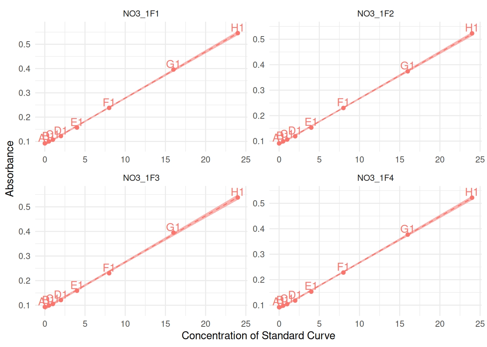

# blank-correction

``` r

library(plate2N)
```

> **Work in progress**
>
> This vignette is still under development, bugs are to be expected

## TO DO

- Make sure there is a “bad” curve in the example dataset (with blank
  with higher absorbance than row B)

## Introduction

This vignette shows the basic functions that allow the correction of raw
absorbance data (`abs`) to blank-corrected absorbance data, referred to
as `abs_corrected` throughout this package.

This pipeline is adapted to the case where the standard curve solutions
were prepared with a different blank than the samples. Because of that,
there are 2 parallel pipelines to perform the blank-correction, then
data from standard curves and from samples are merged again.

In theory, the “samples” pipeline should be adaptable to the case where
all wells used the same blank (including those containing standard curve
solutions), though this has yet to be tested, and bugs may occur. Feel
free to contact the authors to suggest improvements.

To avoid confusion between “blank of the standard curve” and “blank of
the samples”, the sample-blank is referred to as “extractant” or `extr`
throughout this vignette, to refer to the solution that was used to
extract N-compounds from soil samples and now serves as blank. The
standard blank is referred to as `std_blank`.

## 1 - Getting raw absorbance data

The vignette `import-tidy` shows how to import and tidy absorbance data.
The vignette `handling-outliers` shows how to run some preliminary
quality checks and possibly remove some first outliers. To access those
vignettes, run the following commands

[`vignette("import-tidy", package = "plate2N")`](https://mdetoeuf.github.io/plate2N/articles/import-tidy.md)

[`vignette("handling-outliers", package = "plate2N")`](https://mdetoeuf.github.io/plate2N/articles/handling-outliers.md)

``` r

tidy_plates
#> # A tibble: 480 × 8
#>    row   column well_id unique_well_id dataset plate_id map      abs  
#>    <chr> <chr>  <chr>   <chr>          <chr>   <chr>    <chr>    <chr>
#>  1 A     1      A1      A1_NO3_1F1     Nmin    NO3_1F1  Std      0.092
#>  2 A     1      A1      A1_NO3_1F2     Nmin    NO3_1F2  Std      0.091
#>  3 A     1      A1      A1_NO3_1F3     Nmin    NO3_1F3  Std      0.093
#>  4 A     1      A1      A1_NO3_1F4     Nmin    NO3_1F4  Std      0.092
#>  5 A     1      A1      A1_NO3_1F5     Nmin    NO3_1F5  Std      0.092
#>  6 A     2      A2      A2_NO3_1F1     Nmin    NO3_1F1  81_t1_z2 0.114
#>  7 A     2      A2      A2_NO3_1F2     Nmin    NO3_1F2  97_t1_z1 0.107
#>  8 A     2      A2      A2_NO3_1F3     Nmin    NO3_1F3  89_t1_z3 0.095
#>  9 A     2      A2      A2_NO3_1F4     Nmin    NO3_1F4  81_t1_z1 0.118
#> 10 A     2      A2      A2_NO3_1F5     Nmin    NO3_1F5  Std_3_t1 0.167
#> # ℹ 470 more rows
```

For blank-correction of the standard curve, we will also require some
metadata for each 96-well plate containing at least the concentrations
of the dilutions of the standard curve

``` r

(meta <- metadata |> dplyr::select(dataset, plate_id, std_sp, std_unit, std_conc))
#> # A tibble: 5 × 5
#>   dataset plate_id std_sp std_unit    std_conc           
#>   <chr>   <chr>    <chr>  <chr>       <chr>              
#> 1 Nmin    NO3_1F1  NO3    mg NO3- L-1 0-0.5-1-2-4-8-16-24
#> 2 Nmin    NO3_1F2  NO3    mg NO3- L-1 0-0.5-1-2-4-8-16-24
#> 3 Nmin    NO3_1F3  NO3    mg NO3- L-1 0-0.5-1-2-4-8-16-24
#> 4 Nmin    NO3_1F4  NO3    mg NO3- L-1 0-0.5-1-2-4-8-16-24
#> 5 Nmin    NO3_1F5  NO3    mg NO3- L-1 0-0.5-1-2-4-8-16-24
```

We now join (raw) plate data and metadata (meta)

``` r

raw_meta <- tidy_plates |> 
  dplyr::left_join(meta, by = dplyr::join_by(dataset, plate_id))
```

## 2 - Blank-correction of standard curves

### 2.1 - Extract curve concentrations

To fit in one row per plate, the concentrations for standard curve are,
so far, stored in a compact manner, like this:

``` r

raw_meta |> dplyr::select(plate_id, std_conc) |> head(n = 3)
#> # A tibble: 3 × 2
#>   plate_id std_conc           
#>   <chr>    <chr>              
#> 1 NO3_1F1  0-0.5-1-2-4-8-16-24
#> 2 NO3_1F2  0-0.5-1-2-4-8-16-24
#> 3 NO3_1F3  0-0.5-1-2-4-8-16-24
```

Note that concentration values are separated by a `-` and digits are
marked by a `.`, which is important in the function call to
[`extract_curve()`](https://mdetoeuf.github.io/plate2N/reference/extract_curve.md).
Also, concentration values MUST be in ascending order in the metadata
file. See also
[`?metadata`](https://mdetoeuf.github.io/plate2N/reference/metadata.md)
and `?extract_curve()`

``` r

(curve_concentration <- extract_curve(meta, pipetting_direction = "top_down"))
#> # A tibble: 40 × 4
#>    dataset plate_id row   std_conc
#>    <chr>   <chr>    <chr> <chr>   
#>  1 Nmin    NO3_1F1  A     0       
#>  2 Nmin    NO3_1F1  B     0.5     
#>  3 Nmin    NO3_1F1  C     1       
#>  4 Nmin    NO3_1F1  D     2       
#>  5 Nmin    NO3_1F1  E     4       
#>  6 Nmin    NO3_1F1  F     8       
#>  7 Nmin    NO3_1F1  G     16      
#>  8 Nmin    NO3_1F1  H     24      
#>  9 Nmin    NO3_1F2  A     0       
#> 10 Nmin    NO3_1F2  B     0.5     
#> # ℹ 30 more rows
```

> **Too many rows?**
>
> A common mistake is to run
> [`extract_curve()`](https://mdetoeuf.github.io/plate2N/reference/extract_curve.md)
> on `raw_meta` instead of `meta`. But `meta` has one row per plate,
> whereas `raw_meta` has one row per well, so that calling
> `extract_curve(raw_meta)` would result on a table that is much too
> long (~96 times too long). If you run into issues later, this might be
> the source.

We now have curve concentrations connected to the dataset, plate_id and
row of a plate, which we can use for all downstream steps. This goes
under the assumption that standard curves are pipetted vertically in a
complete column of the 96-well plate. Check `?extract_curve()` for more
details.

### 2.2 - Extract Standard data

``` r

std_data <- raw_meta |> 
  extract_std_data(std_def = "Std") |> 
  dplyr::select(!std_conc) |> 
  dplyr::left_join(curve_concentration, by = dplyr::join_by(row, dataset, plate_id))
std_data
#> # A tibble: 80 × 12
#> # Groups:   dataset, plate_id [5]
#>    row   column well_id unique_well_id dataset plate_id unique_curve_id map  
#>    <chr> <chr>  <chr>   <chr>          <chr>   <chr>    <chr>           <chr>
#>  1 A     1      A1      A1_NO3_1F1     Nmin    NO3_1F1  NO3_1F1_col1    Std  
#>  2 A     1      A1      A1_NO3_1F2     Nmin    NO3_1F2  NO3_1F2_col1    Std  
#>  3 A     1      A1      A1_NO3_1F3     Nmin    NO3_1F3  NO3_1F3_col1    Std  
#>  4 A     1      A1      A1_NO3_1F4     Nmin    NO3_1F4  NO3_1F4_col1    Std  
#>  5 A     1      A1      A1_NO3_1F5     Nmin    NO3_1F5  NO3_1F5_col1    Std  
#>  6 A     12     A12     A12_NO3_1F1    Nmin    NO3_1F1  NO3_1F1_col12   Std  
#>  7 A     12     A12     A12_NO3_1F2    Nmin    NO3_1F2  NO3_1F2_col12   Std  
#>  8 A     12     A12     A12_NO3_1F3    Nmin    NO3_1F3  NO3_1F3_col12   Std  
#>  9 A     12     A12     A12_NO3_1F4    Nmin    NO3_1F4  NO3_1F4_col12   Std  
#> 10 A     12     A12     A12_NO3_1F5    Nmin    NO3_1F5  NO3_1F5_col12   Std  
#> # ℹ 70 more rows
#> # ℹ 4 more variables: abs <chr>, std_sp <chr>, std_unit <chr>, std_conc <chr>
```

### 2.3 - Compute per-plate average of std_blank

`extract_std_blanc()` returns a list with several elements concerning
standard blanks

- `std_blank$all` fetches all wells that are expected to contain the
  standard blank (all standard data from plate-row A
  (`pipetting_direction = "top_down"`) or H
  (`pipetting_direction = "bottom_up"`)

- `std_blank$untrusted` identifies expected blank wells that do not
  correspond to the lowest absorbance value of their standard curve[^1].
  This item and may be empty

- `std_blank$trusted` is the complement to `std_blank$untrusted`.

- `std_blank$average` computes the per-plate average of standard blanks
  (relevant if there are several standard curves pipetted in one plate),
  as well as the standard deviation and the coefficient of variation.

``` r

std_blank <- std_data |> 
  extract_std_blank(
    std_def = "Std",
    pipetting_direction = "top_down")

std_blank$all
#> # A tibble: 10 × 8
#> # Groups:   dataset, plate_id, column [10]
#>    well_id dataset plate_id row   column unique_well_id unique_curve_id   abs
#>    <chr>   <chr>   <chr>    <chr> <chr>  <chr>          <chr>           <dbl>
#>  1 A1      Nmin    NO3_1F1  A     1      A1_NO3_1F1     NO3_1F1_col1    0.092
#>  2 A1      Nmin    NO3_1F2  A     1      A1_NO3_1F2     NO3_1F2_col1    0.091
#>  3 A1      Nmin    NO3_1F3  A     1      A1_NO3_1F3     NO3_1F3_col1    0.093
#>  4 A1      Nmin    NO3_1F4  A     1      A1_NO3_1F4     NO3_1F4_col1    0.092
#>  5 A1      Nmin    NO3_1F5  A     1      A1_NO3_1F5     NO3_1F5_col1    0.092
#>  6 A12     Nmin    NO3_1F1  A     12     A12_NO3_1F1    NO3_1F1_col12   0.091
#>  7 A12     Nmin    NO3_1F2  A     12     A12_NO3_1F2    NO3_1F2_col12   0.09 
#>  8 A12     Nmin    NO3_1F3  A     12     A12_NO3_1F3    NO3_1F3_col12   0.09 
#>  9 A12     Nmin    NO3_1F4  A     12     A12_NO3_1F4    NO3_1F4_col12   0.091
#> 10 A12     Nmin    NO3_1F5  A     12     A12_NO3_1F5    NO3_1F5_col12   0.09

std_blank$average
#> # A tibble: 5 × 5
#>   dataset plate_id blank_avg blank_sdev blank_coeff_var_percent
#>   <chr>   <chr>        <dbl>      <dbl>                   <dbl>
#> 1 Nmin    NO3_1F1     0.0915   0.000707                   0.773
#> 2 Nmin    NO3_1F2     0.0905   0.000707                   0.781
#> 3 Nmin    NO3_1F3     0.0915   0.00212                    2.32 
#> 4 Nmin    NO3_1F4     0.0915   0.000707                   0.773
#> 5 Nmin    NO3_1F5     0.091    0.00141                    1.55

std_blank$untrusted ; std_blank$trusted
#> # A tibble: 0 × 8
#> # Groups:   dataset, plate_id, column [0]
#> # ℹ 8 variables: well_id <chr>, dataset <chr>, plate_id <chr>, column <chr>,
#> #   unique_curve_id <chr>, row <chr>, unique_well_id <chr>, abs <dbl>
#> # A tibble: 10 × 8
#>    well_id dataset plate_id row   column unique_well_id unique_curve_id   abs
#>    <chr>   <chr>   <chr>    <chr> <chr>  <chr>          <chr>           <dbl>
#>  1 A1      Nmin    NO3_1F1  A     1      A1_NO3_1F1     NO3_1F1_col1    0.092
#>  2 A1      Nmin    NO3_1F2  A     1      A1_NO3_1F2     NO3_1F2_col1    0.091
#>  3 A1      Nmin    NO3_1F3  A     1      A1_NO3_1F3     NO3_1F3_col1    0.093
#>  4 A1      Nmin    NO3_1F4  A     1      A1_NO3_1F4     NO3_1F4_col1    0.092
#>  5 A1      Nmin    NO3_1F5  A     1      A1_NO3_1F5     NO3_1F5_col1    0.092
#>  6 A12     Nmin    NO3_1F1  A     12     A12_NO3_1F1    NO3_1F1_col12   0.091
#>  7 A12     Nmin    NO3_1F2  A     12     A12_NO3_1F2    NO3_1F2_col12   0.09 
#>  8 A12     Nmin    NO3_1F3  A     12     A12_NO3_1F3    NO3_1F3_col12   0.09 
#>  9 A12     Nmin    NO3_1F4  A     12     A12_NO3_1F4    NO3_1F4_col12   0.091
#> 10 A12     Nmin    NO3_1F5  A     12     A12_NO3_1F5    NO3_1F5_col12   0.09
```

### 2.4 - Quality check of std_blank & outlier removal

> **Check out untrusted standard blanks**
>
> The computation of `std_blank$average` is made on trusted blank wells
> only. It is therefore important to check curves containing “untrusted”
> blank wells and decide whether to keep them or not

The function
[`plot_std()`](https://mdetoeuf.github.io/plate2N/reference/plot_std.md)
allows the visualization of a subset of curves. Because there is no
untrusted blank for now (**Make sure there is a “bad” curve in the
example dataset**), we artificially take a subset of `std_blank$all`
just for the purpose of demonstrating the plots.

``` r

# Subset: create an artificial std_data
artificial_std <- std_data |> 
  dplyr::filter(
    unique_curve_id %in% std_blank$all$unique_curve_id[1:4]) 

# look at (fake) "suspicious" curves
artificial_std |> 
  plot_std(through_origin = FALSE) +
  ggplot2::facet_wrap(~plate_id, scales = "free") +
  ggplot2::theme(legend.position = "none")
```



If the absorbance in well A is very obviously wrong, then remove those
wells, either by keeping `std_blank$average` as is, or by using
[`remove_wells()`](https://mdetoeuf.github.io/plate2N/reference/remove_wells.md)
and re-computing blank averages. Of course, this only works if there
were several standard curves on problematic plates, otherwise you will
be removing the only std_blank of the plate. In such cases, you must
consider your options. If the inter-plate variability of std_blank is
sufficiently small, taking an across-dataset or an across-batch mean
might do the trick.

Here is an example of how to re-compute average blanks in case we decide
to trust some of the wells from `std_blank$untrusted`, replaced here by
`artificial_blank_untrusted` because our untrusted example is empty (for
now).

``` r

# create artificial version of std_blank$untrusted
(artificial_blank_untrusted <- (artificial_std |> extract_std_blank(std_def = "Std"))$all)
#> # A tibble: 4 × 8
#> # Groups:   dataset, plate_id, column [4]
#>   well_id dataset plate_id row   column unique_well_id unique_curve_id   abs
#>   <chr>   <chr>   <chr>    <chr> <chr>  <chr>          <chr>           <dbl>
#> 1 A1      Nmin    NO3_1F1  A     1      A1_NO3_1F1     NO3_1F1_col1    0.092
#> 2 A1      Nmin    NO3_1F2  A     1      A1_NO3_1F2     NO3_1F2_col1    0.091
#> 3 A1      Nmin    NO3_1F3  A     1      A1_NO3_1F3     NO3_1F3_col1    0.093
#> 4 A1      Nmin    NO3_1F4  A     1      A1_NO3_1F4     NO3_1F4_col1    0.092

# remove those untrusted wells from std_blank$all ~ new version of std_blank$trusted
(artificial_blank_clean <- std_blank$all |> remove_wells(artificial_blank_untrusted))
#> # A tibble: 6 × 8
#> # Groups:   dataset, plate_id, column [6]
#>   well_id dataset plate_id row   column unique_well_id unique_curve_id   abs
#>   <chr>   <chr>   <chr>    <chr> <chr>  <chr>          <chr>           <dbl>
#> 1 A1      Nmin    NO3_1F5  A     1      A1_NO3_1F5     NO3_1F5_col1    0.092
#> 2 A12     Nmin    NO3_1F1  A     12     A12_NO3_1F1    NO3_1F1_col12   0.091
#> 3 A12     Nmin    NO3_1F2  A     12     A12_NO3_1F2    NO3_1F2_col12   0.09 
#> 4 A12     Nmin    NO3_1F3  A     12     A12_NO3_1F3    NO3_1F3_col12   0.09 
#> 5 A12     Nmin    NO3_1F4  A     12     A12_NO3_1F4    NO3_1F4_col12   0.091
#> 6 A12     Nmin    NO3_1F5  A     12     A12_NO3_1F5    NO3_1F5_col12   0.09

# re-compute per-plate blank average from that new trusted table
artificial_std_blank_avg <- artificial_blank_clean |>
  dplyr::ungroup() |> 
  dplyr::summarise(
    .by = c(dataset, plate_id),
    blank_avg = mean(abs),
    blank_sdev = stats::sd(abs)
  ) |>
  dplyr::mutate(blank_coeff_var_percent = 100 * blank_sdev / blank_avg)
```

In case of a manual re-computation of blank avergaes, all occurences of
std_blank\$average below should be replaced by this new
`artificial_std_blank_avg`.

### 2.5 - Blank-correction of Standard Curve

Once we are confident in our `std_blank`s, we can use the
`std_blank$average` to blank-correct the raw absorbance values for the
whole standard curves. This is done with the function
[`blank_correct_abs()`](https://mdetoeuf.github.io/plate2N/reference/blank_correct_abs.md),
which will also be used to correct sample absorbance data in the next
section.

[`blank_correct_abs()`](https://mdetoeuf.github.io/plate2N/reference/blank_correct_abs.md)
takes 3 main arguments.

- `raw_wells_data` takes the standard curves data. It should be
  ungrouped and contain only non-blank data (in the case of “top_down”
  pipetting, rows B to H)

- `per_plate_avg_blank` takes the version of blank averages that we
  trust (e.g., `std_blank$average` or `artificial_std_blank_avg)`

- `map_to_exclude` tells which rows to exclude from `raw_wells_data`
  based on their value for the column “map”. Its default setting fits
  the blank-correction of sample data, not that of standard data, so we
  simply replace it by `""`, as we do not wish to exclude any rows here

You can ignore the message `Joining with by = join_by(...)`, which just
depends on the additional columns you may have in your data tables

``` r

std_corrected <-
  blank_correct_abs(
    raw_wells_data = std_data |>
      dplyr::ungroup() |>
      dplyr::filter_out(row == "A"),
    per_plate_avg_blank = std_blank$average,
    map_to_exclude = ""
  ) |> 
  # only keep relevant columns (remove metadata clutter)
  dplyr::select(row:abs_corrected)
#> Joining with `by = join_by(dataset, plate_id)`
#> Joining with `by = join_by(row, column, well_id, unique_well_id, dataset,
#> plate_id, unique_curve_id, map, std_sp, std_unit, std_conc)`
std_corrected
#> # A tibble: 70 × 9
#>    row   column well_id unique_well_id dataset plate_id unique_curve_id map  
#>    <chr> <chr>  <chr>   <chr>          <chr>   <chr>    <chr>           <chr>
#>  1 B     1      B1      B1_NO3_1F1     Nmin    NO3_1F1  NO3_1F1_col1    Std  
#>  2 B     1      B1      B1_NO3_1F2     Nmin    NO3_1F2  NO3_1F2_col1    Std  
#>  3 B     1      B1      B1_NO3_1F3     Nmin    NO3_1F3  NO3_1F3_col1    Std  
#>  4 B     1      B1      B1_NO3_1F4     Nmin    NO3_1F4  NO3_1F4_col1    Std  
#>  5 B     1      B1      B1_NO3_1F5     Nmin    NO3_1F5  NO3_1F5_col1    Std  
#>  6 B     12     B12     B12_NO3_1F1    Nmin    NO3_1F1  NO3_1F1_col12   Std  
#>  7 B     12     B12     B12_NO3_1F2    Nmin    NO3_1F2  NO3_1F2_col12   Std  
#>  8 B     12     B12     B12_NO3_1F3    Nmin    NO3_1F3  NO3_1F3_col12   Std  
#>  9 B     12     B12     B12_NO3_1F4    Nmin    NO3_1F4  NO3_1F4_col12   Std  
#> 10 B     12     B12     B12_NO3_1F5    Nmin    NO3_1F5  NO3_1F5_col12   Std  
#> # ℹ 60 more rows
#> # ℹ 1 more variable: abs_corrected <dbl>
```

Notice that the `abs` column has been removed to avoid mistaking it for
corrected absorbance. Instead, it has been replaced by `abs_corrected`.

## 3 - Blank-correction of samples

### plot_blank_var_distrib() (& extractant_average()?)

### qc_raw_extr()

### suspicious_extr()

### plot extractant outliers with boxplot_outlier_extr() or multiplot_outlier_extr()

[^1]: This quality check was added because, in case of top_down
    pipetting, A1 often will contain the standard blank, but it is also
    often the first well to be filled during pipetting. With automated
    pipettes, a small ejection of liquid has to occur before dispensing
    the first dose of solution. Failure to intentionally eject will
    result in the first well receiving the “ejection” dose, which is not
    the correct volume. This can end up in various responses in terms of
    absorbance, depending on which reagent has been wrongly pipetted.
