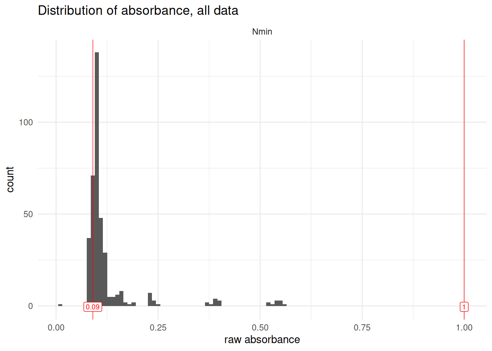

# handling-outliers

``` r

library(plate2N)
```

> **Work in progress**
>
> This vignette is still under development, bugs are to be expected

## TO DO

- Add reference to outlier steps for Std blank, std curve and extr blank

## Introduction

This vignette introduces the handling of several functions to help deal
with outliers, at several steps of the data transformation pipeline.

- [`remove_wells()`](https://mdetoeuf.github.io/plate2N/reference/remove_wells.md)
  allows an easy filtering out of outlier wells from a `tidy_plate`.

- [`failed_wells_template()`](https://mdetoeuf.github.io/plate2N/reference/failed_wells_template.md)
  creates a template of failed wells to be manually filled, e.g., in the
  lab while conducting experiments

- [`qc_raw_abs()`](https://mdetoeuf.github.io/plate2N/reference/qc_raw_abs.md)
  helps in the identification of wells that recorded suspicious
  absorbance readings (outside of an expected range)

- Additional functions are introduced in vignettes `blank-correction`
  and `abs-to-conc`

## 1 - Manual removal of single wells

It is not unusual to have to manually remove wells from a data set. This
is often due to pipetting errors, whether we know that we failed a well
in the lab, or we identify aberrant values during data processing (see
also **vignette xx - upcoming** for how to identify such wells).
[`remove_wells()`](https://mdetoeuf.github.io/plate2N/reference/remove_wells.md)
does just that.

According to the logic of this package, 3 pieces of information uniquely
define a well: `dataset`, `plate_id` and `well_id`. The function
[`remove_wells()`](https://mdetoeuf.github.io/plate2N/reference/remove_wells.md)
allows manual removal of wells from a table formatted as `tidy_table`,
taking a small tibble such as `failed_wells_example` to decide which
wells to remove.

First, let’s check out the input data: a `tidy_table` with 960 rows and
a small table referring to failed wells with 2 rows.

``` r

# check out input
tidy_table ; failed_wells_example
#> # A tibble: 960 × 8
#>    row   column well_id plate_id unique_well_id dataset map     abs   
#>    <chr> <chr>  <chr>   <chr>    <chr>          <chr>   <chr>   <chr> 
#>  1 A     1      A1      M12      A1_M12         expe1   Std0001 1.4402
#>  2 A     1      A1      M16      A1_M16         expe1   Std0097 1.5789
#>  3 A     1      A1      M17      A1_M17         expe1   Std0193 1.5611
#>  4 A     1      A1      M18      A1_M18         expe1   Std0289 1.7013
#>  5 A     1      A1      M19      A1_M19         expe1   Std0385 1.6865
#>  6 A     1      A1      M20      A1_M20         expe1   Std0481 1.7936
#>  7 A     1      A1      M21      A1_M21         expe1   Std0577 1.7925
#>  8 A     1      A1      M22      A1_M22         expe1   Std0673 1.8274
#>  9 A     1      A1      M23      A1_M23         expe1   Std0769 1.9330
#> 10 A     1      A1      M1       A1_M1          expe1   Std0865 0.9254
#> # ℹ 950 more rows
#> # A tibble: 2 × 3
#>   dataset plate_id well_id
#>   <chr>   <chr>    <chr>  
#> 1 expe1   M16      A1     
#> 2 expe1   M23      H12
```

Here is how to use the function
[`remove_wells()`](https://mdetoeuf.github.io/plate2N/reference/remove_wells.md).
Notice that `clean_table` has 958 rows, i.e., 2 rows less than the 960
of `tidy_table`.

``` r

# remove wells
(clean_table <- tidy_table |> remove_wells(failed_wells_example))
#> # A tibble: 958 × 8
#>    row   column well_id plate_id unique_well_id dataset map     abs   
#>    <chr> <chr>  <chr>   <chr>    <chr>          <chr>   <chr>   <chr> 
#>  1 A     1      A1      M12      A1_M12         expe1   Std0001 1.4402
#>  2 A     1      A1      M17      A1_M17         expe1   Std0193 1.5611
#>  3 A     1      A1      M18      A1_M18         expe1   Std0289 1.7013
#>  4 A     1      A1      M19      A1_M19         expe1   Std0385 1.6865
#>  5 A     1      A1      M20      A1_M20         expe1   Std0481 1.7936
#>  6 A     1      A1      M21      A1_M21         expe1   Std0577 1.7925
#>  7 A     1      A1      M22      A1_M22         expe1   Std0673 1.8274
#>  8 A     1      A1      M23      A1_M23         expe1   Std0769 1.9330
#>  9 A     1      A1      M1       A1_M1          expe1   Std0865 0.9254
#> 10 A     2      A2      M12      A2_M12         expe1   Std0002 1.4802
#> # ℹ 948 more rows

# check how many rows were removed
tidy_table |> nrow() ; failed_wells_example |> nrow() ; clean_table |> nrow()
#> [1] 960
#> [1] 2
#> [1] 958
```

Note that
[`remove_wells()`](https://mdetoeuf.github.io/plate2N/reference/remove_wells.md)
requires the columns `dataset`, `plate_id` and `well_id` in both input
tables, but they may contain other columns as well.

## 2 - Defining wells to remove

In vignettes **`blank-correction`** and **`abs-to-conc`**, we go in
detail into how to identify potential outliers wells at various stages
of the analytic pipeline. `failed_wells_example` has a very simple
structure that can easily be created either in R or imported from a csv
file.

### 2.1 - From a csv

It can he handy to have a printed table in the lab, to quickly fill in
by hand the information on wells where we know that something went
wrong. For this, the function
[`failed_wells_template()`](https://mdetoeuf.github.io/plate2N/reference/failed_wells_template.md)
quickly generates a table that can be exported as a csv, printed, then
manually encoded and imported back into R. By default, it will generate
a csv with 30 rows.

``` r

(failed_wells_template <- failed_wells_template(nrow = 30))
#> # A tibble: 30 × 3
#>    dataset plate_id well_id
#>    <chr>   <chr>    <chr>  
#>  1 ""      ""       ""     
#>  2 ""      ""       ""     
#>  3 ""      ""       ""     
#>  4 ""      ""       ""     
#>  5 ""      ""       ""     
#>  6 ""      ""       ""     
#>  7 ""      ""       ""     
#>  8 ""      ""       ""     
#>  9 ""      ""       ""     
#> 10 ""      ""       ""     
#> # ℹ 20 more rows
```

Exporting as a csv can be done with

`failed_wells_template |> readr::write_csv("path/to/folder/failed_wells_template.csv")`

Importing it back can be done with

`readr::read_csv("path/to/folder/failed_wells_lab.csv")`

### 2.2 - Manually in R

**Option 1:** use
[`dplyr::filter()`](https://dplyr.tidyverse.org/reference/filter.html)
to extract `failed_wells` from an existing table.

The use of
[`dplyr::select()`](https://dplyr.tidyverse.org/reference/select.html)
is optional and only allows a cleaner table for the purpose of this
vignette.
[`remove_wells()`](https://mdetoeuf.github.io/plate2N/reference/remove_wells.md)
works regardless.

``` r

failed_wells <- tidy_table |> 
  dplyr::select(dataset, plate_id, well_id) |> 
  dplyr::filter(
    dataset == "expe1" &
    ((plate_id == "M16" & well_id == "A1") |
       (plate_id == "M23" & well_id == "H12"))
  )
# check it out
failed_wells
#> # A tibble: 2 × 3
#>   dataset plate_id well_id
#>   <chr>   <chr>    <chr>  
#> 1 expe1   M16      A1     
#> 2 expe1   M23      H12
```

Notice that applying
[`remove_wells()`](https://mdetoeuf.github.io/plate2N/reference/remove_wells.md)
to `tidy_table` from this table of `failed_wells` results in the same as
just filtering out those wells. So simply using
[`dplyr::filter_out()`](https://dplyr.tidyverse.org/reference/filter.html)
may be more efficient in this case:

``` r

tidy_table |> remove_wells(failed_wells)
#> # A tibble: 958 × 8
#>    row   column well_id plate_id unique_well_id dataset map     abs   
#>    <chr> <chr>  <chr>   <chr>    <chr>          <chr>   <chr>   <chr> 
#>  1 A     1      A1      M12      A1_M12         expe1   Std0001 1.4402
#>  2 A     1      A1      M17      A1_M17         expe1   Std0193 1.5611
#>  3 A     1      A1      M18      A1_M18         expe1   Std0289 1.7013
#>  4 A     1      A1      M19      A1_M19         expe1   Std0385 1.6865
#>  5 A     1      A1      M20      A1_M20         expe1   Std0481 1.7936
#>  6 A     1      A1      M21      A1_M21         expe1   Std0577 1.7925
#>  7 A     1      A1      M22      A1_M22         expe1   Std0673 1.8274
#>  8 A     1      A1      M23      A1_M23         expe1   Std0769 1.9330
#>  9 A     1      A1      M1       A1_M1          expe1   Std0865 0.9254
#> 10 A     2      A2      M12      A2_M12         expe1   Std0002 1.4802
#> # ℹ 948 more rows

tidy_table |> dplyr::filter_out(
    dataset == "expe1" &
    ((plate_id == "M16" & well_id == "A1") |
       (plate_id == "M23" & well_id == "H12"))
  )
#> # A tibble: 958 × 8
#>    row   column well_id plate_id unique_well_id dataset map     abs   
#>    <chr> <chr>  <chr>   <chr>    <chr>          <chr>   <chr>   <chr> 
#>  1 A     1      A1      M12      A1_M12         expe1   Std0001 1.4402
#>  2 A     1      A1      M17      A1_M17         expe1   Std0193 1.5611
#>  3 A     1      A1      M18      A1_M18         expe1   Std0289 1.7013
#>  4 A     1      A1      M19      A1_M19         expe1   Std0385 1.6865
#>  5 A     1      A1      M20      A1_M20         expe1   Std0481 1.7936
#>  6 A     1      A1      M21      A1_M21         expe1   Std0577 1.7925
#>  7 A     1      A1      M22      A1_M22         expe1   Std0673 1.8274
#>  8 A     1      A1      M23      A1_M23         expe1   Std0769 1.9330
#>  9 A     1      A1      M1       A1_M1          expe1   Std0865 0.9254
#> 10 A     2      A2      M12      A2_M12         expe1   Std0002 1.4802
#> # ℹ 948 more rows
```

**Option 2:** Encode it manually from scratch, using
[`tibble::tibble()`](https://tibble.tidyverse.org/reference/tibble.html).
This can be more efficient for a handful of wells to remove, but it
easily becomes a source of errors with numerous outlier wells because
row-correspondence between dataset, plate_id and well_id is not easily
followed visually.

``` r

failed_wells <- tibble::tibble(
  dataset = rep("expe1", 2),
  plate_id = c("M16", "M23"),
  well_id = c("A1", "H12")
)
```

## 3 - Quality Check of raw absorbance readings

There is a range of values that are deemed acceptable for absorbance
readings. Whereas there is a long-lasting tradition of setting
“acceptable” absorbance values between 0.1 and 1, in reality, the
acceptable range will depend on experiment, usage and quality of the
spectrophotomer. Note that for N dosage, values lower than 0.1 are not
rare, especially for blanks and lower values in the standard curve.

[`qc_raw_abs()`](https://mdetoeuf.github.io/plate2N/reference/qc_raw_abs.md)
checks raw absorbance values in a dataset and returns a table allowing
the identification of suspicious wells.

By default,
[`qc_raw_abs()`](https://mdetoeuf.github.io/plate2N/reference/qc_raw_abs.md)
also draws a plot of the distribution of raw absorbance values in the
data set, and sends either a message (all is well) or a warning (some
wells are out of range). These outputs can be repressed. See
`?qc_raw_abs()` for more details.

Default range of accepted absorbance is \[0.1, 1\], but it can be
modulated with the arguments `min_abs` and `max_abs`.

``` r

# check out the raw table
tidy_plates
#> # A tibble: 480 × 8
#>    row   column well_id unique_well_id dataset plate_id map      abs  
#>    <chr> <chr>  <chr>   <chr>          <chr>   <chr>    <chr>    <chr>
#>  1 A     1      A1      A1_NO3_1F1     Nmin    NO3_1F1  Std      0.092
#>  2 A     1      A1      A1_NO3_1F2     Nmin    NO3_1F2  Std      0.091
#>  3 A     1      A1      A1_NO3_1F3     Nmin    NO3_1F3  Std      0.110
#>  4 A     1      A1      A1_NO3_1F4     Nmin    NO3_1F4  Std      0.092
#>  5 A     1      A1      A1_NO3_1F5     Nmin    NO3_1F5  Std      0.113
#>  6 A     2      A2      A2_NO3_1F1     Nmin    NO3_1F1  81_t1_z2 0.114
#>  7 A     2      A2      A2_NO3_1F2     Nmin    NO3_1F2  97_t1_z1 0.107
#>  8 A     2      A2      A2_NO3_1F3     Nmin    NO3_1F3  89_t1_z3 0.095
#>  9 A     2      A2      A2_NO3_1F4     Nmin    NO3_1F4  81_t1_z1 0.118
#> 10 A     2      A2      A2_NO3_1F5     Nmin    NO3_1F5  Std_3_t1 0.167
#> # ℹ 470 more rows

# run the function
(suspicious_wells <- qc_raw_abs(tidy_plates, min_abs = 0.09, max_abs = 1))
#> Warning in qc_raw_abs(tidy_plates, min_abs = 0.09, max_abs = 1): 46 wells out of 384 are out of range for absorbance, i.e., not in the set boundaries of [0.09; 1]. 
#> See table to identify suspicious wells.
```



    #> # A tibble: 46 × 5
    #>    dataset plate_id well_id map      abs
    #>    <chr>   <chr>    <chr>   <chr>    <chr>
    #>  1 Nmin    NO3_1F1  A8      extr     0.083
    #>  2 Nmin    NO3_1F2  A8      extr     0.083
    #>  3 Nmin    NO3_1F3  A8      extr     0.084
    #>  4 Nmin    NO3_1F4  A8      extr     0.084
    #>  5 Nmin    NO3_1F5  A8      extr     0.084
    #>  6 Nmin    NO3_1F3  B2      89_t1_z3 0.085
    #>  7 Nmin    NO3_1F1  B8      extr     0.083
    #>  8 Nmin    NO3_1F2  B8      extr     0.082
    #>  9 Nmin    NO3_1F3  B8      extr     0.085
    #> 10 Nmin    NO3_1F4  B8      extr     0.084
    #> # ℹ 36 more rows

It can happen that some wells are very striking, e.g., a single well
with an absorbance of 3 where the rest of the dataset is around 1 and
the experiment has been ran in 4 technical replicates (there should
always be 4 wells for each value). In such cases, the output of
[`qc_raw_abs()`](https://mdetoeuf.github.io/plate2N/reference/qc_raw_abs.md)
can be used in combination with
[`remove_wells()`](https://mdetoeuf.github.io/plate2N/reference/remove_wells.md),
possibly with additional selection and filtering steps as shown above.

``` r

tidy_plates |> remove_wells(suspicious_wells)
#> # A tibble: 434 × 8
#>    row   column well_id unique_well_id dataset plate_id map      abs  
#>    <chr> <chr>  <chr>   <chr>          <chr>   <chr>    <chr>    <chr>
#>  1 A     1      A1      A1_NO3_1F1     Nmin    NO3_1F1  Std      0.092
#>  2 A     1      A1      A1_NO3_1F2     Nmin    NO3_1F2  Std      0.091
#>  3 A     1      A1      A1_NO3_1F3     Nmin    NO3_1F3  Std      0.110
#>  4 A     1      A1      A1_NO3_1F4     Nmin    NO3_1F4  Std      0.092
#>  5 A     1      A1      A1_NO3_1F5     Nmin    NO3_1F5  Std      0.113
#>  6 A     2      A2      A2_NO3_1F1     Nmin    NO3_1F1  81_t1_z2 0.114
#>  7 A     2      A2      A2_NO3_1F2     Nmin    NO3_1F2  97_t1_z1 0.107
#>  8 A     2      A2      A2_NO3_1F3     Nmin    NO3_1F3  89_t1_z3 0.095
#>  9 A     2      A2      A2_NO3_1F4     Nmin    NO3_1F4  81_t1_z1 0.118
#> 10 A     2      A2      A2_NO3_1F5     Nmin    NO3_1F5  Std_3_t1 0.167
#> # ℹ 424 more rows
```

## 4 - When to remove outliers?

From the end of the `import-tidy` vignette until linear model
application, tables are in the same “tidy” format, with one row per well
and one column for absorbance (blank-corrected or raw), like this:

``` r

tidy_table
#> # A tibble: 960 × 8
#>    row   column well_id plate_id unique_well_id dataset map     abs   
#>    <chr> <chr>  <chr>   <chr>    <chr>          <chr>   <chr>   <chr> 
#>  1 A     1      A1      M12      A1_M12         expe1   Std0001 1.4402
#>  2 A     1      A1      M16      A1_M16         expe1   Std0097 1.5789
#>  3 A     1      A1      M17      A1_M17         expe1   Std0193 1.5611
#>  4 A     1      A1      M18      A1_M18         expe1   Std0289 1.7013
#>  5 A     1      A1      M19      A1_M19         expe1   Std0385 1.6865
#>  6 A     1      A1      M20      A1_M20         expe1   Std0481 1.7936
#>  7 A     1      A1      M21      A1_M21         expe1   Std0577 1.7925
#>  8 A     1      A1      M22      A1_M22         expe1   Std0673 1.8274
#>  9 A     1      A1      M23      A1_M23         expe1   Std0769 1.9330
#> 10 A     1      A1      M1       A1_M1          expe1   Std0865 0.9254
#> # ℹ 950 more rows
```

Main steps of the pipeline are: blank-correction of standard curves,
blank-correction of sample data, computation of the linear or polynomial
model, and inference of sample concentration.
[`remove_wells()`](https://mdetoeuf.github.io/plate2N/reference/remove_wells.md)
can be applied at any of those steps. So when is it important to perform
outlier removal?

We find it a good practice to check for outliers directly before any
aggregation of data, which needs to be computed on wells that we trust,
so that we can also trust the aggregated value that is computed. Key
moments that should be preceded by an outlier removal step are thus

- any average of several wells:

  - [standard
    blank](https://mdetoeuf.github.io/plate2N/articles/blank-correction.html#blank-correction-of-standard-curves)
    (when there are several standard curves per plate)

  - [sample
    blank](https://mdetoeuf.github.io/plate2N/articles/blank-correction.html#blank-correction-of-samples)
    (extractant)

  - triplicate or n-replicates of sample wells (**under development**)

- [computation of the model
  parameters](https://mdetoeuf.github.io/plate2N/articles/abs-to-conc.html#compute-linear-model-on-standard-curves)
  (e.g., slope and intercept for the linear model)

## 5 - Next steps

if you already have tidy imported data as produced by `import-tidy`,
move on to `blank-correction`.
