# microresp

``` r

library(plate2N)
library(patchwork)
library(ggridges)
```

## TO DO

- test to test a push
- Explain the choice of absorbance thresholds used in the QC step
  (Section 4.1)
- Double-check the µg CO2-C conversion formula (Section 5.3) against the
  MicroResp manual — currently taken from an Excel document
- Check where the MBC and qCO2 formulas (Section 7.1) come from, and
  confirm their units
- Section 6’s standard-soil QC plot only shows one run currently —
  revisit once more run data is available
- Turn Section 11’s per-variable plotting into a loop over each index
  (basal_resp through shannon)
- Investigate and resolve the one dropped data point warning in `rSIRs`
  (Section 7.2) — likely a negative-or-zero value going into
  [`log()`](https://rdrr.io/r/base/Log.html)
- change ylim() in normalized / not normalized plot to reflect new data
  (5 plates added) so no points are out of range

## 1 - Introduction

This vignette walks through the full analysis pipeline for a MicroResp
experiment, from raw plate import to substrate-level CO2 respiration
values. It follows the same overall logic as the main N-dosage pipeline
(`import-tidy`, `blank-correction`, `abs-to-conc`), but MicroResp
experiments differ enough — more data layers per plate, no standard
curve, and a different final unit (a respiration rate rather than a
concentration) — that they’re covered here as their own self-contained
walkthrough rather than split across the main vignettes.

We start, as in `import-tidy`, with importing and tidying data recorded
with more than 2 layers per plate (see the tip on multiple data layers
there) — then move on to the MicroResp-specific steps: joining sample
metadata, quality-checking and cleaning raw absorbance, normalizing
across plates, converting to %CO2 and then to a respiration rate, and
finally checking for and removing per-sample outliers.

Here, we quickly go through the import pipeline with an example of data
from a
[MicroResp](https://www.hutton.ac.uk/scientific-services/analytical/analytical-services/microresp/)
experiment. To understand what this means: here plates are incubated for
5h. An absorbance reading is done at t = 0h (`t0`) and t = 5h (`t5`).
There is also mapping data, containing the info on which substrate has
been added in which well. Substrates are, in this experiment: glucose
(Glu), water (H2O), oxalic acid (OA), lignin (Lgn), N-acetylglucosamine
(NAG), gamma-acetylbutyric acid (gABA), alanine (Ala) and urea (Urea).

So, the 3 layers of data are referred to as `abs_t0`, `abs_t5`, and
`map`.

### Overview

This vignette runs through 12 sections in a single, mostly linear
pipeline. Here’s the shape of it, grouped into the main phases:

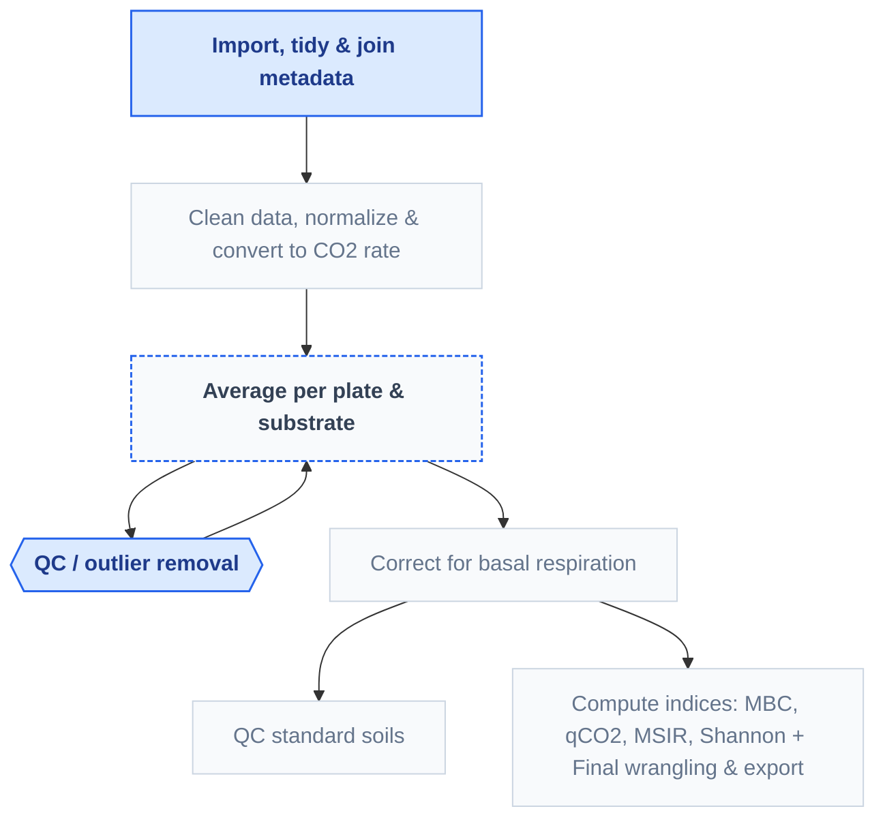

Bold boxes use `plate2N` functions directly; the remaining boxes apply
the tidyverse toolbox ([Wickham et al. 2019](#ref-wickham2019)) to
MicroResp data.

- **Sections 2**: import raw plate files, tidy them, and join in sample
  metadata.
- **Section 3**: quality-check raw absorbance, remove empty/edge wells,
  normalize across plates, then convert to %CO2 and a respiration rate.
- **Section 4**: compute a preliminary average, then iteratively check
  for and remove per-plate[^1]/substrate outliers, and recompute the
  final average.
- **Section 5**: correct for basal respiration.
- **Section 6**: a QC check on the standard soils.
- **Section 7**: compute the summary indices (MBC, qCO2, MSIR, Shannon).
- **Section 8**: final study-specific wrangling and export.

## 2 - Import & tidy 2+ layers, then join metadata

### 2.1 - Importing 2 layers of absorbance data

``` r

# Get path to absorbance data, t0 and t5
MR_t0_csv <- system.file("extdata", "MR_abs_t0.csv", package = "plate2N")
MR_t5_csv <- system.file("extdata", "MR_abs_t5.csv", package = "plate2N")

# import from csv file type
MR_abs_t0 <- csv_to_tibble(MR_t0_csv)
MR_abs_t5 <- csv_to_tibble(MR_t5_csv)

# Check them out
MR_abs_t0; MR_abs_t5
#> # A tibble: 90 × 13
#>    row      X1    X2    X3    X4    X5    X6    X7    X8    X9   X10   X11   X12
#>    <chr> <dbl> <dbl> <dbl> <dbl> <dbl> <dbl> <dbl> <dbl> <dbl> <dbl> <dbl> <dbl>
#>  1 P01    1     2     3     4     5     6     7     8     9    10    11    12   
#>  2 A      0.93  1.15  1.14  1.14  1.15  1.16  1.16  1.17  1.17  1.12  1.14  1.17
#>  3 B      1.15  1.16  1.13  1.16  1.16  1.16  1.17  1.16  1.14  1.16  1.16  1.15
#>  4 C      1.16  1.15  1.14  1.17  1.15  1.16  1.19  1.19  1.17  1.17  1.18  1.17
#>  5 D      1.17  1.16  1.16  1.16  1.16  1.16  1.18  1.17  1.14  1.18  1.17  1.17
#>  6 E      1.19  1.16  1.16  1.18  1.17  1.15  1.19  1.1   1.11  1.17  1.16  1.16
#>  7 F      1.16  1.17  1.17  1.18  1.19  1.15  1.19  1.13  1.13  1.16  1.14  1.18
#>  8 G      1.17  1.15  1.16  1.13  1.19  1.16  1.2   1.08  1.15  1.16  1.15  1.16
#>  9 H      1.17  1.16  1.17  1.16  1.19  1.16  1.2   1.11  1.15  1.15  1.16  1.18
#> 10 P02    1     2     3     4     5     6     7     8     9    10    11    12   
#> # ℹ 80 more rows
#> # A tibble: 90 × 13
#>    row      X1    X2    X3    X4    X5    X6    X7    X8    X9   X10   X11   X12
#>    <chr> <dbl> <dbl> <dbl> <dbl> <dbl> <dbl> <dbl> <dbl> <dbl> <dbl> <dbl> <dbl>
#>  1 P01    1     2     3     4     5     6     7     8     9    10    11    12   
#>  2 A      0.67  0.39  0.89  0.91  0.32  0.6   0.77  0.81  0.86  0.67  0.79  0.98
#>  3 B      0.9   0.4   0.86  0.92  0.32  0.64  0.81  0.79  0.83  0.77  0.82  0.94
#>  4 C      0.92  0.42  0.89  0.93  0.33  0.56  0.81  0.8   0.86  0.78  0.84  0.95
#>  5 D      0.92  0.39  0.91  0.91  0.32  0.6   0.81  0.79  0.84  0.81  0.84  0.95
#>  6 E      0.94  0.41  0.9   0.95  0.34  0.59  0.8   0.7   0.8   0.79  0.81  0.95
#>  7 F      0.92  0.41  0.92  0.94  0.36  0.6   0.82  0.77  0.79  0.78  0.8   0.96
#>  8 G      0.93  0.41  0.92  0.89  0.36  0.65  0.83  0.72  0.84  0.76  0.8   0.94
#>  9 H      0.93  0.43  0.92  0.94  0.34  0.62  0.83  0.72  0.83  0.74  0.8   0.96
#> 10 P02    1     2     3     4     5     6     7     8     9    10    11    12   
#> # ℹ 80 more rows
```

> **More layers of data are possible**
>
> In theory, any number of data layers are possible - you just need to
> extend the logic displayed here, with additional elements to some
> arguments that are vectors (e.g.,
> `abs_map = c("abs_t0", "abs_t5", "map")`) and others that are lists of
> all data sets (one per layer).

### 2.2 - Being creative with importing mappings

In a classical MicroResp experiment, a whole 96-well plate is dedicated
to a single sample, though this may vary between experimental design. In
this particular case, the mapping did not relate to samples, but to
substrates added. And because the template of substrate addition was
strictly the same for each plate, with a complete column attributed per
substrate, there is a much simpler way to import the mapping data than
creating a plate layout csv and importing it. This holds particularly
true for an experiment with a large number of plates (we had hundreds).
So feel free to be creative in generating layers of data, as best fits
your needs.

Plate mapping is strictly the same for each plate throughout the
experiment, so we propose to take advantage of the function
[`plate2N::map_plates()`](https://mdetoeuf.github.io/plate2N/reference/map_plates.md)
(see also the `prepare-plates`
[vignette](https://mdetoeuf.github.io/plate2N/articles/prepare_plates.html))
to create this mapping data in R.

First, create a vector with the names of the substrates (in the order of
the plate map)

``` r

# vector of substrates
MR_columns <- c(
  "Std_Glu", "Std_H2O", 
  "H2O", "OA", "Glu", "Lgn", "NAG", "gABA", "Ala", "Urea")
```

Then, compute the number of plates required (here, 5 plates) by counting
how many cells in the first column of `MR_abs_t0` do not correspond to
one of the 26 `LETTERS` (= number of plate ids).

``` r

# nb of plates
(nb_plates <- MR_abs_t0 |> 
  dplyr::filter(!(row %in% LETTERS)) |> 
  nrow())
#> [1] 10
```

Finally, run the mapping function with

- plate_id that pastes “P” with numbers from 01 to the nb of plates

- “sample list” = repetition of the vector of substrates x the nb of
  plates

- no std curves or blank (not needed in MicroResp experiments), and 2
  empty columns (1 and 12, typically disregarded in those experiments
  due to large edge effects)

- 8 wells per “sample” (in this case: not samples but substrates)

``` r

# extract the real plate ids present in the raw data, in order
(plate_ids_used <- MR_abs_t0 |> 
  dplyr::filter(!(row %in% LETTERS)) |> 
  dplyr::pull(row))
#>  [1] "P01" "P02" "P03" "P04" "P05" "P11" "P12" "P13" "P14" "P15"

# compute the mapping
MR_map <- map_plates(
  plate_ids = plate_ids_used, 
  samples = rep(MR_columns, nb_plates),
  n_samples_per_plate = 10,
  column_curves = c(), column_blank = c(), column_empty = c(1,12),
  n_wells_samples = 8)

# Check it out
MR_map
#> # A tibble: 90 × 13
#>    row   X1    X2    X3    X4    X5    X6    X7    X8    X9    X10   X11   X12  
#>    <chr> <chr> <chr> <chr> <chr> <chr> <chr> <chr> <chr> <chr> <chr> <chr> <chr>
#>  1 P01   1     2     3     4     5     6     7     8     9     10    11    12   
#>  2 A     empty Std_… Std_… H2O   OA    Glu   Lgn   NAG   gABA  Ala   Urea  empty
#>  3 B     empty Std_… Std_… H2O   OA    Glu   Lgn   NAG   gABA  Ala   Urea  empty
#>  4 C     empty Std_… Std_… H2O   OA    Glu   Lgn   NAG   gABA  Ala   Urea  empty
#>  5 D     empty Std_… Std_… H2O   OA    Glu   Lgn   NAG   gABA  Ala   Urea  empty
#>  6 E     empty Std_… Std_… H2O   OA    Glu   Lgn   NAG   gABA  Ala   Urea  empty
#>  7 F     empty Std_… Std_… H2O   OA    Glu   Lgn   NAG   gABA  Ala   Urea  empty
#>  8 G     empty Std_… Std_… H2O   OA    Glu   Lgn   NAG   gABA  Ala   Urea  empty
#>  9 H     empty Std_… Std_… H2O   OA    Glu   Lgn   NAG   gABA  Ala   Urea  empty
#> 10 P02   1     2     3     4     5     6     7     8     9     10    11    12   
#> # ℹ 80 more rows
```

Such creative methods are particularly time-saving with large datasets.
Here, we have only 5 plates \<=\> 45 rows in our tibble. But in a
100-plate dataset, this would correspond to 900 rows, quite
time-consuming to encode by hand.

### 2.3 - Verticalize and join all 3 layers

Notice the use of a 3-element (rather than 2-element) list and a
3-element vector for the arguments `tibble_list` and `abs_map`,
respectively. The logic stays the same as with 2 layers though.

``` r

# verticalize and join the 3 layers
MR_joined <- join_abs_map(
  tibble_list = list( MR_abs_t0, MR_abs_t5, MR_map), 
  abs_map = c("abs_t0-", "abs_t5-", "map-"), 
  coerce_numeric = FALSE, 
  dataset = "MR-" )

# Check it out
MR_joined
#> # A tibble: 96 × 32
#>    row   column `MR-abs_t0-P01` `MR-abs_t0-P02` `MR-abs_t0-P03` `MR-abs_t0-P04`
#>    <chr> <chr>  <chr>           <chr>           <chr>           <chr>          
#>  1 A     1      0.93            1.23            1.27            1.32           
#>  2 A     2      1.15            1.23            1.26            1.25           
#>  3 A     3      1.14            1.22            1.25            1.22           
#>  4 A     4      1.14            1.22            1.26            1.3            
#>  5 A     5      1.15            1.22            1.24            1.28           
#>  6 A     6      1.16            1.21            1.23            1.26           
#>  7 A     7      1.16            1.23            1.23            1.27           
#>  8 A     8      1.17            1.2             1.24            1.24           
#>  9 A     9      1.17            1.21            1.25            1.28           
#> 10 A     10     1.12            1.21            1.25            1.24           
#> # ℹ 86 more rows
#> # ℹ 26 more variables: `MR-abs_t0-P05` <chr>, `MR-abs_t0-P11` <chr>,
#> #   `MR-abs_t0-P12` <chr>, `MR-abs_t0-P13` <chr>, `MR-abs_t0-P14` <chr>,
#> #   `MR-abs_t0-P15` <chr>, `MR-abs_t5-P01` <chr>, `MR-abs_t5-P02` <chr>,
#> #   `MR-abs_t5-P03` <chr>, `MR-abs_t5-P04` <chr>, `MR-abs_t5-P05` <chr>,
#> #   `MR-abs_t5-P11` <chr>, `MR-abs_t5-P12` <chr>, `MR-abs_t5-P13` <chr>,
#> #   `MR-abs_t5-P14` <chr>, `MR-abs_t5-P15` <chr>, `MR-map-P01` <chr>, …
```

Notice the names of the columns, that now received 3 options for the
layer prefix: `abs_t0-`, `abs_t5-` and `map-`.

``` r

# Check out column names
names(MR_joined)
#>  [1] "row"           "column"        "MR-abs_t0-P01" "MR-abs_t0-P02"
#>  [5] "MR-abs_t0-P03" "MR-abs_t0-P04" "MR-abs_t0-P05" "MR-abs_t0-P11"
#>  [9] "MR-abs_t0-P12" "MR-abs_t0-P13" "MR-abs_t0-P14" "MR-abs_t0-P15"
#> [13] "MR-abs_t5-P01" "MR-abs_t5-P02" "MR-abs_t5-P03" "MR-abs_t5-P04"
#> [17] "MR-abs_t5-P05" "MR-abs_t5-P11" "MR-abs_t5-P12" "MR-abs_t5-P13"
#> [21] "MR-abs_t5-P14" "MR-abs_t5-P15" "MR-map-P01"    "MR-map-P02"   
#> [25] "MR-map-P03"    "MR-map-P04"    "MR-map-P05"    "MR-map-P11"   
#> [29] "MR-map-P12"    "MR-map-P13"    "MR-map-P14"    "MR-map-P15"
```

### 2.4 - Tidy the data, 3 columns for 3 layers

Tidy the table to reach 1 row per unique well (96 x nb of physical
plates), and 3 important columns: `abs_t0`, `abs_t5`, `map`. The syntax
for this step is strictly the same as with 2 layers, but we now have to
specify the argument `column_def`\` as its default value, containing
only `c("abs-", "map-")` would no longer work.

``` r

# From vertical to tidy format with 3 layers
MR_tidy <- vertical_to_tidy(
  MR_joined, 
  column_def = c("abs_t0", "abs_t5", "map"))

# Check it out
MR_tidy
#> # A tibble: 960 × 9
#>    row   column well_id unique_well_id dataset plate_id abs_t0 abs_t5 map  
#>    <chr> <chr>  <chr>   <chr>          <chr>   <chr>    <chr>  <chr>  <chr>
#>  1 A     1      A1      A1_P01         MR      P01      0.93   0.67   empty
#>  2 A     1      A1      A1_P02         MR      P02      1.23   1      empty
#>  3 A     1      A1      A1_P03         MR      P03      1.27   1.04   empty
#>  4 A     1      A1      A1_P04         MR      P04      1.32   1.09   empty
#>  5 A     1      A1      A1_P05         MR      P05      1.32   1.13   empty
#>  6 A     1      A1      A1_P11         MR      P11      1.43   1.18   empty
#>  7 A     1      A1      A1_P12         MR      P12      1.4    1.12   empty
#>  8 A     1      A1      A1_P13         MR      P13      1.39   1.14   empty
#>  9 A     1      A1      A1_P14         MR      P14      1.38   1.16   empty
#> 10 A     1      A1      A1_P15         MR      P15      1.45   1.2    empty
#> # ℹ 950 more rows

# If you like to reorder columns to have mapping first, then absorbance
MR_tidy |> dplyr::relocate(map, .before = abs_t0)
#> # A tibble: 960 × 9
#>    row   column well_id unique_well_id dataset plate_id map   abs_t0 abs_t5
#>    <chr> <chr>  <chr>   <chr>          <chr>   <chr>    <chr> <chr>  <chr> 
#>  1 A     1      A1      A1_P01         MR      P01      empty 0.93   0.67  
#>  2 A     1      A1      A1_P02         MR      P02      empty 1.23   1     
#>  3 A     1      A1      A1_P03         MR      P03      empty 1.27   1.04  
#>  4 A     1      A1      A1_P04         MR      P04      empty 1.32   1.09  
#>  5 A     1      A1      A1_P05         MR      P05      empty 1.32   1.13  
#>  6 A     1      A1      A1_P11         MR      P11      empty 1.43   1.18  
#>  7 A     1      A1      A1_P12         MR      P12      empty 1.4    1.12  
#>  8 A     1      A1      A1_P13         MR      P13      empty 1.39   1.14  
#>  9 A     1      A1      A1_P14         MR      P14      empty 1.38   1.16  
#> 10 A     1      A1      A1_P15         MR      P15      empty 1.45   1.2   
#> # ℹ 950 more rows
```

### 2.5 - Join metadata to plate data

``` r

# Get path to metadata
metadata_csv <- system.file("extdata", "MR_metadata.csv", package = "plate2N")

# import it
(MR_metadata <- readr::read_csv(metadata_csv, show_col_types = FALSE))
#> # A tibble: 10 × 20
#>    plate_nb run_id sample_id plate_id lab_id detection_plate_id expe  cra_trial
#>    <chr>    <chr>  <chr>     <chr>    <chr>  <chr>              <chr> <chr>    
#>  1 P01      R1     t2_102_z1 P01      MdT    M25                Field SyCBio   
#>  2 P02      R1     t2_103_z3 P02      MdT    M26                Field SyCBio   
#>  3 P03      R1     t2_86_z2  P03      MdT    M27                Field SyCBio   
#>  4 P04      R1     t2_101_z3 P04      MdT    M28                Field SyCBio   
#>  5 P05      R1     t2_84_z1  P05      MdT    M29                Field SyCBio   
#>  6 P11      R2     t2_92_z2  P11      MdT    M25                Field SyCBio   
#>  7 P12      R2     t2_82_z2  P12      MdT    M26                Field SyCBio   
#>  8 P13      R2     t2_94_z3  P13      MdT    M27                Field SyCBio   
#>  9 P14      R2     t2_87_z2  P14      MdT    M28                Field SyCBio   
#> 10 P15      R2     t2_91_z3  P15      MdT    M29                Field SyCBio   
#> # ℹ 12 more variables: sd_c <chr>, soil <chr>, crop_diversity <chr>,
#> #   bloc <chr>, sampling_time <chr>, zone <chr>, date <chr>, sample_name <chr>,
#> #   soil_dm_content_percent <dbl>, soil_well_g <dbl>,
#> #   std_soil_dm_content_percent <dbl>, std_soil_well_g <dbl>
```

Notice the absence of column called `std_conc`. For the MicroResp
experiment, there is no standard curve. However, there is other
per-sample data that we will need, namely weight of soil added to each
deep-well, and soil water content.

Now we can join it to the plate data

``` r

(MR <- MR_tidy |> dplyr::left_join(MR_metadata, by = dplyr::join_by(plate_id)))
#> # A tibble: 960 × 28
#>    row   column well_id unique_well_id dataset plate_id abs_t0 abs_t5 map  
#>    <chr> <chr>  <chr>   <chr>          <chr>   <chr>    <chr>  <chr>  <chr>
#>  1 A     1      A1      A1_P01         MR      P01      0.93   0.67   empty
#>  2 A     1      A1      A1_P02         MR      P02      1.23   1      empty
#>  3 A     1      A1      A1_P03         MR      P03      1.27   1.04   empty
#>  4 A     1      A1      A1_P04         MR      P04      1.32   1.09   empty
#>  5 A     1      A1      A1_P05         MR      P05      1.32   1.13   empty
#>  6 A     1      A1      A1_P11         MR      P11      1.43   1.18   empty
#>  7 A     1      A1      A1_P12         MR      P12      1.4    1.12   empty
#>  8 A     1      A1      A1_P13         MR      P13      1.39   1.14   empty
#>  9 A     1      A1      A1_P14         MR      P14      1.38   1.16   empty
#> 10 A     1      A1      A1_P15         MR      P15      1.45   1.2    empty
#> # ℹ 950 more rows
#> # ℹ 19 more variables: plate_nb <chr>, run_id <chr>, sample_id <chr>,
#> #   lab_id <chr>, detection_plate_id <chr>, expe <chr>, cra_trial <chr>,
#> #   sd_c <chr>, soil <chr>, crop_diversity <chr>, bloc <chr>,
#> #   sampling_time <chr>, zone <chr>, date <chr>, sample_name <chr>,
#> #   soil_dm_content_percent <dbl>, soil_well_g <dbl>,
#> #   std_soil_dm_content_percent <dbl>, std_soil_well_g <dbl>
```

## 3 - Clean data, normalize & convert to CO2 rate

### 3.1 - QC - suspicious wells

[`plate2N::qc_raw_abs()`](https://mdetoeuf.github.io/plate2N/reference/qc_raw_abs.md)
checks whether absorbance data is within a user-defined range or not.
Check the documentation on this function for more details.

Here, we run the quality check to see if there is any really abnormal
absorbance reading. The plots are saved in the working environment as
objects `abs_t0_distrib` and `abs_t5_distrib`, which can be called on
later.

``` r

# Check for t0
MR |> 
  dplyr::mutate(abs = abs_t0) |> 
  qc_raw_abs(
    min_abs = 0.9, max_abs = 1.8, 
    plot_col_facet = "dataset", 
    show_plot = FALSE, 
    export_plot = "abs_t0_distrib") 
#> !! YAY !! All wells are in range for absorbance between 0.9 and 1.8
#> # A tibble: 0 × 5
#> # ℹ 5 variables: dataset <chr>, plate_id <chr>, well_id <chr>, map <chr>,
#> #   abs <chr>

# And for t1
MR |> 
  dplyr::mutate(abs = abs_t5) |> 
  qc_raw_abs(
    min_abs = 0.2, max_abs = 1.8, 
    plot_col_facet = "dataset", 
    show_plot = FALSE, 
    export_plot = "abs_t5_distrib") 
#> !! YAY !! All wells are in range for absorbance between 0.2 and 1.8
#> # A tibble: 0 × 5
#> # ℹ 5 variables: dataset <chr>, plate_id <chr>, well_id <chr>, map <chr>,
#> #   abs <chr>
```

Good news, all absorbance reads are within expected range. Let’s plot
them

``` r

(abs_t0_distrib + ggplot2::labs(title = "t0")) / 
  (abs_t5_distrib + ggplot2::labs(title = "t5")) + 
  patchwork::plot_annotation(title = "Distribution of raw absorbance")
```

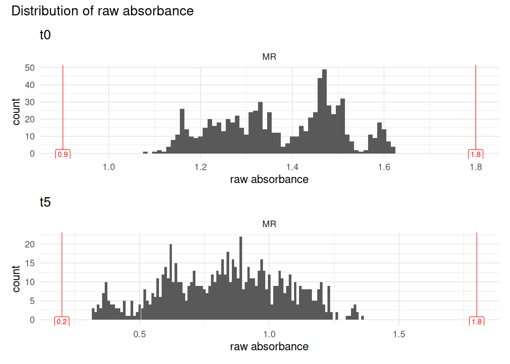

### 3.2 - Remove “empty” and NAs

With MicroResp experiments, edge effects are not rare, so we exclude any
data from columns 1 and 12 of the 96-well plate. Those have been encoded
in the mapping as “empty” (though they were not physically).

We also change data format so that all absorbance data becomes numeric
(until now stored as character)

``` r

MR_clean <- MR |> 
  dplyr::filter_out(map == "empty" | is.na(abs_t0)) |> 
  dplyr::mutate(abs_t0 = as.numeric(abs_t0), abs_t5 = as.numeric(abs_t5))

# notice that there are now less rows (in particulare, it starts with column 1)
MR_clean
#> # A tibble: 800 × 28
#>    row   column well_id unique_well_id dataset plate_id abs_t0 abs_t5 map    
#>    <chr> <chr>  <chr>   <chr>          <chr>   <chr>     <dbl>  <dbl> <chr>  
#>  1 A     2      A2      A2_P01         MR      P01        1.15   0.39 Std_Glu
#>  2 A     2      A2      A2_P02         MR      P02        1.23   0.43 Std_Glu
#>  3 A     2      A2      A2_P03         MR      P03        1.26   0.47 Std_Glu
#>  4 A     2      A2      A2_P04         MR      P04        1.25   0.44 Std_Glu
#>  5 A     2      A2      A2_P05         MR      P05        1.25   0.47 Std_Glu
#>  6 A     2      A2      A2_P11         MR      P11        1.41   0.62 Std_Glu
#>  7 A     2      A2      A2_P12         MR      P12        1.4    0.56 Std_Glu
#>  8 A     2      A2      A2_P13         MR      P13        1.37   0.57 Std_Glu
#>  9 A     2      A2      A2_P14         MR      P14        1.4    0.59 Std_Glu
#> 10 A     2      A2      A2_P15         MR      P15        1.51   0.64 Std_Glu
#> # ℹ 790 more rows
#> # ℹ 19 more variables: plate_nb <chr>, run_id <chr>, sample_id <chr>,
#> #   lab_id <chr>, detection_plate_id <chr>, expe <chr>, cra_trial <chr>,
#> #   sd_c <chr>, soil <chr>, crop_diversity <chr>, bloc <chr>,
#> #   sampling_time <chr>, zone <chr>, date <chr>, sample_name <chr>,
#> #   soil_dm_content_percent <dbl>, soil_well_g <dbl>,
#> #   std_soil_dm_content_percent <dbl>, std_soil_well_g <dbl>
```

### 3.3 - Normalisation

In preliminary works we noticed that `detection_plate_id` was the
biggest driver of variability in our dataset. This is due to some lab
issues and should not be a recurring problem, but it is a good
illustration of the question of “at which scale should we normalize?”.
Let’s visualize t0 absorbance readings for standard soils and glucose,
supposedly the same between plates (see plot)

``` r

unnormed_plot <- MR_clean |> 
  dplyr::filter(map == "Std_Glu") |> 
  ggplot2::ggplot(ggplot2::aes(x = detection_plate_id, y = as.numeric(abs_t5))) +
  ggplot2::theme_minimal() +
  ggplot2::geom_boxplot() +
  ggplot2::facet_wrap(~dataset, scales = "free_x") +
  ggplot2::labs(title = "Raw data at t5",
       subtitle = "no normalisation") +
  ggplot2::ylim(0.38,0.58)

unnormed_plot
#> Warning: Removed 37 rows containing non-finite outside the scale range
#> (`stat_boxplot()`).
```

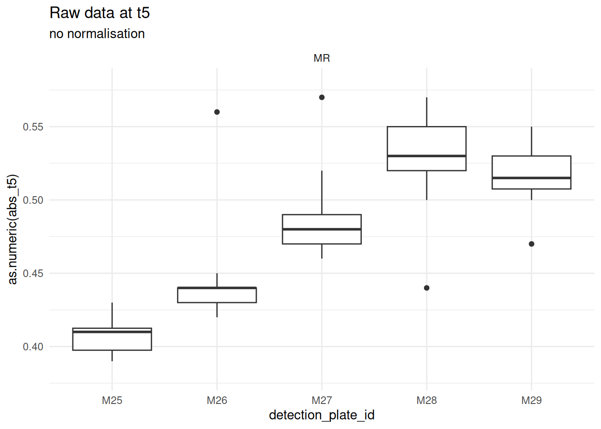

So, instead of a “per-plate” normalization, we propose a “per-dataset”
normalisation. I.e., instead of

- $`normalized_{abs} = \frac{abs_{i,t5}}{abs_{i,t0}} \cdot mean(abs_{plate,t0})`$

We get

- $`normalized_{abs} = \frac {abs_{i,t5}}{abs_{i,t0}} \cdot mean(abs_{dataset,t0})`$

``` r

MR_norm <- MR_clean |> 
  # compute dataset-wise mean of t0
  dplyr::mutate(mean_t0_dataset = mean(abs_t0)) |> 
  # compute plate-wise mean of t0
  dplyr::mutate(mean_t0_plate = mean(abs_t0), .by = plate_id) |> 
  # compute both norms: plate-wise and dataset-wise
  dplyr::mutate(
    norm_plate = mean_t0_plate * abs_t5 / abs_t0,
    norm_dataset = mean_t0_dataset * abs_t5 / abs_t0
  ) |> 
  # reorder columns to improve readibility
  dplyr::relocate(unique_well_id, abs_t0, abs_t5, norm_dataset, norm_plate, mean_t0_plate, mean_t0_dataset)

# Check it out
MR_norm
#> # A tibble: 800 × 32
#>    unique_well_id abs_t0 abs_t5 norm_dataset norm_plate mean_t0_plate
#>    <chr>           <dbl>  <dbl>        <dbl>      <dbl>         <dbl>
#>  1 A2_P01           1.15   0.39        0.465      0.393          1.16
#>  2 A2_P02           1.23   0.43        0.480      0.426          1.22
#>  3 A2_P03           1.26   0.47        0.512      0.474          1.27
#>  4 A2_P04           1.25   0.44        0.483      0.462          1.31
#>  5 A2_P05           1.25   0.47        0.516      0.502          1.34
#>  6 A2_P11           1.41   0.62        0.603      0.655          1.49
#>  7 A2_P12           1.4    0.56        0.549      0.590          1.47
#>  8 A2_P13           1.37   0.57        0.571      0.605          1.45
#>  9 A2_P14           1.4    0.59        0.578      0.604          1.43
#> 10 A2_P15           1.51   0.64        0.582      0.668          1.58
#> # ℹ 790 more rows
#> # ℹ 26 more variables: mean_t0_dataset <dbl>, row <chr>, column <chr>,
#> #   well_id <chr>, dataset <chr>, plate_id <chr>, map <chr>, plate_nb <chr>,
#> #   run_id <chr>, sample_id <chr>, lab_id <chr>, detection_plate_id <chr>,
#> #   expe <chr>, cra_trial <chr>, sd_c <chr>, soil <chr>, crop_diversity <chr>,
#> #   bloc <chr>, sampling_time <chr>, zone <chr>, date <chr>, sample_name <chr>,
#> #   soil_dm_content_percent <dbl>, soil_well_g <dbl>, …
```

#### Choice of normalisation - graphical

Redo the same plots to confirm the improvement coming from the
normalisation, and look at plots with original vs new normalisation

``` r

dataset_normed_plot <- MR_norm |> 
  dplyr::filter(map == "Std_Glu") |> 
  ggplot2::ggplot(ggplot2::aes(x = detection_plate_id, y = as.numeric(norm_dataset))) +
  ggplot2::theme_minimal() +
  ggplot2::geom_boxplot() +
  ggplot2::facet_wrap(~dataset, scales = "free_x") +
  ggplot2::labs(title = "Normalised data", subtitle = "dataset-level") +
  ggplot2::ylim(0.38,0.58)

plate_normed_plot <- MR_norm |> 
  dplyr::filter(map == "Std_Glu") |> 
  ggplot2::ggplot(ggplot2::aes(x = detection_plate_id, y = as.numeric(norm_plate))) +
  ggplot2::theme_minimal() +
  ggplot2::geom_boxplot() +
  ggplot2::facet_wrap(~dataset, scales = "free_x") +
  ggplot2::labs(title = "Normalised data", subtitle = "plate-level") +
  ggplot2::ylim(0.38,0.58)

unnormed_plot + plate_normed_plot + dataset_normed_plot
#> Warning: Removed 37 rows containing non-finite outside the scale range
#> (`stat_boxplot()`).
#> Warning: Removed 40 rows containing non-finite outside the scale range
#> (`stat_boxplot()`).
#> Warning: Removed 26 rows containing non-finite outside the scale range
#> (`stat_boxplot()`).
```

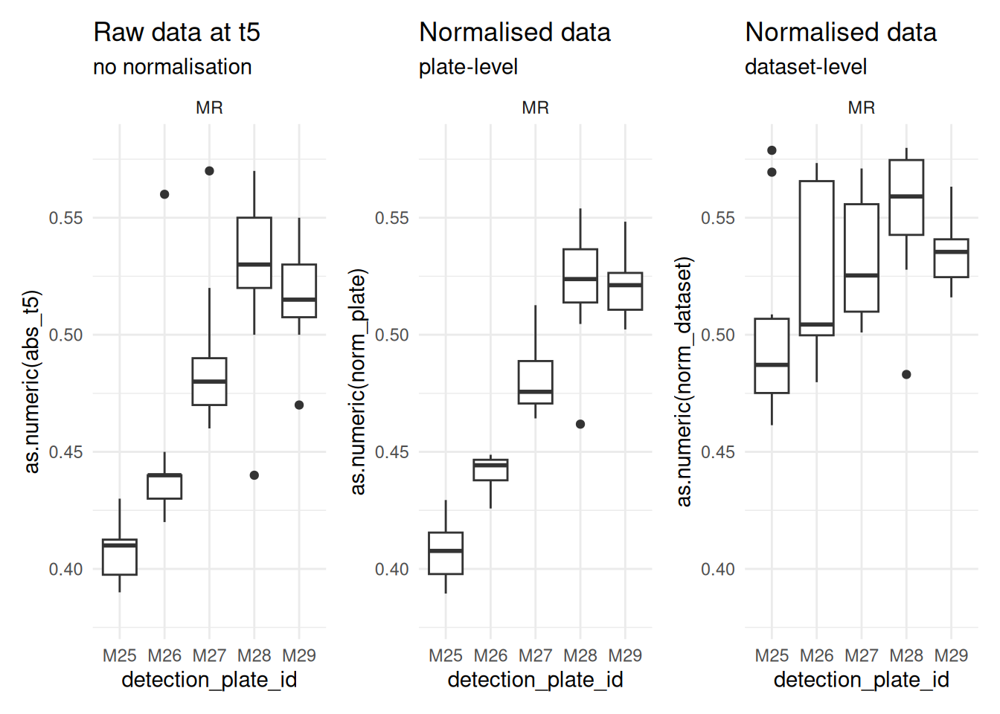

Each step, from raw to plate-level to dataset-level is an improvement on
the data. This confirms the proposition, and we keep the dataset-level
normalised data for downstream steps

### 3.4 - Convert to %CO2

Those are the coefficients as given in the MicroResp manual. However, if
you are interested in this particular experiment, note that the manual
recommends that you calibrate the equation on your own lab material.

%Co2 = -0.2265 + (-1.606)/(1+(-6.771)\*norm)

``` r

MR_percent_co2 <- MR_norm |> 
  dplyr::mutate(
    percent_co2 = -0.2265 + ((-1.606) / (1 + ((-6.771) * norm_dataset))),
    .after = norm_dataset)

# Check it out
MR_percent_co2
#> # A tibble: 800 × 33
#>    unique_well_id abs_t0 abs_t5 norm_dataset percent_co2 norm_plate
#>    <chr>           <dbl>  <dbl>        <dbl>       <dbl>      <dbl>
#>  1 A2_P01           1.15   0.39        0.465       0.520      0.393
#>  2 A2_P02           1.23   0.43        0.480       0.488      0.426
#>  3 A2_P03           1.26   0.47        0.512       0.425      0.474
#>  4 A2_P04           1.25   0.44        0.483       0.481      0.462
#>  5 A2_P05           1.25   0.47        0.516       0.418      0.502
#>  6 A2_P11           1.41   0.62        0.603       0.294      0.655
#>  7 A2_P12           1.4    0.56        0.549       0.365      0.590
#>  8 A2_P13           1.37   0.57        0.571       0.334      0.605
#>  9 A2_P14           1.4    0.59        0.578       0.324      0.604
#> 10 A2_P15           1.51   0.64        0.582       0.320      0.668
#> # ℹ 790 more rows
#> # ℹ 27 more variables: mean_t0_plate <dbl>, mean_t0_dataset <dbl>, row <chr>,
#> #   column <chr>, well_id <chr>, dataset <chr>, plate_id <chr>, map <chr>,
#> #   plate_nb <chr>, run_id <chr>, sample_id <chr>, lab_id <chr>,
#> #   detection_plate_id <chr>, expe <chr>, cra_trial <chr>, sd_c <chr>,
#> #   soil <chr>, crop_diversity <chr>, bloc <chr>, sampling_time <chr>,
#> #   zone <chr>, date <chr>, sample_name <chr>, soil_dm_content_percent <dbl>, …
```

### 3.5 - Convert to µg CO2-C / g dry soil / h

co2_emitted =
(((percent_co2/100)x850x(44/22.4)x*(12/44)x*(273/(273+25)))/(soil_per_well_gx(soil_dw/100)))/5

``` r

MR_co2_g_h <- MR_percent_co2 |> 
  dplyr::mutate(
    co2_g_h = (
      ((percent_co2 / 100) * 850 * (44/22.4) * (12/44) * (273 / (273+25))) / 
        dplyr::case_when(
          # for std soils
          column %in% c(2,3) ~ 
            (std_soil_well_g * (std_soil_dm_content_percent / 100)),
          column %in% c(4:11) ~ 
            (soil_well_g * (soil_dm_content_percent / 100)))
      ) / 5
  )

MR_co2_g_h
#> # A tibble: 800 × 34
#>    unique_well_id abs_t0 abs_t5 norm_dataset percent_co2 norm_plate
#>    <chr>           <dbl>  <dbl>        <dbl>       <dbl>      <dbl>
#>  1 A2_P01           1.15   0.39        0.465       0.520      0.393
#>  2 A2_P02           1.23   0.43        0.480       0.488      0.426
#>  3 A2_P03           1.26   0.47        0.512       0.425      0.474
#>  4 A2_P04           1.25   0.44        0.483       0.481      0.462
#>  5 A2_P05           1.25   0.47        0.516       0.418      0.502
#>  6 A2_P11           1.41   0.62        0.603       0.294      0.655
#>  7 A2_P12           1.4    0.56        0.549       0.365      0.590
#>  8 A2_P13           1.37   0.57        0.571       0.334      0.605
#>  9 A2_P14           1.4    0.59        0.578       0.324      0.604
#> 10 A2_P15           1.51   0.64        0.582       0.320      0.668
#> # ℹ 790 more rows
#> # ℹ 28 more variables: mean_t0_plate <dbl>, mean_t0_dataset <dbl>, row <chr>,
#> #   column <chr>, well_id <chr>, dataset <chr>, plate_id <chr>, map <chr>,
#> #   plate_nb <chr>, run_id <chr>, sample_id <chr>, lab_id <chr>,
#> #   detection_plate_id <chr>, expe <chr>, cra_trial <chr>, sd_c <chr>,
#> #   soil <chr>, crop_diversity <chr>, bloc <chr>, sampling_time <chr>,
#> #   zone <chr>, date <chr>, sample_name <chr>, soil_dm_content_percent <dbl>, …
```

Check-out value distribution

``` r

MR_co2_g_h |> 
  ggplot2::ggplot(ggplot2::aes(x = co2_g_h)) + 
  ggplot2::theme_minimal() +
  ggridges::geom_density_ridges(ggplot2::aes(y = map)) +
  ggplot2::facet_wrap(~dataset)
#> Picking joint bandwidth of 0.0651
```

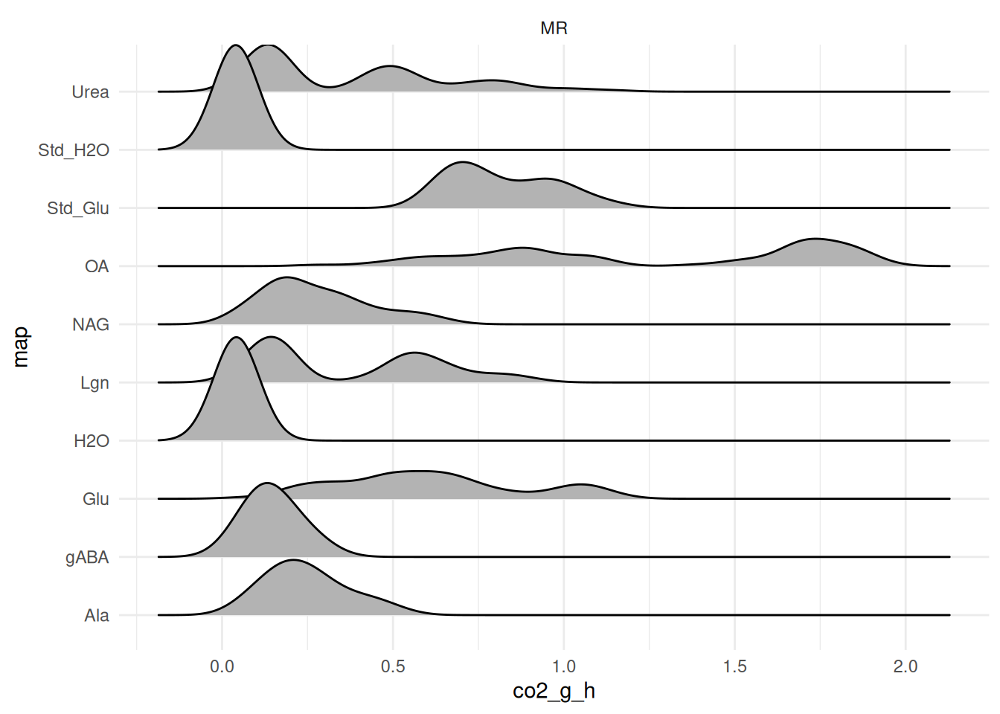

## 4 - Average per plate & substrate / outlier removal

### 4.1 - Compute preliminary average (pre-outlier removal)

MicroResp plates commonly show edge effects — sometimes marginal when
the kit was well sealed, but often visible even to the naked eye along
one or more edges of the plate. This is the same underlying issue
already addressed for columns 1 and 12 in [Remove “empty” and
NAs](#sec-remove-empty), and it applies to rows as well: a preliminary
run of the steps below showed that wells in row A and row H are outliers
on many plates, often a majority of them. Following both this
expectation and the recommendation of our colleagues at FiBL, we
therefore exclude rows A and H from the subset below before computing
the average, rather than treating them case-by-case as ordinary
outliers. If you’d like to check the unfiltered data, simply comment out
the filtering line. We then compute coefficient of variation which will
serve as a threshold to identify potential outliers

``` r

MR_avg_prelim <- MR_co2_g_h |> 
  dplyr::filter_out(row %in% c("A", "H")) |> 
  dplyr::group_by(dataset, plate_id, map) |> 
  dplyr::summarize(
    substrate_avg = mean(co2_g_h),
    std_dev = stats::sd(co2_g_h)
  ) |> 
  dplyr::mutate(coef_var_percent = 100 * std_dev / substrate_avg) |> 
  dplyr::arrange(desc(coef_var_percent))
```

Check out the distribution of the coefficient of variation

``` r

MR_avg_prelim |> ggplot2::ggplot(ggplot2::aes(x = coef_var_percent)) +
  ggplot2::theme_minimal() +
  ggplot2::geom_histogram() 
```

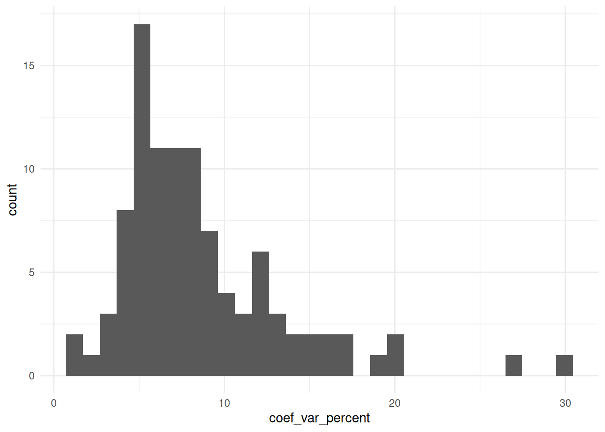

We have higher values than with the N-dosage pipeline, which is expected
with this experiment: there are many sources of noise.

With a large data set, we set a threshold of 10-15%, i.e., data where
the coefficient of variation is under the threshold will not be checked.
Here we have a small data set and for the sake of showing the principle
of outlier removal, we will set a somewhat stricter threshold at 8%

``` r

suspicious_substrates <- MR_avg_prelim |> 
  dplyr::filter(abs(coef_var_percent) > 8) |> 
  dplyr::select(dataset, plate_id, map) |> unique()

suspicious_MR <- MR_co2_g_h |> 
  dplyr::filter_out(row %in% c("A", "H")) |> 
  dplyr::right_join(suspicious_substrates, by = dplyr::join_by(dataset, plate_id, map)) 
```

Now, with a threshold of 8% as max coef of variation, we are left with
only 6 combinations of plate x substrate to look at (instead of 50).

This kind of automated flagging is a trade-off: it saves you from
manually reviewing every single well, but it also means you’re trusting
the threshold to actually catch what matters. When in doubt, err on the
side of a stricter threshold — one that flags more plates than strictly
necessary — rather than a looser one. Reviewing a few extra, ultimately
fine plates costs little; missing a real outlier because the threshold
was too permissive costs much more.

### 4.2 - create QC plots

Create one list of QC plots per dataset.

Notice that we get a list with 1 plot per substrate (but not all because
not all had outliers in this reduced dataset)

``` r

qc_plots <- plot_list_qc_microresp(
  suspicious_MR, 
  map_col = "map",
  panel_col = "run_id")

names(qc_plots)
#>  [1] "Std_Glu" "Std_H2O" "H2O"     "OA"      "Glu"     "Lgn"     "NAG"    
#>  [8] "gABA"    "Ala"     "Urea"
```

For the sake of illustration, we just plot 2 of the plots (one per
dataset per substrate): each facets by run, and only displays data that
is suspicious (coefficient of variation above the threshold defined
above).

Notice that the number of plates differs between the two plots — only
the plates flagged as suspicious for that particular substrate are
shown.

``` r

# qc_plots$Std_Glu
  qc_plots$Std_H2O
#> Picking joint bandwidth of 0.00232
#> Picking joint bandwidth of 0.00258
```

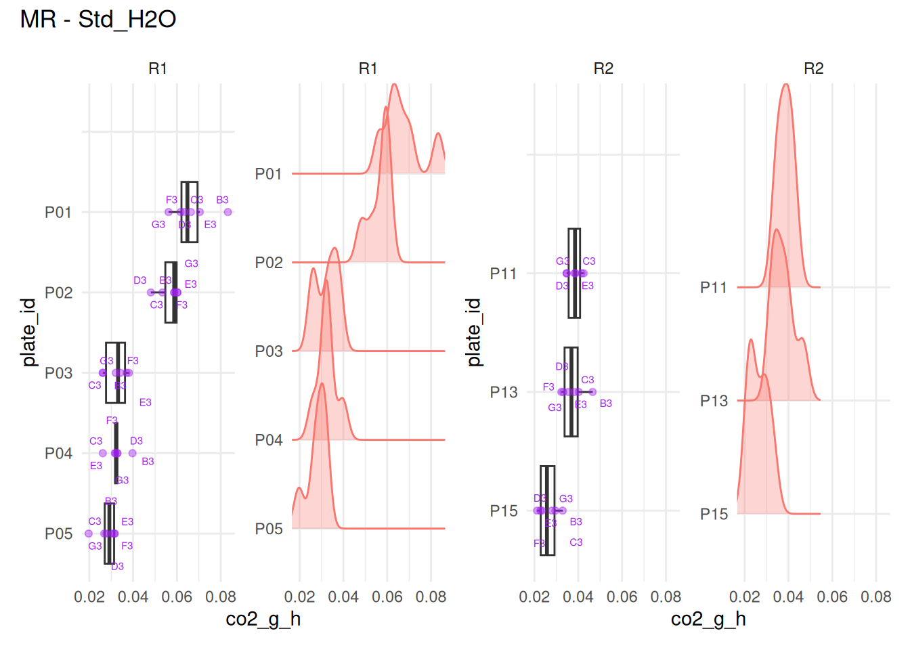

``` r

# qc_plots$H2O
# qc_plots$OA
# qc_plots$Glu
# qc_plots$Lgn
  qc_plots$NAG
#> Picking joint bandwidth of 0.00678
#> Picking joint bandwidth of 0.0159
```

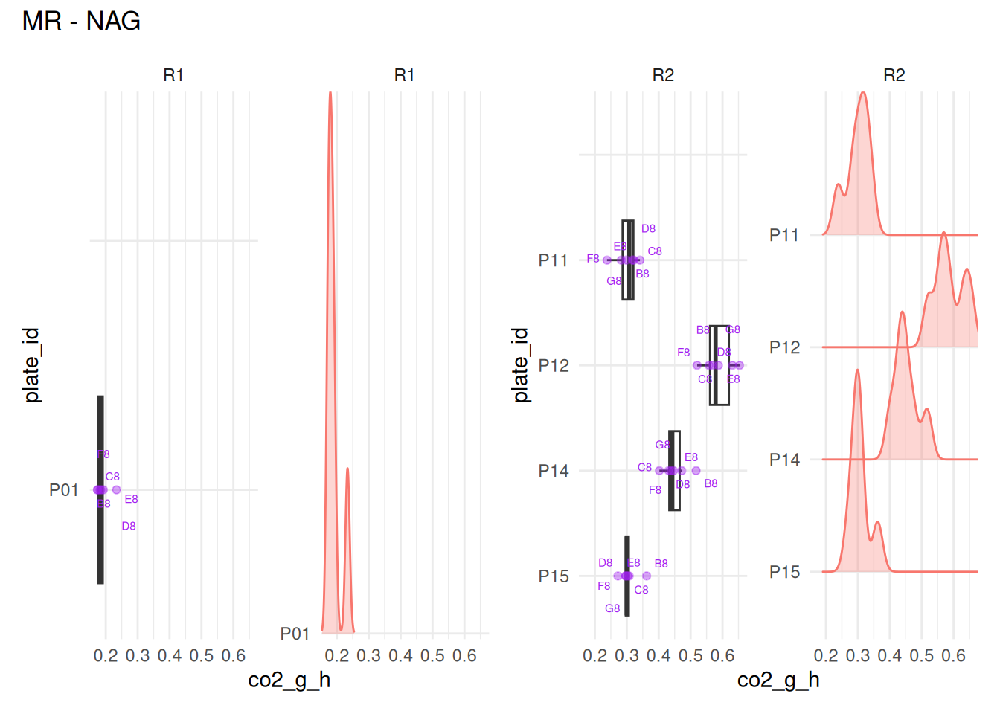

``` r

# qc_plots$gABA
```

- For Std_H2O: we would remove B3 from P01
- For NAG: E8 from P01

For other substrates (not displayed here) - H2O: B4 from P02 and P12, F4
from P13 - OA: B5 from P12 - gABA: F9 from P01 - Urea: F11 from P12 -
Std_Glu, Glu, Lgn, Ala: no wells to remove

To get a general overview, we can plot several substrates together in a
single figure. Each substrate’s plot is itself already a `patchwork`
composition (boxplot + ridgeline) with its own title — nesting one
`patchwork` inside another normally drops that inner title, so we wrap
each one with
[`patchwork::wrap_elements()`](https://patchwork.data-imaginist.com/reference/wrap_elements.html)
first, which “flattens” it into a single element that keeps its title
intact when combined further. In a real dataset, depending on how many
plates are flagged per substrate and per run, this combined view can get
crowded quickly — treat it as a quick overview, and fall back to
inspecting substrates individually, either interactively (as above) or
by saving each plot to disk (see 2 chunks below) when there’s a lot to
look through.

``` r

(patchwork::wrap_elements(full = qc_plots$Std_Glu) +
    patchwork::wrap_elements(full = qc_plots$Std_H2O)) /
  (patchwork::wrap_elements(full = qc_plots$H2O) + 
     patchwork::wrap_elements(full = qc_plots$OA))
#> Picking joint bandwidth of 0.0428
#> Picking joint bandwidth of 0.00232
#> Picking joint bandwidth of 0.00258
#> Picking joint bandwidth of 0.00243
#> Picking joint bandwidth of 0.00215
#> Picking joint bandwidth of 0.0925
#> Picking joint bandwidth of 0.0627
```

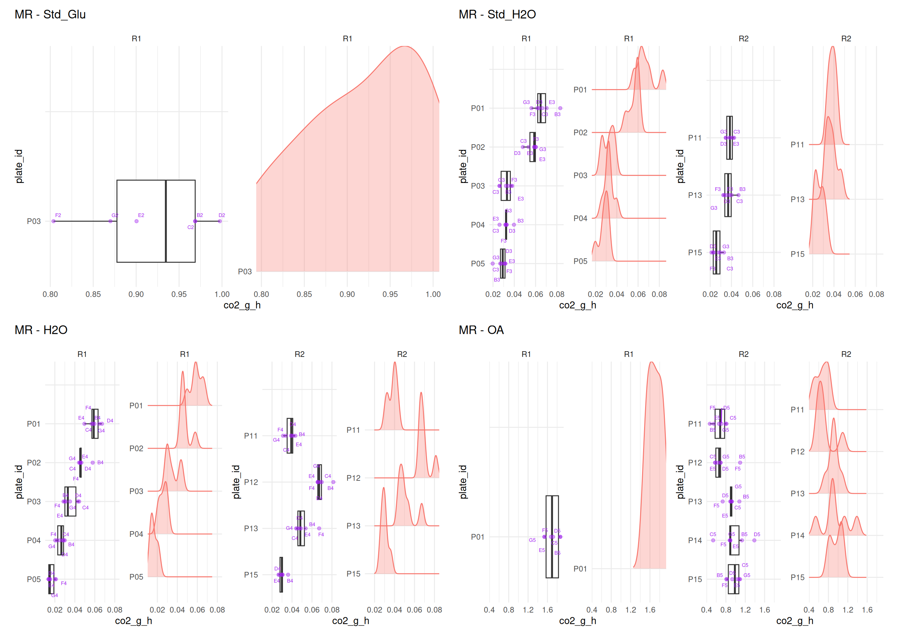

``` r


(patchwork::wrap_elements(full = qc_plots$Glu) +
    patchwork::wrap_elements(full = qc_plots$Lgn)) /
  (patchwork::wrap_elements(full = qc_plots$NAG) +
     patchwork::wrap_elements(full = qc_plots$gABA))
#> Picking joint bandwidth of 0.0235
#> Picking joint bandwidth of 0.0073
#> Picking joint bandwidth of 0.00678
#> Picking joint bandwidth of 0.0159
#> Picking joint bandwidth of 0.00376
#> Picking joint bandwidth of 0.0125
```

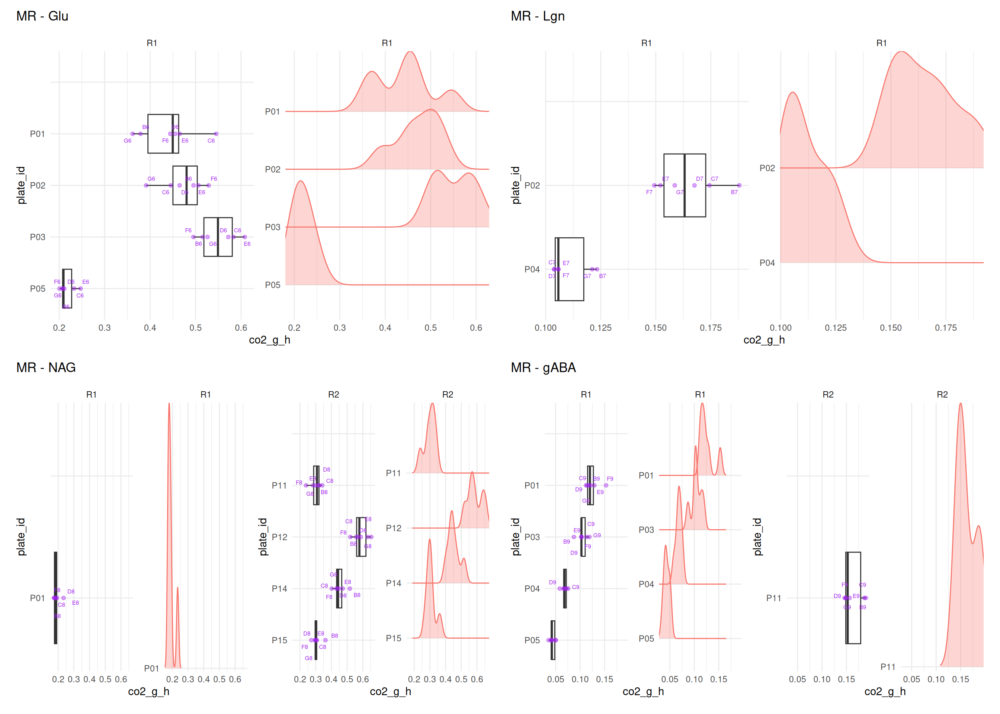

``` r


patchwork::wrap_elements(full = qc_plots$Ala) /
  patchwork::wrap_elements(full = qc_plots$Urea)
#> Picking joint bandwidth of 0.00752
#> Picking joint bandwidth of 0.00329
#> Picking joint bandwidth of 0.0293
```

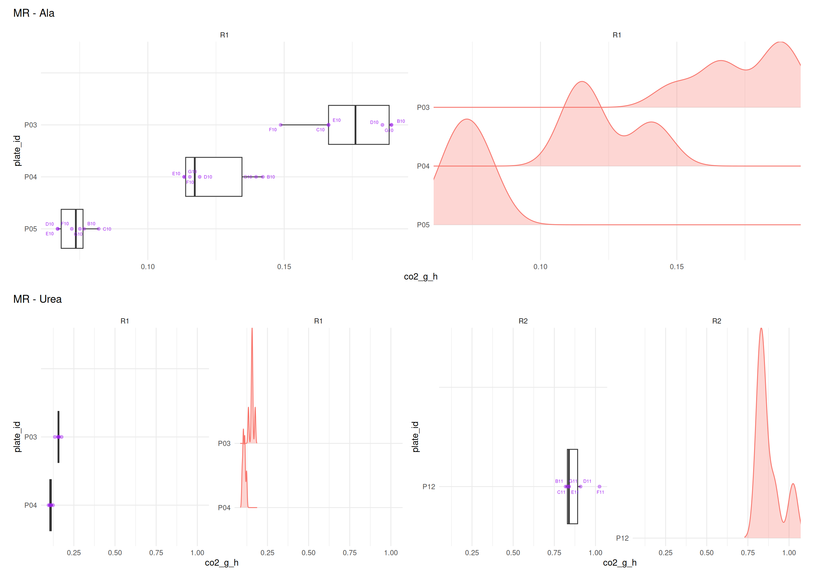

Save QC plots for review outside R (optional), in a loop. Notice that
because plots are named in the list, they can be easily accessed by name
(= substrate), and this can then serve as filenaming for export

``` r

for (i in seq_along(qc_plots)) {
  
  plot <- qc_plots[[i]]
  plot_name <- names(qc_plots)[i]
  
  filepath <- paste0(
      "output/figures/QC/microresp/",
      plot_name, "_", Sys.Date(), ".pdf")
  
  ggplot2::ggsave(
    filename = filepath, 
    plot = plot, width = 18, height = 10)
}
```

### 4.3 - identifying outliers + removal

Then, by visual assessment of the plots one by one, we create a table of
wells to remove, and clean the dataset from obvious outliers

Starting with greenhouse outliers

``` r

to_remove <- tibble::tribble(
  ~ plate_id, ~well_id, 
  # Urea
  "P12", "F11",
  # gABA
  "P01", "F9",   
  # NAG
  "P01", "E8",
  # OA
  "P12", "B5",
  # H2O
  "P02", "B4",    "P12", "B4",    "P13", "F4",
  # Std-H2O
  "P01", "B3",      
) |> 
  dplyr::mutate(dataset = "MR")

to_remove
#> # A tibble: 8 × 3
#>   plate_id well_id dataset
#>   <chr>    <chr>   <chr>  
#> 1 P12      F11     MR     
#> 2 P01      F9      MR     
#> 3 P01      E8      MR     
#> 4 P12      B5      MR     
#> 5 P02      B4      MR     
#> 6 P12      B4      MR     
#> 7 P13      F4      MR     
#> 8 P01      B3      MR
```

In a real dataset with hundreds of plates, this can take a while, and we
recommend a second reading of those plots after “sleeping on it”, and
seeing if we still agree with ourselves, and didn’t make any mistake

Remove those outliers

``` r

MR_wash1 <- MR_co2_g_h |> 
  remove_wells(to_remove) 
```

It is possible to run once more through the quality check before
deciding to move on, and possibly create a “wash2”, “wash3”, etc.
version, though we never needed it so far. But it might become relevant,
for example, in the case of one single really extreme value, that would
“squeeze” the rest of the data for all plates of the same panel in a
plot too tight to discern patterns. In such cases, a removal of the
extreme outlier first, followed by re-plotting, allows the unfolding of
squeezed plots

Store last version in a new variable (easier for edits…)

``` r

MR_outliers_removed <- MR_wash1
```

### 4.4 - Compute sample\*substrate average

Now that outliers are removed, we can compute the average value per
plate per substrate.

Note that we create a new column where we store, for each substrate,
whether the well contained “sample soil” or “standard soil” (this will
be needed for downstream analysis)

``` r

MR_avg <- MR_outliers_removed |> 
  dplyr::group_by(dataset, plate_id, map) |> 
  dplyr::summarize(
    co2_g_h_avg = mean(co2_g_h)) |> 
  # attribute sample soil or std soil
  dplyr::mutate(std_sample = dplyr::case_when(
      map %in% c("Std_H2O", "Std_Glu") ~ "std_soil",
      .default = "sample"
    )) 

# Check it out
MR_avg
```

Plot distribution of values

``` r

distrib_uncorrected <- MR_avg |> 
  ggplot2::ggplot(ggplot2::aes(x = co2_g_h_avg)) +
  ggplot2::theme_minimal() +
  ggplot2::geom_histogram() +
  ggplot2::labs(
    title = "Distribution of per plate per substrate average\nof CO2 emission rate",
    x = "CO2 emission rate [gCO2 / g dry soil / hour]") + 
  ggplot2::facet_wrap(~dataset)

distrib_uncorrected
```

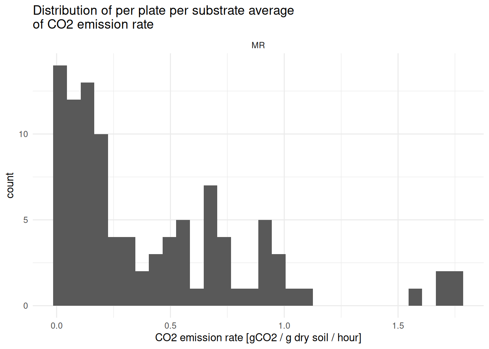

## 5 - Correction of averages - remove basal respiration

([Bongiorno et al. 2020](#ref-bongiorno2020)) write: *Thereafter, we
corrected for the average respiration rate of soil to which the
deionized water was added.*

Although not fully explicit in the paper, we read this as meaning that
the substrate-induced respiration computed so far is the sum of basal
respiration plus the “real,” substrate-specific part — so correcting for
it means subtracting the basal (H2O) respiration from each substrate’s
value.

So, now we correct SIR’s for basal respiration (subtract H2O-resp from
substrate-induced resp)

First, extract basal respiration and keep only H2O rows, so that we
have, separately, the basal respiration of the samples vs the standard
soil

``` r

# Extract basal resp data only
basal_resp <- MR_avg |> 
  dplyr::filter(map %in% c("H2O", "Std_H2O")) |> 
  dplyr::select(dataset, plate_id, std_sample, basal_resp = co2_g_h_avg)

# Check it out
basal_resp
#> # A tibble: 20 × 4
#> # Groups:   dataset, plate_id [10]
#>    dataset plate_id std_sample basal_resp
#>    <chr>   <chr>    <chr>           <dbl>
#>  1 MR      P01      sample         0.0571
#>  2 MR      P01      std_soil       0.0637
#>  3 MR      P02      sample         0.0432
#>  4 MR      P02      std_soil       0.0548
#>  5 MR      P03      sample         0.0343
#>  6 MR      P03      std_soil       0.0314
#>  7 MR      P04      sample         0.0255
#>  8 MR      P04      std_soil       0.0341
#>  9 MR      P05      sample         0.0153
#> 10 MR      P05      std_soil       0.0273
#> 11 MR      P11      sample         0.0394
#> 12 MR      P11      std_soil       0.0374
#> 13 MR      P12      sample         0.0700
#> 14 MR      P12      std_soil       0.0470
#> 15 MR      P13      sample         0.0479
#> 16 MR      P13      std_soil       0.0382
#> 17 MR      P14      sample         0.0524
#> 18 MR      P14      std_soil       0.0399
#> 19 MR      P15      sample         0.0300
#> 20 MR      P15      std_soil       0.0271
```

Now we can join this info to the rest of the data and compute
H2O-corrected data

``` r

H2O_corrected <- MR_avg |> 
  dplyr::left_join(
    basal_resp, 
    by = dplyr::join_by(dataset, plate_id, std_sample)) |> 
  dplyr::mutate(H2O_corrected_resp = dplyr::case_when(
    map %in% c("H2O", "Std_H2O") ~ basal_resp,
    .default = co2_g_h_avg - basal_resp
  ))
```

Check it out

``` r

H2O_corrected
#> # A tibble: 100 × 7
#> # Groups:   dataset, plate_id [10]
#>    dataset plate_id map     co2_g_h_avg std_sample basal_resp H2O_corrected_resp
#>    <chr>   <chr>    <chr>         <dbl> <chr>           <dbl>              <dbl>
#>  1 MR      P01      Ala          0.206  sample         0.0571             0.149 
#>  2 MR      P01      Glu          0.440  sample         0.0571             0.383 
#>  3 MR      P01      H2O          0.0571 sample         0.0571             0.0571
#>  4 MR      P01      Lgn          0.172  sample         0.0571             0.115 
#>  5 MR      P01      NAG          0.184  sample         0.0571             0.127 
#>  6 MR      P01      OA           1.72   sample         0.0571             1.66  
#>  7 MR      P01      Std_Glu      1.06   std_soil       0.0637             0.992 
#>  8 MR      P01      Std_H2O      0.0637 std_soil       0.0637             0.0637
#>  9 MR      P01      Urea         0.150  sample         0.0571             0.0929
#> 10 MR      P01      gABA         0.120  sample         0.0571             0.0625
#> # ℹ 90 more rows
```

In the following sections, we follow computations as in ([Bongiorno et
al. 2020](#ref-bongiorno2020)), i.e.:

- Compute MSIR, MBC, metabolic quotient

- Compute relative contributions of SIR’s (SIR / MSIR), refered to as
  rSIR’s

- Derive from this relative contribution an intermediary value needed
  for Shanon (x\*ln(x)), refered to as sSIR’s

- Compute the Shannon index

Then, we can still discuss some N-based index

## 6 - QC - check standard soils

For this QC check, we use H2O-corrected data for the glucose standard.

``` r

# Extract standard-soil data
std_soil_data <- H2O_corrected |> 
  dplyr::filter(map %in% c("Std_H2O", "Std_Glu")) |> 
  dplyr::rename(substrate = map, SIR = H2O_corrected_resp) |> 
  dplyr::select(dataset, plate_id, substrate, SIR) |>
  # joining MR_outliers_removed based on dataset and plate_id
  # add columns as needed for your study (here: run_id and detection_plate_id)
  dplyr::left_join(
    MR_outliers_removed |> 
      dplyr::select(dataset, plate_id, run_id, detection_plate_id) |> 
      unique(), 
    by = dplyr::join_by(dataset, plate_id))

# plot it
std_soil_data |> 
  ggplot2::ggplot(ggplot2::aes(x = run_id, y = SIR)) +
  ggplot2::theme_minimal() + 
  ggplot2::geom_boxplot() +
  ggplot2::facet_wrap(~substrate, scales = "free")
```

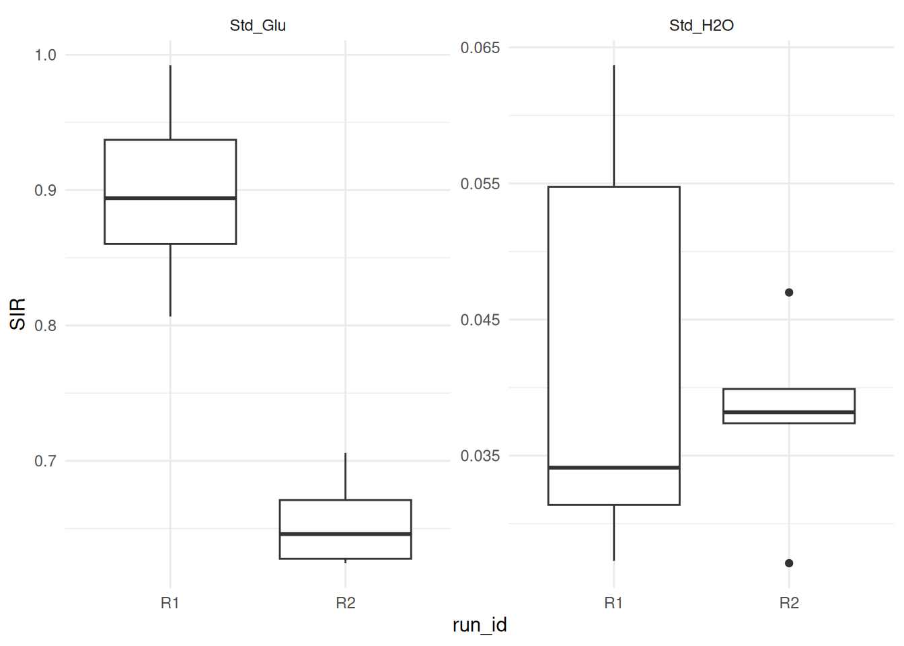

## 7 - Compute indices & final wrangling

### 7.1 - MBC, basal respiration, metabolic quotient and MSIR

Now, we compute the MBC, qCO2 and MSIR. We use H2O-corrected data
throughout, and exclude both the water (basal respiration) and the
standard-soil rows from the MSIR sum, since it should only reflect the
real substrates.

``` r

# Extract Glu's own respiration value per plate (needed for MBC below)
glu_resp <- H2O_corrected |> 
  dplyr::filter(map == "Glu") |> 
  dplyr::select(dataset, plate_id, glu_resp = H2O_corrected_resp)

# Keep only real substrates (exclude basal/H2O and both std soils),
# drop the now-redundant raw co2_g_h_avg, and compute MSIR as a
# grouped sum - no pivot needed
substrate_data <- H2O_corrected |> 
  dplyr::filter_out(map %in% c("H2O", "Std_H2O", "Std_Glu")) |> 
  dplyr::rename(substrate = map, SIR = H2O_corrected_resp) |> 
  dplyr::select(!co2_g_h_avg) |> 
  dplyr::group_by(dataset, plate_id) |> 
  dplyr::mutate(MSIR = sum(SIR)) |> 
  dplyr::ungroup()
```

### 7.2 - Shannon index

We can now join in each plate’s Glu respiration (needed for MBC) and
directly compute relative SIRs (rSIR) and the -x\*ln(x) intermediary
value (sSIR), all while staying in the same long, per-substrate format.

``` r

# Join in basal_resp and glu_resp, then compute MBC, qCO2, rSIR, sSIR -
# all still in long format
rSIRs <- substrate_data |> 
  dplyr::left_join(
    glu_resp, by = dplyr::join_by(dataset, plate_id)) |> 
  dplyr::mutate(
    MBC = (glu_resp * 40.04) + 0.37, # not sure where those numbers come from!
    qCO2 = basal_resp * 1000 / MBC, # same here
    rSIR = SIR / MSIR,
    sSIR = -rSIR * log(rSIR)
  )
```

Still, check out the output

``` r

rSIRs
#> # A tibble: 70 × 12
#>    dataset plate_id substrate std_sample basal_resp    SIR  MSIR glu_resp   MBC
#>    <chr>   <chr>    <chr>     <chr>           <dbl>  <dbl> <dbl>    <dbl> <dbl>
#>  1 MR      P01      Ala       sample         0.0571 0.149   2.59    0.383  15.7
#>  2 MR      P01      Glu       sample         0.0571 0.383   2.59    0.383  15.7
#>  3 MR      P01      Lgn       sample         0.0571 0.115   2.59    0.383  15.7
#>  4 MR      P01      NAG       sample         0.0571 0.127   2.59    0.383  15.7
#>  5 MR      P01      OA        sample         0.0571 1.66    2.59    0.383  15.7
#>  6 MR      P01      Urea      sample         0.0571 0.0929  2.59    0.383  15.7
#>  7 MR      P01      gABA      sample         0.0571 0.0625  2.59    0.383  15.7
#>  8 MR      P02      Ala       sample         0.0432 0.143   2.71    0.432  17.7
#>  9 MR      P02      Glu       sample         0.0432 0.432   2.71    0.432  17.7
#> 10 MR      P02      Lgn       sample         0.0432 0.126   2.71    0.432  17.7
#> # ℹ 60 more rows
#> # ℹ 3 more variables: qCO2 <dbl>, rSIR <dbl>, sSIR <dbl>
```

Now, we sum sSIRs within each plate to get the Shannon index.

``` r

shannon <- rSIRs |> 
  dplyr::group_by(dataset, plate_id) |> 
  dplyr::summarize(
    shannon = sum(sSIR),
    # basal_resp, MBC, qCO2, MSIR are already constant within each plate
    # (computed once per plate, repeated across its substrate rows), so
    # taking the first row's value is equivalent to taking "the" value
    basal_resp = dplyr::first(basal_resp),
    MBC = dplyr::first(MBC),
    qCO2 = dplyr::first(qCO2),
    MSIR = dplyr::first(MSIR),
    .groups = "drop"
  )

# Check it out
shannon
#> # A tibble: 10 × 7
#>    dataset plate_id shannon basal_resp   MBC  qCO2  MSIR
#>    <chr>   <chr>      <dbl>      <dbl> <dbl> <dbl> <dbl>
#>  1 MR      P01        1.23      0.0571 15.7   3.63  2.59
#>  2 MR      P02        1.28      0.0432 17.7   2.44  2.71
#>  3 MR      P03        1.29      0.0343 21.0   1.63  2.87
#>  4 MR      P04        1.10      0.0255 13.1   1.95  2.46
#>  5 MR      P05        0.885     0.0153  7.60  2.01  2.03
#>  6 MR      P11        1.84      0.0394 22.9   1.72  2.73
#>  7 MR      P12        1.86      0.0700 40.8   1.72  4.31
#>  8 MR      P13        1.81      0.0479 28.5   1.68  3.26
#>  9 MR      P14        1.83      0.0524 37.6   1.39  4.00
#> 10 MR      P15        1.78      0.0300 25.3   1.18  3.08
```

Gather all data (except std soil data)

``` r

MR_indices <- MR_outliers_removed |> 
  # update this selection to what makes sense in your study
  dplyr::select(dataset, plate_id, run_id:sample_name) |> 
  unique() |> 
  dplyr::left_join(shannon, by = dplyr::join_by(dataset, plate_id)) |> 
  dplyr::relocate(plate_id, sample_id, soil, basal_resp, MBC, qCO2, MSIR, shannon)
```

Check it out

``` r

MR_indices 
#> # A tibble: 10 × 21
#>    plate_id sample_id soil  basal_resp   MBC  qCO2  MSIR shannon dataset run_id
#>    <chr>    <chr>     <chr>      <dbl> <dbl> <dbl> <dbl>   <dbl> <chr>   <chr> 
#>  1 P01      t2_102_z1 Auto      0.0571 15.7   3.63  2.59   1.23  MR      R1    
#>  2 P02      t2_103_z3 Auto      0.0432 17.7   2.44  2.71   1.28  MR      R1    
#>  3 P03      t2_86_z2  ABC       0.0343 21.0   1.63  2.87   1.29  MR      R1    
#>  4 P04      t2_101_z3 Auto      0.0255 13.1   1.95  2.46   1.10  MR      R1    
#>  5 P05      t2_84_z1  ABC       0.0153  7.60  2.01  2.03   0.885 MR      R1    
#>  6 P11      t2_92_z2  Ref       0.0394 22.9   1.72  2.73   1.84  MR      R2    
#>  7 P12      t2_82_z2  ABC       0.0700 40.8   1.72  4.31   1.86  MR      R2    
#>  8 P13      t2_94_z3  Ref       0.0479 28.5   1.68  3.26   1.81  MR      R2    
#>  9 P14      t2_87_z2  ABC       0.0524 37.6   1.39  4.00   1.83  MR      R2    
#> 10 P15      t2_91_z3  Ref       0.0300 25.3   1.18  3.08   1.78  MR      R2    
#> # ℹ 11 more variables: lab_id <chr>, detection_plate_id <chr>, expe <chr>,
#> #   cra_trial <chr>, sd_c <chr>, crop_diversity <chr>, bloc <chr>,
#> #   sampling_time <chr>, zone <chr>, date <chr>, sample_name <chr>
```

This is per-plate aggregated data, meaning that we lost the
per-substrate data, including raw `co2_g_h` and its corrected version
`SIR`, as well as relative SIR (`rSIR`) and precomputed `sSIR`, which
are stored in `rSIRs` (just in case). Standard-soil data is set aside
too — it’s rebuilt directly from `H2O_corrected` in [QC - check standard
soils](#sec-qc-std-soils).

``` r

rSIRs
#> # A tibble: 70 × 12
#>    dataset plate_id substrate std_sample basal_resp    SIR  MSIR glu_resp   MBC
#>    <chr>   <chr>    <chr>     <chr>           <dbl>  <dbl> <dbl>    <dbl> <dbl>
#>  1 MR      P01      Ala       sample         0.0571 0.149   2.59    0.383  15.7
#>  2 MR      P01      Glu       sample         0.0571 0.383   2.59    0.383  15.7
#>  3 MR      P01      Lgn       sample         0.0571 0.115   2.59    0.383  15.7
#>  4 MR      P01      NAG       sample         0.0571 0.127   2.59    0.383  15.7
#>  5 MR      P01      OA        sample         0.0571 1.66    2.59    0.383  15.7
#>  6 MR      P01      Urea      sample         0.0571 0.0929  2.59    0.383  15.7
#>  7 MR      P01      gABA      sample         0.0571 0.0625  2.59    0.383  15.7
#>  8 MR      P02      Ala       sample         0.0432 0.143   2.71    0.432  17.7
#>  9 MR      P02      Glu       sample         0.0432 0.432   2.71    0.432  17.7
#> 10 MR      P02      Lgn       sample         0.0432 0.126   2.71    0.432  17.7
#> # ℹ 60 more rows
#> # ℹ 3 more variables: qCO2 <dbl>, rSIR <dbl>, sSIR <dbl>
```

### 7.3 - Last data wrangling

For our Field experiment, some modalities are to be removed: Bloc 1 is
not a real bloc, and the faba bean did not take in the Ref treatment, so
we removed it from MR data. Not relevant to write it out here though
(didn’t make it into plates 1 to 5), but nice to mention that some more
post analysis might be relevant

Plot the indices

``` r

MR_indices |> 
  ggplot2::ggplot(ggplot2::aes(x = soil, y = basal_resp)) + 
  ggplot2::theme_minimal() +
  ggplot2::geom_boxplot(ggplot2::aes(fill = run_id)) 
```

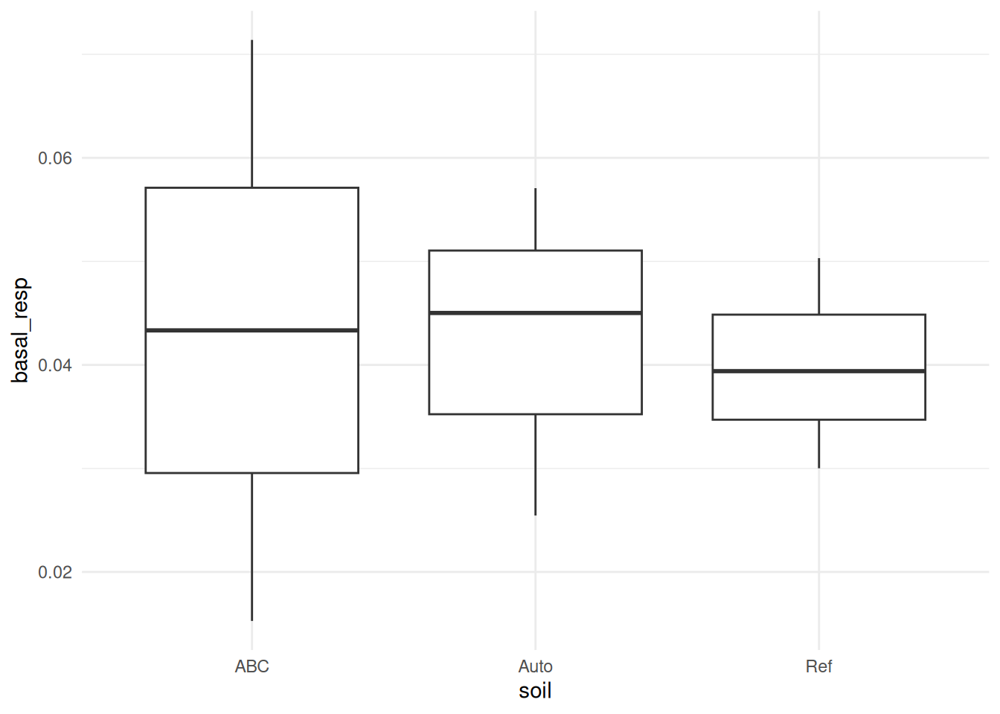

## 8 - Next steps

Can be exported with `MR_indices |> write_rds("path/to/the/file.rds")`
or as a csv with `MR_indices |> write_csv("path/to/the/file.csv")`

Now would come: plotting, modelling, etc. –\> “usual data analysis”

Bongiorno, Giulia, Else K. Bünemann, Lijbert Brussaard, Paul Mäder,
Chidinma U. Oguejiofor, and Ron G. M. de Goede. 2020. “Soil Management
Intensity Shifts Microbial Catabolic Profiles Across a Range of European
Long-Term Field Experiments.” *Applied Soil Ecology* 154: 103596.
<https://doi.org/10.1016/j.apsoil.2020.103596>.

Wickham, Hadley, Mara Averick, Jennifer Bryan, et al. 2019. “Welcome to
the tidyverse.” *Journal of Open Source Software* 4 (43): 1686.
<https://doi.org/10.21105/joss.01686>.

[^1]: In the MicroResp experiment, one plate was attributed to each
    sample (with dedicated columns for comparison with the standard
    soil), so that “per-plate” really means “per-sample”
