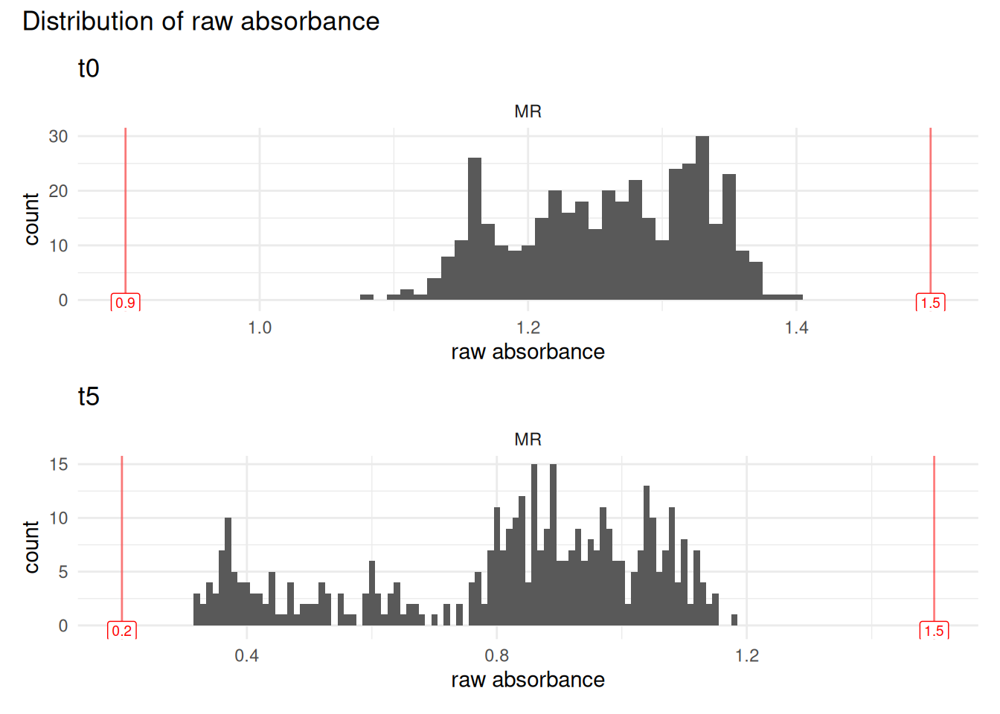
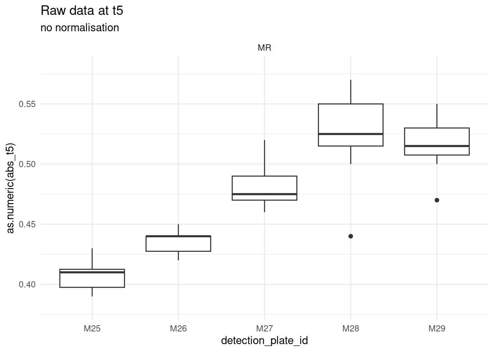
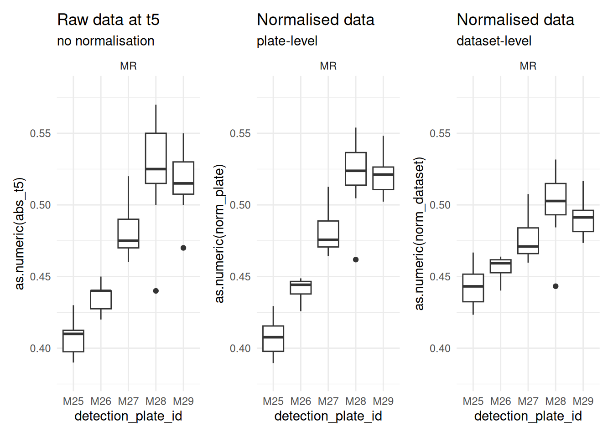
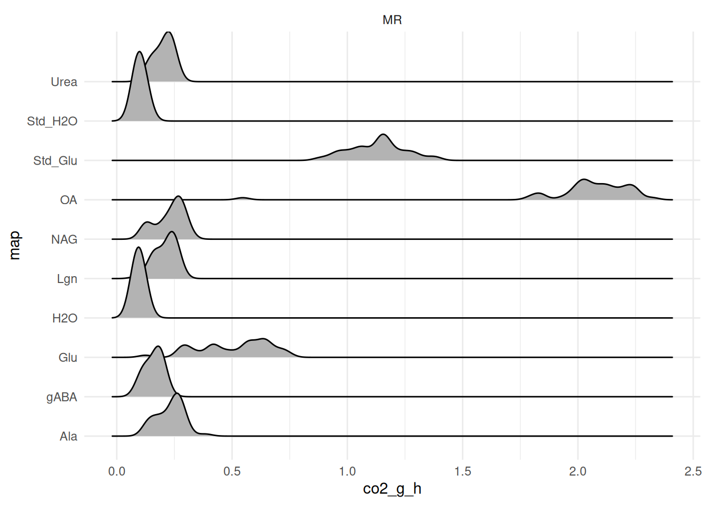
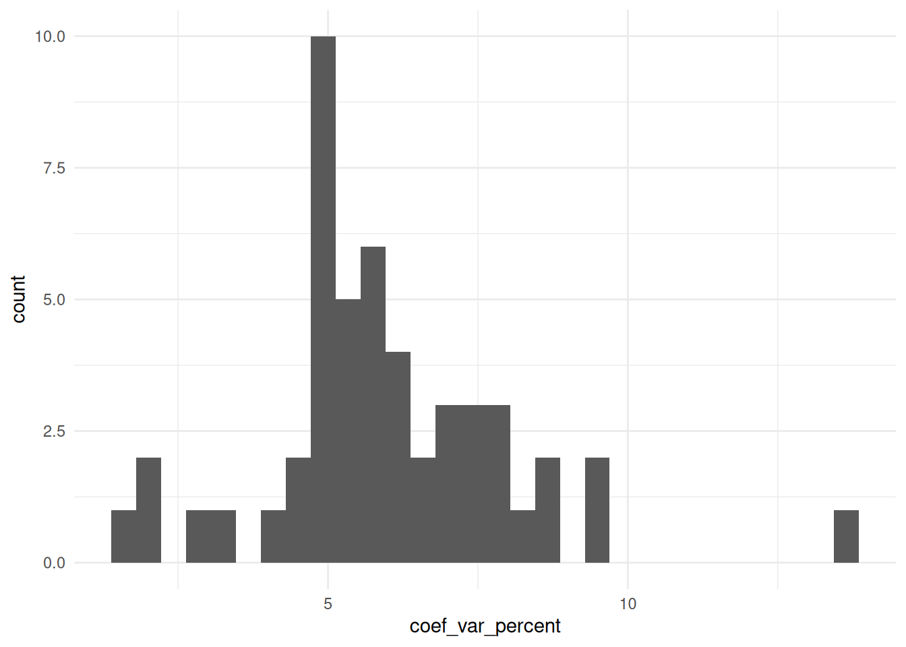

# microresp

``` r

library(plate2N)
library(patchwork)
library(ggridges)
```

## TO DO

- Add index computations at the end of the pipeline (not yet written)
- Explain the choice of absorbance thresholds used in the QC step
  (Section 4.1)
- Double-check the µg CO2-C conversion formula (Section 5.3) against the
  MicroResp manual — currently taken from an Excel document

## 1 - Introduction

This vignette walks through the full analysis pipeline for a MicroResp
experiment, from raw plate import to substrate-level CO2 respiration
values. It follows the same overall logic as the main N-dosage pipeline
(`import-tidy`, `blank-correction`, `abs-to-conc`), but MicroResp
experiments differ enough — more data layers per plate, no standard
curve, and a different final unit (a respiration rate rather than a
concentration) — that they’re covered here as their own self-contained
walkthrough rather than split across the main vignettes.

We start, as in `import-tidy`, with importing and tidying data recorded
with more than 2 layers per plate (see the tip on multiple data layers
there) — then move on to the MicroResp-specific steps: joining sample
metadata, quality-checking and cleaning raw absorbance, normalizing
across plates, converting to %CO2 and then to a respiration rate, and
finally checking for and removing per-sample outliers.

Here, we quickly go through the import pipeline with an example of data
from a
[MicroResp](https://www.hutton.ac.uk/scientific-services/analytical/analytical-services/microresp/)
experiment. To understand what this means: here plates are incubated for
5h. An absorbance reading is done at t = 0h (`t0`) and t = 5h (`t5`).
There is also mapping data, containing the info on which substrate has
been added in which well. Substrates are, in this experiment: glucose
(Glu), water (H2O), oxalic acid (OA), lignin (Lgn), N-acetylglucosamine
(NAG), gamma-acetylbutyric acid (gABA), alanine (Ala) and urea (Urea).

So, the 3 layers of data are referred to as `abs_t0`, `abs_t5`, and
`map`.

> **More layers of data are possible**
>
> In theory, any number of data layers are possible, you just need to
> extend the logic displayed here, with additional elements to some
> arguments that are vectors (e.g.,
> `abs_map = c("abs_t0", "abs_t5", "map")` and others that are lists of
> all data sets (one per layer).

## 2 - Import and tidy with 2+ layers

### 2.1 - Importing 2 layers of absorbance data

``` r

# Get path to absorbance data, t0 and t5
MR_t0_csv <- system.file("extdata", "MR_abs_t0.csv", package = "plate2N")
MR_t5_csv <- system.file("extdata", "MR_abs_t5.csv", package = "plate2N")

# import from csv file type
MR_abs_t0 <- csv_to_tibble(MR_t0_csv)
MR_abs_t5 <- csv_to_tibble(MR_t5_csv)

# Check them out
MR_abs_t0; MR_abs_t5
#> # A tibble: 45 × 13
#>    row      X1    X2    X3    X4    X5    X6    X7    X8    X9   X10   X11   X12
#>    <chr> <dbl> <dbl> <dbl> <dbl> <dbl> <dbl> <dbl> <dbl> <dbl> <dbl> <dbl> <dbl>
#>  1 P01    1     2     3     4     5     6     7     8     9    10    11    12   
#>  2 A      0.93  1.15  1.14  1.14  1.15  1.16  1.16  1.17  1.17  1.12  1.14  1.17
#>  3 B      1.15  1.16  1.13  1.16  1.16  1.16  1.17  1.16  1.14  1.16  1.16  1.15
#>  4 C      1.16  1.15  1.14  1.17  1.15  1.16  1.19  1.19  1.17  1.17  1.18  1.17
#>  5 D      1.17  1.16  1.16  1.16  1.16  1.16  1.18  1.17  1.14  1.18  1.17  1.17
#>  6 E      1.19  1.16  1.16  1.18  1.17  1.15  1.19  1.1   1.11  1.17  1.16  1.16
#>  7 F      1.16  1.17  1.17  1.18  1.19  1.15  1.19  1.13  1.13  1.16  1.14  1.18
#>  8 G      1.17  1.15  1.16  1.13  1.19  1.16  1.2   1.08  1.15  1.16  1.15  1.16
#>  9 H      1.17  1.16  1.17  1.16  1.19  1.16  1.2   1.11  1.15  1.15  1.16  1.18
#> 10 P02    1     2     3     4     5     6     7     8     9    10    11    12   
#> # ℹ 35 more rows
#> # A tibble: 45 × 13
#>    row      X1    X2    X3    X4    X5    X6    X7    X8    X9   X10   X11   X12
#>    <chr> <dbl> <dbl> <dbl> <dbl> <dbl> <dbl> <dbl> <dbl> <dbl> <dbl> <dbl> <dbl>
#>  1 P01    1     2     3     4     5     6     7     8     9    10    11    12   
#>  2 A      0.67  0.39  0.89  0.91  0.32  0.6   0.77  0.81  0.86  0.67  0.79  0.98
#>  3 B      0.9   0.4   0.86  0.92  0.32  0.64  0.81  0.79  0.83  0.77  0.82  0.94
#>  4 C      0.92  0.42  0.89  0.93  0.33  0.56  0.81  0.8   0.86  0.78  0.84  0.95
#>  5 D      0.92  0.39  0.91  0.91  0.32  0.6   0.81  0.79  0.84  0.81  0.84  0.95
#>  6 E      0.94  0.41  0.9   0.95  0.34  0.59  0.8   0.7   0.8   0.79  0.81  0.95
#>  7 F      0.92  0.41  0.92  0.94  0.36  0.6   0.82  0.77  0.79  0.78  0.8   0.96
#>  8 G      0.93  0.41  0.92  0.89  0.36  0.65  0.83  0.72  0.84  0.76  0.8   0.94
#>  9 H      0.93  0.43  0.92  0.94  0.34  0.62  0.83  0.72  0.83  0.74  0.8   0.96
#> 10 P02    1     2     3     4     5     6     7     8     9    10    11    12   
#> # ℹ 35 more rows
```

### 2.2 - Being creative with importing mappings

In a classical MicroResp experiment, a whole 96-well plate is dedicated
to a single sample, though this may vary between experimental design. In
this particular case, the mapping did not relate to samples, but to
substrates added. And because the template of substrate addition was
strictly the same for each plate, with a complete column attributed per
substrate, there is a much simpler way to import the mapping data than
creating a plate layout csv and importing it. This holds particularly
true for an experiment with a large number of plates (we had hundreds).
So feel free to be creative in generating layers of data, as best fits
your needs.

Plate mapping is strictly the same for each plate throughout the
experiment, so we propose to take advantage of the function
[`plate2N::map_plates()`](https://mdetoeuf.github.io/plate2N/reference/map_plates.md)
(see also the `prepare-plates`
[vignette](https://mdetoeuf.github.io/plate2N/articles/prepare_plates.html))
to create this mapping data in R.

First, create a vector with the names of the substrates (in the order of
the plate map)

``` r

# vector of substrates
MR_columns <- c(
  "Std_Glu", "Std_H2O", 
  "H2O", "OA", "Glu", "Lgn", "NAG", "gABA", "Ala", "Urea")
```

Then, compute the number of plates required (here, 5 plates) by counting
how many cells in the first column of `MR_abs_t0` do not correspond to
one of the 26 `LETTERS` (= number of plate ids).

``` r

# nb of plates
(nb_plates <- MR_abs_t0 |> 
  dplyr::filter(!(row %in% LETTERS)) |> 
  nrow())
#> [1] 5
```

Finally, run the mapping function with

- plate_id that pastes “P” with numbers from 01 to the nb of plates

- “sample list” = repetition of the vector of substrates x the nb of
  plates

- no std curves or blank (not needed in MicroResp experiments), and 2
  empty columns (1 and 12, typically disregarded in those experiments
  due to large edge effects)

- 8 wells per “sample” (in this case: not samples but substrates)

``` r

# compute the mapping
MR_map <- map_plates(
  plate_ids = paste0("P", sprintf("%02d", seq(01:nb_plates))), 
  samples = rep(MR_columns, nb_plates),
  n_samples_per_plate = 10,
  column_curves = c(), column_blank = c(), column_empty = c(1,12),
  n_wells_samples = 8)

# Check it out
MR_map
#> # A tibble: 45 × 13
#>    row   X1    X2    X3    X4    X5    X6    X7    X8    X9    X10   X11   X12  
#>    <chr> <chr> <chr> <chr> <chr> <chr> <chr> <chr> <chr> <chr> <chr> <chr> <chr>
#>  1 P01   1     2     3     4     5     6     7     8     9     10    11    12   
#>  2 A     empty Std_… Std_… H2O   OA    Glu   Lgn   NAG   gABA  Ala   Urea  empty
#>  3 B     empty Std_… Std_… H2O   OA    Glu   Lgn   NAG   gABA  Ala   Urea  empty
#>  4 C     empty Std_… Std_… H2O   OA    Glu   Lgn   NAG   gABA  Ala   Urea  empty
#>  5 D     empty Std_… Std_… H2O   OA    Glu   Lgn   NAG   gABA  Ala   Urea  empty
#>  6 E     empty Std_… Std_… H2O   OA    Glu   Lgn   NAG   gABA  Ala   Urea  empty
#>  7 F     empty Std_… Std_… H2O   OA    Glu   Lgn   NAG   gABA  Ala   Urea  empty
#>  8 G     empty Std_… Std_… H2O   OA    Glu   Lgn   NAG   gABA  Ala   Urea  empty
#>  9 H     empty Std_… Std_… H2O   OA    Glu   Lgn   NAG   gABA  Ala   Urea  empty
#> 10 P02   1     2     3     4     5     6     7     8     9     10    11    12   
#> # ℹ 35 more rows
```

Such creative methods are particularly time-saving with large datasets.
Here, we have only 5 plates \<=\> 45 rows in our tibble. But in a
100-plate dataset, this would correspond to 900 rows, quite
time-consuming to encode by hand.

### 2.3 - Verticalize and join all 3 layers

Notice the use of a 3-element (rather than 2-element) list and a
3-element vector for the arguments `tibble_list` and `abs_map`,
respectively. The logic stays the same as with 2 layers though.

``` r

# verticalize and join the 3 layers
MR_joined <- join_abs_map(
  tibble_list = list( MR_abs_t0, MR_abs_t5, MR_map), 
  abs_map = c("abs_t0-", "abs_t5-", "map-"), 
  coerce_numeric = FALSE, 
  dataset = "MR-" )

# Check it out
MR_joined
#> # A tibble: 96 × 17
#>    row   column `MR-abs_t0-P01` `MR-abs_t0-P02` `MR-abs_t0-P03` `MR-abs_t0-P04`
#>    <chr> <chr>  <chr>           <chr>           <chr>           <chr>          
#>  1 A     1      0.93            1.23            1.27            1.32           
#>  2 A     2      1.15            1.23            1.26            1.25           
#>  3 A     3      1.14            1.22            1.25            1.22           
#>  4 A     4      1.14            1.22            1.26            1.3            
#>  5 A     5      1.15            1.22            1.24            1.28           
#>  6 A     6      1.16            1.21            1.23            1.26           
#>  7 A     7      1.16            1.23            1.23            1.27           
#>  8 A     8      1.17            1.2             1.24            1.24           
#>  9 A     9      1.17            1.21            1.25            1.28           
#> 10 A     10     1.12            1.21            1.25            1.24           
#> # ℹ 86 more rows
#> # ℹ 11 more variables: `MR-abs_t0-P05` <chr>, `MR-abs_t5-P01` <chr>,
#> #   `MR-abs_t5-P02` <chr>, `MR-abs_t5-P03` <chr>, `MR-abs_t5-P04` <chr>,
#> #   `MR-abs_t5-P05` <chr>, `MR-map-P01` <chr>, `MR-map-P02` <chr>,
#> #   `MR-map-P03` <chr>, `MR-map-P04` <chr>, `MR-map-P05` <chr>
```

Notice the names of the columns, that now received 3 options for the
layer prefix: `abs_t0-`, `abs_t5-` and `map-`.

``` r

# Check out column names
names(MR_joined)
#>  [1] "row"           "column"        "MR-abs_t0-P01" "MR-abs_t0-P02"
#>  [5] "MR-abs_t0-P03" "MR-abs_t0-P04" "MR-abs_t0-P05" "MR-abs_t5-P01"
#>  [9] "MR-abs_t5-P02" "MR-abs_t5-P03" "MR-abs_t5-P04" "MR-abs_t5-P05"
#> [13] "MR-map-P01"    "MR-map-P02"    "MR-map-P03"    "MR-map-P04"   
#> [17] "MR-map-P05"
```

### 2.4 - Tidy the data, 3 columns for 3 layers

Tidy the table to reach 1 row per unique well (96 x nb of physical
plates), and 3 important columns: `abs_t0`, `abs_t5`, `map`. The syntax
for this step is strictly the same as with 2 layers, but we now have to
specify the argument `column_def`\` as its default value, containing
only `c("abs-", "map-")` would no longer work.

``` r

# From vertical to tidy format with 3 layers
MR_tidy <- vertical_to_tidy(
  MR_joined, 
  column_def = c("abs_t0", "abs_t5", "map"))

# Check it out
MR_tidy
#> # A tibble: 480 × 9
#>    row   column well_id unique_well_id dataset plate_id abs_t0 abs_t5 map    
#>    <chr> <chr>  <chr>   <chr>          <chr>   <chr>    <chr>  <chr>  <chr>  
#>  1 A     1      A1      A1_P01         MR      P01      0.93   0.67   empty  
#>  2 A     1      A1      A1_P02         MR      P02      1.23   1      empty  
#>  3 A     1      A1      A1_P03         MR      P03      1.27   1.04   empty  
#>  4 A     1      A1      A1_P04         MR      P04      1.32   1.09   empty  
#>  5 A     1      A1      A1_P05         MR      P05      1.32   1.13   empty  
#>  6 A     2      A2      A2_P01         MR      P01      1.15   0.39   Std_Glu
#>  7 A     2      A2      A2_P02         MR      P02      1.23   0.43   Std_Glu
#>  8 A     2      A2      A2_P03         MR      P03      1.26   0.47   Std_Glu
#>  9 A     2      A2      A2_P04         MR      P04      1.25   0.44   Std_Glu
#> 10 A     2      A2      A2_P05         MR      P05      1.25   0.47   Std_Glu
#> # ℹ 470 more rows

# If you like to reorder columns to have mapping first, then absorbance
MR_tidy |> dplyr::relocate(map, .before = abs_t0)
#> # A tibble: 480 × 9
#>    row   column well_id unique_well_id dataset plate_id map     abs_t0 abs_t5
#>    <chr> <chr>  <chr>   <chr>          <chr>   <chr>    <chr>   <chr>  <chr> 
#>  1 A     1      A1      A1_P01         MR      P01      empty   0.93   0.67  
#>  2 A     1      A1      A1_P02         MR      P02      empty   1.23   1     
#>  3 A     1      A1      A1_P03         MR      P03      empty   1.27   1.04  
#>  4 A     1      A1      A1_P04         MR      P04      empty   1.32   1.09  
#>  5 A     1      A1      A1_P05         MR      P05      empty   1.32   1.13  
#>  6 A     2      A2      A2_P01         MR      P01      Std_Glu 1.15   0.39  
#>  7 A     2      A2      A2_P02         MR      P02      Std_Glu 1.23   0.43  
#>  8 A     2      A2      A2_P03         MR      P03      Std_Glu 1.26   0.47  
#>  9 A     2      A2      A2_P04         MR      P04      Std_Glu 1.25   0.44  
#> 10 A     2      A2      A2_P05         MR      P05      Std_Glu 1.25   0.47  
#> # ℹ 470 more rows
```

> **Work in progress from here on**
>
> Everything from Section 3 onward is functional, but still being
> refined — expect rough edges, and expect this section to keep growing
> (an index-computation step is still to be added at the end).

## 3 - Join metadata to plate data

``` r

# Get path to metadata
metadata_csv <- system.file("extdata", "MR_metadata.csv", package = "plate2N")

# import it
(MR_metadata <- readr::read_csv(metadata_csv, show_col_types = FALSE))
#> # A tibble: 5 × 20
#>   plate_nb run_id sample_id plate_id lab_id detection_plate_id expe  cra_trial
#>   <chr>    <chr>  <chr>     <chr>    <chr>  <chr>              <chr> <chr>    
#> 1 P01      R1     t2_102_z1 P01      MdT    M25                Field SyCBio   
#> 2 P02      R1     t2_103_z3 P02      MdT    M26                Field SyCBio   
#> 3 P03      R1     t2_86_z2  P03      MdT    M27                Field SyCBio   
#> 4 P04      R1     t2_101_z3 P04      MdT    M28                Field SyCBio   
#> 5 P05      R1     t2_84_z1  P05      MdT    M29                Field SyCBio   
#> # ℹ 12 more variables: sd_c <chr>, soil <chr>, crop_diversity <chr>,
#> #   bloc <chr>, sampling_time <chr>, zone <chr>, date <chr>, sample_name <chr>,
#> #   soil_dm_content_percent <dbl>, soil_well_g <dbl>,
#> #   std_soil_dm_content_percent <dbl>, std_soil_well_g <dbl>
```

Notice the absence of column called `std_conc`. For the MicroResp
experiment, there is no standard curve. However, there is other
per-sample data that we will need, namely weight of soil added to each
deep-well, and soil water content.

Now we can join it to the plate data

``` r

(MR <- MR_tidy |> dplyr::left_join(MR_metadata, by = dplyr::join_by(plate_id)))
#> # A tibble: 480 × 28
#>    row   column well_id unique_well_id dataset plate_id abs_t0 abs_t5 map    
#>    <chr> <chr>  <chr>   <chr>          <chr>   <chr>    <chr>  <chr>  <chr>  
#>  1 A     1      A1      A1_P01         MR      P01      0.93   0.67   empty  
#>  2 A     1      A1      A1_P02         MR      P02      1.23   1      empty  
#>  3 A     1      A1      A1_P03         MR      P03      1.27   1.04   empty  
#>  4 A     1      A1      A1_P04         MR      P04      1.32   1.09   empty  
#>  5 A     1      A1      A1_P05         MR      P05      1.32   1.13   empty  
#>  6 A     2      A2      A2_P01         MR      P01      1.15   0.39   Std_Glu
#>  7 A     2      A2      A2_P02         MR      P02      1.23   0.43   Std_Glu
#>  8 A     2      A2      A2_P03         MR      P03      1.26   0.47   Std_Glu
#>  9 A     2      A2      A2_P04         MR      P04      1.25   0.44   Std_Glu
#> 10 A     2      A2      A2_P05         MR      P05      1.25   0.47   Std_Glu
#> # ℹ 470 more rows
#> # ℹ 19 more variables: plate_nb <chr>, run_id <chr>, sample_id <chr>,
#> #   lab_id <chr>, detection_plate_id <chr>, expe <chr>, cra_trial <chr>,
#> #   sd_c <chr>, soil <chr>, crop_diversity <chr>, bloc <chr>,
#> #   sampling_time <chr>, zone <chr>, date <chr>, sample_name <chr>,
#> #   soil_dm_content_percent <dbl>, soil_well_g <dbl>,
#> #   std_soil_dm_content_percent <dbl>, std_soil_well_g <dbl>
```

## 4 - Cleaning the data

### 4.1 - QC - suspicious wells

[`plate2N::qc_raw_abs()`](https://mdetoeuf.github.io/plate2N/reference/qc_raw_abs.md)
checks whether absorbance data is within a user-defined range or not.
Check the documentation on this function for more details.

Here, we run the quality check to see if there is any really abnormal
absorbance reading. The plots are saved in the working environment as
objects `abs_t0_distrib` and `abs_t5_distrib`, which can be called on
later.

``` r

# Check for t0
MR |> 
  dplyr::mutate(abs = abs_t0) |> 
  qc_raw_abs(
    min_abs = 0.9, max_abs = 1.5, 
    plot_col_facet = "dataset", 
    show_plot = FALSE, 
    export_plot = "abs_t0_distrib") 
#> !! YAY !! All wells are in range for absorbance between 0.9 and 1.5
#> # A tibble: 0 × 5
#> # ℹ 5 variables: dataset <chr>, plate_id <chr>, well_id <chr>, map <chr>,
#> #   abs <chr>

# And for t1
MR |> 
  dplyr::mutate(abs = abs_t5) |> 
  qc_raw_abs(
    min_abs = 0.2, max_abs = 1.5, 
    plot_col_facet = "dataset", 
    show_plot = FALSE, 
    export_plot = "abs_t5_distrib") 
#> !! YAY !! All wells are in range for absorbance between 0.2 and 1.5
#> # A tibble: 0 × 5
#> # ℹ 5 variables: dataset <chr>, plate_id <chr>, well_id <chr>, map <chr>,
#> #   abs <chr>
```

Good news, all absorbance reads are within expected range. Let’s plot
them

``` r

(abs_t0_distrib + ggplot2::labs(title = "t0")) / 
  (abs_t5_distrib + ggplot2::labs(title = "t5")) + 
  patchwork::plot_annotation(title = "Distribution of raw absorbance")
```



### 4.2 - Remove “empty” and NAs

With MicroResp experiments, edge effects are not rare, so we exclude any
data from columns 1 and 12 of the 96-well plate. Those have been encoded
in the mapping as “empty” (though they were not physically).

We also change data format so that all absorbance data becomes numeric
(until now stored as character)

``` r

MR_clean <- MR |> 
  dplyr::filter_out(map == "empty" | is.na(abs_t0)) |> 
  dplyr::mutate(abs_t0 = as.numeric(abs_t0), abs_t5 = as.numeric(abs_t5))

# notice that there are now less rows (in particulare, it starts with column 1)
MR_clean
#> # A tibble: 400 × 28
#>    row   column well_id unique_well_id dataset plate_id abs_t0 abs_t5 map    
#>    <chr> <chr>  <chr>   <chr>          <chr>   <chr>     <dbl>  <dbl> <chr>  
#>  1 A     2      A2      A2_P01         MR      P01        1.15   0.39 Std_Glu
#>  2 A     2      A2      A2_P02         MR      P02        1.23   0.43 Std_Glu
#>  3 A     2      A2      A2_P03         MR      P03        1.26   0.47 Std_Glu
#>  4 A     2      A2      A2_P04         MR      P04        1.25   0.44 Std_Glu
#>  5 A     2      A2      A2_P05         MR      P05        1.25   0.47 Std_Glu
#>  6 A     3      A3      A3_P01         MR      P01        1.14   0.89 Std_H2O
#>  7 A     3      A3      A3_P02         MR      P02        1.22   0.97 Std_H2O
#>  8 A     3      A3      A3_P03         MR      P03        1.25   1.03 Std_H2O
#>  9 A     3      A3      A3_P04         MR      P04        1.22   0.96 Std_H2O
#> 10 A     3      A3      A3_P05         MR      P05        1.28   1.06 Std_H2O
#> # ℹ 390 more rows
#> # ℹ 19 more variables: plate_nb <chr>, run_id <chr>, sample_id <chr>,
#> #   lab_id <chr>, detection_plate_id <chr>, expe <chr>, cra_trial <chr>,
#> #   sd_c <chr>, soil <chr>, crop_diversity <chr>, bloc <chr>,
#> #   sampling_time <chr>, zone <chr>, date <chr>, sample_name <chr>,
#> #   soil_dm_content_percent <dbl>, soil_well_g <dbl>,
#> #   std_soil_dm_content_percent <dbl>, std_soil_well_g <dbl>
```

## 5 - Data transformation

### 5.1 - Normalisation

In preliminary works we noticed that `detection_plate_id` was the
biggest driver of variability in our dataset. This is due to some lab
issues and should not be a recurring problem, but it is a good
illustration of the question of “at which scale should we normalize?”.
Let’s visualize t0 absorbance readings for standard soils and glucose,
supposedly the same between plates (see plot)

``` r

unnormed_plot <- MR_clean |> 
  dplyr::filter(map == "Std_Glu") |> 
  ggplot2::ggplot(ggplot2::aes(x = detection_plate_id, y = as.numeric(abs_t5))) +
  ggplot2::theme_minimal() +
  ggplot2::geom_boxplot() +
  ggplot2::facet_wrap(~dataset, scales = "free_x") +
  ggplot2::labs(title = "Raw data at t5",
       subtitle = "no normalisation") +
  ggplot2::ylim(0.38,0.58)

unnormed_plot
```



So, instead of a “per-plate” normalization, we propose a “per-dataset”
normalisation. I.e., instead of

- $`normalized_{abs} = \frac{abs_{i,t5}}{abs_{i,t0}} \cdot mean(abs_{plate,t0})`$

We get

- $`normalized_{abs} = \frac {abs_{i,t5}}{abs_{i,t0}} \cdot mean(abs_{dataset,t0})`$

``` r

MR_norm <- MR_clean |> 
  # compute dataset-wise mean of t0
  dplyr::mutate(mean_t0_dataset = mean(abs_t0)) |> 
  # compute plate-wise mean of t0
  dplyr::mutate(mean_t0_plate = mean(abs_t0), .by = plate_id) |> 
  # compute both norms: plate-wise and dataset-wise
  dplyr::mutate(
    norm_plate = mean_t0_plate * abs_t5 / abs_t0,
    norm_dataset = mean_t0_dataset * abs_t5 / abs_t0
  ) |> 
  # reorder columns to improve readibility
  dplyr::relocate(unique_well_id, abs_t0, abs_t5, norm_dataset, norm_plate, mean_t0_plate, mean_t0_dataset)

# Check it out
MR_norm
#> # A tibble: 400 × 32
#>    unique_well_id abs_t0 abs_t5 norm_dataset norm_plate mean_t0_plate
#>    <chr>           <dbl>  <dbl>        <dbl>      <dbl>         <dbl>
#>  1 A2_P01           1.15   0.39        0.427      0.393          1.16
#>  2 A2_P02           1.23   0.43        0.440      0.426          1.22
#>  3 A2_P03           1.26   0.47        0.470      0.474          1.27
#>  4 A2_P04           1.25   0.44        0.443      0.462          1.31
#>  5 A2_P05           1.25   0.47        0.473      0.502          1.34
#>  6 A3_P01           1.14   0.89        0.983      0.904          1.16
#>  7 A3_P02           1.22   0.97        1.00       0.968          1.22
#>  8 A3_P03           1.25   1.03        1.04       1.05           1.27
#>  9 A3_P04           1.22   0.96        0.991      1.03           1.31
#> 10 A3_P05           1.28   1.06        1.04       1.11           1.34
#> # ℹ 390 more rows
#> # ℹ 26 more variables: mean_t0_dataset <dbl>, row <chr>, column <chr>,
#> #   well_id <chr>, dataset <chr>, plate_id <chr>, map <chr>, plate_nb <chr>,
#> #   run_id <chr>, sample_id <chr>, lab_id <chr>, detection_plate_id <chr>,
#> #   expe <chr>, cra_trial <chr>, sd_c <chr>, soil <chr>, crop_diversity <chr>,
#> #   bloc <chr>, sampling_time <chr>, zone <chr>, date <chr>, sample_name <chr>,
#> #   soil_dm_content_percent <dbl>, soil_well_g <dbl>, …
```

#### Choice of normalisation - graphical

Redo the same plots to confirm the improvement coming from the
normalisation, and look at plots with original vs new normalisation

``` r

dataset_normed_plot <- MR_norm |> 
  dplyr::filter(map == "Std_Glu") |> 
  ggplot2::ggplot(ggplot2::aes(x = detection_plate_id, y = as.numeric(norm_dataset))) +
  ggplot2::theme_minimal() +
  ggplot2::geom_boxplot() +
  ggplot2::facet_wrap(~dataset, scales = "free_x") +
  ggplot2::labs(title = "Normalised data", subtitle = "dataset-level") +
  ggplot2::ylim(0.38,0.58)

plate_normed_plot <- MR_norm |> 
  dplyr::filter(map == "Std_Glu") |> 
  ggplot2::ggplot(ggplot2::aes(x = detection_plate_id, y = as.numeric(norm_plate))) +
  ggplot2::theme_minimal() +
  ggplot2::geom_boxplot() +
  ggplot2::facet_wrap(~dataset, scales = "free_x") +
  ggplot2::labs(title = "Normalised data", subtitle = "plate-level") +
  ggplot2::ylim(0.38,0.58)

unnormed_plot + plate_normed_plot + dataset_normed_plot
```



Each step, from raw to plate-level to dataset-level is an improvement on
the data. This confirms the proposition, and we keep the dataset-level
normalised data for downstream steps

### 5.2 - Convert to %CO2

Those are the coefficients as given in the MicroResp manual. However, if
you are interested in this particular experiment, note that the manual
recommends that you calibrate the equation on your own lab material.

%Co2 = -0.2265 + (-1.606)/(1+(-6.771)\*norm)

``` r

MR_percent_co2 <- MR_norm |> 
  dplyr::mutate(
    percent_co2 = -0.2265 + ((-1.606) / (1 + ((-6.771) * norm_dataset))),
    .after = norm_dataset)

# Check it out
MR_percent_co2
#> # A tibble: 400 × 33
#>    unique_well_id abs_t0 abs_t5 norm_dataset percent_co2 norm_plate
#>    <chr>           <dbl>  <dbl>        <dbl>       <dbl>      <dbl>
#>  1 A2_P01           1.15   0.39        0.427      0.623       0.393
#>  2 A2_P02           1.23   0.43        0.440      0.584       0.426
#>  3 A2_P03           1.26   0.47        0.470      0.510       0.474
#>  4 A2_P04           1.25   0.44        0.443      0.576       0.462
#>  5 A2_P05           1.25   0.47        0.473      0.502       0.502
#>  6 A3_P01           1.14   0.89        0.983      0.0574      0.904
#>  7 A3_P02           1.22   0.97        1.00       0.0514      0.968
#>  8 A3_P03           1.25   1.03        1.04       0.0400      1.05 
#>  9 A3_P04           1.22   0.96        0.991      0.0548      1.03 
#> 10 A3_P05           1.28   1.06        1.04       0.0385      1.11 
#> # ℹ 390 more rows
#> # ℹ 27 more variables: mean_t0_plate <dbl>, mean_t0_dataset <dbl>, row <chr>,
#> #   column <chr>, well_id <chr>, dataset <chr>, plate_id <chr>, map <chr>,
#> #   plate_nb <chr>, run_id <chr>, sample_id <chr>, lab_id <chr>,
#> #   detection_plate_id <chr>, expe <chr>, cra_trial <chr>, sd_c <chr>,
#> #   soil <chr>, crop_diversity <chr>, bloc <chr>, sampling_time <chr>,
#> #   zone <chr>, date <chr>, sample_name <chr>, soil_dm_content_percent <dbl>, …
```

### 5.3 - Convert to µg CO2-C / g dry soil / h

co2_emitted =
(((percent_co2/100)x850x(44/22.4)x*(12/44)x*(273/(273+25)))/(soil_per_well_gx(soil_dw/100)))/5

``` r

MR_co2_g_h <- MR_percent_co2 |> 
  dplyr::mutate(
    co2_g_h = (
      ((percent_co2 / 100) * 850 * (44/22.4) * (12/44) * (273 / (273+25))) / 
        dplyr::case_when(
          # for std soils
          column %in% c(2,3) ~ 
            (std_soil_well_g * (std_soil_dm_content_percent / 100)),
          column %in% c(4:11) ~ 
            (soil_well_g * (soil_dm_content_percent / 100)))
      ) / 5
  )

MR_co2_g_h
#> # A tibble: 400 × 34
#>    unique_well_id abs_t0 abs_t5 norm_dataset percent_co2 norm_plate
#>    <chr>           <dbl>  <dbl>        <dbl>       <dbl>      <dbl>
#>  1 A2_P01           1.15   0.39        0.427      0.623       0.393
#>  2 A2_P02           1.23   0.43        0.440      0.584       0.426
#>  3 A2_P03           1.26   0.47        0.470      0.510       0.474
#>  4 A2_P04           1.25   0.44        0.443      0.576       0.462
#>  5 A2_P05           1.25   0.47        0.473      0.502       0.502
#>  6 A3_P01           1.14   0.89        0.983      0.0574      0.904
#>  7 A3_P02           1.22   0.97        1.00       0.0514      0.968
#>  8 A3_P03           1.25   1.03        1.04       0.0400      1.05 
#>  9 A3_P04           1.22   0.96        0.991      0.0548      1.03 
#> 10 A3_P05           1.28   1.06        1.04       0.0385      1.11 
#> # ℹ 390 more rows
#> # ℹ 28 more variables: mean_t0_plate <dbl>, mean_t0_dataset <dbl>, row <chr>,
#> #   column <chr>, well_id <chr>, dataset <chr>, plate_id <chr>, map <chr>,
#> #   plate_nb <chr>, run_id <chr>, sample_id <chr>, lab_id <chr>,
#> #   detection_plate_id <chr>, expe <chr>, cra_trial <chr>, sd_c <chr>,
#> #   soil <chr>, crop_diversity <chr>, bloc <chr>, sampling_time <chr>,
#> #   zone <chr>, date <chr>, sample_name <chr>, soil_dm_content_percent <dbl>, …
```

Check-out value distribution

``` r

MR_co2_g_h |> 
  ggplot2::ggplot(ggplot2::aes(x = co2_g_h)) + 
  ggplot2::theme_minimal() +
  ggridges::geom_density_ridges(ggplot2::aes(y = map)) +
  ggplot2::facet_wrap(~dataset)
#> Picking joint bandwidth of 0.0288
```



## 6 - Per plate & per substrate outlier removal

### 6.1 - Compute preliminary average (pre-outlier removal)

MicroResp plates commonly show edge effects — sometimes marginal when
the kit was well sealed, but often visible even to the naked eye along
one or more edges of the plate. This is the same underlying issue
already addressed for columns 1 and 12 in [Remove “empty” and
NAs](#sec-remove-empty), and it applies to rows as well: a preliminary
run of the steps below showed that wells in row A and row H are outliers
on many plates, often a majority of them. Following both this
expectation and the recommendation of our colleagues at FiBL, we
therefore exclude rows A and H from the subset below before computing
the average, rather than treating them case-by-case as ordinary
outliers. If you’d like to check the unfiltered data, simply comment out
the filtering line. We then compute coefficient of variation which will
serve as a threshold to identify potential outliers

``` r

MR_avg_prelim <- MR_co2_g_h |> 
  dplyr::filter_out(row %in% c("A", "H")) |> 
  dplyr::group_by(dataset, plate_id, map) |> 
  dplyr::summarize(
    substrate_avg = mean(co2_g_h),
    std_dev = stats::sd(co2_g_h)
  ) |> 
  dplyr::mutate(coef_var_percent = 100 * std_dev / substrate_avg) |> 
  dplyr::arrange(desc(coef_var_percent))
```

Check out the distribution of the coefficient of variation

``` r

MR_avg_prelim |> ggplot2::ggplot(ggplot2::aes(x = coef_var_percent)) +
  ggplot2::theme_minimal() +
  ggplot2::geom_histogram() 
```



We have higher values than with the N-dosage pipeline, which is expected
with this experiment: there are many sources of noise.

With a large data set, we set a threshold of 10-15%, i.e., data where
the coefficient of variation is under the threshold will not be checked.
Here we have a small data set and for the sake of showing the principle
of outlier removal, we will set a somewhat stricter threshold at 8%

``` r

suspicious_substrates <- MR_avg_prelim |> 
  dplyr::filter(abs(coef_var_percent) > 8) |> 
  dplyr::select(dataset, plate_id, map) |> unique()

suspicious_MR <- MR_co2_g_h |> 
  dplyr::filter_out(row %in% c("A", "H")) |> 
  dplyr::right_join(suspicious_substrates, by = dplyr::join_by(dataset, plate_id, map)) 
```

Now, with a threshold of 8% as max coef of variation, we are left with
only 6 combinations of plate x substrate to look at (instead of 50).

### 
