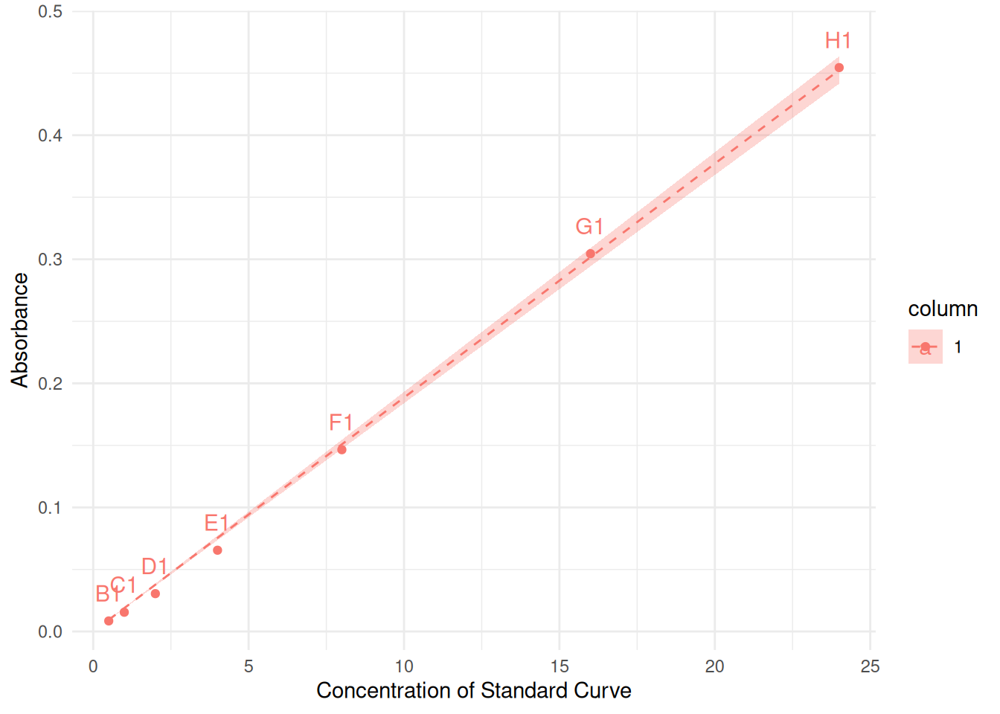
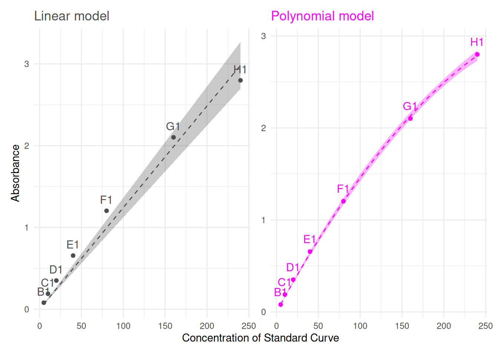
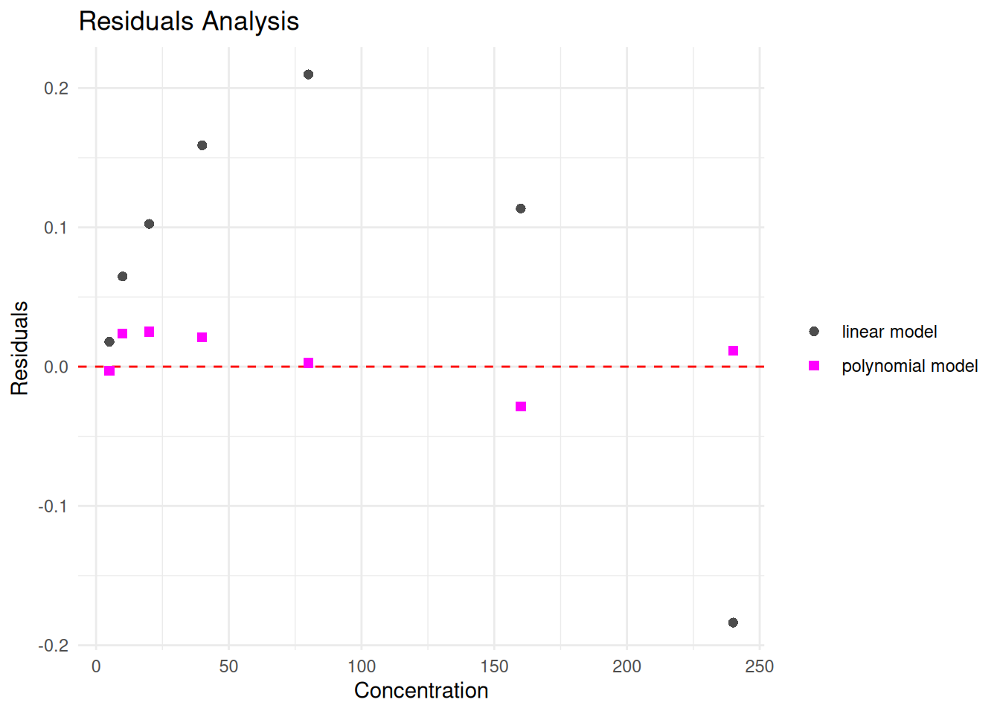
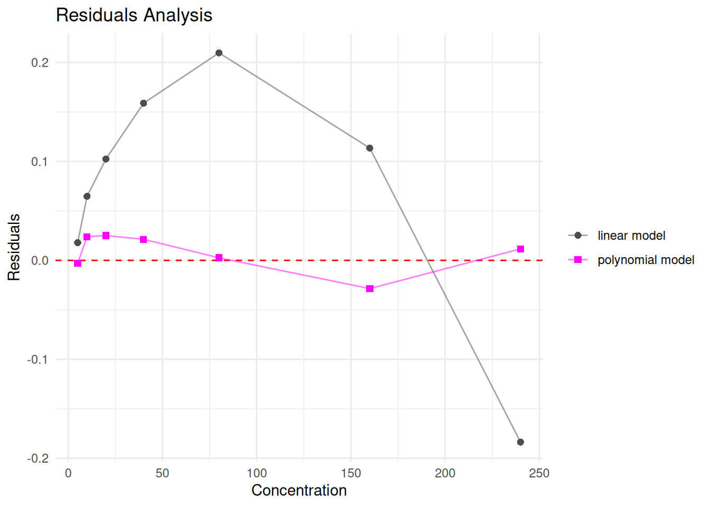
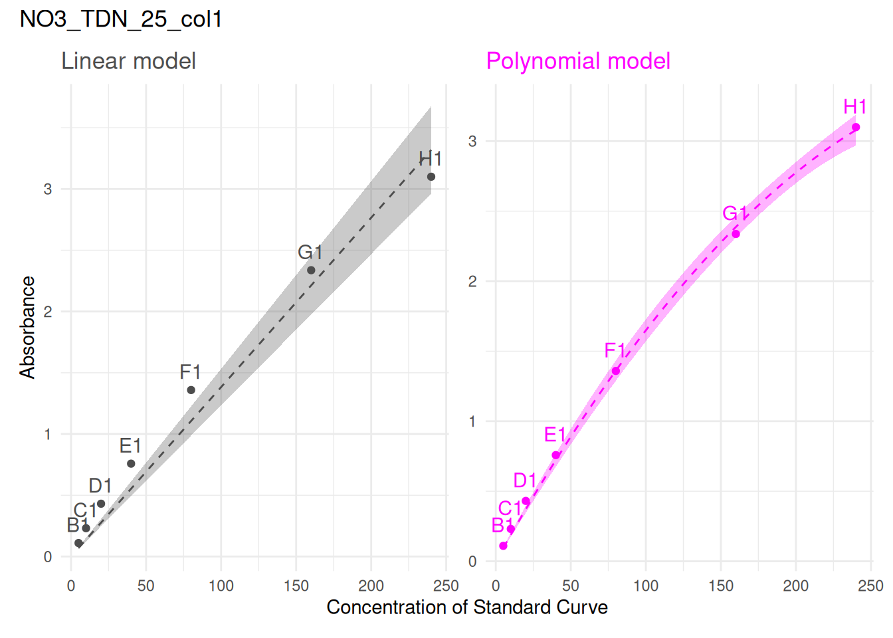
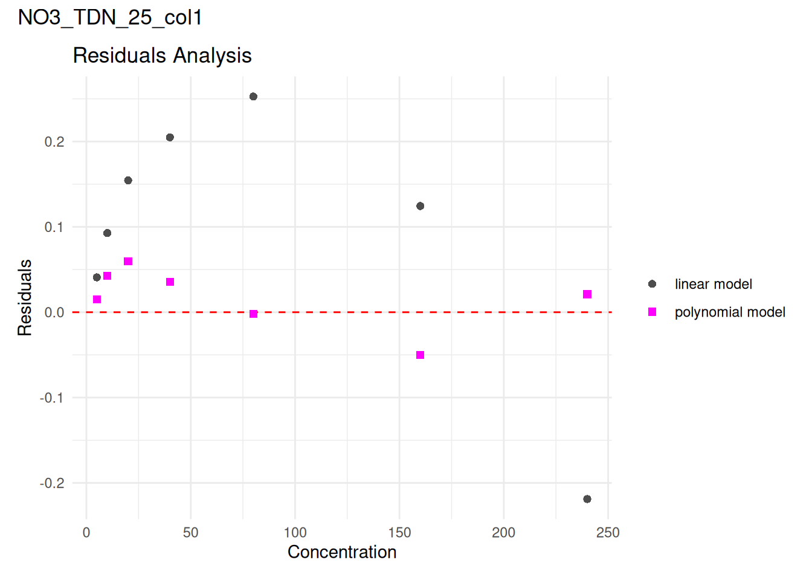
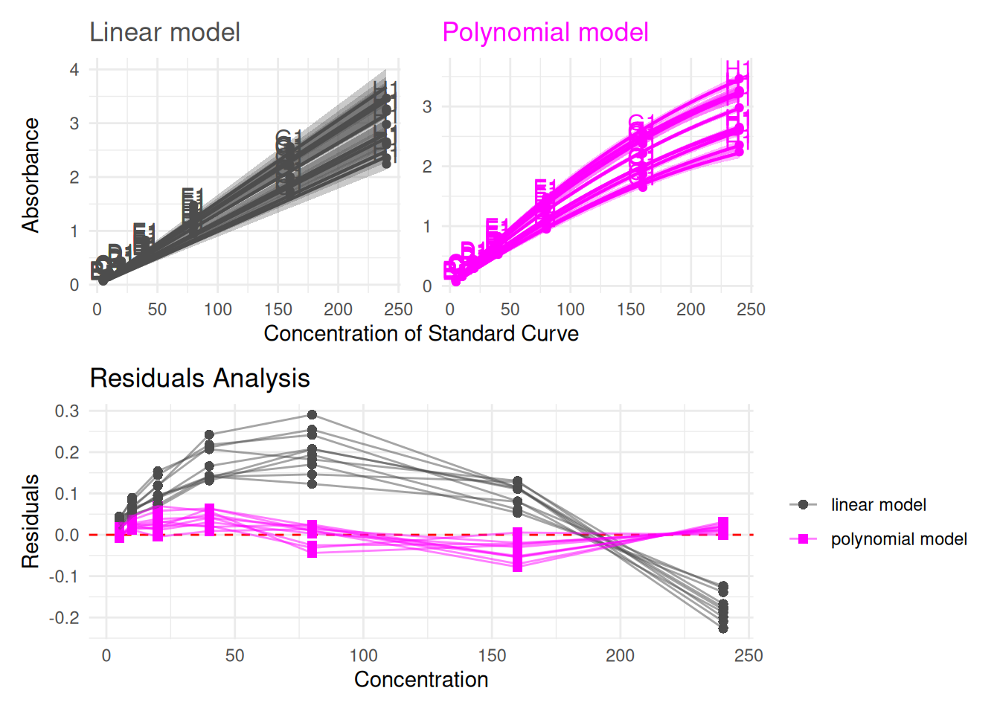
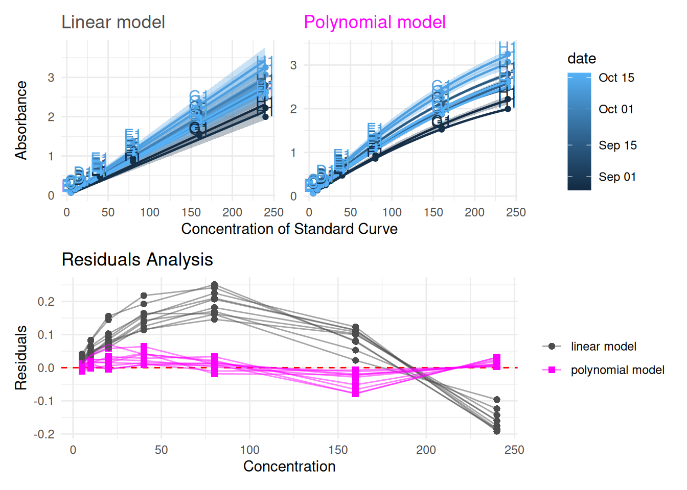

# model-choice

``` r

library(plate2N)
```

## 1 - Introduction

- This vignette is a detailed companion to `abs-to-conc`’s “Tips for
  choosing the model” section — that vignette links here instead of
  walking through the full mechanics inline
- Quick recap of why the choice matters: curvature at high absorbance
  can come from more than one source (the colour-forming reagent
  becoming limiting, or stray light — see `abs-to-conc` for the fuller
  methodological discussion). Switching to a polynomial model is a
  reasonable empirical fix either way, but it’s worth actually looking
  at the fit rather than guessing
- What’s covered here: a small set of functions to fit, visually
  compare, and review the linear-vs-polynomial choice — for a single
  curve, or across several curves at once
- The building blocks, in the order this vignette introduces them:
  - [`plot_std()`](https://mdetoeuf.github.io/plate2N/reference/plot_std.md)
    — the underlying standard-curve plotting function (already used
    elsewhere in the package), extended this round with several new
    parameters we’ll make use of here
  - [`fit_curve_model()`](https://mdetoeuf.github.io/plate2N/reference/fit_curve_model.md)
    /
    [`fit_curve_models()`](https://mdetoeuf.github.io/plate2N/reference/fit_curve_models.md)
    — fitting one or both models for a single curve
  - [`plot_model_comparison()`](https://mdetoeuf.github.io/plate2N/reference/plot_model_comparison.md)
    — linear vs. polynomial, side by side
  - [`plot_residual_comparison()`](https://mdetoeuf.github.io/plate2N/reference/plot_residual_comparison.md)
    — a residuals view, for a more diagnostic look at fit quality
  - [`review_model_choice()`](https://mdetoeuf.github.io/plate2N/reference/review_model_choice.md)
    — ties everything together: review model choice across several
    curves at once, either paginated or overplotted
- Example dataset used throughout: `std_corrected_TDN` — a TDN
  experiment with standard curve concentrations increased ten-fold,
  producing absorbance values above 3 and a case where a polynomial
  model genuinely fits better than linear

### 1.1 - Plotting a standard curve: `plot_std()`

[`plot_std()`](https://mdetoeuf.github.io/plate2N/reference/plot_std.md)
is the underlying function for visualizing standard curve data — raw
absorbance against concentration, with a fitted line overlaid. It is
used throughout the package, and it is the foundation everything else in
this vignette builds on.

``` r

plot_std(std_data, through_origin = TRUE, model = "linear")
```



- `std_data` — a tibble of standard curve data
- `through_origin` — whether the fitted line is forced through zero
  (appropriate for blank-corrected absorbance, which should read zero at
  zero concentration)
- `model` — `"linear"` or `"poly"`, controlling which model gets fitted
  for the overlaid line

By default, curves are grouped, coloured, and labelled using the columns
already established elsewhere in the package (`column` for
grouping/colour, `well_id` for point labels, `std_conc`/`abs` for the
axes) — but every one of these can now be set explicitly:

- `conc_col`, `value_col` — which columns hold concentration and
  absorbance
- `group_col` — which column defines one curve/line per group
- `colour_col` — which column drives colour (defaults to `group_col` if
  not given, but can be set independently — more on this later)
- `label_col` — which column labels individual points
- `unit_col` — optionally show a concentration unit on the x-axis (a
  column name, a literal string, or `NULL` for no unit — the default)
- `smooth_alpha`, `smooth_linewidth`, `smooth_linetype` — control how
  visible the fitted line is, useful when overplotting many curves at
  once (see [Section 2](#sec-review-model-choice))

### 1.2 - A note on colour vs. grouping

`group_col` and `colour_col` are two separate ideas that happen to
default to the same thing. `group_col` decides how many curves get
fitted — one regression line per unique value, always. `colour_col` only
decides how points and lines are *coloured*, and by default
(`colour_col = NULL`) simply reuses whatever `group_col` is, matching
what you’d expect from a single, unified variable.

Setting them independently lets you fit one line per curve while
colouring by something else entirely — a date, a dilution factor, or any
other variable that might actually explain differences between curves.
That’s exactly what powers
[`review_model_choice()`](https://mdetoeuf.github.io/plate2N/reference/review_model_choice.md)’s
`colour_col` argument in [Section 2](#sec-review-model-choice):
`curve_id_col` still decides which points belong to which fitted curve,
while `colour_col` decides what the colour itself should mean.

### 1.3 - Fitting a model: `fit_curve_model()` and `fit_curve_models()`

Plotting a fitted line is useful for a first look, but deciding between
linear and polynomial properly means actually inspecting the fitted
models — their coefficients, p-values, R².
[`fit_curve_model()`](https://mdetoeuf.github.io/plate2N/reference/fit_curve_model.md)
fits one model (linear or polynomial) for a single curve and returns the
model object itself:

`curve` is a single standard curve’s worth of data — one plate, one
curve, filtered down to exactly the rows we want to fit. Here we draw it
from `std_corrected_TDN`: it’s the same 9th curve from that dataset used
elsewhere in the package’s own examples, specifically chosen because
it’s a case where the polynomial model genuinely fits better than linear
— exactly the kind of decision this vignette exists to help make.

``` r

fit_curve_model(curve, model = "linear")
#> 
#> Call:
#> stats::lm(formula = stats::reformulate(terms, response = value_col), 
#>     data = curve_data)
#> 
#> Coefficients:
#> std_conc  
#>  0.01243
```

Same default `through_origin` argument as
[`plot_std()`](https://mdetoeuf.github.io/plate2N/reference/plot_std.md),
with the same meaning.

Printing the model itself, as above, mostly shows the fitted
coefficients. But what we’re usually really after is the model’s overall
fit quality — its (adjusted) R² and p-values — which comes from calling
[`summary()`](https://rdrr.io/r/base/summary.html) on it instead:

``` r

summary(fit_curve_model(curve, model = "linear"))
#> 
#> Call:
#> stats::lm(formula = stats::reformulate(terms, response = value_col), 
#>     data = curve_data)
#> 
#> Residuals:
#>      Min       1Q   Median       3Q      Max 
#> -0.18370  0.04129  0.10244  0.13621  0.20977 
#> 
#> Coefficients:
#>           Estimate Std. Error t value Pr(>|t|)    
#> std_conc 0.0124279  0.0004877   25.48 2.41e-07 ***
#> ---
#> Signif. codes:  0 '***' 0.001 '**' 0.01 '*' 0.05 '.' 0.1 ' ' 1
#> 
#> Residual standard error: 0.1477 on 6 degrees of freedom
#> Multiple R-squared:  0.9908, Adjusted R-squared:  0.9893 
#> F-statistic: 649.5 on 1 and 6 DF,  p-value: 2.405e-07
```

Since comparing linear against polynomial is the whole point,
[`fit_curve_models()`](https://mdetoeuf.github.io/plate2N/reference/fit_curve_models.md)
(plural) fits both at once and returns them together in a named list:

``` r

models <- fit_curve_models(curve)
models$linear
#> 
#> Call:
#> stats::lm(formula = stats::reformulate(terms, response = value_col), 
#>     data = curve_data)
#> 
#> Coefficients:
#> std_conc  
#>  0.01243
models$poly
#> 
#> Call:
#> stats::lm(formula = stats::reformulate(terms, response = value_col), 
#>     data = curve_data)
#> 
#> Coefficients:
#>      std_conc  I(std_conc^2)  
#>     1.672e-02     -2.127e-05
```

`models$linear` and `models$poly` are ordinary `lm` objects —
[`summary()`](https://rdrr.io/r/base/summary.html),
[`coef()`](https://rdrr.io/r/stats/coef.html),
[`residuals()`](https://rdrr.io/r/stats/residuals.html), and anything
else you’d normally do with a fitted model all work as usual. This
`models` list is exactly what feeds into
[`plot_residual_comparison()`](https://mdetoeuf.github.io/plate2N/reference/plot_residual_comparison.md),
further down.

### 1.4 - Comparing both models visually: `plot_model_comparison()`

[`fit_curve_model()`](https://mdetoeuf.github.io/plate2N/reference/fit_curve_model.md)
gives you the numbers;
[`plot_model_comparison()`](https://mdetoeuf.github.io/plate2N/reference/plot_model_comparison.md)
gives you the picture — it wraps
[`plot_std()`](https://mdetoeuf.github.io/plate2N/reference/plot_std.md),
calling it once for each model and placing the two side by side, so you
can see at a glance whether the polynomial fit is actually capturing
something the linear one misses:

``` r

plot_model_comparison(curve)
```



It shares most of its parameters with
[`plot_std()`](https://mdetoeuf.github.io/plate2N/reference/plot_std.md)
(`conc_col`, `value_col`, `through_origin`, `unit_col`,
`smooth_alpha`/`smooth_linewidth`/`smooth_linetype`), plus two of its
own:

- `curve_id_col` — which column identifies a curve. Defaults to
  `"unique_curve_id"`, and matters more once you’re comparing several
  curves at once (see [Section 2](#sec-review-model-choice)) — for a
  single curve like `curve` above, it has nothing to do.
- `legend_position` — a standard `ggplot2` legend position (defaults to
  `"right"`). Only shows a legend when there’s actually something
  meaningful to label: here, with a single curve and no `colour_col`
  given, each panel just uses a fixed colour (grey for linear, magenta
  for polynomial) — there’s nothing to distinguish, so no legend appears
  regardless of `legend_position`. A legend becomes meaningful once
  you’re colouring by something real, like several curves’ own
  identities, or a variable such as date — which is exactly the case in
  [Section 2](#sec-review-model-choice).

Notice that `curve_data` here isn’t restricted to a single curve at all
—
[`plot_model_comparison()`](https://mdetoeuf.github.io/plate2N/reference/plot_model_comparison.md)
works just as well on several curves’ worth of data at once,
grouped/coloured by `curve_id_col`. That’s exactly what makes
[`review_model_choice()`](https://mdetoeuf.github.io/plate2N/reference/review_model_choice.md)’s
overplot mode possible later in this vignette, without needing any
separate machinery for it.

### 1.5 - A closer look at fit quality: `plot_residual_comparison()`

A model can look reasonable on the standard curve plot itself and still
have a telling pattern in its residuals — points systematically curving
away from zero as concentration increases, for example, which a linear
model can hide but a residual plot makes obvious.
[`plot_residual_comparison()`](https://mdetoeuf.github.io/plate2N/reference/plot_residual_comparison.md)
takes the `models` list from
[`fit_curve_models()`](https://mdetoeuf.github.io/plate2N/reference/fit_curve_models.md)
and plots both models’ residuals together:

``` r

plot_residual_comparison(curve, models)
```



Points near zero with no obvious pattern suggest a good fit; a
systematic curve or trend (typically in the linear model’s residuals,
when a polynomial fit is actually the better choice) is the sign to look
for.

Since this is a `ggplot2` object like any other, you can add to it
freely. For example, connecting each model’s own points with a line can
make a pattern easier to follow at a glance:

``` r

plot_residual_comparison(curve, models) + ggplot2::geom_line(alpha = 0.5)
```



## 2 - Reviewing model choice across several curves

Looking at one curve at a time is useful, but usually you’ll want to
check several — or all — of the curves in a dataset before settling on a
model choice for the whole thing.
[`review_model_choice()`](https://mdetoeuf.github.io/plate2N/reference/review_model_choice.md)
ties together everything from the previous section: it selects a set of
curves (all of them, or a sample), fits both models for each, and builds
the same comparison + residual view we’ve just walked through — either
one curve at a time, or all at once.

### 2.1 - Paginated: one curve at a time

By default (`overplot = FALSE`),
[`review_model_choice()`](https://mdetoeuf.github.io/plate2N/reference/review_model_choice.md)
returns a named list, one entry per curve, each containing the fitted
`models`, the `comparison_plot`, and the `residual_plot` — exactly the
three things we built by hand above, just automated across as many
curves as you like.

``` r

review <- review_model_choice(std_corrected_TDN, n_curves = 3, seed = 1)
names(review)
#> [1] "NO3_TDN_25_col1" "NO3_TDN_04_col1" "NO3_TDN_07_col1"
```

Each entry is named after its curve, and can be inspected individually.
Adding the curve’s name as a title makes each plot self-identifying,
which matters once you’re looking at several in sequence:

``` r

review[[1]]$comparison_plot + patchwork::plot_annotation(title = names(review)[1])
```



``` r

review[[1]]$residual_plot + patchwork::plot_annotation(title = names(review)[1])
```



`n_curves = NULL` (the default) reviews every curve in the dataset —
useful for small or exploratory datasets where you’d want to look at
everything anyway. `seed` makes the random selection reproducible; set
`random_sample = FALSE` instead to simply take the first `n_curves`
curves as they appear in the data, rather than a random sample.

### 2.2 - Overplot: many curves at once

Paging through curves one at a time doesn’t scale well once you’re
reviewing more than a handful. `overplot = TRUE` instead combines all
the selected curves into one figure — comparison plot on top, residual
plot below — much faster to scan for a dataset-wide pattern:

``` r

review_model_choice(std_corrected_TDN, n_curves = 10, overplot = TRUE)
```



By default, every curve is drawn in the same fixed colour per panel
(grey for linear, magenta for polynomial) — with many curves, colouring
by curve identity alone tends to produce an unhelpful rainbow with no
real meaning behind which colour is which. Colouring by something
scientifically relevant instead is often more useful — a date, a
dilution factor, anything that might actually explain variation between
curves:

``` r

review_model_choice(
  std_corrected_TDN, n_curves = 10, overplot = TRUE,
  colour_col = "date", legend_position = "right")
```



Two more parameters exist specifically for the overplot case, since the
default smooth-line styling (thin, dashed) is easy to lose track of with
many curves overlapping: `overplot_smooth_alpha`,
`overplot_smooth_linewidth`, and `overplot_smooth_linetype` control the
fitted lines’ visibility, defaulting to something more visible than
[`plot_std()`](https://mdetoeuf.github.io/plate2N/reference/plot_std.md)’s
own defaults.

## 3 - Using this in your own pipeline

Back in the `abs-to-conc` vignette’s “Tips for choosing the model”
section, the choice between a linear and polynomial model is discussed
conceptually — what causes curvature at high absorbance, and why it
might justify switching models. This vignette is where that choice
actually gets made in practice: pick whichever combination of the
functions above fits your dataset — a single quick
[`plot_model_comparison()`](https://mdetoeuf.github.io/plate2N/reference/plot_model_comparison.md)
for one curve, or
[`review_model_choice()`](https://mdetoeuf.github.io/plate2N/reference/review_model_choice.md)
across the whole thing — and use the result to decide which model to
carry forward into the rest of the `abs-to-conc` pipeline.

`std_corrected_TDN`, used throughout this vignette, is a real example
included with the package: a Total Dissolved Nitrogen experiment where
standard curve concentrations were increased ten-fold compared to a
typical N-dosage experiment, producing absorbance values above 3 —
exactly the kind of case where a polynomial model genuinely fits better
than linear, and a useful dataset to practice this workflow on before
applying it to your own data.
